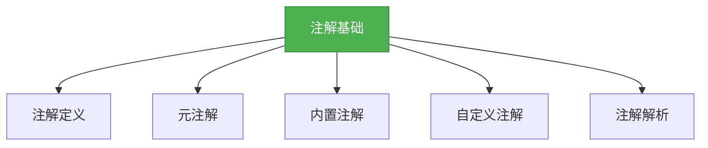

# 基础-注解基础

## 概述
注解（Annotation）是JDK5引入的一种元数据机制，它可以在代码中添加标记，用于编译时检查、运行时处理或生成文档。注解不会直接影响代码的执行，但能被编译器或工具读取并处理，是框架开发和代码分析的重要技术。



## 知识要点

### 1. 注解的定义与使用
注解通过`@interface`关键字定义，本质是一种特殊的接口。使用时在目标元素前添加`@注解名`即可。

```java
// 定义一个简单的注解
public @interface MyAnnotation {
    // 注解元素（无参数方法形式）
    String value() default "default value";
    int count() default 0;
}

// 使用注解
@MyAnnotation(value = "test", count = 1)
public class AnnotationDemo {
    @MyAnnotation
    private String name;

    @MyAnnotation(count = 2)
    public void doSomething() {
        // 方法体
    }
}
```

### 2. 元注解
元注解是用于修饰注解的注解，JDK提供了4个标准元注解：

| 元注解 | 作用 | 可选参数 |
|--------|------|----------|
| @Target | 指定注解可修饰的元素类型 | TYPE, FIELD, METHOD, PARAMETER, CONSTRUCTOR, LOCAL_VARIABLE, ANNOTATION_TYPE, PACKAGE, TYPE_PARAMETER, TYPE_USE |
| @Retention | 指定注解的保留策略 | SOURCE(源码), CLASS(字节码), RUNTIME(运行时) |
| @Documented | 指定注解是否包含在Javadoc中 | - |
| @Inherited | 指定注解是否可被继承 | - |

```java
import java.lang.annotation.*;

@Target({ElementType.TYPE, ElementType.METHOD})
@Retention(RetentionPolicy.RUNTIME)
@Documented
@Inherited
public @interface MyAnnotation {
    String value();
}
```

### 3. 内置注解
JDK提供的常用内置注解：

- `@Override`：标记方法重写父类方法，编译器会检查方法签名是否正确
- `@Deprecated`：标记已过时的元素，编译器会发出警告
- `@SuppressWarnings`：抑制编译器警告
- `@SafeVarargs`：标记构造函数或方法是类型安全的（JDK7+）
- `@FunctionalInterface`：标记函数式接口（JDK8+）

```java
public class BuiltInAnnotations {
    // 重写父类方法
    @Override
    public String toString() {
        return super.toString();
    }

    // 标记过时方法
    @Deprecated
    public void oldMethod() {
        // 过时实现
    }

    // 抑制未使用变量警告
    @SuppressWarnings("unused")
    public void suppressWarningDemo() {
        int unusedVariable = 0;
    }

    // 函数式接口
    @FunctionalInterface
    public interface MyFunction {
        void apply();
    }
}
```

### 4. 自定义注解与解析
自定义注解通常需要结合反射在运行时解析：

```java
import java.lang.reflect.Method;

// 自定义注解
@Target(ElementType.METHOD)
@Retention(RetentionPolicy.RUNTIME)
public @interface LogAnnotation {
    String action();
    boolean logParameters() default true;
}

// 使用注解
public class Service {
    @LogAnnotation(action = "addUser", logParameters = true)
    public void addUser(String name, int age) {
        // 业务逻辑
    }
}

// 解析注解
public class AnnotationParser {
    public static void parse(Object service) {
        Class<?> clazz = service.getClass();
        for (Method method : clazz.getDeclaredMethods()) {
            if (method.isAnnotationPresent(LogAnnotation.class)) {
                LogAnnotation annotation = method.getAnnotation(LogAnnotation.class);
                System.out.println("Action: " + annotation.action());
                System.out.println("Log parameters: " + annotation.logParameters());
                // 可以在这里实现日志记录逻辑
            }
        }
    }

    public static void main(String[] args) {
        parse(new Service());
    }
}
```

## 知识扩展

### 设计思想
注解体现了Java的元数据编程思想，通过将配置信息与代码分离，提高了代码的灵活性和可维护性。框架如Spring大量使用注解简化配置，实现了"约定优于配置"的开发模式。

### 避坑指南
1. **保留策略选择**：如果需要在运行时解析注解，必须使用`@Retention(RetentionPolicy.RUNTIME)`
2. **注解元素默认值**：注解元素必须提供默认值，除非使用时必须显式指定
3. **数组类型处理**：当注解元素是数组且只有一个值时，可以省略大括号
4. **注解继承**：`@Inherited`仅对类注解有效，方法和字段注解不会被继承

### 深度思考题
**思考题**：如何实现一个简单的ORM框架，使用注解标记实体类与数据库表的映射关系？

**思考题回答**：可以定义`@Table`注解标记表名，`@Column`注解标记字段名，然后通过反射读取注解信息，生成SQL语句。例如：

```java
@Target(ElementType.TYPE)
@Retention(RetentionPolicy.RUNTIME)
public @interface Table {
    String name();
}

@Target(ElementType.FIELD)
@Retention(RetentionPolicy.RUNTIME)
public @interface Column {
    String name();
    boolean primaryKey() default false;
}

@Table(name = "user")
public class User {
    @Column(name = "id", primaryKey = true)
    private int id;
    @Column(name = "username")
    private String username;
    // 省略getter和setter
}
```

通过反射解析这些注解，就能动态生成CRUD操作的SQL语句，实现简单的ORM功能。