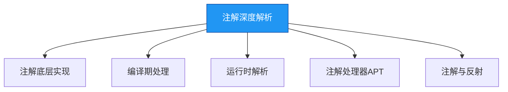

# 理解-深入理解注解

## 概述
注解本质是一种特殊的接口，它通过JVM的支持实现元数据的存储与访问。深入理解注解需要掌握其底层实现原理、编译期处理流程和运行时反射解析机制。注解在框架开发中扮演关键角色，如Spring的依赖注入、MyBatis的SQL映射等核心功能都基于注解实现。



## 知识要点

### 1. 注解的底层实现原理
注解在编译后会生成class文件，本质是继承`java.lang.annotation.Annotation`接口的特殊接口。JVM对注解提供特殊支持，允许通过反射API访问注解信息。

```java
// 反编译注解类会得到类似以下结构
public interface MyAnnotation extends Annotation {
    String value();
    int count() default 0;
}
```

注解的属性在编译时会被转换为接口方法，默认值存储在`AnnotationDefault`属性中。JVM在加载类时会为注解创建动态代理实例，这就是为什么通过反射获取的注解是代理对象。

### 2. 注解的编译期处理
注解在编译期有两种处理方式：源码注解处理器和字节码修改。

#### 2.1 源码注解处理器（APT）
JDK6引入的注解处理工具（APT）允许在编译期扫描和处理注解，生成新的Java文件。这是Lombok、Dagger等框架的核心实现方式。

```java
import javax.annotation.processing.*;
import javax.lang.model.SourceVersion;
import javax.lang.model.element.TypeElement;
import java.util.Set;

@SupportedAnnotationTypes("com.example.MyAnnotation")
@SupportedSourceVersion(SourceVersion.RELEASE_8)
public class MyAnnotationProcessor extends AbstractProcessor {
    @Override
    public boolean process(Set<? extends TypeElement> annotations, RoundEnvironment roundEnv) {
        // 处理注解逻辑
        for (TypeElement annotation : annotations) {
            roundEnv.getElementsAnnotatedWith(annotation).forEach(element -> {
                // 生成代码或进行验证
                System.out.println("Processing element: " + element.getSimpleName());
            });
        }
        return true;
    }
}
```

要使用APT，需要在Maven中配置processor：
```xml
<build>
    <plugins>
        <plugin>
            <groupId>org.apache.maven.plugins</groupId>
            <artifactId>maven-compiler-plugin</artifactId>
            <version>3.8.1</version>
            <configuration>
                <annotationProcessors>
                    <annotationProcessor>com.example.MyAnnotationProcessor</annotationProcessor>
                </annotationProcessors>
            </configuration>
        </plugin>
    </plugins>
</build>
```

#### 2.2 字节码级别处理
编译后注解信息存储在class文件的属性表中，可通过ASM等字节码操作库在编译后修改class文件。

### 3. 注解的运行时解析机制
运行时保留的注解（@Retention(RetentionPolicy.RUNTIME)）可通过反射API获取：

```java
import java.lang.reflect.AnnotatedElement;
import java.lang.reflect.Method;

public class AnnotationRuntimeParser {
    public static void parse(Object obj) {
        Class<?> clazz = obj.getClass();
        // 获取类上的注解
        if (clazz.isAnnotationPresent(MyAnnotation.class)) {
            MyAnnotation annotation = clazz.getAnnotation(MyAnnotation.class);
            System.out.println("Class annotation value: " + annotation.value());
        }

        // 获取方法上的注解
        for (Method method : clazz.getDeclaredMethods()) {
            if (method.isAnnotationPresent(MyAnnotation.class)) {
                MyAnnotation annotation = method.getAnnotation(MyAnnotation.class);
                System.out.println("Method annotation value: " + annotation.value() + ", count: " + annotation.count());
            }
        }
    }
}
```

JVM在运行时为注解创建动态代理对象，当调用注解的方法时，代理对象会从class文件的属性表中读取对应的值。

### 4. 注解与反射的性能影响
反射解析注解会带来性能开销，主要体现在：
- 类加载时注解信息的解析
- 反射调用的性能损耗
- 大量注解处理导致的CPU占用

优化方案：
```java
// 缓存注解解析结果
public class AnnotationCache {
    private static final Map<Class<?>, MyAnnotation> annotationCache = new ConcurrentHashMap<>();

    public static MyAnnotation getAnnotation(Class<?> clazz) {
        return annotationCache.computeIfAbsent(clazz, c -> {
            // 反射解析注解的逻辑
            return c.getAnnotation(MyAnnotation.class);
        });
    }
}
```

## 知识扩展

### 设计思想
注解设计体现了Java的"元数据驱动开发"思想，通过将配置信息编码为注解，实现了：
1. 关注点分离：业务逻辑与横切关注点（如日志、事务）分离
2. 声明式编程：通过注解声明意图而非实现细节
3. 代码生成：基于注解自动生成重复代码，减少样板代码

### 避坑指南
1. **注解继承陷阱**：`@Inherited`仅对类注解有效，方法和字段注解不会被子类继承
2. **保留策略错误**：需要运行时解析的注解必须使用`RetentionPolicy.RUNTIME`
3. **APT处理器注册**：自定义注解处理器需要正确配置，否则编译时不会执行
4. **重复注解处理**：JDK8之前不支持重复注解，需使用容器注解包装
5. **性能问题**：避免在高频调用的代码中使用反射解析注解

### 深度思考题
**思考题**：如何实现一个基于注解的权限验证框架？

**思考题回答**：可以设计`@RequiresPermission`注解标记需要权限的方法，结合AOP在方法执行前检查权限：

```java
// 定义权限注解
@Target(ElementType.METHOD)
@Retention(RetentionPolicy.RUNTIME)
public @interface RequiresPermission {
    String[] value();
    boolean allMatch() default true;
}

// AOP切面实现权限检查
@Aspect
@Component
public class PermissionAspect {
    @Autowired
    private PermissionService permissionService;

    @Around("@annotation(requiresPermission)")
    public Object checkPermission(ProceedingJoinPoint joinPoint, RequiresPermission requiresPermission) throws Throwable {
        String[] permissions = requiresPermission.value();
        boolean allMatch = requiresPermission.allMatch();

        if (allMatch) {
            // 检查是否拥有所有权限
            for (String permission : permissions) {
                if (!permissionService.hasPermission(permission)) {
                    throw new AccessDeniedException("No permission: " + permission);
                }
            }
        } else {
            // 检查是否拥有任一权限
            boolean hasAnyPermission = false;
            for (String permission : permissions) {
                if (permissionService.hasPermission(permission)) {
                    hasAnyPermission = true;
                    break;
                }
            }
            if (!hasAnyPermission) {
                throw new AccessDeniedException("No required permission");
            }
        }

        return joinPoint.proceed();
    }
}

// 使用示例
@Service
public class UserService {
    @RequiresPermission("user:read")
    public User getUser(Long id) {
        // 业务逻辑
    }

    @RequiresPermission(value = {"user:write", "admin"}, allMatch = false)
    public void updateUser(User user) {
        // 业务逻辑
    }
}
```

这种实现方式将权限检查逻辑与业务逻辑分离，通过注解声明权限需求，提高了代码的可读性和可维护性。