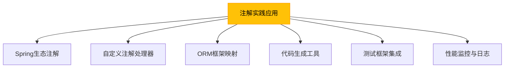

# 进阶-注解在实践中的应用

## 概述
注解在现代Java开发中应用广泛，从框架配置到代码生成，从性能优化到业务逻辑解耦，注解技术极大提升了开发效率和代码质量。本章将深入探讨注解在实际项目中的典型应用场景，包括Spring生态中的注解实践、自定义注解处理器开发、ORM框架中的注解映射以及注解驱动的代码生成技术。



## 知识要点

### 1. Spring生态中的注解应用
Spring框架广泛使用注解简化配置，实现依赖注入、事务管理、AOP等核心功能。

#### 1.1 依赖注入与组件扫描
```java
import org.springframework.stereotype.Component;
import org.springframework.beans.factory.annotation.Autowired;
import org.springframework.beans.factory.annotation.Value;

// 组件注册
@Component
public class UserService {
    // 属性注入
    @Autowired
    private UserRepository userRepository;

    // 构造函数注入（推荐）
    private final OrderService orderService;

    @Autowired
    public UserService(OrderService orderService) {
        this.orderService = orderService;
    }

    // 方法注入
    @Autowired
    public void setLogService(LogService logService) {
        this.logService = logService;
    }

    // 外部配置注入
    @Value("${app.user.default-role}")
    private String defaultRole;
}
```

#### 1.2 事务管理与AOP
```java
import org.springframework.transaction.annotation.Transactional;
import org.springframework.stereotype.Service;

@Service
public class OrderService {
    // 声明式事务
    @Transactional(rollbackFor = Exception.class)
    public void createOrder(Order order) {
        // 业务逻辑
        orderRepository.save(order);
        inventoryService.reduceStock(order.getItems());
    }

    // AOP切面注解
    @LogExecutionTime
    public List<Order> getUserOrders(Long userId) {
        return orderRepository.findByUserId(userId);
    }
}
```

### 2. 自定义注解处理器开发
通过注解处理器在编译期生成代码，是Lombok、MapStruct等工具的核心技术。

#### 2.1 实现一个简单的Builder模式生成器
```java
// 自定义Builder注解
@Target(ElementType.TYPE)
@Retention(RetentionPolicy.SOURCE)
public @interface Builder {
}

// 注解处理器
@SupportedAnnotationTypes("com.example.Builder")
@SupportedSourceVersion(SourceVersion.RELEASE_8)
public class BuilderProcessor extends AbstractProcessor {
    @Override
    public boolean process(Set<? extends TypeElement> annotations, RoundEnvironment roundEnv) {
        for (TypeElement annotation : annotations) {
            for (Element element : roundEnv.getElementsAnnotatedWith(annotation)) {
                if (element.getKind() == ElementKind.CLASS) {
                    generateBuilderCode((TypeElement) element);
                }
            }
        }
        return true;
    }

    private void generateBuilderCode(TypeElement classElement) {
        // 生成Builder类的代码
        String className = classElement.getSimpleName().toString();
        String packageName = processingEnv.getElementUtils().getPackageOf(classElement).getQualifiedName().toString();
        String builderClassName = className + "Builder";

        // 创建Java文件
        JavaFileObject jfo = processingEnv.getFiler().createSourceFile(packageName + "." + builderClassName);
        try (Writer writer = jfo.openWriter()) {
            // 写入Builder类代码
            writer.write(generateBuilderCodeContent(packageName, className, builderClassName, classElement));
        }
    }

    // 生成Builder类内容的具体实现
    private String generateBuilderCodeContent(String packageName, String className, String builderClassName, TypeElement classElement) {
        // 实现代码生成逻辑
        // ...
    }
}
```

使用示例：
```java
@Builder
public class User {
    private String name;
    private int age;
    private String email;
}

// 生成的Builder类可用于链式调用
User user = new UserBuilder()
    .name("Alice")
    .age(30)
    .email("alice@example.com")
    .build();
```

### 3. ORM框架中的注解映射
MyBatis、Hibernate等ORM框架使用注解实现Java对象与数据库表的映射。

#### 3.1 MyBatis注解配置
```java
import org.apache.ibatis.annotations.*;
import java.util.List;

@Mapper
public interface UserMapper {
    @Select("SELECT * FROM user WHERE id = #{id}")
    @Results({
        @Result(property = "id", column = "user_id"),
        @Result(property = "userName", column = "user_name")
    })
    User selectById(Long id);

    @Insert("INSERT INTO user(name, age) VALUES(#{name}, #{age})")
    @Options(useGeneratedKeys = true, keyProperty = "id")
    int insert(User user);

    @Update("UPDATE user SET name = #{name}, age = #{age} WHERE id = #{id}")
    int update(User user);

    @Delete("DELETE FROM user WHERE id = #{id}")
    int delete(Long id);
}
```

#### 3.2 JPA注解映射
```java
import javax.persistence.*;
import java.util.Date;

@Entity
@Table(name = "t_user")
public class User {
    @Id
    @GeneratedValue(strategy = GenerationType.IDENTITY)
    private Long id;

    @Column(name = "user_name", length = 50, nullable = false)
    private String userName;

    @Column(precision = 3, scale = 0)
    private Integer age;

    @Temporal(TemporalType.TIMESTAMP)
    @Column(name = "create_time")
    private Date createTime;

    @Transient
    private String tempData; // 不映射到数据库字段

    // 省略getter和setter
}
```

### 4. 注解驱动的测试框架
JUnit和Mockito等测试框架大量使用注解简化测试代码。

```java
import org.junit.jupiter.api.Test;
import org.junit.jupiter.api.BeforeEach;
import org.junit.jupiter.api.AfterEach;
import org.junit.jupiter.api.extension.ExtendWith;
import org.mockito.InjectMocks;
import org.mockito.Mock;
import org.mockito.junit.jupiter.MockitoExtension;
import static org.junit.jupiter.api.Assertions.*;
import static org.mockito.Mockito.*;

@ExtendWith(MockitoExtension.class)
public class UserServiceTest {
    @Mock
    private UserRepository userRepository;

    @InjectMocks
    private UserService userService;

    private User testUser;

    @BeforeEach
    void setUp() {
        testUser = new User(1L, "Test User", 25);
    }

    @AfterEach
    void tearDown() {
        // 清理资源
    }

    @Test
    void getUserById_ShouldReturnUser() {
        // 模拟依赖行为
        when(userRepository.findById(1L)).thenReturn(testUser);

        // 执行测试
        User result = userService.getUserById(1L);

        // 验证结果
        assertNotNull(result);
        assertEquals("Test User", result.getName());
        verify(userRepository).findById(1L);
    }
}
```

## 知识扩展

### 设计思想
注解实践体现了多种设计模式和编程思想：
1. **策略模式**：通过注解标记不同策略实现，动态选择执行逻辑
2. **模板方法**：框架定义流程模板，通过注解标记扩展点
3. **元编程**：通过注解实现代码自我描述和自我处理
4. **约定优于配置**：框架注解默认值体现约定，减少显式配置

### 避坑指南
1. **注解滥用**：避免过度使用注解导致代码可读性下降，简单逻辑优先使用直接编码
2. **运行时性能**：反射解析注解有性能开销，高频调用场景需缓存解析结果
3. **版本兼容性**：注意不同JDK版本对注解特性的支持差异
4. **文档缺失**：为自定义注解编写清晰文档，说明使用场景和注意事项
5. **测试覆盖**：注解处理逻辑需要充分测试，特别是编译期注解处理器

### 深度思考题
**思考题**：如何设计一个基于注解的缓存框架，实现方法级别的缓存功能？

**思考题回答**：可以设计`@Cacheable`、`@CacheEvict`等注解，结合AOP实现方法结果缓存：

```java
// 缓存注解定义
@Target(ElementType.METHOD)
@Retention(RetentionPolicy.RUNTIME)
public @interface Cacheable {
    String key();
    long expire() default 3600;
}

@Target(ElementType.METHOD)
@Retention(RetentionPolicy.RUNTIME)
public @interface CacheEvict {
    String key();
    boolean allEntries() default false;
}

// AOP实现缓存逻辑
@Aspect
@Component
public class CacheAspect {
    private final CacheManager cacheManager;

    public CacheAspect(CacheManager cacheManager) {
        this.cacheManager = cacheManager;
    }

    @Around("@annotation(cacheable)")
    public Object handleCacheable(ProceedingJoinPoint joinPoint, Cacheable cacheable) throws Throwable {
        String key = generateKey(cacheable.key(), joinPoint.getArgs());
        Cache cache = cacheManager.getCache("default");

        Object value = cache.get(key);
        if (value != null) {
            return value;
        }

        value = joinPoint.proceed();
        cache.put(key, value, cacheable.expire());
        return value;
    }

    @Around("@annotation(cacheEvict)")
    public Object handleCacheEvict(ProceedingJoinPoint joinPoint, CacheEvict cacheEvict) throws Throwable {
        Object result = joinPoint.proceed();
        String key = generateKey(cacheEvict.key(), joinPoint.getArgs());
        Cache cache = cacheManager.getCache("default");

        if (cacheEvict.allEntries()) {
            cache.clear();
        } else {
            cache.remove(key);
        }

        return result;
    }

    private String generateKey(String keyPattern, Object[] args) {
        // 实现缓存键生成逻辑
        // ...
    }
}

// 使用示例
@Service
public class ProductService {
    @Cacheable(key = "#id", expire = 1800)
    public Product getProduct(Long id) {
        // 从数据库获取商品信息
        return productRepository.findById(id);
    }

    @CacheEvict(key = "#product.id")
    public void updateProduct(Product product) {
        productRepository.update(product);
    }

    @CacheEvict(allEntries = true)
    public void clearAllCache() {
        // 仅用于触发缓存清除
    }
}
```

这种实现可以灵活地为方法添加缓存功能，减少数据库访问，提高系统性能。实际应用中还需要考虑缓存一致性、并发控制和异常处理等问题。