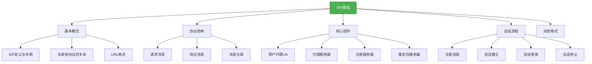
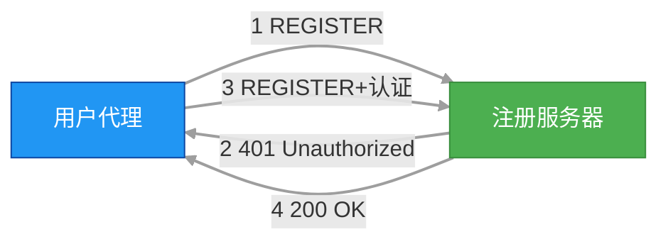
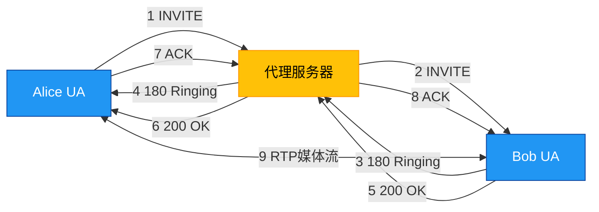

# 基础-SIP基础

## 概述
SIP（Session Initiation Protocol，会话初始协议）是一种用于建立、修改和终止多媒体会话的应用层协议，广泛应用于VoIP、视频会议、即时通讯等领域。它采用客户端-服务器模型，通过文本形式的消息进行通信，具有灵活、可扩展和与现有网络协议兼容的特点。本章将从SIP的基本概念、协议结构、核心组件和会话流程等方面，系统介绍SIP机制的基础知识。



## 知识要点

### 1. SIP基本概念

#### 1.1 SIP的定义与作用
SIP是由IETF定义的一种信令协议，用于在IP网络中建立、修改和终止多媒体会话。它不负责传输媒体数据，而是通过信令控制会话的建立和管理，媒体数据通常通过RTP/RTCP协议传输。

SIP的主要作用包括：
- 用户定位：确定通信对方的位置
- 会话建立：协商会话参数，如媒体类型、编码格式等
- 会话修改：更改会话参数，如增加媒体流、调整带宽等
- 会话终止：结束已建立的会话

#### 1.2 SIP与相关协议的关系
- **SDP（Session Description Protocol）**：SIP消息体中携带SDP信息，用于描述会话的媒体类型、格式、传输地址等
- **RTP/RTCP**：实时传输协议/实时传输控制协议，用于实际媒体数据的传输和质量控制
- **HTTP**：SIP的设计借鉴了HTTP的请求-响应模型和文本格式
- **TCP/UDP**：SIP消息通常通过UDP传输，也可使用TCP保证可靠性

#### 1.3 SIP URL格式
SIP用户通过SIP URL标识，格式如下：
```
sip:user@host[:port]
```
- `user`：用户名，可以是电话号码或邮箱地址
- `host`：域名或IP地址
- `port`：可选，SIP服务器端口，默认5060

示例：
- `sip:alice@example.com`
- `sip:10086@192.168.1.1:5061`

### 2. SIP协议结构

#### 2.1 SIP消息类型
SIP消息分为两类：请求消息（Request）和响应消息（Response）。

**请求消息**：客户端向服务器发送的消息，常用方法包括：

| 方法 | 作用 |
|------|------|
| REGISTER | 用户注册，将用户地址与实际位置绑定 |
| INVITE | 发起会话请求，邀请对方加入会话 |
| ACK | 确认收到对方的最终响应 |
| BYE | 终止会话 |
| CANCEL | 取消未完成的请求 |
| OPTIONS | 查询服务器能力 |

**响应消息**：服务器对请求的回复，包含状态码：
- 1xx：临时响应，表示请求正在处理
- 2xx：成功响应，表示请求已被接受
- 3xx：重定向响应，指示客户端需要进一步操作
- 4xx：客户端错误
- 5xx：服务器错误
- 6xx：全局错误

#### 2.2 SIP消息格式
SIP消息由起始行、头域、空行和消息体组成：
```
起始行
头域1: 值1
头域2: 值2
...

消息体（可选）
```

**示例：INVITE请求消息**
```
INVITE sip:bob@example.com SIP/2.0
Via: SIP/2.0/UDP alicepc:5060;branch=z9hG4bK776asdhds
Max-Forwards: 70
To: Bob <sip:bob@example.com>
From: Alice <sip:alice@example.com>;tag=1928301774
Call-ID: a84b4c76e66710
CSeq: 314159 INVITE
Contact: <sip:alice@alicepc:5060>
Content-Type: application/sdp
Content-Length: 142

v=0
o=alice 2890844526 2890844526 IN IP4 alicepc
 s=-
 c=IN IP4 alicepc
 t=0 0
 m=audio 49172 RTP/AVP 0
 a=rtpmap:0 PCMU/8000
```

**关键头域说明**：
- `Via`：记录消息传输路径，用于响应消息的返回
- `To`：请求的接收者
- `From`：请求的发送者，包含一个唯一标签
- `Call-ID`：标识一个会话，全局唯一
- `CSeq`：命令序列，包含序列号和方法，用于排序请求
- `Contact`：提供发送者的实际联系地址

### 3. SIP核心组件

#### 3.1 用户代理（UA）
用户代理是SIP通信的端点，分为用户代理客户端（UAC）和用户代理服务器（UAS）：
- **UAC**：发起SIP请求的客户端（如Alice的软电话）
- **UAS**：接收并处理SIP请求的服务器（如Bob的软电话）

一个UA可以同时扮演UAC和UAS的角色，例如在通话过程中，发起方的UA既是INVITE请求的UAC，也是BYE请求的UAS。

#### 3.2 代理服务器（Proxy Server）
代理服务器接收SIP请求并转发给其他服务器，相当于中间路由器，主要功能包括：
- 请求路由：根据目标地址查找下一跳服务器
- 认证授权：验证用户身份，控制访问权限
- 负载均衡：将请求分发到不同的服务器

代理服务器分为有状态和无状态两种：
- **有状态代理**：保存请求和响应的状态信息，支持事务处理
- **无状态代理**：仅转发消息，不保存状态，处理效率高

#### 3.3 注册服务器（Registrar）
注册服务器接收并处理REGISTER请求，维护用户地址与实际位置的映射关系（位置服务数据库）。当用户移动到新的位置时，通过REGISTER消息更新注册信息。

#### 3.4 重定向服务器（Redirect Server）
重定向服务器接收请求后，返回3xx响应，指示客户端直接联系其他服务器。它不转发请求，仅提供路由信息，减轻网络负担。

### 4. SIP会话流程

#### 4.1 注册流程
用户需要先向注册服务器注册，将其SIP URL与实际网络位置绑定：
1. UA发送REGISTER请求到注册服务器
2. 注册服务器验证用户身份
3. 注册服务器更新位置服务数据库
4. 返回200 OK响应



#### 4.2 会话建立流程（INVITE流程）
以Alice呼叫Bob为例，SIP会话建立流程如下：
1. Alice的UA（UAC）发送INVITE请求
2. 代理服务器转发请求
3. Bob的UA（UAS）返回180 Ringing（振铃）
4. Bob接听后，返回200 OK
5. Alice发送ACK确认
6. 开始媒体传输（RTP）



#### 4.3 会话终止流程
通话结束时，一方发送BYE请求终止会话：
1. Alice发送BYE请求
2. Bob返回200 OK响应
3. 会话终止，媒体流停止

### 5. Java中的SIP编程基础
Java中可以通过JAIN-SIP（Java API for Integrated Networks - SIP）规范实现SIP协议通信。以下是一个简单的SIP客户端示例，用于发送INVITE请求：

```java
import javax.sip.*;
import javax.sip.address.*;
import javax.sip.header.*;
import javax.sip.message.*;
import java.util.*;

public class SipClient implements SipListener {
    private SipFactory sipFactory;
    private SipStack sipStack;
    private SipProvider sipProvider;
    private AddressFactory addressFactory;
    private MessageFactory messageFactory;
    private HeaderFactory headerFactory;
    private ListeningPoint listeningPoint;

    public SipClient() throws Exception {
        // 初始化SIP工厂
        sipFactory = SipFactory.getInstance();
        sipFactory.setPathName("gov.nist");

        // 配置SIP栈
        Properties properties = new Properties();
        properties.setProperty("javax.sip.STACK_NAME", "SipClientStack");
        sipStack = sipFactory.createSipStack(properties);

        // 创建地址、消息和头工厂
        addressFactory = sipFactory.createAddressFactory();
        messageFactory = sipFactory.createMessageFactory();
        headerFactory = sipFactory.createHeaderFactory();

        // 创建监听点（UDP，端口5060）
        listeningPoint = sipStack.createListeningPoint("127.0.0.1", 5060, "udp");

        // 创建SIP提供者并注册监听器
        sipProvider = sipStack.createSipProvider(listeningPoint);
        sipProvider.addSipListener(this);
    }

    /**
     * 发送INVITE请求
     * @param toUri 目标SIP URI
     * @param fromUri 源SIP URI
     * @param contactUri 本地联系地址
     */
    public void sendInvite(String toUri, String fromUri, String contactUri) throws Exception {
        // 创建请求行
        URI requestUri = addressFactory.createURI(toUri);
        SipURI sipRequestUri = (SipURI) requestUri;

        // 创建From头
        Address fromAddress = addressFactory.createAddress(fromUri);
        FromHeader fromHeader = headerFactory.createFromHeader(fromAddress, "client-tag-12345");

        // 创建To头
        Address toAddress = addressFactory.createAddress(toUri);
        ToHeader toHeader = headerFactory.createToHeader(toAddress, null);

        // 创建Call-ID头
        CallIdHeader callIdHeader = sipProvider.getNewCallId();

        // 创建CSeq头
        CSeqHeader cSeqHeader = headerFactory.createCSeqHeader(1L, Request.INVITE);

        // 创建Via头
        ViaHeader viaHeader = headerFactory.createViaHeader(
            "127.0.0.1", 5060, "udp", "branch-z9hG4bK-12345");
        List<ViaHeader> viaHeaders = new ArrayList<>();
        viaHeaders.add(viaHeader);

        // 创建Max-Forwards头
        MaxForwardsHeader maxForwardsHeader = headerFactory.createMaxForwardsHeader(70);

        // 创建请求消息
        Request inviteRequest = messageFactory.createRequest(
            sipRequestUri, Request.INVITE, callIdHeader, cSeqHeader, fromHeader,
            toHeader, viaHeaders, maxForwardsHeader);

        // 添加Contact头
        Address contactAddress = addressFactory.createAddress(contactUri);
        ContactHeader contactHeader = headerFactory.createContactHeader(contactAddress);
        inviteRequest.addHeader(contactHeader);

        // 添加Content-Type头（SDP）
        ContentTypeHeader contentTypeHeader = headerFactory.createContentTypeHeader(
            "application", "sdp");
        inviteRequest.setContent(
            createSdpContent(), contentTypeHeader);

        // 发送请求
        ClientTransaction clientTransaction = sipProvider.getNewClientTransaction(inviteRequest);
        clientTransaction.sendRequest();
        System.out.println("INVITE请求已发送");
    }

    /**
     * 创建SDP内容
     */
    private String createSdpContent() {
        StringBuilder sdp = new StringBuilder();
        sdp.append("v=0\n");
        sdp.append("o=client 12345 67890 IN IP4 127.0.0.1\n");
        sdp.append("s=SIP Call\n");
        sdp.append("c=IN IP4 127.0.0.1\n");
        sdp.append("t=0 0\n");
        sdp.append("m=audio 49172 RTP/AVP 0\n");
        sdp.append("a=rtpmap:0 PCMU/8000\n");
        return sdp.toString();
    }

    // SIP事件处理方法（省略实现）
    @Override
    public void processRequest(RequestEvent requestEvent) {}

    @Override
    public void processResponse(ResponseEvent responseEvent) {
        Response response = responseEvent.getResponse();
        System.out.println("收到响应: " + response.getStatusCode());
    }

    @Override
    public void processTimeout(TimeoutEvent timeoutEvent) {}

    @Override
    public void processIOException(IOExceptionEvent exceptionEvent) {}

    @Override
    public void processTransactionTerminated(TransactionTerminatedEvent transactionTerminatedEvent) {}

    @Override
    public void processDialogTerminated(DialogTerminatedEvent dialogTerminatedEvent) {}

    public static void main(String[] args) throws Exception {
        SipClient client = new SipClient();
        client.sendInvite(
            "sip:bob@127.0.0.1:5060",
            "sip:alice@127.0.0.1:5060",
            "sip:alice@127.0.0.1:5060");
    }
}
```

**代码说明**：
- 使用JAIN-SIP API创建SIP栈、监听点和消息工厂
- 构建INVITE请求，包含必要的头域和SDP媒体描述
- 通过ClientTransaction发送请求
- 实现SipListener接口处理响应和事件

## 知识扩展

### 设计思想
SIP的设计遵循以下核心思想：
1. **简洁性**：仅关注会话信令控制，媒体传输由其他协议处理
2. **模块化**：通过不同组件（UA、代理服务器、注册服务器等）实现不同功能
3. **灵活性**：支持多种网络环境和传输协议，易于扩展
4. **用户中心**：以用户为中心而非设备，支持移动性

### 避坑指南

#### 1. 网络地址转换（NAT）问题
SIP消息中的Contact头域通常包含内网IP地址，导致外部网络无法访问。解决方案：
- 使用STUN/TURN服务器获取公网地址
- 配置NAT端口映射
- 采用SIP ALG（应用层网关）设备

#### 2. 消息重传与超时
UDP传输不可靠，SIP依赖重传机制保证可靠性：
- 临时响应（1xx）不重传
- 请求消息在未收到响应时会重传，重传间隔指数增长
- 实现时需正确处理重传消息，避免重复处理

#### 3. 状态码处理
正确理解和处理不同状态码：
- 180 Ringing表示被叫振铃，而非通话建立
- 486 Busy Here表示被叫忙
- 401 Unauthorized需要重新发送带认证信息的请求

### 深度思考题

#### 思考题1：SIP协议与HTTP协议有哪些异同点？

**参考答案**：

**相同点**：
- 均为应用层协议，基于请求-响应模型
- 均使用文本格式的消息
- 均支持URI标识资源
- 均使用头域传递附加信息

**不同点**：
- **用途**：SIP用于会话控制，HTTP用于数据传输
- **状态性**：HTTP通常是无状态的，SIP支持有状态会话
- **连接性**：HTTP基于TCP，SIP可使用UDP或TCP
- **方法**：HTTP方法（GET、POST等）与SIP方法（INVITE、BYE等）语义不同
- **响应处理**：SIP支持临时响应（1xx），HTTP无类似机制

#### 思考题2：如何在Java中实现一个简单的SIP注册客户端？

**参考答案**：
实现SIP注册客户端需要以下步骤：
1. 初始化SIP栈和必要的工厂类
2. 创建REGISTER请求，包含To、From、Call-ID、CSeq等头域
3. 添加认证信息（如果服务器要求）
4. 发送请求并处理响应
5. 定期刷新注册（注册有有效期）

关键代码示例：
```java
public void sendRegister(String registrarUri, String fromUri, String contactUri) throws Exception {
    // 创建请求行
    URI requestUri = addressFactory.createURI(registrarUri);
    SipURI sipRequestUri = (SipURI) requestUri;

    // 创建From头
    Address fromAddress = addressFactory.createAddress(fromUri);
    FromHeader fromHeader = headerFactory.createFromHeader(fromAddress, "reg-tag-54321");

    // 创建To头
    Address toAddress = addressFactory.createAddress(fromUri); // To与From相同
    ToHeader toHeader = headerFactory.createToHeader(toAddress, null);

    // 创建Call-ID、CSeq、Via等头（与INVITE类似）
    // ...

    // 创建Expires头（注册有效期，单位秒）
    ExpiresHeader expiresHeader = headerFactory.createExpiresHeader(3600);

    // 创建REGISTER请求
    Request registerRequest = messageFactory.createRequest(
        sipRequestUri, Request.REGISTER, callIdHeader, cSeqHeader, fromHeader,
        toHeader, viaHeaders, maxForwardsHeader);

    registerRequest.addHeader(contactHeader);
    registerRequest.addHeader(expiresHeader);

    // 发送注册请求
    ClientTransaction clientTransaction = sipProvider.getNewClientTransaction(registerRequest);
    clientTransaction.sendRequest();
    System.out.println("REGISTER请求已发送");
}
```

定期刷新注册可通过定时器实现，在注册即将过期前重新发送REGISTER请求。