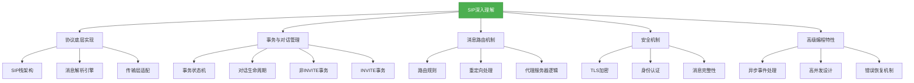
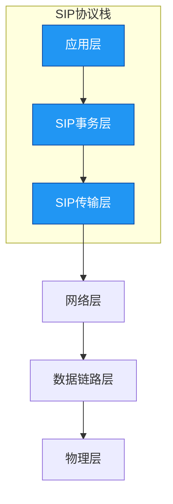
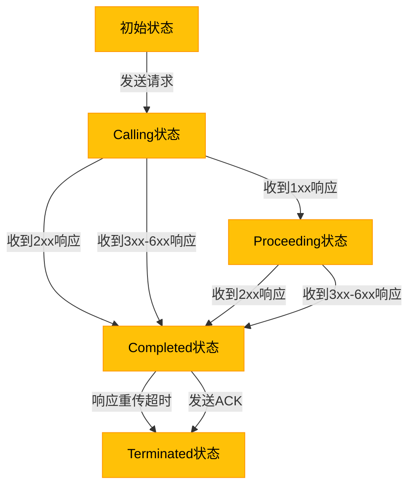
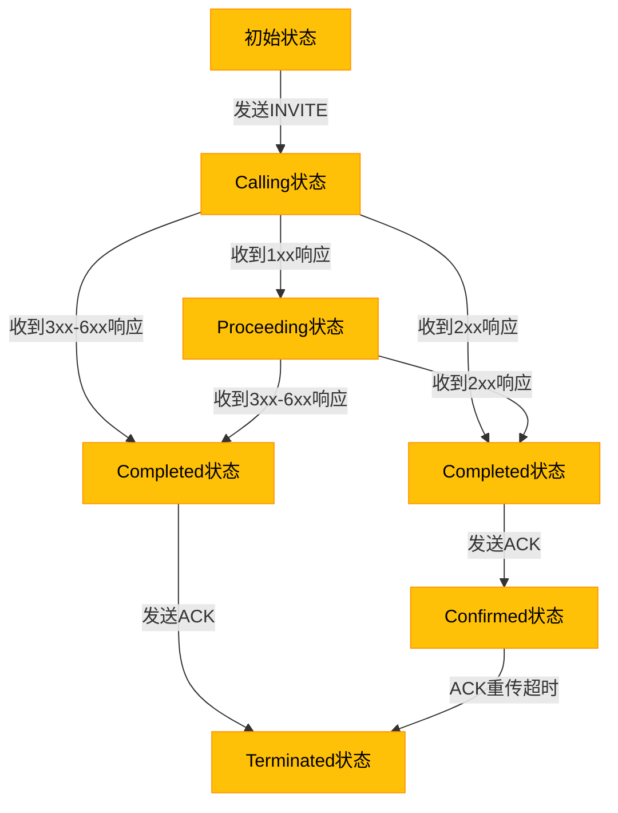
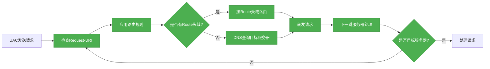

# 理解-深入理解SIP

## 概述
SIP（Session Initiation Protocol）作为多媒体会话控制的核心协议，其内部机制远比表面看起来更为复杂。本章将深入剖析SIP的底层实现原理，包括协议栈架构、事务处理机制、消息路由策略、安全机制以及Java SIP编程的高级特性。通过理解这些深层次的技术细节，开发者能够更好地应对复杂网络环境下的SIP应用开发挑战，优化会话性能，并解决实际应用中遇到的各种问题。



## 知识要点

### 1. SIP协议底层实现

#### 1.1 SIP协议栈架构
SIP协议栈是实现SIP通信的基础框架，通常包含以下核心层次：



- **应用层**：处理SIP消息的创建、解析和业务逻辑
- **事务层**：管理SIP事务的状态和超时重传机制
- **传输层**：处理UDP/TCP/TLS等传输协议的适配

在Java中，JAIN-SIP规范定义了SIP协议栈的实现标准，典型的实现包括NIST SIP和Mobicents SIP等。

#### 1.2 SIP消息解析机制
SIP消息采用文本格式，解析过程包括：
1. 起始行解析：区分请求/响应消息，提取方法/状态码
2. 头域解析：提取标准头域和扩展头域
3. 消息体解析：处理SDP等负载内容

以下是一个SIP消息解析的核心代码示例：

```java
import javax.sip.message.Request;
import javax.sip.message.Response;
import javax.sip.header.*;
import java.text.ParseException;

public class SipMessageParser {
    
    /**
     * 解析SIP请求消息
     * @param request SIP请求对象
     * @return 解析后的消息信息
     */
    public SipRequestInfo parseRequest(Request request) throws ParseException {
        SipRequestInfo info = new SipRequestInfo();
        
        // 解析请求行
        info.setMethod(request.getMethod());
        info.setRequestUri(request.getRequestURI().toString());
        info.setSipVersion(request.getSipVersion());
        
        // 解析核心头域
        FromHeader fromHeader = (FromHeader) request.getHeader(FromHeader.NAME);
        info.setFromAddress(fromHeader.getAddress().toString());
        info.setFromTag(fromHeader.getTag());
        
        ToHeader toHeader = (ToHeader) request.getHeader(ToHeader.NAME);
        info.setToAddress(toHeader.getAddress().toString());
        info.setToTag(toHeader.getTag());
        
        CallIdHeader callIdHeader = (CallIdHeader) request.getHeader(CallIdHeader.NAME);
        info.setCallId(callIdHeader.getCallId());
        
        CSeqHeader cSeqHeader = (CSeqHeader) request.getHeader(CSeqHeader.NAME);
        info.setCSeqNumber(cSeqHeader.getSeqNumber());
        info.setCSeqMethod(cSeqHeader.getMethod());
        
        // 解析消息体(SDP)
        if (request.getContentLength().getContentLength() > 0) {
            String content = request.getContent().toString();
            info.setSdpContent(content);
            info.setSdpInfo(parseSdpContent(content));
        }
        
        return info;
    }
    
    /**
     * 解析SDP内容
     * @param sdpContent SDP字符串
     * @return 解析后的SDP信息
     */
    private SdpInfo parseSdpContent(String sdpContent) {
        // SDP解析逻辑实现
        SdpInfo sdpInfo = new SdpInfo();
        String[] lines = sdpContent.split("\r?\n");
        
        for (String line : lines) {
            if (line.startsWith("v=")) {
                sdpInfo.setVersion(line.substring(2).trim());
            } else if (line.startsWith("o=")) {
                sdpInfo.setOrigin(line.substring(2).trim());
            } else if (line.startsWith("s=")) {
                sdpInfo.setSessionName(line.substring(2).trim());
            } else if (line.startsWith("c=")) {
                sdpInfo.setConnectionInfo(line.substring(2).trim());
            } else if (line.startsWith("t=")) {
                sdpInfo.setTiming(line.substring(2).trim());
            } else if (line.startsWith("m=")) {
                sdpInfo.addMedia(line.substring(2).trim());
            }
        }
        
        return sdpInfo;
    }
    
    // 内部辅助类
    public static class SipRequestInfo {
        private String method;
        private String requestUri;
        private String sipVersion;
        private String fromAddress;
        private String fromTag;
        private String toAddress;
        private String toTag;
        private String callId;
        private long cSeqNumber;
        private String cSeqMethod;
        private String sdpContent;
        private SdpInfo sdpInfo;
        
        // 省略getter和setter方法
    }
    
    public static class SdpInfo {
        private String version;
        private String origin;
        private String sessionName;
        private String connectionInfo;
        private String timing;
        private List<String> media = new ArrayList<>();
        
        // 省略getter和setter方法
    }
}
```

#### 1.3 传输层适配
SIP支持多种传输协议，各有其适用场景：

| 传输协议 | 特点 | 适用场景 |
|---------|------|---------|
| UDP | 无连接、低延迟、不可靠 | 实时性要求高的场景，如VoIP通话 |
| TCP | 面向连接、可靠传输、开销较大 | 消息较大或需要可靠传输的场景 |
| TLS | 基于TCP的加密传输 | 需要安全性保障的场景 |

Java SIP实现中，传输层适配代码示例：

```java
import javax.sip.SipStack;
import javax.sip.ListeningPoint;
import javax.sip.SipProvider;
import java.util.Properties;

public class SipTransportAdapter {
    private SipStack sipStack;
    
    public SipTransportAdapter() throws Exception {
        // 初始化SIP栈
        Properties properties = new Properties();
        properties.setProperty("javax.sip.STACK_NAME", "SipTransportStack");
        // 设置支持的传输协议
        properties.setProperty("javax.sip.IP_ADDRESS", "0.0.0.0");
        
        sipStack = SipFactory.getInstance().createSipStack(properties);
    }
    
    /**
     * 创建UDP监听点
     * @param port 端口号
     * @return SipProvider实例
     */
    public SipProvider createUdpProvider(int port) throws Exception {
        ListeningPoint listeningPoint = sipStack.createListeningPoint(port, "udp");
        return sipStack.createSipProvider(listeningPoint);
    }
    
    /**
     * 创建TCP监听点
     * @param port 端口号
     * @return SipProvider实例
     */
    public SipProvider createTcpProvider(int port) throws Exception {
        ListeningPoint listeningPoint = sipStack.createListeningPoint(port, "tcp");
        return sipStack.createSipProvider(listeningPoint);
    }
    
    /**
     * 创建TLS监听点
     * @param port 端口号
     * @param tlsConfig TLS配置
     * @return SipProvider实例
     */
    public SipProvider createTlsProvider(int port, TlsConfig tlsConfig) throws Exception {
        ListeningPoint listeningPoint = sipStack.createListeningPoint(port, "tls");
        // 配置TLS参数
        listeningPoint.setAttribute("javax.net.ssl.keyStore", tlsConfig.getKeyStorePath());
        listeningPoint.setAttribute("javax.net.ssl.keyStorePassword", tlsConfig.getKeyStorePassword());
        listeningPoint.setAttribute("javax.net.ssl.trustStore", tlsConfig.getTrustStorePath());
        
        return sipStack.createSipProvider(listeningPoint);
    }
    
    // TLS配置类
    public static class TlsConfig {
        private String keyStorePath;
        private String keyStorePassword;
        private String trustStorePath;
        
        // 省略getter和setter方法
    }
}
```

### 2. 事务与对话管理

#### 2.1 SIP事务状态机
SIP事务是SIP协议的核心概念，定义了请求和响应的交互模式。SIP事务分为两类：
- 非INVITE事务：用于除INVITE之外的所有请求方法
- INVITE事务：专门用于INVITE请求，包含确认过程

**非INVITE事务状态机**：



**INVITE事务状态机**（客户端）：



Java中实现事务状态管理的示例代码：

```java
import javax.sip.ClientTransaction;
import javax.sip.Dialog;
import javax.sip.RequestEvent;
import javax.sip.ResponseEvent;
import javax.sip.TimeoutEvent;
import javax.sip.listener.SipListener;

public class SipTransactionManager implements SipListener {
    private Map<String, ClientTransaction> transactions = new ConcurrentHashMap<>();
    private Map<String, Dialog> dialogs = new ConcurrentHashMap<>();
    
    /**
     * 处理请求事件
     */
    @Override
    public void processRequest(RequestEvent requestEvent) {
        // 服务器端事务处理
        Request request = requestEvent.getRequest();
        ServerTransaction serverTransaction = requestEvent.getServerTransaction();
        
        try {
            if (serverTransaction == null) {
                // 创建新的服务器事务
                serverTransaction = requestEvent.getSipProvider().getNewServerTransaction(request);
            }
            
            // 根据请求方法和当前状态进行处理
            String method = request.getMethod();
            if (Request.INVITE.equals(method)) {
                handleInviteRequest(serverTransaction, request);
            } else if (Request.BYE.equals(method)) {
                handleByeRequest(serverTransaction, request);
            } else if (Request.ACK.equals(method)) {
                handleAckRequest(request);
            } else {
                // 处理其他请求方法
                serverTransaction.sendResponse(
                    messageFactory.createResponse(200, request));
            }
        } catch (Exception e) {
            e.printStackTrace();
        }
    }
    
    /**
     * 处理响应事件
     */
    @Override
    public void processResponse(ResponseEvent responseEvent) {
        Response response = responseEvent.getResponse();
        ClientTransaction clientTransaction = responseEvent.getClientTransaction();
        int statusCode = response.getStatusCode();
        
        // 更新事务状态
        if (clientTransaction != null) {
            String transactionId = clientTransaction.getBranchId();
            
            if (statusCode >= 100 && statusCode < 200) {
                // 1xx临时响应
                updateTransactionState(transactionId, "Proceeding");
            } else if (statusCode >= 200 && statusCode < 700) {
                // 最终响应
                updateTransactionState(transactionId, "Completed");
                
                // 如果是INVITE的2xx响应，需要发送ACK
                if (Request.INVITE.equals(clientTransaction.getRequest().getMethod()) &&
                    statusCode >= 200 && statusCode < 300) {
                    sendAckForInvite(clientTransaction, response);
                }
            }
        }
    }
    
    /**
     * 处理超时事件
     */
    @Override
    public void processTimeout(TimeoutEvent timeoutEvent) {
        ClientTransaction transaction = timeoutEvent.getClientTransaction();
        if (transaction != null) {
            String transactionId = transaction.getBranchId();
            updateTransactionState(transactionId, "Timeout");
            transactions.remove(transactionId);
        }
    }
    
    // 其他事件处理方法省略...
    
    /**
     * 处理INVITE请求
     */
    private void handleInviteRequest(ServerTransaction serverTransaction, Request request) throws Exception {
        // 1. 发送180 Ringing响应
        Response ringingResponse = messageFactory.createResponse(180, request);
        serverTransaction.sendResponse(ringingResponse);
        
        // 2. 创建对话
        Dialog dialog = serverTransaction.getDialog();
        dialogs.put(dialog.getDialogId(), dialog);
        
        // 3. 模拟处理时间后发送200 OK响应
        new Thread(() -> {
            try {
                Thread.sleep(2000); // 模拟振铃2秒
                Response okResponse = messageFactory.createResponse(200, request);
                // 添加SDP响应
                okResponse.setContent(createSdpContent(), 
                    headerFactory.createContentTypeHeader("application", "sdp"));
                serverTransaction.sendResponse(okResponse);
            } catch (Exception e) {
                e.printStackTrace();
            }
        }).start();
    }
    
    /**
     * 发送INVITE的ACK确认
     */
    private void sendAckForInvite(ClientTransaction clientTransaction, Response response) throws Exception {
        Dialog dialog = clientTransaction.getDialog();
        if (dialog != null) {
            Request ackRequest = dialog.createAck(((CSeqHeader)response.getHeader(CSeqHeader.NAME)).getSeqNumber());
            dialog.sendAck(ackRequest);
            // 更新对话状态
            dialogs.put(dialog.getDialogId(), dialog);
        }
    }
    
    /**
     * 更新事务状态
     */
    private void updateTransactionState(String transactionId, String state) {
        // 记录事务状态变更
        System.out.println("Transaction " + transactionId + " state changed to: " + state);
        // 可以添加状态变更监听器等逻辑
    }
}
```

#### 2.2 对话生命周期管理
对话(Dialog)是SIP中两个UA之间的持久会话上下文，由Call-ID、本地标签和远程标签唯一标识。对话生命周期包括：

1. **创建**：由INVITE请求的2xx响应确认后创建
2. **活跃**：媒体流传输阶段
3. **终止**：收到BYE请求并响应2xx后终止

对话管理代码示例：

```java
import javax.sip.Dialog;
import javax.sip.RequestEvent;
import javax.sip.message.Request;
import javax.sip.message.Response;

public class DialogManager {
    private Map<String, DialogInfo> activeDialogs = new ConcurrentHashMap<>();
    
    /**
     * 创建新对话
     */
    public DialogInfo createDialog(Dialog dialog, Request request, Response response) {
        DialogInfo dialogInfo = new DialogInfo();
        dialogInfo.setDialogId(dialog.getDialogId());
        dialogInfo.setCallId(dialog.getCallId().getCallId());
        dialogInfo.setLocalTag(dialog.getLocalTag());
        dialogInfo.setRemoteTag(dialog.getRemoteTag());
        dialogInfo.setStartTime(new Date());
        dialogInfo.setState(DialogState.ESTABLISHED);
        
        // 解析SDP获取媒体信息
        if (response.getContent() != null) {
            dialogInfo.setSdpContent(response.getContent().toString());
            dialogInfo.setMediaInfo(parseMediaInfo(response.getContent().toString()));
        }
        
        activeDialogs.put(dialog.getDialogId(), dialogInfo);
        return dialogInfo;
    }
    
    /**
     * 终止对话
     */
    public void terminateDialog(String dialogId) {
        DialogInfo dialogInfo = activeDialogs.get(dialogId);
        if (dialogInfo != null) {
            dialogInfo.setState(DialogState.TERMINATED);
            dialogInfo.setEndTime(new Date());
            // 可以添加对话统计信息收集等逻辑
            System.out.println("Dialog " + dialogId + " terminated after " + 
                (dialogInfo.getEndTime().getTime() - dialogInfo.getStartTime().getTime()) + "ms");
        }
    }
    
    /**
     * 更新对话状态
     */
    public void updateDialogState(String dialogId, DialogState state) {
        DialogInfo dialogInfo = activeDialogs.get(dialogId);
        if (dialogInfo != null) {
            dialogInfo.setState(state);
        }
    }
    
    /**
     * 获取活跃对话列表
     */
    public List<DialogInfo> getActiveDialogs() {
        return activeDialogs.values().stream()
            .filter(d -> d.getState() == DialogState.ESTABLISHED)
            .collect(Collectors.toList());
    }
    
    /**
     * 解析媒体信息
     */
    private MediaInfo parseMediaInfo(String sdpContent) {
        // 解析SDP内容，提取媒体信息
        MediaInfo mediaInfo = new MediaInfo();
        // 实现SDP解析逻辑
        return mediaInfo;
    }
    
    // 对话状态枚举
    public enum DialogState {
        INITIATED, ESTABLISHED, TERMINATED, FAILED
    }
    
    // 对话信息类
    public static class DialogInfo {
        private String dialogId;
        private String callId;
        private String localTag;
        private String remoteTag;
        private Date startTime;
        private Date endTime;
        private DialogState state;
        private String sdpContent;
        private MediaInfo mediaInfo;
        
        // 省略getter和setter方法
    }
    
    // 媒体信息类
    public static class MediaInfo {
        private List<String> mediaTypes = new ArrayList<>();
        private Map<String, Integer> mediaPorts = new HashMap<>();
        private String codecInfo;
        
        // 省略getter和setter方法
    }
}
```

### 3. SIP消息路由机制

#### 3.1 路由规则与处理流程
SIP消息路由是SIP网络的核心功能，决定了消息如何从发送方传递到接收方。路由过程主要基于以下信息：
- Request-URI：请求的目标地址
- Route头域：显式路由路径
- Record-Route头域：记录路由路径，用于后续请求
- Contact头域：实际联系地址

SIP路由流程：



#### 3.2 代理服务器路由逻辑
代理服务器是SIP路由的关键组件，负责根据路由规则转发请求。代理服务器可分为：
- 有状态代理：维护事务和对话状态
- 无状态代理：仅转发消息，不维护状态

代理服务器路由实现示例：

```java
import javax.sip.address.Address;
import javax.sip.address.URI;
import javax.sip.header.RouteHeader;
import javax.sip.message.Request;
import java.util.List;

public class ProxyRouter {
    private RoutingTable routingTable;
    private DnsResolver dnsResolver;
    
    public ProxyRouter(RoutingTable routingTable, DnsResolver dnsResolver) {
        this.routingTable = routingTable;
        this.dnsResolver = dnsResolver;
    }
    
    /**
     * 确定下一跳服务器地址
     * @param request SIP请求
     * @return 下一跳地址
     */
    public String determineNextHop(Request request) throws Exception {
        // 1. 检查是否有Route头域
        List<RouteHeader> routeHeaders = request.getHeaders(RouteHeader.NAME);
        if (routeHeaders != null && !routeHeaders.isEmpty()) {
            // 取第一个Route头域作为下一跳
            RouteHeader routeHeader = routeHeaders.get(0);
            URI nextHopUri = routeHeader.getAddress().getURI();
            
            // 移除已处理的Route头域
            request.removeHeader(RouteHeader.NAME);
            
            return nextHopUri.toString();
        }
        
        // 2. 检查本地路由表
        URI requestUri = request.getRequestURI();
        String domain = extractDomain(requestUri.toString());
        String nextHop = routingTable.lookup(domain);
        
        if (nextHop != null) {
            return nextHop;
        }
        
        // 3. DNS查询(SRV记录)
        return dnsResolver.resolveSipSrv(domain);
    }
    
    /**
     * 提取URI中的域名
     */
    private String extractDomain(String uri) {
        // 简单实现：提取@后的部分
        int atIndex = uri.indexOf('@');
        if (atIndex != -1) {
            String domainPart = uri.substring(atIndex + 1);
            // 移除端口号
            int colonIndex = domainPart.indexOf(':');
            if (colonIndex != -1) {
                domainPart = domainPart.substring(0, colonIndex);
            }
            return domainPart;
        }
        return uri;
    }
    
    /**
     * 路由表接口
     */
    public interface RoutingTable {
        String lookup(String domain);
    }
    
    /**
     * DNS解析器接口
     */
    public interface DnsResolver {
        String resolveSipSrv(String domain) throws Exception;
    }
}
```

### 4. SIP安全机制

#### 4.1 SIP-TLS加密
SIP-TLS通过TLS协议对SIP消息进行加密传输，防止窃听和篡改。实现SIP-TLS需要：
1. 配置TLS证书
2. 设置TLS监听端口
3. 实现证书验证

Java中配置SIP-TLS的示例代码：

```java
import javax.net.ssl.SSLContext;
import javax.net.ssl.KeyManagerFactory;
import javax.net.ssl.TrustManagerFactory;
import java.io.FileInputStream;
import java.security.KeyStore;
import java.security.SecureRandom;

public class SipTlsConfig {
    private String keyStorePath;
    private String keyStorePassword;
    private String trustStorePath;
    private String trustStorePassword;
    
    /**
     * 创建SSL上下文
     */
    public SSLContext createSSLContext() throws Exception {
        // 加载密钥库
        KeyStore keyStore = KeyStore.getInstance("JKS");
        try (FileInputStream fis = new FileInputStream(keyStorePath)) {
            keyStore.load(fis, keyStorePassword.toCharArray());
        }
        
        // 加载信任库
        KeyStore trustStore = KeyStore.getInstance("JKS");
        try (FileInputStream fis = new FileInputStream(trustStorePath)) {
            trustStore.load(fis, trustStorePassword.toCharArray());
        }
        
        // 初始化密钥管理器
        KeyManagerFactory keyManagerFactory = KeyManagerFactory.getInstance(
            KeyManagerFactory.getDefaultAlgorithm());
        keyManagerFactory.init(keyStore, keyStorePassword.toCharArray());
        
        // 初始化信任管理器
        TrustManagerFactory trustManagerFactory = TrustManagerFactory.getInstance(
            TrustManagerFactory.getDefaultAlgorithm());
        trustManagerFactory.init(trustStore);
        
        // 创建SSL上下文
        SSLContext sslContext = SSLContext.getInstance("TLS");
        sslContext.init(
            keyManagerFactory.getKeyManagers(),
            trustManagerFactory.getTrustManagers(),
            new SecureRandom()
        );
        
        return sslContext;
    }
    
    /**
     * 配置SIP监听点使用TLS
     */
    public void configureTlsListeningPoint(ListeningPoint listeningPoint) throws Exception {
        SSLContext sslContext = createSSLContext();
        
        // 设置SSL上下文到监听点
        listeningPoint.setAttribute("javax.net.ssl.SSLContext", sslContext);
        
        // 可选：配置主机名验证器
        listeningPoint.setAttribute("javax.net.ssl.HostnameVerifier",
            (hostname, session) -> {
                // 实现自定义主机名验证逻辑
                return true; // 生产环境中需要严格验证
            });
    }
    
    // 省略getter和setter方法
}
```

#### 4.2 SIP身份认证
SIP支持多种身份认证机制，最常用的是Digest认证：

1. 服务器返回401 Unauthorized响应，包含WWW-Authenticate头域
2. 客户端使用凭据计算响应值，重新发送请求
3. 服务器验证响应值，通过则处理请求

Digest认证实现示例：

```java
import javax.sip.header.AuthorizationHeader;
import javax.sip.header.WwwAuthenticateHeader;
import javax.sip.message.Request;
import javax.sip.message.Response;
import java.security.MessageDigest;
import java.security.NoSuchAlgorithmException;
import java.util.Random;

public class DigestAuthenticator {
    private UserCredentialStore credentialStore;
    private NonceManager nonceManager;
    
    public DigestAuthenticator(UserCredentialStore credentialStore) {
        this.credentialStore = credentialStore;
        this.nonceManager = new NonceManager();
    }
    
    /**
     * 创建401响应，包含认证挑战
     */
    public Response createUnauthorizedResponse(Request request) throws Exception {
        Response response = messageFactory.createResponse(401, request);
        
        // 生成nonce
        String nonce = nonceManager.generateNonce();
        String realm = "sip.example.com";
        
        // 创建WWW-Authenticate头域
        WwwAuthenticateHeader wwwAuthHeader = headerFactory.createWwwAuthenticateHeader("Digest");
        wwwAuthHeader.setParameter("realm", realm);
        wwwAuthHeader.setParameter("nonce", nonce);
        wwwAuthHeader.setParameter("qop", "auth");
        wwwAuthHeader.setParameter("algorithm", "MD5");
        wwwAuthHeader.setParameter("opaque", generateOpaque());
        
        response.addHeader(wwwAuthHeader);
        return response;
    }
    
    /**
     * 验证请求中的认证信息
     */
    public boolean validateRequest(Request request) throws Exception {
        AuthorizationHeader authHeader = (AuthorizationHeader) request.getHeader(AuthorizationHeader.NAME);
        if (authHeader == null) {
            return false;
        }
        
        // 提取认证参数
        String username = authHeader.getUsername();
        String realm = authHeader.getRealm();
        String nonce = authHeader.getNonce();
        String uri = authHeader.getURI();
        String response = authHeader.getResponse();
        String qop = authHeader.getQop();
        String cnonce = authHeader.getCNonce();
        String nc = authHeader.getNonceCount();
        
        // 验证nonce
        if (!nonceManager.validateNonce(nonce)) {
            return false;
        }
        
        // 获取用户密码
        String password = credentialStore.getPassword(username, realm);
        if (password == null) {
            return false;
        }
        
        // 计算期望的响应值
        String expectedResponse = calculateResponse(
            request.getMethod(), username, realm, password, nonce, uri, qop, cnonce, nc);
        
        // 比较响应值
        return expectedResponse.equals(response);
    }
    
    /**
     * 计算Digest响应值
     */
    private String calculateResponse(String method, String username, String realm, String password,
                                   String nonce, String uri, String qop, String cnonce, String nc) throws NoSuchAlgorithmException {
        // A1 = username:realm:password
        String a1 = username + ":" + realm + ":" + password;
        String ha1 = md5Hash(a1);
        
        // A2 = method:uri
        String a2 = method + ":" + uri;
        String ha2 = md5Hash(a2);
        
        // 计算响应值
        String response;
        if (qop != null && qop.equalsIgnoreCase("auth")) {
            // response = MD5(HA1:nonce:nc:cnonce:qop:HA2)
            response = ha1 + ":" + nonce + ":" + nc + ":" + cnonce + ":" + qop + ":" + ha2;
        } else {
            // response = MD5(HA1:nonce:HA2)
            response = ha1 + ":" + nonce + ":" + ha2;
        }
        
        return md5Hash(response);
    }
    
    /**
     * MD5哈希计算
     */
    private String md5Hash(String input) throws NoSuchAlgorithmException {
        MessageDigest md = MessageDigest.getInstance("MD5");
        byte[] digest = md.digest(input.getBytes());
        
        // 转换为十六进制字符串
        StringBuilder sb = new StringBuilder();
        for (byte b : digest) {
            sb.append(String.format("%02x", b));
        }
        return sb.toString();
    }
    
    /**
     * 生成opaque值
     */
    private String generateOpaque() {
        Random random = new Random();
        return Integer.toHexString(random.nextInt());
    }
    
    /**
     * 用户凭据存储接口
     */
    public interface UserCredentialStore {
        String getPassword(String username, String realm);
    }
    
    /**
     * Nonce管理器
     */
    public static class NonceManager {
        private Set<String> validNonces = Collections.synchronizedSet(new HashSet<>());
        private long nonceValidityPeriod = 300000; // 5分钟
        
        public String generateNonce() {
            String nonce = System.currentTimeMillis() + ":" + UUID.randomUUID().toString();
            validNonces.add(nonce);
            
            // 清理过期nonce
            cleanupExpiredNonces();
            return nonce;
        }
        
        public boolean validateNonce(String nonce) {
            cleanupExpiredNonces();
            return validNonces.contains(nonce);
        }
        
        private void cleanupExpiredNonces() {
            long currentTime = System.currentTimeMillis();
            validNonces.removeIf(nonce -> {
                try {
                    String[] parts = nonce.split(":");
                    long timestamp = Long.parseLong(parts[0]);
                    return currentTime - timestamp > nonceValidityPeriod;
                } catch (Exception e) {
                    return true;
                }
            });
        }
    }
}
```

### 5. Java SIP高级编程特性

#### 5.1 异步事件处理模型
JAIN-SIP采用异步事件驱动模型，所有SIP消息和事件通过SipListener接口回调处理：

```java
import javax.sip.*;
import javax.sip.message.Request;
import javax.sip.message.Response;
import java.util.concurrent.ExecutorService;
import java.util.concurrent.Executors;

public class AsyncSipHandler implements SipListener {
    private ExecutorService executorService = Executors.newFixedThreadPool(10);
    private SipMessageProcessor messageProcessor;
    
    public AsyncSipHandler(SipMessageProcessor messageProcessor) {
        this.messageProcessor = messageProcessor;
    }
    
    /**
     * 异步处理请求事件
     */
    @Override
    public void processRequest(RequestEvent requestEvent) {
        executorService.submit(() -> {
            try {
                // 异步处理请求
                messageProcessor.processRequest(requestEvent);
            } catch (Exception e) {
                e.printStackTrace();
            }
        });
    }
    
    /**
     * 异步处理响应事件
     */
    @Override
    public void processResponse(ResponseEvent responseEvent) {
        executorService.submit(() -> {
            try {
                // 异步处理响应
                messageProcessor.processResponse(responseEvent);
            } catch (Exception e) {
                e.printStackTrace();
            }
        });
    }
    
    /**
     * 处理超时事件
     */
    @Override
    public void processTimeout(TimeoutEvent timeoutEvent) {
        executorService.submit(() -> {
            // 处理超时
            messageProcessor.processTimeout(timeoutEvent);
        });
    }
    
    // 其他事件处理方法省略...
    
    /**
     * 关闭执行器服务
     */
    public void shutdown() {
        executorService.shutdown();
    }
    
    /**
     * 消息处理器接口
     */
    public interface SipMessageProcessor {
        void processRequest(RequestEvent requestEvent) throws Exception;
        void processResponse(ResponseEvent responseEvent) throws Exception;
        void processTimeout(TimeoutEvent timeoutEvent);
    }
}
```

#### 5.2 高并发SIP服务器设计
构建高并发SIP服务器需要考虑：
- 线程池管理
- 连接复用
- 内存优化
- 负载均衡

高并发SIP服务器架构示例：

```java
public class HighPerformanceSipServer {
    private SipStack sipStack;
    private List<SipProvider> sipProviders = new ArrayList<>();
    private AsyncSipHandler sipHandler;
    private ExecutorService processingPool;
    private ExecutorService ioPool;
    
    /**
     * 初始化高并发SIP服务器
     */
    public void initialize() throws Exception {
        // 1. 配置SIP栈
        Properties properties = new Properties();
        properties.setProperty("javax.sip.STACK_NAME", "HighPerfSipServer");
        properties.setProperty("javax.sip.IP_ADDRESS", "0.0.0.0");
        
        // 性能优化参数
        properties.setProperty("gov.nist.javax.sip.THREAD_POOL_SIZE", "20");
        properties.setProperty("gov.nist.javax.sip.RECEIVE_UDP_BUFFER_SIZE", "65536");
        properties.setProperty("gov.nist.javax.sip.MAX_MESSAGE_SIZE", "65536");
        properties.setProperty("gov.nist.javax.sip.CACHE_CLIENT_CONNECTIONS", "true");
        
        sipStack = SipFactory.getInstance().createSipStack(properties);
        
        // 2. 创建线程池
        processingPool = Executors.newFixedThreadPool(50);
        ioPool = Executors.newCachedThreadPool();
        
        // 3. 创建消息处理器
        SipMessageProcessor messageProcessor = new DefaultSipMessageProcessor();
        sipHandler = new AsyncSipHandler(messageProcessor);
        
        // 4. 创建监听点
        createListeningPoints();
    }
    
    /**
     * 创建监听点
     */
    private void createListeningPoints() throws Exception {
        // 创建UDP监听点
        ListeningPoint udpListeningPoint = sipStack.createListeningPoint(5060, "udp");
        SipProvider udpProvider = sipStack.createSipProvider(udpListeningPoint);
        udpProvider.addSipListener(sipHandler);
        sipProviders.add(udpProvider);
        
        // 创建TCP监听点
        ListeningPoint tcpListeningPoint = sipStack.createListeningPoint(5060, "tcp");
        SipProvider tcpProvider = sipStack.createSipProvider(tcpListeningPoint);
        tcpProvider.addSipListener(sipHandler);
        sipProviders.add(tcpProvider);
        
        // 可以添加TLS监听点
    }
    
    /**
     * 关闭服务器
     */
    public void shutdown() {
        processingPool.shutdown();
        ioPool.shutdown();
        sipHandler.shutdown();
    }
    
    /**
     * 默认SIP消息处理器
     */
    private static class DefaultSipMessageProcessor implements AsyncSipHandler.SipMessageProcessor {
        private DialogManager dialogManager = new DialogManager();
        private TransactionManager transactionManager = new TransactionManager();
        private ProxyRouter proxyRouter = new ProxyRouter(new DefaultRoutingTable(), new DefaultDnsResolver());
        
        @Override
        public void processRequest(RequestEvent requestEvent) throws Exception {
            // 实现请求处理逻辑
            Request request = requestEvent.getRequest();
            ServerTransaction serverTransaction = requestEvent.getServerTransaction();
            
            // 处理注册请求
            if (Request.REGISTER.equals(request.getMethod())) {
                handleRegisterRequest(requestEvent, serverTransaction);
            } 
            // 处理INVITE请求
            else if (Request.INVITE.equals(request.getMethod())) {
                handleInviteRequest(requestEvent, serverTransaction);
            } 
            // 处理其他请求...
        }
        
        // 具体请求处理方法省略...
    }
}
```

## 知识扩展

### 设计思想

SIP协议的设计体现了以下关键思想：

1. **模块化与分层设计**
SIP采用清晰的分层结构，将协议栈分为应用层、事务层和传输层，各层职责明确，便于实现和扩展。这种设计使得SIP能够灵活适配不同的传输协议和应用场景。

2. **无状态与有状态结合**
SIP在协议设计上巧妙地结合了无状态和有状态的特点：无状态代理服务器提高了处理效率，而有状态事务管理确保了消息可靠传输。这种混合设计平衡了性能和可靠性需求。

3. **端到端原则**
SIP遵循互联网的端到端原则，将复杂的会话控制逻辑放在通信端点（UA），而网络中间节点（代理服务器）主要负责路由功能。这种设计简化了网络架构，提高了系统的可扩展性。

4. **文本格式与可扩展性**
采用文本格式的消息使得SIP易于调试和扩展。通过定义新的头域和方法，可以在不修改核心协议的情况下添加新功能，如SIP扩展协议（SIP-I、SIMPLE等）。

5. **与其他协议的协同工作**
SIP并不试图解决所有问题，而是专注于会话控制，通过与其他协议（SDP、RTP/RTCP、DNS等）协同工作，提供完整的多媒体通信解决方案。这种松耦合设计提高了协议的灵活性和适应性。

### 避坑指南

#### 1. 事务超时与重传处理
SIP依赖超时重传机制保证消息可靠传输，但在实际应用中容易出现问题：

**问题**：网络延迟导致重传消息到达，引起重复处理。
**解决方案**：
- 正确实现事务状态机，跟踪事务状态
- 使用branch参数识别重传消息
- 对最终响应后的重传请求直接丢弃

```java
// 处理重传请求的示例代码
public void handleRequest(Request request, ServerTransaction serverTransaction) throws Exception {
    if (serverTransaction != null) {
        // 已存在事务，说明是重传
        TransactionState state = serverTransaction.getState();
        
        if (state == TransactionState.COMPLETED) {
            // 对已完成事务的重传，直接重发响应
            Response response = serverTransaction.getLastResponse();
            if (response != null) {
                serverTransaction.sendResponse(response);
            }
            return;
        }
    }
    
    // 处理新请求...
}
```

#### 2. 对话状态维护
在多线程环境下，对话状态维护容易出现并发问题：

**问题**：多个线程同时修改对话状态，导致数据不一致。
**解决方案**：
- 使用线程安全的数据结构存储对话
- 对对话操作进行同步
- 实现对话状态变更的原子操作

```java
// 线程安全的对话操作示例
public void updateDialogState(String dialogId, DialogState newState) {
    synchronized (dialogs) {
        DialogInfo dialogInfo = dialogs.get(dialogId);
        if (dialogInfo != null) {
            // 检查状态转换是否合法
            if (isValidStateTransition(dialogInfo.getState(), newState)) {
                dialogInfo.setState(newState);
                // 触发状态变更事件
                fireDialogStateChanged(dialogInfo);
            } else {
                log.warn("Invalid state transition from {} to {} for dialog {}",
                    dialogInfo.getState(), newState, dialogId);
            }
        }
    }
}
```

#### 3. NAT穿透问题
SIP在NAT环境下通信是常见挑战：

**问题**：私有网络中的UA无法被外部网络直接访问，导致呼叫失败。
**解决方案**：
- 使用STUN服务器获取公网地址
- 采用TURN服务器中继媒体流
- 配置SIP ALG功能
- 在Contact头域中使用公网地址

```java
// 使用STUN获取公网地址示例
public String getPublicAddress() throws Exception {
    StunClient stunClient = new StunClient("stun.example.com", 3478);
    StunResponse response = stunClient.testConnection();
    
    if (response.isSuccess()) {
        return response.getPublicAddress() + ":" + response.getPublicPort();
    } else {
        throw new Exception("Failed to get public address via STUN");
    }
}

// 在Contact头域中使用公网地址
Address contactAddress = addressFactory.createAddress(
    "sip:" + username + "@" + getPublicAddress());
ContactHeader contactHeader = headerFactory.createContactHeader(contactAddress);
request.addHeader(contactHeader);
```

#### 4. 性能优化策略
高并发场景下SIP服务器容易出现性能瓶颈：

**问题**：大量并发请求导致服务器响应延迟或丢包。
**解决方案**：
- 合理配置线程池大小
- 使用NIO提高I/O处理能力
- 优化内存使用，减少对象创建
- 实现请求优先级机制
- 采用分布式架构横向扩展

```java
// 线程池配置示例
public ExecutorService createOptimizedThreadPool() {
    int corePoolSize = Runtime.getRuntime().availableProcessors() * 2;
    int maxPoolSize = corePoolSize * 2;
    long keepAliveTime = 60;
    
    return new ThreadPoolExecutor(
        corePoolSize,
        maxPoolSize,
        keepAliveTime, TimeUnit.SECONDS,
        new SynchronousQueue<>(),
        new ThreadFactoryBuilder()
            .setNameFormat("sip-worker-%d")
            .setDaemon(true)
            .build(),
        new ThreadPoolExecutor.CallerRunsPolicy() // 饱和策略：调用者运行
    );
}
```

### 深度思考题

#### 思考题1：SIP事务与TCP连接的关系是什么？它们如何协同工作保证消息可靠传输？

**参考答案**：
SIP事务和TCP连接是两个不同层次的概念，分别工作在应用层和传输层，但它们协同工作以保证SIP消息的可靠传输：

1. **层次关系**：
   - TCP是传输层协议，提供面向连接的可靠字节流传输
   - SIP事务是应用层概念，定义了SIP请求和响应的交互模式
   - SIP事务可以运行在TCP之上，也可以运行在UDP之上

2. **协同工作机制**：
   - 当SIP使用TCP传输时，TCP提供的可靠传输特性（确认、重传、排序）减轻了SIP事务层的负担
   - SIP事务层仍然需要管理事务状态和超时，但可以减少UDP环境下的重传次数
   - TCP保证消息按顺序到达，避免了SIP事务处理乱序问题
   - 对于大型SIP消息（如包含大量SDP属性），TCP的流传输更适合，避免了UDP的分片问题

3. **优缺点比较**：
   - UDP+事务重传：适合实时性要求高的场景，但可能有重复消息
   - TCP+事务：提供更强的可靠性，但连接建立和关闭有额外开销

4. **实际应用选择**：
   - 对可靠性要求高的场景（如注册、消息传递）使用TCP
   - 对实时性要求高的场景（如语音通话建立）可使用UDP
   - 现代SIP实现通常同时支持TCP和UDP，根据消息类型自动选择

#### 思考题2：如何设计一个支持百万级并发会话的SIP服务器架构？

**参考答案**：
设计支持百万级并发会话的SIP服务器需要从多个层面进行优化：

1. **网络层优化**：
   - 使用多网卡和负载均衡分散流量
   - 优化TCP参数（如增大缓冲区、调整超时时间）
   - 采用DPDK等技术绕过内核直接操作网络接口

2. **协议栈优化**：
   - 使用高性能SIP协议栈（如OpenSIPS、Kamailio）
   - 合理配置线程池和内存使用
   - 禁用不必要的协议特性和扩展

3. **应用架构设计**：
   - 采用分布式架构，将功能拆分为注册、代理、路由等独立服务
   - 使用无状态设计便于水平扩展
   - 引入消息队列解耦组件间通信
   - 采用异步非阻塞I/O模型提高吞吐量

4. **数据存储优化**：
   - 使用分布式缓存（如Redis）存储会话状态
   - 采用时序数据库存储通话记录和统计信息
   - 实现数据分片和分区策略

5. **高可用设计**：
   - 实现服务冗余和自动故障转移
   - 采用主从复制或集群技术保证数据可靠性
   - 设计优雅降级机制应对流量峰值

6. **监控与调优**：
   - 实时监控系统指标（CPU、内存、网络、会话数）
   - 实现自动扩缩容机制
   - 定期进行性能测试和瓶颈分析

7. **典型架构示例**：
   ```
   客户端 → 负载均衡器 → SIP前端代理集群 → 业务逻辑服务集群 → 数据存储集群
                      ↓                    ↓
                      → 媒体服务器集群   → 监控与管理系统
   ```

实现百万级并发会话不仅需要技术选型正确，还需要细致的性能调优和架构设计，同时考虑成本与收益的平衡。