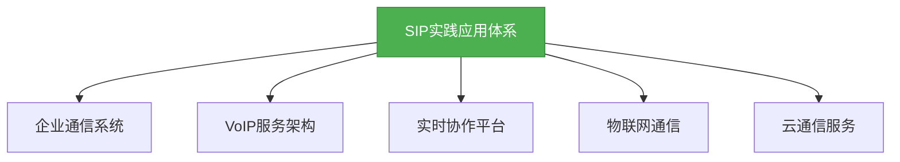
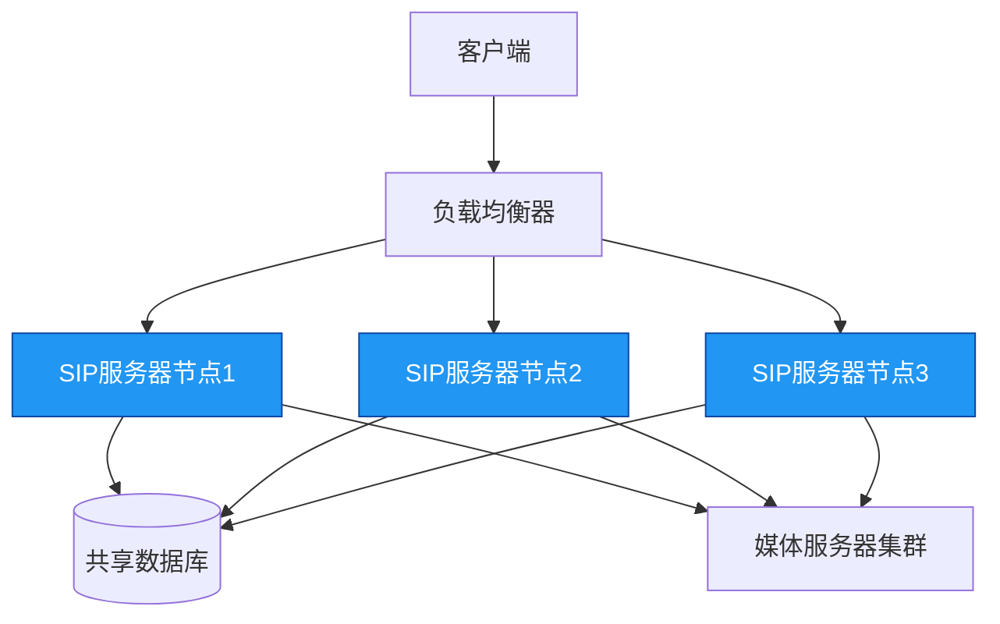
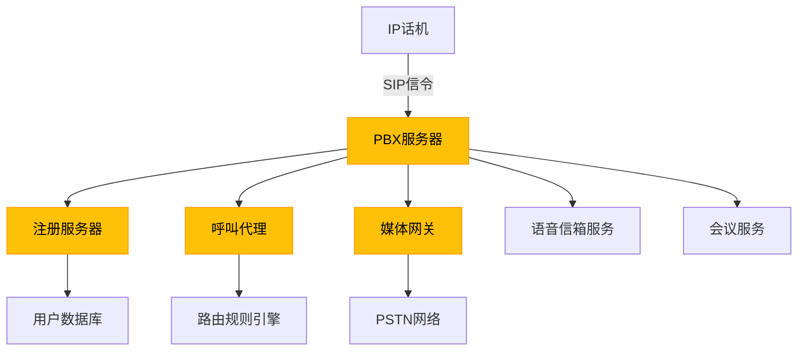

# 进阶-SIP在实践中的应用

## 概述
SIP协议在实际应用中涉及复杂场景和架构设计，包括企业通信系统、VoIP服务、实时协作平台等。本章将深入探讨SIP在实践中的高级应用，涵盖协议集成、大规模部署、安全实现和性能优化等关键技术点。



## 知识要点
### 1. SIP与WebRTC集成
WebRTC提供浏览器端实时音视频能力，与SIP结合可构建跨平台通信系统：

```java
/**
 * SIP与WebRTC网关示例
 * 将SIP信令转换为WebRTC兼容格式
 */
public class SipWebrtcGateway {
    private SipStack sipStack;
    private WebRtcPeerConnectionFactory webRtcFactory;

    /**
     * 初始化SIP和WebRTC组件
     */
    public void init() throws Exception {
        // 初始化SIP栈
        initSipStack();
        // 初始化WebRTC工厂
        initWebRtcFactory();
    }

    /**
     * 处理SIP INVITE请求，创建WebRTC连接
     */
    public void handleSipInvite(Request inviteRequest) {
        // 1. 解析SIP消息中的SDP信息
        SdpDescription sdp = parseSipSdp(inviteRequest);
        
        // 2. 创建WebRTC对等连接
        WebRtcPeerConnection peerConnection = createWebRtcPeerConnection();
        
        // 3. 设置ICE候选者和媒体流
        setupMediaStream(peerConnection, sdp);
        
        // 4. 生成WebRTC SDP应答
        SdpDescription webRtcSdp = generateWebRtcSdp(peerConnection);
        
        // 5. 转换为SIP应答消息
        Response okResponse = createSipOkResponse(inviteRequest, webRtcSdp);
        
        // 6. 发送SIP响应
        sendSipResponse(okResponse);
    }

    // 省略其他实现方法...
}
```

### 2. 企业级SIP服务器集群部署
大规模SIP服务需要集群架构支持高可用和负载均衡：

#### （1）集群架构设计


#### （2）会话状态同步
使用分布式缓存实现会话状态共享：

```java
/**
 * SIP会话状态管理器
 * 使用Redis实现集群节点间状态同步
 */
public class ClusterSessionManager {
    private RedisTemplate<String, Object> redisTemplate;
    private String nodeId;
    private static final String SESSION_PREFIX = "sip:session:";
    private static final String USER_PREFIX = "sip:user:";

    /**
     * 保存会话状态到分布式缓存
     */
    public void saveSession(SipSession session) {
        String sessionKey = SESSION_PREFIX + session.getCallId();
        // 设置会话数据并添加节点ID
        session.setNodeId(nodeId);
        redisTemplate.opsForValue().set(sessionKey, session, 3600, TimeUnit.SECONDS);

        // 维护用户与会话的映射
        String userKey = USER_PREFIX + session.getUserId();
        redisTemplate.opsForSet().add(userKey, session.getCallId());
    }

    /**
     * 获取会话状态，支持跨节点查找
     */
    public SipSession getSession(String callId) {
        String sessionKey = SESSION_PREFIX + callId;
        return (SipSession) redisTemplate.opsForValue().get(sessionKey);
    }

    // 省略其他方法...
}
```

### 3. SIP安全机制实现
SIP协议在开放网络中面临安全威胁，需从传输加密、身份认证和消息完整性三个层面构建防护体系：

#### （1）TLS加密传输
通过TLS协议保护SIP信令传输，防止窃听和篡改：

```java
/**
 * 配置SIP TLS传输层
 */
public class SipTlsConfig {
    private static final int TLS_PORT = 5061;
    private SSLContext sslContext;

    /**
     * 初始化TLS上下文
     */
    public void initTlsContext() throws Exception {
        // 加载密钥库
        KeyStore keyStore = KeyStore.getInstance("JKS");
        keyStore.load(new FileInputStream("sip-server-keystore.jks"), "password".toCharArray());

        // 创建密钥管理器
        KeyManagerFactory keyManagerFactory = KeyManagerFactory.getInstance(
            KeyManagerFactory.getDefaultAlgorithm());
        keyManagerFactory.init(keyStore, "password".toCharArray());

        // 创建信任管理器
        TrustManagerFactory trustManagerFactory = TrustManagerFactory.getInstance(
            TrustManagerFactory.getDefaultAlgorithm());
        trustManagerFactory.init(keyStore);

        // 初始化SSL上下文
        sslContext = SSLContext.getInstance("TLSv1.2");
        sslContext.init(
            keyManagerFactory.getKeyManagers(),
            trustManagerFactory.getTrustManagers(),
            new SecureRandom()
        );
    }

    /**
     * 创建TLS监听点
     */
    public ListeningPoint createTlsListeningPoint(SipStack sipStack) throws Exception {
        ListeningPoint tlsListeningPoint = sipStack.createListeningPoint(
            "0.0.0.0", TLS_PORT, "tls");
        
        // 配置TLS参数
        ((TlsListeningPoint) tlsListeningPoint).setSSLContext(sslContext);
        ((TlsListeningPoint) tlsListeningPoint).setEnabledProtocols(new String[] {"TLSv1.2"});
        ((TlsListeningPoint) tlsListeningPoint).setEnabledCipherSuites(new String[] {
            "TLS_ECDHE_RSA_WITH_AES_256_GCM_SHA384"
        });
        
        return tlsListeningPoint;
    }
}
```

#### （2）身份认证机制
实现SIP Digest认证，防止未授权访问：

```java
/**
 * SIP Digest认证处理器
 */
public class DigestAuthenticationHandler {
    private UserCredentialStore credentialStore;

    /**
     * 验证SIP请求中的认证信息
     */
    public boolean validateRequest(Request request) throws Exception {
        // 获取Authorization头
        AuthorizationHeader authHeader = (AuthorizationHeader) request.getHeader(AuthorizationHeader.NAME);
        if (authHeader == null) {
            throw new SecurityException("Missing authentication header");
        }

        // 提取认证参数
        String username = authHeader.getUsername();
        String realm = authHeader.getRealm();
        String nonce = authHeader.getNonce();
        String uri = authHeader.getURI();
        String response = authHeader.getResponse();
        String method = request.getMethod();

        // 获取用户凭证
        UserCredential credential = credentialStore.getCredential(username, realm);
        if (credential == null) {
            throw new SecurityException("User not found: " + username);
        }

        // 计算期望的响应值
        String expectedResponse = calculateResponse(
            credential.getPassword(), username, realm, method, uri, nonce);

        // 验证响应
        return expectedResponse.equals(response);
    }

    // 省略Digest算法实现...
}
```

### 4. SIP性能优化实践
针对高并发场景，需从协议处理、资源管理和架构设计三方面优化：

#### （1）异步消息处理
采用事件驱动模型处理SIP消息，提高吞吐量：

```java
/**
 * 高性能SIP消息处理器
 * 使用Disruptor实现无锁并发处理
 */
public class HighPerformanceMessageHandler {
    private final RingBuffer<SipMessageEvent> ringBuffer;
    private final ExecutorService executor;

    public HighPerformanceMessageHandler(int bufferSize) {
        // 初始化Disruptor环形缓冲区
        Disruptor<SipMessageEvent> disruptor = new Disruptor<>(
            SipMessageEvent::new, bufferSize, Executors.defaultThreadFactory());

        // 设置事件处理器链
        disruptor.handleEventsWith(this::processMessage)
                 .then(this::routeMessage)
                 .then(this::sendResponse);

        // 启动Disruptor
        ringBuffer = disruptor.start();
        executor = Executors.newFixedThreadPool(Runtime.getRuntime().availableProcessors());
    }

    /**
     * 提交消息到处理队列
     */
    public void submitMessage(SipMessage message, SipSession session) {
        long sequence = ringBuffer.next();
        try {
            SipMessageEvent event = ringBuffer.get(sequence);
            event.setMessage(message);
            event.setSession(session);
        } finally {
            ringBuffer.publish(sequence);
        }
    }

    // 消息处理实现...
}
```

#### （2）连接复用与池化
管理SIP连接资源，减少创建销毁开销：

```java
/**
 * SIP连接池
 * 复用TCP连接提高性能
 */
public class SipConnectionPool {
    private final GenericObjectPool<SipConnection> connectionPool;
    private final SipConnectionFactory connectionFactory;

    public SipConnectionPool(SipConnectionFactory factory, PoolConfig config) {
        this.connectionFactory = factory;
        this.connectionPool = new GenericObjectPool<>(factory, config);
    }

    /**
     * 获取连接
     */
    public SipConnection borrowConnection() throws Exception {
        return connectionPool.borrowObject();
    }

    /**
     * 归还连接
     */
    public void returnConnection(SipConnection connection) {
        if (connection.isValid()) {
            connectionPool.returnObject(connection);
        } else {
            connectionPool.invalidateObject(connection);
        }
    }

    // 连接工厂实现...
}
```

### 5. 实际应用案例分析
#### （1）企业IP PBX系统
基于SIP构建的企业电话系统架构：



#### （2）云通信平台集成
SIP与云服务结合实现弹性扩展：

```java
/**
 * 云原生SIP服务示例
 * 基于Kubernetes实现自动扩缩容
 */
public class CloudNativeSipService {
    private final KubernetesClient k8sClient;
    private final String deploymentName = "sip-server";
    private final String namespace = "communication";

    /**
     * 根据负载自动调整副本数
     */
    public void scaleBasedOnLoad(double currentCpuUsage, int currentConnections) {
        // 获取当前部署
        Deployment deployment = k8sClient.apps().deployments()
            .inNamespace(namespace)
            .withName(deploymentName)
            .get();

        // 计算目标副本数
        int targetReplicas = calculateTargetReplicas(currentCpuUsage, currentConnections);
        int currentReplicas = deployment.getSpec().getReplicas();

        // 调整副本数
        if (targetReplicas != currentReplicas) {
            deployment.getSpec().setReplicas(targetReplicas);
            k8sClient.apps().deployments()
                .inNamespace(namespace)
                .withName(deploymentName)
                .replace(deployment);
            
            System.out.println("Scaling SIP server from " + currentReplicas + " to " + targetReplicas);
        }
    }

    // 副本数计算逻辑...
}
```

// ... existing code ...