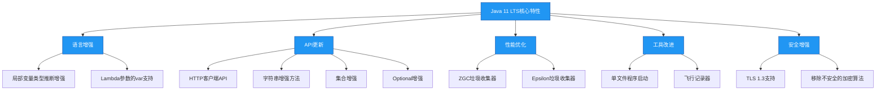

# Java 11 LTS特性

## 概述

Java 11是Oracle于2018年9月发布的长期支持(LTS)版本，作为Java 8之后的第二个LTS版本，它带来了多项重要更新。Java 11不仅整合了Java 9和Java 10的特性，还引入了新的API和性能优化，同时移除了一些过时的功能。本章节将详细介绍Java 11的核心特性及其在实际开发中的应用。



## 知识要点

### 1. 语言增强

#### 1.1 局部变量类型推断增强

Java 10引入了`var`关键字用于局部变量类型推断，Java 11进一步扩展了其使用范围，允许在Lambda表达式的参数中使用`var`。

```java
// Java 10及之前：只能在局部变量声明中使用var
var message = "Hello Java 10";

// Java 11新增：Lambda参数中使用var
Predicate<String> predicate = (var s) -> s.length() > 5;

// 带注解的Lambda参数
Predicate<String> annotatedPredicate = (@NonNull var s) -> s.length() > 5;
```

使用`var`的好处：
- 减少样板代码，提高可读性
- 便于后续重构变量类型
- 保持类型安全，编译器仍会进行类型检查

#### 1.2 Lambda参数的var支持

Java 11允许在Lambda表达式的参数中使用`var`，这使得可以为Lambda参数添加注解：

```java
// 带多个注解的Lambda参数
List<String> names = Arrays.asList("Alice", "Bob", "Charlie");
names.forEach((@NonNull var name) -> {
    System.out.println("Hello, " + name);
});

// 复杂场景下的类型推断
BiFunction<Integer, String, Boolean> biFunction = (@Nullable var i, @NonNull var s) -> {
    return s.length() > i;
};
```

### 2. API更新

#### 2.1 HTTP客户端API (Standard)

Java 11将Java 9中引入的孵化阶段的HTTP客户端正式标准化，位于`java.net.http`包下。这个新的HTTP客户端支持HTTP/2和WebSocket，提供了同步和异步两种编程模型。

**同步请求示例**：
```java
import java.net.URI;
import java.net.http.HttpClient;
import java.net.http.HttpRequest;
import java.net.http.HttpResponse;
import java.util.concurrent.ExecutionException;

public class HttpClientExample {
    public static void main(String[] args) throws Exception {
        // 创建HTTP客户端
        HttpClient client = HttpClient.newHttpClient();
        
        // 创建HTTP请求
        HttpRequest request = HttpRequest.newBuilder()
                .uri(URI.create("https://api.example.com/data"))
                .header("Content-Type", "application/json")
                .GET()
                .build();
        
        // 发送同步请求
        HttpResponse<String> response = client.send(
                request,
                HttpResponse.BodyHandlers.ofString()
        );
        
        // 处理响应
        System.out.println("状态码: " + response.statusCode());
        System.out.println("响应体: " + response.body());
    }
}
```

**异步请求示例**：
```java
// 发送异步请求
client.sendAsync(request, HttpResponse.BodyHandlers.ofString())
      .thenApply(HttpResponse::body)
      .thenAccept(System.out::println)
      .join();
```

**POST请求示例**：
```java
String requestBody = "{\"name\": \"Java 11\"}";

HttpRequest postRequest = HttpRequest.newBuilder()
        .uri(URI.create("https://api.example.com/data"))
        .header("Content-Type", "application/json")
        .POST(HttpRequest.BodyPublishers.ofString(requestBody))
        .build();

HttpResponse<String> postResponse = client.send(postRequest, HttpResponse.BodyHandlers.ofString());
```

新HTTP客户端相比传统的`HttpURLConnection`具有以下优势：
- 支持HTTP/2和WebSocket
- 提供简洁的API和函数式编程接口
- 支持异步非阻塞操作
- 内置连接池和超时设置

#### 2.2 字符串增强方法

Java 11为`String`类添加了多个实用方法：

```java
// 判断字符串是否为空白（空白包括空格、制表符、换行符等）
String blankStr = "   \t\n";
boolean isBlank = blankStr.isBlank(); // true

// 去除字符串首尾空白（类似trim()，但支持Unicode空白字符）
String str = "  Hello Java 11  ";
String stripped = str.strip(); // "Hello Java 11"
String strippedLeft = str.stripLeading(); // "Hello Java 11  "
String strippedRight = str.stripTrailing(); // "  Hello Java 11"

// 将字符串转换为Stream流
String multiLineStr = "Line 1\nLine 2\nLine 3";
Stream<String> lines = multiLineStr.lines();
List<String> lineList = lines.collect(Collectors.toList()); // ["Line 1", "Line 2", "Line 3"]

// 重复字符串n次
String repeated = "Java".repeat(3); // "JavaJavaJava"
```

#### 2.3 集合增强

Java 11为集合接口添加了`toArray(IntFunction<T[]>)`默认方法，使集合转换为数组更加方便：

```java
List<String> list = Arrays.asList("a", "b", "c");

// 传统方式
String[] array1 = list.toArray(new String[0]);

// Java 11新方式
String[] array2 = list.toArray(String[]::new);
```

#### 2.4 Optional增强

`Optional`类新增了`isEmpty()`方法，用于判断值是否为空，与`isPresent()`方法互补：

```java
Optional<String> optional = Optional.empty();

// 传统方式
if (!optional.isPresent()) {
    System.out.println("值为空");
}

// Java 11新方式
if (optional.isEmpty()) {
    System.out.println("值为空");
}
```

### 3. 性能优化

#### 3.1 ZGC (Z Garbage Collector)

Java 11引入了实验性的ZGC（Z垃圾收集器），这是一个低延迟垃圾收集器，旨在实现以下目标：
- 亚毫秒级暂停时间
- 支持TB级堆大小
- 对应用吞吐量影响小
- 简化GC调优

启用ZGC的方法：
```bash
java -XX:+UnlockExperimentalVMOptions -XX:+UseZGC -jar application.jar
```

ZGC的工作原理：
1. 并发标记-整理算法
2. 使用着色指针和读屏障技术
3. 不分代设计
4. 并发压缩，不停止应用线程

#### 3.2 Epsilon垃圾收集器

Epsilon是一个"无操作"垃圾收集器，它只分配内存但不回收内存，适用于以下场景：
- 性能测试和基准测试
- 短期任务
- 内存压力测试
- 确定应用的内存需求

启用Epsilon的方法：
```bash
java -XX:+UnlockExperimentalVMOptions -XX:+UseEpsilonGC -jar application.jar
```

### 4. 工具改进

#### 4.1 单文件程序启动

Java 11允许直接运行单个`.java`文件，无需先编译：

```java
// HelloWorld.java
public class HelloWorld {
    public static void main(String[] args) {
        System.out.println("Hello, Java 11!");
    }
}
```

直接运行：
```bash
java HelloWorld.java
```

对于包含多个类的单文件程序，也可以直接运行：
```java
// MultiClass.java
public class MultiClass {
    public static void main(String[] args) {
        Helper helper = new Helper();
        helper.sayHello();
    }
}

class Helper {
    void sayHello() {
        System.out.println("Hello from Helper!");
    }
}
```

直接运行：
```bash
java MultiClass.java
```

#### 4.2 飞行记录器 (JFR)

Java飞行记录器(JFR)最初是Oracle JDK的商业特性，Java 11将其开源并包含在OpenJDK中。JFR是一个低开销的事件收集框架，用于诊断Java应用程序。

启用JFR的方法：
```bash
# 启动应用并开始记录
java -XX:StartFlightRecording=duration=60s,filename=recording.jfr -jar application.jar

# 从正在运行的JVM中 dump 记录
jcmd <pid> JFR.dump filename=recording.jfr

# 查看记录文件
jfr view recording.jfr
```

### 5. 安全增强

#### 5.1 TLS 1.3支持

Java 11添加了对TLS 1.3的支持，相比之前的TLS版本，TLS 1.3提供了：
- 更快的握手过程（减少往返次数）
- 更强的安全性
- 简化的密码套件

#### 5.2 移除不安全的加密算法

Java 11移除了以下不安全的加密算法：
- MD5消息摘要算法
- SHA-1证书指纹
- RC4流密码
- DES和3DES块密码

## 知识扩展

### 1. 设计思想

#### （1）模块化系统的成熟

Java 11标志着Java模块化系统（JPMS）的成熟，从Java 9开始引入的模块化系统在Java 11中得到了完善。模块化系统带来了以下好处：
- 更强的封装性
- 更小的运行时镜像（jlink工具）
- 改进的依赖管理
- 更好的安全性

#### （2）性能与可用性的平衡

Java 11在性能优化方面做了很多工作，特别是ZGC的引入，体现了Java在追求极致性能的同时，也注重可用性和易用性。ZGC的设计目标是"暂停时间不超过10ms"，这对于需要低延迟的应用至关重要。

#### （3）标准化与生态整合

Java 11将HTTP客户端API标准化，体现了Java对现代Web开发需求的响应。同时，通过开源JFR等商业特性，Java进一步整合了开源生态，增强了社区活力。

### 2. 避坑指南

#### （1）模块化迁移问题

从传统的类路径（classpath）迁移到模块路径（modulepath）时，可能会遇到以下问题：
- **反射访问受限**：模块化系统限制了对私有成员的反射访问
- **服务加载变化**：使用`ServiceLoader`加载服务时需要在`module-info.java`中声明
- **依赖管理**：需要显式声明模块依赖

解决方法：
```java
// module-info.java示例
module com.example.app {
    requires java.net.http; // 声明依赖
    requires com.google.guava;
    exports com.example.app.api; // 导出公共API
    provides com.example.service.SomeService with com.example.impl.SomeServiceImpl; // 提供服务实现
}
```

#### （2）HTTP客户端的异常处理

新的HTTP客户端在处理异步请求时，异常处理需要特别注意：

```java
// 错误示例：未处理异常
client.sendAsync(request, HttpResponse.BodyHandlers.ofString())
      .thenApply(HttpResponse::body)
      .thenAccept(System.out::println);

// 正确示例：处理异常
client.sendAsync(request, HttpResponse.BodyHandlers.ofString())
      .thenApply(HttpResponse::body)
      .thenAccept(System.out::println)
      .exceptionally(ex -> {
          System.err.println("请求失败: " + ex.getMessage());
          return null;
      });
```

#### （3）ZGC的使用注意事项

虽然ZGC具有低延迟特性，但在使用时仍需注意：
- ZGC在Java 11中是实验性特性，需要解锁才能使用
- ZGC的内存占用较大，通常需要更大的堆空间
- 对于小型应用，ZGC的优势可能不明显

### 3. 深度思考题

#### 思考题1：Java 11的HTTP客户端相比第三方库（如OkHttp、Apache HttpClient）有哪些优势和不足？

**回答**：Java 11的HTTP客户端相比第三方库有以下优势和不足：

**优势**：
1. **标准API**：作为JDK的一部分，无需额外依赖
2. **与Java生态深度整合**：支持Lambda、Stream、CompletableFuture等Java特性
3. **长期支持**：由Oracle和OpenJDK社区维护，与Java版本同步更新
4. **原生支持HTTP/2和WebSocket**：无需额外配置

**不足**：
1. **功能相对基础**：相比成熟的第三方库，高级功能较少
2. **生态不够丰富**：第三方库有更多的插件和扩展
3. **性能差距**：在某些场景下性能可能不如专门优化的第三方库
4. **学习曲线**：对于习惯了第三方库的开发者，需要适应新的API风格

在选择时，如果项目已经使用了第三方HTTP客户端且工作良好，可以继续使用；如果是新项目或希望减少依赖，Java 11的HTTP客户端是一个不错的选择。

#### 思考题2：如何利用Java 11的特性优化现有Java应用？

**回答**：可以从以下几个方面利用Java 11特性优化现有应用：

1. **替换老旧API**：
   - 使用新的HTTP客户端替换`HttpURLConnection`或老旧的第三方库
   - 使用`String`增强方法简化字符串处理代码
   - 使用`Optional.isEmpty()`使代码更易读

2. **性能优化**：
   - 对低延迟要求高的应用，尝试使用ZGC
   - 使用`var`关键字减少样板代码，提高可读性
   - 利用集合的`toArray(String[]::new)`简化数组转换

3. **模块化改造**：
   - 将大型应用拆分为模块，减少内存占用
   - 使用jlink创建自定义运行时镜像，减小部署包体积

4. **开发效率提升**：
   - 使用单文件程序启动简化小型工具和脚本的开发
   - 利用JFR进行性能分析和问题诊断

5. **安全性增强**：
   - 升级到TLS 1.3提高网络传输安全性
   - 移除对不安全加密算法的依赖

通过逐步应用这些特性，可以在保持应用稳定性的同时，充分利用Java 11带来的优势。