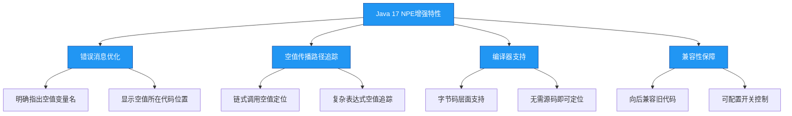

# Java 17 增强的NPE特性

## 概述

Java 17作为Oracle在2021年9月发布的长期支持(LTS)版本，引入了多项重要改进，其中JEP 391（增强NullPointerException错误消息）显著提升了空指针异常的调试体验。该特性通过在NPE消息中精确指出哪个变量为null以及空值传播路径，帮助开发者快速定位问题根源。本章节将详细解析这一增强特性的实现原理、使用方法及实际应用价值。



## 知识要点

### 1. NPE错误消息的革命性改进

在Java 17之前，NullPointerException的错误消息通常只能告诉你发生了空指针异常，但无法直接指出哪个变量为null，尤其是在复杂的链式调用中。Java 17通过精确识别空值变量和传播路径，彻底改变了这一状况。

#### 1.1 基础变量空值提示

**传统NPE消息（Java 16及之前）**：
```
Exception in thread "main" java.lang.NullPointerException
    at com.example.NpeDemo.main(NpeDemo.java:5)
```

**增强NPE消息（Java 17+）**：
```
Exception in thread "main" java.lang.NullPointerException: Cannot invoke "String.length()" because "str" is null
    at com.example.NpeDemo.main(NpeDemo.java:5)
```

**代码示例**：
```java
public class BasicNpeExample {
    public static void main(String[] args) {
        String str = null;
        // 当调用str.length()时会抛出NPE
        System.out.println(str.length()); // Java 17会明确指出"str"为null
    }
}
```

#### 1.2 链式调用空值定位

对于链式调用，Java 17能精确指出链条中哪个环节出现了null：

```java
public class ChainedCallExample {
    static class Address {
        private String city;
        // 省略getter和setter
        public String getCity() { return city; }
    }
    
    static class User {
        private Address address;
        // 省略getter和setter
        public Address getAddress() { return address; }
    }
    
    public static void main(String[] args) {
        User user = new User();
        // user.getAddress()返回null，但user不为null
        System.out.println(user.getAddress().getCity());
        // Java 17错误消息：Cannot invoke "Address.getCity()" because the return value of "User.getAddress()" is null
    }
}
```

#### 1.3 复杂表达式空值追踪

即使在复杂表达式中，Java 17也能准确识别空值来源：

```java
public class ComplexExpressionExample {
    public static void main(String[] args) {
        String a = null;
        String b = "hello";
        
        // 复杂表达式中的NPE
        if (a.length() > 0 || b.length() > 0) { // a为null
            System.out.println("At least one string is non-empty");
        }
        // Java 17错误消息：Cannot invoke "String.length()" because "a" is null
    }
}
```

### 2. 实现原理与技术细节

Java 17的NPE增强特性并非简单的消息文本改进，而是涉及编译器和JVM层面的协同工作：

#### 2.1 编译器层面的支持

Java编译器在生成字节码时，会为可能抛出NPE的操作插入额外的空值检查代码，并记录相关变量名信息。这些信息会被存储在异常对象中，以便在抛出异常时生成详细消息。

```java
// 编译器在处理"str.length()"时生成的伪代码逻辑
if (str == null) {
    throw new NullPointerException("Cannot invoke "String.length()" because "str" is null");
}
str.length();
```

#### 2.2 字节码层面的变化

Java 17引入了新的字节码属性`NullPointerExceptionInfo`，用于存储空指针异常的详细信息。这使得即使在没有源代码的情况下，也能生成精确的错误消息。

#### 2.3 性能影响与优化

虽然增加了空值检查和信息记录，但Java 17的实现非常高效：
- 仅在实际发生NPE时才会处理详细信息
- 正常执行路径上几乎没有性能损耗
- 采用延迟计算策略生成异常消息

### 3. 配置与兼容性

Java 17的NPE增强特性默认启用，但也提供了灵活的配置选项以确保兼容性：

#### 3.1 禁用增强NPE消息

如果需要恢复到传统的NPE消息格式，可以通过JVM参数禁用：
```bash
java -XX:+DisableEnhancedNullPointerException MyApp
```

#### 3.2 向后兼容性保障

- 增强的NPE消息不会破坏任何现有代码
- 异常类型和基本行为保持不变
- 仅改进了消息文本内容
- 所有依赖NPE消息文本解析的工具可能需要更新

#### 3.3 与其他工具的集成

主流IDE（如IntelliJ IDEA、Eclipse）已支持Java 17的增强NPE消息，能在调试时直接定位到空值变量。构建工具（Maven、Gradle）也能正确处理相关的字节码变化。

## 知识扩展

### 1. 设计思想

#### （1）开发者体验优先

NPE增强特性体现了Java语言设计中对开发者体验的重视。空指针异常是Java开发中最常见的错误之一，通过提供更精确的错误信息，显著降低了调试难度和时间成本。

#### （2）渐进式改进策略

Java团队采用了渐进式改进而非颠覆性变革：
- 保持异常类型不变，避免破坏现有代码
- 默认启用新特性，但提供禁用选项
- 仅增强错误消息，不改变异常语义

这种策略确保了新特性的平稳 adoption，同时最大化其实用价值。

#### （3）数据驱动的优化

NPE增强特性的设计基于大量真实项目中的空指针异常分析，针对开发者最常遇到的困惑点进行优化：
- 无法确定哪个变量为null
- 链式调用中空值位置难以定位
- 复杂表达式中的空值来源模糊

### 2. 避坑指南

#### （1）不要过度依赖NPE消息

虽然增强的NPE消息非常有用，但不应替代良好的编程实践：
```java
// 不推荐：依赖NPE来发现空值问题
public void processUser(User user) {
    // 没有空值检查，依赖NPE来提示问题
    System.out.println(user.getAddress().getCity());
}

// 推荐：显式空值检查并提供有意义的错误消息
public void processUser(User user) {
    if (user == null) {
        throw new IllegalArgumentException("用户对象不能为null");
    }
    Address address = user.getAddress();
    if (address == null) {
        throw new IllegalArgumentException("用户地址信息未设置");
    }
    System.out.println(address.getCity());
}
```

#### （2）注意日志系统对NPE消息的处理

某些日志系统或监控工具可能对异常消息长度有限制，增强的NPE消息可能更长，需要确保这些系统能够正确处理：
```java
// 考虑在日志中捕获并处理长消息
try {
    // 可能抛出NPE的代码
} catch (NullPointerException e) {
    // 确保日志系统能处理详细的NPE消息
    logger.error("处理数据时发生空指针异常: {}", e.getMessage(), e);
}
```

#### （3）警惕反射和动态代理场景

在使用反射或动态代理的场景中，增强的NPE消息可能无法提供准确的变量名，因为这些场景下的方法调用是动态生成的：
```java
// 反射调用可能无法提供准确的NPE消息
Method method = someClass.getMethod("someMethod");
method.invoke(null); // 如果someMethod内部发生NPE，消息可能不精确
```

### 3. 深度思考题

#### 思考题1：Java 17的NPE增强特性与Optional类的关系是什么？它们能互相替代吗？

**回答**：Java 17的NPE增强特性与Optional类是解决空值问题的不同层面方案，不能互相替代，而是互补关系：

- **定位维度**：NPE增强特性专注于**发生空指针异常后**提供更精确的调试信息；Optional类则专注于**编译期**避免空指针异常的发生

- **使用场景**：
  - NPE增强适用于所有可能发生NPE的场景，尤其是遗留系统维护
  - Optional适用于方法返回值为空的场景，明确告知调用者需要处理空值

- **最佳实践**：结合使用两者 - 使用Optional类设计更安全的API，同时利用NPE增强特性快速定位意外出现的空指针问题

```java
// 结合使用Optional和NPE增强的示例
public Optional<String> findUserName(Long userId) {
    // 数据库查询逻辑
    return Optional.ofNullable(userName);
}

// 调用方代码
String userName = findUserName(123L)
    .orElseThrow(() -> new IllegalArgumentException("用户不存在"));
// 如果userName后续被意外设为null，Java 17的NPE增强仍能提供精确的错误定位
System.out.println(userName.length());
```

#### 思考题2：在大型项目迁移到Java 17后，如何充分利用NPE增强特性改进代码质量？

**回答**：大型项目迁移到Java 17后，可以通过以下策略充分利用NPE增强特性：

1. **异常日志分析**：
   - 集中收集一段时间内的NPE异常日志
   - 分析空值出现的高频场景和原因
   - 针对性地改进这些薄弱环节

2. **自动化测试增强**：
   - 在单元测试中故意引入空值场景
   - 利用增强的NPE消息验证异常处理逻辑
   - 构建空值测试用例库

3. **代码审查指南更新**：
   - 将NPE消息中的变量名作为代码审查关注点
   - 对频繁出现空值的变量考虑添加@Nullable注解
   - 优先修复能通过NPE消息精确定位的空值问题

4. **性能监控集成**：
   - 在APM工具中添加NPE异常的专项监控
   - 跟踪NPE发生频率和影响范围
   - 将NPE减少作为代码质量指标

通过这些措施，不仅能解决现有空值问题，还能建立长期的空值风险管理机制，从根本上提高代码质量。