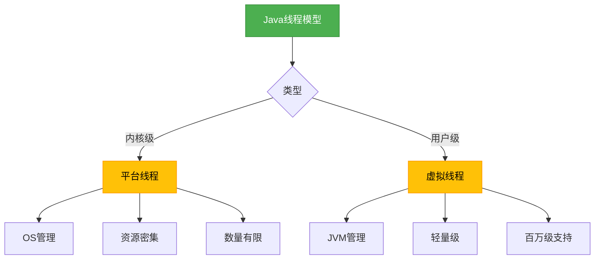

# Java 21 虚拟线程

## 概述
虚拟线程是Java 21中引入的一项重要特性，属于Project Loom的一部分，旨在简化高并发应用的开发。虚拟线程是轻量级的线程实现，由JVM管理而非操作系统，能够在有限的操作系统线程上支持数百万的并发任务，大幅降低了线程创建和上下文切换的成本。



## 知识要点
### 1. 虚拟线程与平台线程的区别
虚拟线程（Virtual Threads）是JVM管理的用户态线程，而平台线程（Platform Threads）是操作系统管理的内核态线程。虚拟线程依附于平台线程运行，多个虚拟线程可以映射到同一个平台线程上执行。

```java
// 平台线程创建方式
Thread platformThread = new Thread(() -> {
    System.out.println("这是平台线程");
});
platformThread.start();

// Java 21虚拟线程创建方式
Thread virtualThread = Thread.startVirtualThread(() -> {
    System.out.println("这是虚拟线程");
});
```

### 2. 虚拟线程的创建方式
Java 21提供了多种创建虚拟线程的方式：

```java
// 方式1: 使用Thread.startVirtualThread()
Thread.startVirtualThread(() -> {
    // 任务逻辑
    System.out.println("虚拟线程执行任务");
});

// 方式2: 使用Thread.Builder
Thread virtualThread = Thread.builder()
    .virtual()
    .name("my-virtual-thread")
    .task(() -> {
        // 任务逻辑
    })
    .start();

// 方式3: 使用ExecutorService
try (ExecutorService executor = Executors.newVirtualThreadPerTaskExecutor()) {
    executor.submit(() -> {
        // 任务逻辑
        return "任务结果";
    });
}
```

### 3. 虚拟线程的实现原理
虚拟线程采用M:N调度模型，即M个虚拟线程映射到N个平台线程上执行。当虚拟线程执行阻塞操作时，JVM会将其挂起并调度其他虚拟线程在该平台线程上运行，从而提高CPU利用率。


### 4. 虚拟线程的适用场景
虚拟线程特别适合I/O密集型任务，如网络请求、数据库操作等。对于CPU密集型任务，虚拟线程的优势不明显，因为CPU一直处于忙碌状态，无法进行有效的线程切换。

```java
// I/O密集型任务示例
ExecutorService executor = Executors.newVirtualThreadPerTaskExecutor();
List<String> urls = Arrays.asList("https://example.com", "https://openai.com");

for (String url : urls) {
    executor.submit(() -> {
        // 模拟网络请求
        HttpClient client = HttpClient.newHttpClient();
        HttpRequest request = HttpRequest.newBuilder().uri(URI.create(url)).build();
        client.send(request, HttpResponse.BodyHandlers.ofString());
        System.out.println("请求完成: " + url);
    });
}
```

## 知识扩展
### 设计思想
虚拟线程的设计目标是简化高并发编程，让开发者能够使用熟悉的线程模型编写高性能的并发应用，而无需学习复杂的异步编程模型。虚拟线程保留了Thread API的语义，使得现有代码可以轻松迁移。

### 避坑指南
1. **不要过度使用同步代码块**：虚拟线程数量众多，同步代码块可能导致大量线程阻塞，影响性能。
2. **避免长时间运行的计算任务**：虚拟线程适合I/O密集型任务，CPU密集型任务应使用平台线程。
3. **注意ThreadLocal的使用**：虚拟线程会继承父线程的ThreadLocal，可能导致内存泄漏，及时清理。
4. **不要依赖线程ID**：虚拟线程的ID生成策略与平台线程不同，不应作为唯一标识符。

### 深度思考题
**思考题**：虚拟线程与Go语言的goroutine有何异同？在实际项目中如何选择使用虚拟线程还是异步编程模型？

**思考题回答**：
虚拟线程和goroutine都旨在提供轻量级的并发模型，但实现方式有所不同。虚拟线程基于JVM实现，保留了Java线程模型的语义；而goroutine是Go语言 runtime 实现的。两者都采用M:N调度，但goroutine使用channel进行通信，而虚拟线程仍使用传统的并发控制机制。

在项目选择上，如果团队熟悉Java线程模型且需要兼容现有代码，虚拟线程是更好的选择；如果追求更高的性能和更简洁的并发编程模型，可以考虑异步编程或其他语言如Go。对于I/O密集型应用，虚拟线程能显著提高吞吐量，同时保持代码的可读性和可维护性。