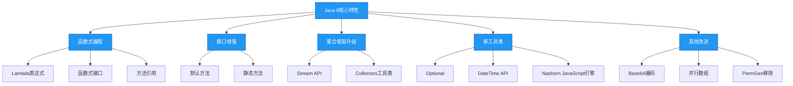

# Java 8 核心特性

## 概述

Java 8是Java历史上的一个里程碑版本，于2014年3月发布，引入了函数式编程范式和一系列革命性特性，彻底改变了Java程序员的编码方式。这些特性不仅提高了开发效率，还为后续Java版本的演进奠定了基础。



## 知识要点

### 1. Lambda表达式

Lambda表达式是Java 8引入的核心特性，它允许我们将函数作为参数传递，实现了函数式编程风格。Lambda表达式的本质是一个匿名函数，它可以简化代码，提高可读性和可维护性。

Lambda表达式的基本语法如下：
```java
(parameters) -> expression
// 或
(parameters) -> { statements; }
```

以下是Lambda表达式的几种常见用法：

```java
// 1. 无参数无返回值
Runnable runnable = () -> System.out.println("Hello Lambda");

// 2. 单个参数无返回值
Consumer<String> consumer = s -> System.out.println(s);

// 3. 多个参数有返回值
BinaryOperator<Integer> add = (a, b) -> a + b;

// 4. 代码块
Comparator<Integer> comparator = (a, b) -> {
    System.out.println("比较两个整数");
    return Integer.compare(a, b);
};
```

Lambda表达式的使用场景包括：
- 集合的迭代和处理
- 事件监听
- 多线程编程
- Stream API操作

### 2. 函数式接口

函数式接口是只包含一个抽象方法的接口，它是Lambda表达式的目标类型。Java 8引入了`@FunctionalInterface`注解来显式声明一个接口为函数式接口。

Java 8在`java.util.function`包中提供了一系列内置的函数式接口，常用的有：

```java
// 消费型接口：接收一个参数，无返回值
Consumer<String> consumer = s -> System.out.println(s);
consumer.accept("Hello Consumer");

// 供给型接口：无参数，返回一个结果
Supplier<Integer> supplier = () -> (int)(Math.random() * 100);
int randomNum = supplier.get();

// 函数型接口：接收一个参数，返回一个结果
Function<String, Integer> function = s -> s.length();
int length = function.apply("Hello Function");

// 断言型接口：接收一个参数，返回boolean
Predicate<String> predicate = s -> s.startsWith("Hello");
boolean result = predicate.test("Hello Predicate");
```

我们也可以自定义函数式接口：

```java
@FunctionalInterface
public interface Calculator {
    int calculate(int a, int b);
}

// 使用自定义函数式接口
Calculator add = (a, b) -> a + b;
int sum = add.calculate(10, 20); // 结果为30
```

### 3. 方法引用

方法引用是Lambda表达式的一种简化形式，它允许我们直接引用已存在的方法、构造方法或数组构造方法。方法引用使用`::`操作符。

方法引用主要有以下几种类型：

```java
// 1. 静态方法引用
Function<String, Integer> parseInt = Integer::parseInt;
int num = parseInt.apply("123");

// 2. 实例方法引用
String str = "Hello Method Reference";
Supplier<Integer> lengthSupplier = str::length;
int length = lengthSupplier.get();

// 3. 对象方法引用
List<String> list = Arrays.asList("a", "b", "c");
list.forEach(System.out::println);

// 4. 构造方法引用
Supplier<List<String>> listSupplier = ArrayList::new;
List<String> newList = listSupplier.get();
```

方法引用可以使代码更加简洁，提高可读性，特别是在Stream API中广泛使用。

### 4. 接口默认方法和静态方法

Java 8允许在接口中定义默认方法和静态方法，这一特性解决了接口的向后兼容性问题。

#### 4.1 默认方法

默认方法使用`default`关键字修饰，接口实现类可以直接继承默认方法，也可以重写默认方法。

```java
public interface MyInterface {
    // 抽象方法
    void abstractMethod();
    
    // 默认方法
    default void defaultMethod() {
        System.out.println("This is a default method");
    }
}

public class MyInterfaceImpl implements MyInterface {
    @Override
    public void abstractMethod() {
        System.out.println("Implement abstract method");
    }
    
    // 可选重写默认方法
    @Override
    public void defaultMethod() {
        System.out.println("Override default method");
    }
}
```

#### 4.2 静态方法

接口静态方法使用`static`关键字修饰，通过接口名直接调用。

```java
public interface MyInterface {
    // 静态方法
    static void staticMethod() {
        System.out.println("This is a static method");
    }
}

// 调用接口静态方法
MyInterface.staticMethod();
```

接口默认方法的引入，使得Java集合框架能够在不破坏现有代码的情况下添加新方法，如`Iterable.forEach()`、`Collection.stream()`等。

### 5. Stream API

Stream API是Java 8中处理集合的利器，它提供了一种高效且易于使用的处理数据的方式。Stream API可以对集合进行过滤、映射、排序、聚合等操作，支持并行处理，提高处理大数据量的效率。

Stream操作的基本流程包括：创建Stream、中间操作、终端操作。

```java
List<String> names = Arrays.asList("Alice", "Bob", "Charlie", "David", "Eva");

// 1. 创建Stream
Stream<String> stream = names.stream();

// 2. 中间操作：过滤以"A"开头的名字，转换为大写
Stream<String> processedStream = stream
    .filter(name -> name.startsWith("A"))
    .map(String::toUpperCase);

// 3. 终端操作：收集结果到List
List<String> result = processedStream.collect(Collectors.toList());
```

以下是一些常用的Stream操作示例：

```java
List<Integer> numbers = Arrays.asList(1, 2, 3, 4, 5, 6, 7, 8, 9, 10);

// 过滤偶数并求和
int sum = numbers.stream()
    .filter(n -> n % 2 == 0)
    .sum();

// 找出大于5的数并排序
List<Integer> sortedNumbers = numbers.stream()
    .filter(n -> n > 5)
    .sorted()
    .collect(Collectors.toList());

// 分组统计
Map<Integer, List<Integer>> groups = numbers.stream()
    .collect(Collectors.groupingBy(n -> n % 3));

// 并行流处理
long count = numbers.parallelStream()
    .filter(n -> n > 5)
    .count();
```

Stream API的特点：
- 惰性求值：中间操作不会立即执行，直到终端操作被调用
- 一次性使用：Stream对象只能使用一次，再次使用需要重新创建
- 并行处理：通过`parallelStream()`轻松实现并行处理

### 6. Optional类

Optional类是Java 8引入的用于解决空指针异常（NullPointerException）的工具类。它封装了一个可能为null的值，可以显式地处理null情况，使代码更加健壮。

Optional类的常用方法：

```java
// 创建Optional对象
Optional<String> optional = Optional.of("Hello Optional");
Optional<String> emptyOptional = Optional.empty();
Optional<String> nullableOptional = Optional.ofNullable(null);

// 判断是否有值
boolean isPresent = optional.isPresent();

// 获取值（如果为null会抛出NoSuchElementException）
String value = optional.get();

// 如果有值则消费
optional.ifPresent(v -> System.out.println(v));

// 如果有值则返回，否则返回默认值
String result1 = nullableOptional.orElse("Default Value");

// 如果有值则返回，否则通过Supplier获取
String result2 = nullableOptional.orElseGet(() -> "Generated Value");

// 如果有值则返回，否则抛出异常
String result3 = nullableOptional.orElseThrow(() -> new RuntimeException("Value is null"));

// 映射值
Optional<Integer> lengthOptional = optional.map(String::length);

// 过滤值
Optional<String> filteredOptional = optional.filter(v -> v.length() > 10);
```

使用Optional类可以避免显式的null检查，使代码更加简洁优雅。

### 7. 新的日期时间API

Java 8引入了全新的日期时间API，位于`java.time`包下，解决了旧版`Date`和`Calendar`类的线程不安全、设计混乱等问题。

新的日期时间API的主要类：
- `LocalDate`：日期（年、月、日）
- `LocalTime`：时间（时、分、秒、纳秒）
- `LocalDateTime`：日期时间
- `ZonedDateTime`：带时区的日期时间
- `Duration`：时间段（基于时间）
- `Period`：时间段（基于日期）
- `DateTimeFormatter`：日期时间格式化

```java
// 获取当前日期
LocalDate today = LocalDate.now();

// 创建指定日期
LocalDate birthday = LocalDate.of(1990, Month.JANUARY, 1);

// 日期计算
LocalDate nextWeek = today.plusWeeks(1);
LocalDate lastMonth = today.minusMonths(1);

// 获取日期信息
int year = today.getYear();
Month month = today.getMonth();
int day = today.getDayOfMonth();

// 日期比较
boolean isAfter = today.isAfter(birthday);

// 日期格式化
DateTimeFormatter formatter = DateTimeFormatter.ofPattern("yyyy-MM-dd");
String formattedDate = today.format(formatter);
LocalDate parsedDate = LocalDate.parse("2023-01-01", formatter);

// 计算日期间隔
Period period = Period.between(birthday, today);
int years = period.getYears();
int months = period.getMonths();
int days = period.getDays();
```

新的日期时间API具有不可变性、线程安全、清晰的API设计等优点，推荐在Java 8及以上版本中使用。

## 知识扩展

### 1. 设计思想

#### （1）函数式编程范式的引入

Java 8引入Lambda表达式和函数式接口，标志着Java开始支持函数式编程范式。函数式编程强调将函数作为一等公民，可以像其他数据类型一样传递和操作。这种范式带来了以下好处：
- 代码更加简洁，减少样板代码
- 提高代码可读性和可维护性
- 便于并行处理和事件驱动编程
- 促进无状态、纯函数的编写，减少副作用

#### （2）接口演进与向后兼容性

Java 8的接口默认方法设计体现了对向后兼容性的重视。通过允许在接口中添加默认方法，Java能够在不破坏现有实现的情况下扩展接口功能，这对于Java集合框架等核心API的演进至关重要。

默认方法的设计遵循了"接口隔离原则"和"开闭原则"，使得接口可以在不影响实现类的情况下进行扩展。

#### （3）Stream API的设计哲学

Stream API的设计借鉴了函数式编程中的流式处理思想，通过将数据处理过程抽象为一系列操作，实现了声明式编程风格。这种设计有以下特点：
- 关注点分离：将"做什么"和"怎么做"分离
- 惰性求值：提高处理效率，避免不必要的计算
- 并行友好：底层自动处理线程管理和同步
- 可组合性：多个操作可以链式组合，形成流水线

### 2. 避坑指南

#### （1）Lambda表达式中的变量捕获

Lambda表达式可以捕获外部作用域的变量，但这些变量必须是final或事实上的final（即没有被重新赋值）。

```java
// 错误示例：变量被重新赋值
int count = 0;
Runnable runnable = () -> {
    count++;
    System.out.println(count);
};

// 正确示例：使用原子类或数组
AtomicInteger count = new AtomicInteger(0);
Runnable runnable = () -> {
    count.incrementAndGet();
    System.out.println(count);
};
```

#### （2）Stream API的陷阱

- **Stream只能使用一次**：每个Stream对象只能执行一次终端操作，再次使用会抛出IllegalStateException
- **并行流的过度使用**：并行流并不总是比串行流快，对于小规模数据或简单操作，并行流的线程开销可能更高
- **忽略异常处理**：Stream操作中抛出的受检异常需要显式处理

```java
// 错误示例：重复使用Stream
Stream<String> stream = list.stream();
stream.filter(s -> s.length() > 5).count();
stream.map(String::toUpperCase).collect(Collectors.toList()); // 抛出异常

// 正确示例：每次操作创建新的Stream
long count = list.stream().filter(s -> s.length() > 5).count();
List<String> upperCaseList = list.stream().map(String::toUpperCase).collect(Collectors.toList());
```

#### （3）Optional类的正确使用

- 不要过度使用Optional：只有当值可能为null时才使用Optional
- 避免使用`Optional.get()`：直接调用`get()`如果值为null会抛出异常，应使用`orElse()`、`orElseGet()`等安全方法
- 不要将Optional作为方法参数：这会增加API复杂度

```java
// 不推荐
public void process(Optional<String> value) {
    if (value.isPresent()) {
        // 处理值
    }
}

// 推荐
public void process(String value) {
    // 显式处理null
    if (value != null) {
        // 处理值
    }
}
```

### 3. 深度思考题

#### 思考题1：Java 8的Lambda表达式是如何实现的？与匿名内部类有何区别？

**回答**：Java 8的Lambda表达式并不是通过匿名内部类实现的，而是通过invokedynamic指令和方法句柄（Method Handle）实现的，这使得Lambda表达式具有更高的性能和更简洁的字节码。

与匿名内部类的主要区别：
1. **字节码生成**：Lambda表达式不会生成单独的类文件，而是在运行时动态生成调用点（Call Site）；匿名内部类会生成单独的类文件
2. **作用域**：Lambda表达式没有自己的作用域，它捕获的变量是词法作用域的；匿名内部类有自己的作用域
3. **this引用**：Lambda表达式中的this引用指向外部类；匿名内部类中的this引用指向匿名类本身
4. **性能**：Lambda表达式的性能通常优于匿名内部类，特别是在频繁创建实例的场景

#### 思考题2：如何在Java 8中实现函数式接口的组合？

**回答**：Java 8的函数式接口提供了默认方法支持组合操作，主要包括：

1. **Predicate组合**：and()、or()、negate()
```java
Predicate<Integer> isEven = n -> n % 2 == 0;
Predicate<Integer> isGreaterThan5 = n -> n > 5;
Predicate<Integer> isEvenAndGreaterThan5 = isEven.and(isGreaterThan5);
```

2. **Function组合**：andThen()、compose()
```java
Function<Integer, Integer> multiplyBy2 = n -> n * 2;
Function<Integer, Integer> add3 = n -> n + 3;
Function<Integer, Integer> multiplyBy2AndAdd3 = multiplyBy2.andThen(add3);
Function<Integer, Integer> add3AndMultiplyBy2 = multiplyBy2.compose(add3);
```

3. **Consumer组合**：andThen()
```java
Consumer<String> print = System.out::println;
Consumer<String> printUpperCase = s -> System.out.println(s.toUpperCase());
Consumer<String> printBoth = print.andThen(printUpperCase);
```

通过这些组合方法，可以将多个简单的函数式接口组合成复杂的逻辑，实现代码的复用和简洁性。