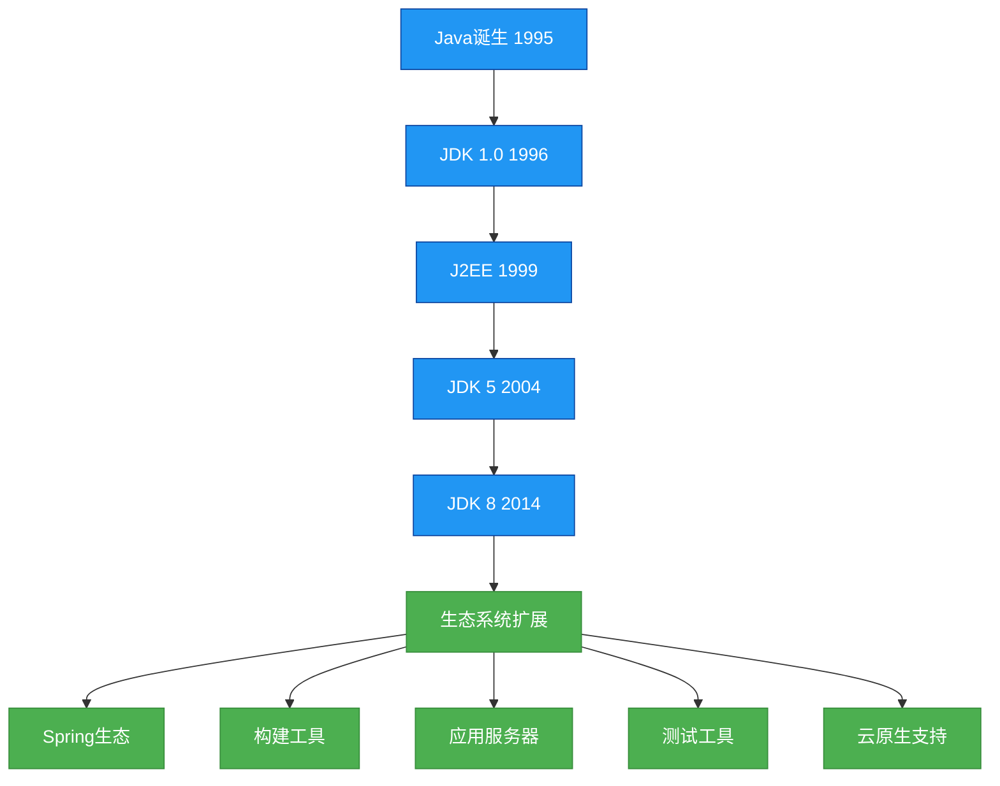
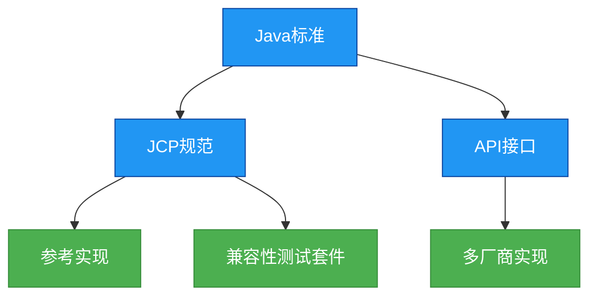

# 生态-Java生态系统演进

## 概述
Java生态系统是一个庞大而活跃的技术体系，从1995年诞生至今，已发展成为包含编程语言、开发工具、应用框架、部署环境等多维度的技术生态。本章节将系统梳理Java生态从诞生到JDK8的演进历程，剖析其核心组件的发展脉络，并探讨生态系统的设计思想与未来趋势。



## 知识扩展

### 1. 设计思想
Java生态系统的成功得益于其独特的设计思想，这些原则指导着整个生态的发展方向：

#### （1）向后兼容性优先
Java始终将向后兼容性作为核心设计目标，确保旧代码能够在新版本JDK上运行：
- 二进制兼容性：类文件格式保持稳定
- 源代码兼容性：避免语法变更影响现有代码
- 行为兼容性：保持API行为一致

这种设计思想使得企业能够安全地升级Java版本，保护投资。

#### （2）模块化与标准化
Java生态通过清晰的模块边界和标准规范促进了生态系统的健康发展：
- JCP（Java Community Process）制定标准
- 接口与实现分离（如JDBC、JPA）
- 模块化设计（OSGi、Jigsaw项目）



#### （3）开源与社区驱动
Java生态的发展离不开开源社区的贡献：
- 开源许可证（GPL、Apache等）
- 社区协作开发模式
- 第三方库与框架的蓬勃发展

### 2. 避坑指南
在Java生态系统中开发时，需要注意以下常见陷阱：

#### （1）版本迁移问题
- **JDK版本选择**：企业应用建议选择LTS版本（如JDK 8、11、17）
- **API废弃处理**：关注@Deprecated注解，避免使用过时API
- **升级策略**：采用渐进式升级，先进行兼容性测试

```java
// 错误示例：使用已废弃的API
Date date = new Date(2023, 10, 5); // 已废弃，月份从0开始且年份偏移1900

// 正确示例：使用新API
LocalDate date = LocalDate.of(2023, 11, 5);
```

#### （2）依赖管理陷阱
- **依赖冲突**：使用`mvn dependency:tree`分析依赖树
- **版本锁定**：在父POM中使用dependencyManagement统一版本
- **传递依赖**：谨慎使用`exclusions`排除不需要的依赖

```xml
<!-- Maven依赖管理示例 -->
<dependencyManagement>
    <dependencies>
        <dependency>
            <groupId>com.google.guava</groupId>
            <artifactId>guava</artifactId>
            <version>28.0-jre</version>
        </dependency>
    </dependencies>
</dependencyManagement>
```

#### （3）框架选择策略
- **避免过度设计**：小型项目不宜引入复杂框架
- **考虑团队熟悉度**：选择团队成员熟悉的技术栈
- **评估长期维护**：优先选择活跃社区支持的框架

### 3. 深度思考题

#### 思考题1：Java生态系统如何保持向后兼容性的同时实现创新？

**回答**：Java通过多种机制平衡兼容性与创新：
1. **渐进式API演进**：新增API而非修改现有API
2. **可选特性**：新功能默认不启用（如Java 9的模块系统）
3. **兼容性标记**：使用`--enable-preview`标记实验性功能
4. **多版本JAR**：允许同一JAR支持多个JDK版本
5. **详细的迁移指南**：提供工具（如jdeprscan）和文档支持

这种平衡使Java既能满足企业对稳定性的需求，又能不断引入现代编程语言特性。

#### 思考题2：微服务架构对Java生态系统产生了哪些影响？

**回答**：微服务架构推动Java生态发生了显著变化：
1. **轻量级框架兴起**：Spring Boot、Micronaut等简化微服务开发
2. **容器化支持**：Java应用更好地适应Docker、Kubernetes环境
3. **响应式编程**：RxJava、Project Reactor等响应式库普及
4. **服务网格**：Istio等服务网格技术补充传统Java EE功能
5. **无服务器架构**：AWS Lambda等平台支持Java函数

## 知识要点

### 1. Java语言与JDK的演进
Java语言的发展伴随着JDK版本的迭代，每一个重要版本都带来了革命性的特性：

#### （1）Java的诞生与早期发展（1995-2004）
- **1995年**：Java语言正式发布，提出"一次编写，到处运行"(WORA)的跨平台理念
- **1996年**：JDK 1.0发布，包含Applet、AWT等早期技术
- **1998年**：JDK 1.2发布，引入集合框架、JIT编译器和Swing
- **2004年**：JDK 5发布，带来泛型、注解、枚举、自动装箱拆箱等重大特性

```java
// JDK 5泛型示例
List<String> stringList = new ArrayList<String>();
stringList.add("Java");
String value = stringList.get(0); // 无需类型转换

// JDK 5注解示例
@Override
public String toString() {
    return "Annotation example";
}
```

#### （2）Java 8的里程碑式更新（2014）
JDK 8引入了函数式编程范式，极大改变了Java编程方式：

```java
// Lambda表达式示例
List<String> names = Arrays.asList("Alice", "Bob", "Charlie");
names.stream()
     .filter(name -> name.startsWith("A"))
     .forEach(System.out::println); // 输出 Alice

// Stream API示例
List<Integer> numbers = Arrays.asList(1, 2, 3, 4, 5);
int sum = numbers.stream()
                 .filter(n -> n % 2 == 0)
                 .mapToInt(Integer::intValue)
                 .sum(); // 结果为6

// 接口默认方法
public interface MyInterface {
    default void defaultMethod() {
        System.out.println("This is a default method");
    }
}
```

### 2. 企业级Java平台的演进
企业级应用开发是Java生态的重要组成部分：

#### （1）从J2EE到Jakarta EE
- **1999年**：J2EE 1.0发布，定义企业级应用标准
- **2005年**：重命名为Java EE
- **2017年**：移交Eclipse基金会管理，更名为Jakarta EE

#### （2）核心规范发展
- **Servlet规范**：从Servlet 1.0到Servlet 3.1，支持异步处理
- **JPA规范**：替代EJB实体Bean，成为ORM标准
- **CDI规范**：提供依赖注入和上下文管理

```java
// JPA实体示例
@Entity
@Table(name = "users")
public class User {
    @Id
    @GeneratedValue(strategy = GenerationType.IDENTITY)
    private Long id;
    
    @Column(nullable = false)
    private String username;
    
    // 省略getter和setter
}
```

### 3. 框架生态的崛起
Java生态的繁荣离不开丰富的框架支持：

#### （1）Spring Framework的发展
- **2002年**：Spring Framework诞生，以IoC和AOP为核心
- **2004年**：Spring 1.0正式发布
- **2006年**：Spring Boot尚未出现，Spring MVC成为Web开发主流

```java
// Spring IoC示例
public class UserService {
    private UserRepository userRepository;
    
    // 构造函数注入
    public UserService(UserRepository userRepository) {
        this.userRepository = userRepository;
    }
    
    public User getUserById(Long id) {
        return userRepository.findById(id);
    }
}
```

#### （2）ORM框架的演进
- **Hibernate**：成为JPA参考实现
- **MyBatis**：专注SQL映射的轻量级框架

### 4. 构建工具的演变
Java构建工具经历了从复杂到简化的发展过程：

#### （1）Ant（2000年）
基于XML配置的构建工具，需要手动定义所有构建步骤：
```xml
<!-- Ant构建文件示例 -->
<project name="HelloWorld" default="compile" basedir=".">
    <target name="compile">
        <mkdir dir="classes"/>
        <javac srcdir="src" destdir="classes"/>
    </target>
</project>
```

#### （2）Maven（2004年）
引入约定优于配置和依赖管理：
```xml
<!-- Maven POM文件示例 -->
<project xmlns="http://maven.apache.org/POM/4.0.0"
         xmlns:xsi="http://www.w3.org/2001/XMLSchema-instance"
         xsi:schemaLocation="http://maven.apache.org/POM/4.0.0 http://maven.apache.org/xsd/maven-4.0.0.xsd">
    <modelVersion>4.0.0</modelVersion>
    
    <groupId>com.example</groupId>
    <artifactId>demo</artifactId>
    <version>1.0-SNAPSHOT</version>
    
    <dependencies>
        <dependency>
            <groupId>junit</groupId>
            <artifactId>junit</artifactId>
            <version>4.12</version>
            <scope>test</scope>
        </dependency>
    </dependencies>
</project>
```

#### （3）Gradle（2012年）
结合Ant的灵活性和Maven的依赖管理，使用Groovy/ Kotlin DSL：
```groovy
// Gradle构建文件示例
dependencies {
    implementation 'com.google.guava:guava:28.0-jre'
    testImplementation 'junit:junit:4.12'
}
```