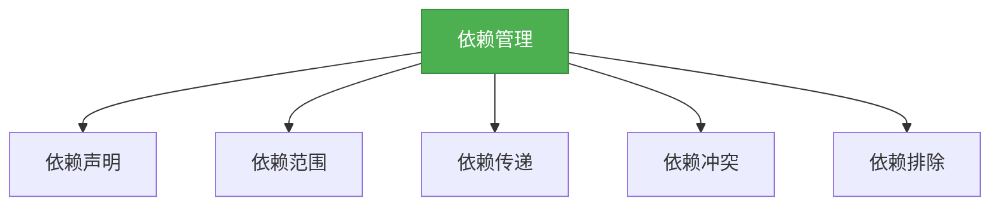
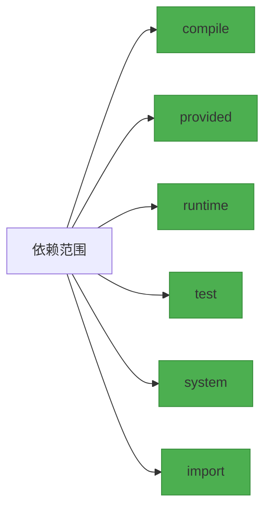

# 依赖管理

## 概述

依赖管理是Maven的核心功能之一，它能够自动解决项目所需的依赖库，并处理版本冲突。本章节将深入探讨Maven的依赖管理机制，帮助你掌握如何高效地管理项目依赖。



## 知识要点

### 1. 依赖声明

在Maven中，依赖声明是通过POM文件中的`<dependencies>`元素来实现的。一个典型的依赖声明如下：

```xml
<dependency>
    <groupId>org.springframework</groupId>
    <artifactId>spring-core</artifactId>
    <version>5.3.8</version>
</dependency>
```

其中，`groupId`、`artifactId`和`version`组成了Maven的坐标系统，用于唯一标识一个依赖。

### 2. 依赖范围

Maven定义了多种依赖范围，用于控制依赖在不同阶段的可见性：



- **compile**：默认范围，编译和运行时都需要
- **provided**：编译时需要，运行时由容器提供
- **runtime**：运行时需要，编译时不需要
- **test**：只在测试时需要
- **system**：类似于provided，但需要显式指定依赖文件的路径
- **import**：用于导入其他POM文件中的依赖管理配置

### 3. 依赖传递

Maven的依赖传递机制可以自动解决间接依赖。例如，如果项目A依赖项目B，而项目B又依赖项目C，那么Maven会自动将项目C添加到项目A的依赖中。

```xml
<!-- 项目A依赖B，B依赖C -->
<!-- 则A会间接依赖C -->
<dependency>
    <groupId>com.example</groupId>
    <artifactId>B</artifactId>
    <version>1.0</version>
</dependency>
```

### 4. 依赖冲突

当项目中存在多个版本的同一依赖时，就会发生依赖冲突。Maven提供了多种解决依赖冲突的策略：

1. **最短路径优先**：Maven会选择依赖路径最短的版本
2. **声明顺序优先**：如果依赖路径长度相同，Maven会选择在POM文件中声明较早的版本
3. **显式声明优先**：如果显式声明了某个版本，Maven会优先使用该版本

### 5. 依赖排除

如果不想引入某个传递依赖，可以使用`<exclusions>`元素来排除它：

```xml
<dependency>
    <groupId>com.example</groupId>
    <artifactId>B</artifactId>
    <version>1.0</version>
    <exclusions>
        <exclusion>
            <groupId>com.example</groupId>
            <artifactId>C</artifactId>
        </exclusion>
    </exclusions>
</dependency>
```

## 知识扩展

### 设计思想

Maven的依赖管理设计遵循了以下原则：
1. **自动解决**：自动解决项目所需的依赖库
2. **传递性**：通过依赖传递机制减少重复声明
3. **冲突解决**：提供多种策略解决依赖冲突
4. **版本控制**：通过版本号精确控制依赖版本

### 避坑指南

1. **依赖冲突**：使用`mvn dependency:tree`命令查看依赖树，找出冲突的版本
2. **不必要的依赖**：定期检查项目依赖，移除不必要的依赖
3. **版本不一致**：使用`<dependencyManagement>`标签统一管理依赖版本
4. **快照版本**：谨慎使用快照版本，因为它们可能会随时变化

### 深度思考题

**思考题:**
什么是依赖传递？它有什么优缺点？

**回答:**
依赖传递是指当项目依赖另一个项目时，会自动继承该项目的依赖。

优点：
1. 减少了重复声明依赖的工作量
2. 简化了项目配置
3. 确保了依赖版本的一致性

缺点：
1. 可能会引入不必要的依赖
2. 可能会导致依赖冲突
3. 增加了项目的复杂性

**思考题:**
如何统一管理项目中的依赖版本？

**回答:**
1. 使用`<dependencyManagement>`标签在父POM文件中统一管理依赖版本
2. 使用属性（如`<spring.version>5.3.8</spring.version>`）来管理版本号
3. 定期更新依赖版本，确保使用最新的稳定版本
4. 避免使用快照版本，除非有特殊需求