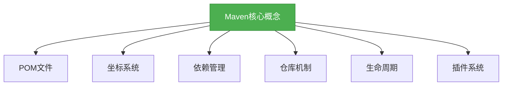
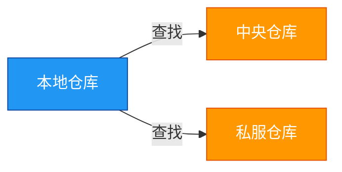

# 基础-Maven核心概念

## 概述

Maven是Java开发中不可或缺的构建工具，它不仅简化了项目构建过程，还提供了依赖管理、项目信息管理等强大功能。本章节将带你深入了解Maven的核心概念，为后续学习打下坚实基础。



## 知识要点

### 1. POM文件

POM（Project Object Model）是Maven的核心文件，它包含了项目的所有信息。一个典型的POM文件结构如下：

```xml
<project>
    <!-- 基础信息 -->
    <modelVersion>4.0.0</modelVersion>
    <groupId>com.example</groupId>
    <artifactId>demo</artifactId>
    <version>1.0.0</version>
    
    <!-- 依赖管理 -->
    <dependencies>
        <dependency>
            <groupId>org.springframework</groupId>
            <artifactId>spring-core</artifactId>
            <version>5.3.8</version>
        </dependency>
    </dependencies>
    
    <!-- 构建配置 -->
    <build>
        <plugins>
            <plugin>
                <groupId>org.apache.maven.plugins</groupId>
                <artifactId>maven-compiler-plugin</artifactId>
                <version>3.8.1</version>
            </plugin>
        </plugins>
    </build>
</project>
```

### 2. 坐标系统

Maven使用GAV（GroupId, ArtifactId, Version）坐标系统来唯一标识一个构件：
- **GroupId**：组织或项目标识，通常使用反转的域名
- **ArtifactId**：模块标识，通常是项目名称
- **Version**：版本号，遵循语义化版本规范

### 3. 依赖管理

Maven的依赖管理机制可以自动解决项目所需的依赖库：

```xml
<dependencies>
    <dependency>
        <groupId>org.springframework</groupId>
        <artifactId>spring-core</artifactId>
        <version>5.3.8</version>
        <!-- 依赖范围 -->
        <scope>compile</scope>
    </dependency>
</dependencies>
```

依赖范围包括：
- **compile**：默认范围，编译和运行时都需要
- **provided**：编译时需要，运行时由容器提供
- **runtime**：运行时需要，编译时不需要
- **test**：只在测试时需要

### 4. 仓库机制

Maven的仓库用于存储构建好的构件：
- **本地仓库**：位于开发者本地机器上的仓库
- **远程仓库**：位于网络上的仓库，包括中央仓库和私服



### 5. 生命周期

Maven定义了三个主要的生命周期：
- **clean**：清理项目
- **default**：构建项目
- **site**：生成项目站点

每个生命周期包含一系列阶段，如default生命周期包含compile、test、package、install、deploy等阶段。

### 6. 插件系统

Maven的插件系统使其具有极强的扩展性：

```xml
<build>
    <plugins>
        <plugin>
            <groupId>org.apache.maven.plugins</groupId>
            <artifactId>maven-compiler-plugin</artifactId>
            <version>3.8.1</version>
            <configuration>
                <source>1.8</source>
                <target>1.8</target>
            </configuration>
        </plugin>
    </plugins>
</build>
```

## 知识扩展

### 设计思想

Maven的设计遵循了以下核心原则：
1. **约定优于配置**：Maven定义了标准的项目结构和构建流程
2. **依赖管理**：自动解决依赖冲突和版本问题
3. **插件机制**：通过插件扩展功能
4. **生命周期**：标准化的构建流程

### 避坑指南

1. **版本冲突**：使用`mvn dependency:tree`命令查看依赖树，找出冲突的版本
2. **构建失败**：检查POM文件中的语法错误，确保所有依赖都能从仓库中获取
3. **仓库配置错误**：检查settings.xml文件中的仓库配置

### 深度思考题

**思考题：**
Maven的约定优于配置原则有什么优缺点？

**回答:**
优点：
1. 简化了项目配置，减少了开发人员的工作量
2. 标准化了项目结构，使团队协作更加容易
3. 降低了学习成本，新开发人员可以快速上手

缺点：
1. 灵活性不足，对于特殊需求的项目可能需要额外的配置
2. 对于初学者来说，可能需要一段时间来熟悉这些约定
3. 当项目结构与约定不符时，可能会导致构建失败

**思考题:**
如何解决Maven中的依赖冲突？

**回答:**
1. 使用`mvn dependency:tree`命令查看依赖树，找出冲突的版本
2. 使用`<exclusions>`标签排除不需要的依赖
3. 使用`<dependencyManagement>`标签统一管理依赖版本
4. 优先使用较新的版本，因为较新的版本通常包含更多的 bug 修复和功能改进