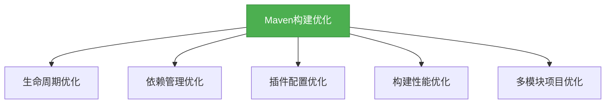

# 架构-Maven构建优化

## 概述

Maven构建优化是提高开发效率和项目质量的重要手段。本章节将深入探讨Maven构建优化的核心策略和实践技巧，帮助你构建更高效、更稳定的Maven项目。



## 知识要点

### 1. 生命周期优化

Maven的生命周期包含了一系列构建阶段，优化生命周期可以显著提高构建效率：

```xml
<!-- 只执行必要的构建阶段 -->
mvn clean install -DskipTests
```

#### 跳过测试

当你不需要运行测试时，可以使用`-DskipTests`或`-Dmaven.test.skip=true`参数跳过测试阶段：

```bash
# 跳过测试执行，但仍然编译测试代码
mvn install -DskipTests

# 完全跳过测试编译和执行
mvn install -Dmaven.test.skip=true
```

#### 增量构建

Maven支持增量构建，只编译修改过的文件：

```bash
# 增量构建
mvn compile
```

### 2. 依赖管理优化

依赖管理优化可以减少构建时间和避免依赖冲突：

#### 排除不必要的依赖

```xml
<dependency>
    <groupId>org.springframework</groupId>
    <artifactId>spring-core</artifactId>
    <version>5.3.8</version>
    <exclusions>
        <exclusion>
            <groupId>commons-logging</groupId>
            <artifactId>commons-logging</artifactId>
        </exclusion>
    </exclusions>
</dependency>
```

#### 统一管理依赖版本

```xml
<dependencyManagement>
    <dependencies>
        <dependency>
            <groupId>org.springframework</groupId>
            <artifactId>spring-core</artifactId>
            <version>5.3.8</version>
        </dependency>
    </dependencies>
</dependencyManagement>
```

### 3. 插件配置优化

插件配置优化可以提高构建效率和灵活性：

#### 配置编译器插件

```xml
<plugin>
    <groupId>org.apache.maven.plugins</groupId>
    <artifactId>maven-compiler-plugin</artifactId>
    <version>3.8.1</version>
    <configuration>
        <source>1.8</source>
        <target>1.8</target>
        <encoding>UTF-8</encoding>
        <!-- 启用增量编译 -->
        <useIncrementalCompilation>true</useIncrementalCompilation>
    </configuration>
</plugin>
```

#### 配置构建缓存

```xml
<plugin>
    <groupId>org.apache.maven.plugins</groupId>
    <artifactId>maven-build-cache-plugin</artifactId>
    <version>1.0.0</version>
    <configuration>
        <cacheDirectory>${project.basedir}/.cache</cacheDirectory>
    </configuration>
</plugin>
```

### 4. 构建性能优化

构建性能优化可以显著减少构建时间：

#### 并行构建

```bash
# 并行构建，使用4个线程
mvn -T 4 clean install
```

#### 离线构建

当你不需要下载新的依赖时，可以使用离线模式：

```bash
# 离线构建
mvn -o clean install
```

### 5. 多模块项目优化

多模块项目优化可以提高项目的可维护性和构建效率：

#### 模块拆分

```xml
<!-- 父POM -->
<modules>
    <module>module1</module>
    <module>module2</module>
    <module>module3</module>
</modules>
```

#### 依赖继承

```xml
<!-- 父POM -->
<dependencyManagement>
    <dependencies>
        <dependency>
            <groupId>org.springframework</groupId>
            <artifactId>spring-core</artifactId>
            <version>5.3.8</version>
        </dependency>
    </dependencies>
</dependencyManagement>

<!-- 子POM -->
<dependencies>
    <dependency>
        <groupId>org.springframework</groupId>
        <artifactId>spring-core</artifactId>
    </dependency>
</dependencies>
```

## 知识扩展

### 设计思想

Maven构建优化的设计遵循了以下原则：
1. **最小化构建范围**：只构建必要的部分
2. **增量构建**：只构建修改过的部分
3. **并行构建**：充分利用多核CPU
4. **缓存机制**：避免重复构建
5. **依赖优化**：减少不必要的依赖

### 避坑指南

1. **过度优化**：不要为了优化而优化，确保优化是有意义的
2. **忽略测试**：虽然跳过测试可以加快构建，但不要在生产环境中这样做
3. **依赖冲突**：定期检查依赖树，避免依赖冲突
4. **版本不一致**：使用依赖管理统一管理版本
5. **插件版本**：使用稳定的插件版本

### 深度思考题

**思考题:**
如何优化大型多模块项目的构建时间？

**回答:**
1. 并行构建：使用`-T`参数启用并行构建
2. 增量构建：只构建修改过的模块
3. 模块拆分：合理拆分模块，减少模块间的依赖
4. 依赖管理：统一管理依赖版本，避免依赖冲突
5. 缓存机制：使用构建缓存插件，避免重复构建
6. 按需构建：只构建必要的模块和阶段

**思考题:**
什么是Maven的依赖传递？它有什么优缺点？

**回答:**
依赖传递是指当项目依赖另一个项目时，会自动继承该项目的依赖。

优点：
1. 减少了重复声明依赖的工作量
2. 简化了项目配置
3. 确保了依赖版本的一致性

缺点：
1. 可能会引入不必要的依赖
2. 可能会导致依赖冲突
3. 增加了项目的复杂性