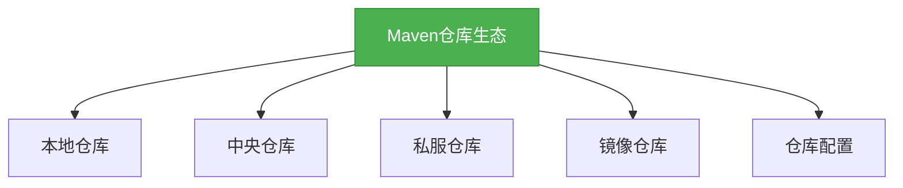

# 生态-Maven仓库生态

## 概述

Maven仓库生态系统是Maven的重要组成部分，它包含了本地仓库、中央仓库和私服仓库等多种仓库类型。本章节将深入探讨Maven仓库生态系统的构成、工作原理和最佳实践，帮助你更好地管理和使用Maven仓库。



## 知识要点

### 1. 本地仓库

本地仓库是位于开发者本地机器上的仓库，用于存储从远程仓库下载的依赖和本地构建的构件。

#### 本地仓库的位置

默认情况下，本地仓库位于用户主目录下的`.m2/repository`目录：

```bash
# 本地仓库默认位置
~/.m2/repository
```

#### 配置本地仓库

可以在`settings.xml`文件中配置本地仓库的位置：

```xml
<settings>
    <localRepository>/path/to/local/repository</localRepository>
</settings>
```

### 2. 中央仓库

中央仓库是Maven官方提供的远程仓库，包含了大量的常用依赖。

#### 中央仓库的地址

默认情况下，Maven会从中央仓库下载依赖，其地址为：

```
https://repo.maven.apache.org/maven2/
```

#### 中央仓库的特点

- 包含了大量的常用依赖
- 由Maven官方维护
- 不允许上传构件
- 访问速度可能较慢

### 3. 私服仓库

私服仓库是企业或组织内部的远程仓库，用于存储内部构件和第三方构件。

#### 私服仓库的优点

- 提高内部构件的复用性
- 减少对外部仓库的依赖
- 控制构件的版本和质量
- 提高构建速度

#### 常用的私服仓库

- **Nexus**：由Sonatype提供的Maven仓库管理工具
- **Artifactory**：由JFrog提供的Maven仓库管理工具
- **Archiva**：由Apache提供的Maven仓库管理工具

### 4. 镜像仓库

镜像仓库是中央仓库的镜像，用于提高访问速度。

#### 配置镜像仓库

可以在`settings.xml`文件中配置镜像仓库：

```xml
<settings>
    <mirrors>
        <mirror>
            <id>aliyun</id>
            <name>Aliyun Maven</name>
            <url>https://maven.aliyun.com/repository/public</url>
            <mirrorOf>central</mirrorOf>
        </mirror>
    </mirrors>
</settings>
```

#### 常用的镜像仓库

- 阿里云Maven镜像：`https://maven.aliyun.com/repository/public`
- 华为云Maven镜像：`https://repo.huaweicloud.com/repository/maven/`
- 网易Maven镜像：`http://mirrors.163.com/maven/repository/maven-public/`

### 5. 仓库配置

仓库配置是控制Maven如何访问仓库的重要手段。

#### 配置远程仓库

可以在POM文件中配置远程仓库：

```xml
<repositories>
    <repository>
        <id>central</id>
        <name>Central Repository</name>
        <url>https://repo.maven.apache.org/maven2/</url>
        <releases>
            <enabled>true</enabled>
        </releases>
        <snapshots>
            <enabled>false</enabled>
        </snapshots>
    </repository>
</repositories>
```

#### 配置快照仓库

```xml
<repositories>
    <repository>
        <id>snapshots</id>
        <name>Snapshots Repository</name>
        <url>https://repo.maven.apache.org/maven2/</url>
        <releases>
            <enabled>false</enabled>
        </releases>
        <snapshots>
            <enabled>true</enabled>
        </snapshots>
    </repository>
</repositories>
```

## 知识扩展

### 设计思想

Maven仓库生态的设计遵循了以下原则：
1. **分布式存储**：构件存储在多个仓库中
2. **缓存机制**：本地仓库缓存远程仓库的构件
3. **镜像机制**：提高访问速度
4. **私服机制**：促进内部构件的复用
5. **版本控制**：精确控制构件的版本

### 避坑指南

1. **仓库配置错误**：检查`settings.xml`和POM文件中的仓库配置
2. **依赖不可用**：确保依赖可以从配置的仓库中获取
3. **版本冲突**：使用依赖管理统一管理依赖版本
4. **快照版本**：谨慎使用快照版本，因为它们可能会随时变化
5. **访问速度慢**：配置镜像仓库提高访问速度

### 深度思考题

**思考题:**
什么是Maven的仓库镜像？它有什么作用？

**回答:**
Maven的仓库镜像是指一个仓库的副本，它包含了原仓库中的所有构件。

作用：
1. 提高访问速度：镜像仓库通常位于本地或附近的网络中，可以显著提高访问速度
2. 减轻原仓库的负担：镜像仓库可以分担原仓库的访问压力
3. 提高可用性：如果原仓库不可用，镜像仓库可以作为备份
4. 降低网络开销：减少跨网络访问的次数和数据量

**思考题:**
为什么企业需要搭建私服仓库？

**回答:**
1. 提高内部构件的复用性：企业内部的构件可以被多个项目共享和复用
2. 控制构件的版本和质量：企业可以控制哪些构件可以被使用，以及它们的版本和质量
3. 减少对外部仓库的依赖：降低对外部仓库的依赖，提高项目的稳定性和安全性
4. 提高构建速度：内部构件可以从本地私服仓库获取，显著提高构建速度
5. 保护知识产权：企业的内部构件可以保存在私服仓库中，避免泄露到外部