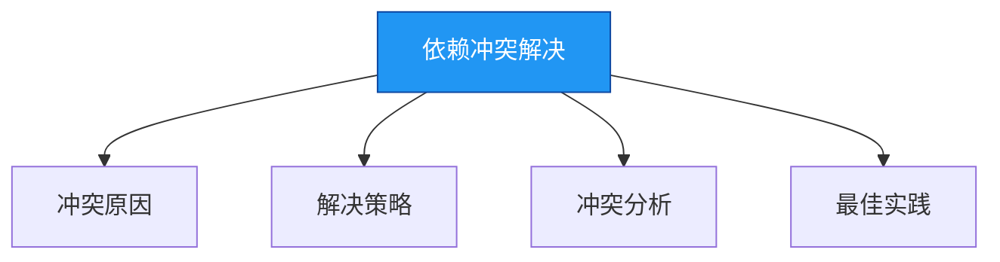

# 进阶-依赖冲突解决

## 概述

依赖冲突是Maven使用过程中常见的问题，尤其是在大型项目中。本章节将深入探讨依赖冲突的原因、解决策略和最佳实践，帮助你更好地管理和解决Maven依赖冲突。



## 知识要点

### 1. 冲突原因

依赖冲突通常是由以下原因引起的：

#### 1.1 传递依赖

Maven的依赖传递机制会导致间接依赖被引入到项目中，如果多个直接依赖引入了同一个库的不同版本，就会产生冲突。

#### 1.2 版本不兼容

不同版本的库可能会有API的变化，导致依赖它的代码无法正常工作。

#### 1.3 重复依赖

同一个库被多次引入到项目中，可能会导致类加载错误。

### 2. 解决策略

Maven提供了多种解决依赖冲突的策略：

#### 2.1 最短路径优先

Maven默认使用最短路径优先的策略来解决依赖冲突，即选择依赖路径最短的版本。

#### 2.2 声明顺序优先

如果两个依赖的路径长度相同，Maven会选择在POM文件中声明较早的那个。

#### 2.3 排除依赖

可以使用`<exclusions>`标签排除特定的依赖。

```xml
<dependency>
    <groupId>com.example</groupId>
    <artifactId>example</artifactId>
    <version>1.0.0</version>
    <exclusions>
        <exclusion>
            <groupId>conflicting.group</groupId>
            <artifactId>conflicting-artifact</artifactId>
        </exclusion>
    </exclusions>
</dependency>
```

#### 2.4 版本锁定

可以使用`<dependencyManagement>`标签锁定依赖的版本。

```xml
<dependencyManagement>
    <dependencies>
        <dependency>
            <groupId>conflicting.group</groupId>
            <artifactId>conflicting-artifact</artifactId>
            <version>2.0.0</version>
        </dependency>
    </dependencies>
</dependencyManagement>
```

#### 2.5 直接依赖

可以在POM文件中直接声明依赖的版本，覆盖传递依赖的版本。

```xml
<dependency>
    <groupId>conflicting.group</groupId>
    <artifactId>conflicting-artifact</artifactId>
    <version>2.0.0</version>
</dependency>
```

### 3. 冲突分析

#### 3.1 使用`mvn dependency:tree`命令

可以使用`mvn dependency:tree`命令查看项目的依赖树，找出冲突的依赖。

```bash
# 查看依赖树
mvn dependency:tree

# 查看特定依赖的路径
mvn dependency:tree -Dincludes=conflicting.group:conflicting-artifact
```

#### 3.2 使用IDE工具

大多数IDE都提供了依赖分析工具，如IntelliJ IDEA的Dependencies视图，可以帮助你可视化地查看和分析依赖冲突。

### 4. 最佳实践

#### 4.1 统一版本管理

使用`<dependencyManagement>`标签统一管理依赖的版本，避免版本不一致导致的冲突。

#### 4.2 最小化依赖

只引入项目真正需要的依赖，避免不必要的依赖被引入。

#### 4.3 定期检查依赖

定期使用`mvn dependency:check`命令检查依赖的更新和安全漏洞。

```bash
# 检查依赖更新
mvn dependency:check
```

#### 4.4 使用可靠的依赖

尽量使用官方的、稳定的依赖，避免使用非正式的、不稳定的依赖。

## 知识扩展

### 设计思想

Maven依赖冲突解决的设计遵循了以下原则：
1. **约定优于配置**：默认的冲突解决策略（最短路径优先、声明顺序优先）减少了手动配置的需求
2. **灵活性**：提供了多种冲突解决策略，适应不同的场景
3. **可观测性**：提供了依赖树等工具，帮助开发者了解和分析依赖关系
4. **向上兼容**：尽量保证新版本的库兼容旧版本的API

### 避坑指南

1. **依赖版本不一致**：使用`<dependencyManagement>`标签统一管理依赖版本
2. **传递依赖冲突**：使用`<exclusions>`标签排除冲突的依赖
3. **依赖过多**：只引入项目真正需要的依赖
4. **依赖未更新**：定期检查依赖的更新和安全漏洞
5. **依赖不兼容**：在引入新的依赖前，检查它与现有依赖的兼容性

### 深度思考题

**思考题:**
什么是Maven的依赖传递机制？它有什么优缺点？

**回答:**
Maven的依赖传递机制是指，当一个项目依赖另一个项目时，它也会自动依赖该项目的依赖。

优点：
1. 简化了依赖配置：开发者只需要声明直接依赖，不需要声明间接依赖
2. 提高了依赖的复用性：多个项目可以共享同一个间接依赖
3. 降低了维护成本：当间接依赖的版本更新时，只需要更新直接依赖的版本

缺点：
1. 可能会引入不必要的依赖：项目可能会依赖一些它并不需要的库
2. 可能会导致依赖冲突：多个直接依赖可能会引入同一个库的不同版本
3. 增加了项目的复杂性：项目的依赖关系可能会变得非常复杂

**思考题:**
如何避免Maven依赖冲突？

**回答:**
1. 使用`<dependencyManagement>`标签统一管理依赖版本
2. 只引入项目真正需要的依赖，避免不必要的依赖被引入
3. 定期检查依赖的更新和安全漏洞
4. 在引入新的依赖前，检查它与现有依赖的兼容性
5. 使用`<exclusions>`标签排除冲突的依赖
6. 直接声明依赖的版本，覆盖传递依赖的版本
7. 使用可靠的、稳定的依赖，避免使用非正式的、不稳定的依赖