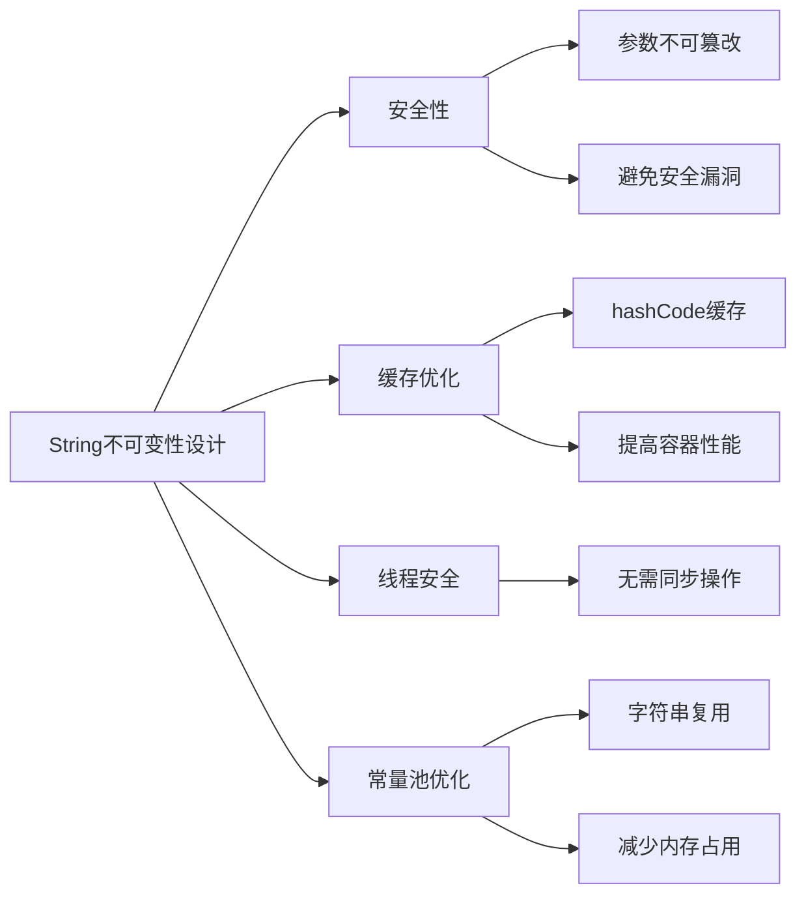

# 面试专题：语法基础

## 核心理论
### 1.1 Java语法体系概览
Java语法体系可分为基础语法、面向对象语法和高级特性三个层次，是Java编程的基石。


### 1.2 语法基础核心考点
| 类别 | 高频考点 | 重要程度 |
|------|----------|----------|
| 关键字 | static, final, this, super, volatile, transient | ★★★★★ |
| 数据类型 | 基本类型与包装类区别、自动装箱/拆箱、String不可变性 | ★★★★★ |
| 控制流程 | 分支结构、循环效率对比、break与continue | ★★★☆☆ |
| 面向对象 | 构造方法、重写与重载、多态实现原理 | ★★★★★ |
| 高级特性 | 泛型擦除、注解原理、函数式接口 | ★★★★☆ |

## 代码实践
### 2.1 关键字应用场景
#### 2.1.1 static关键字用法
```java
/**
 * static关键字使用示例
 * 包含静态变量、静态方法、静态代码块和静态内部类
 */
public class StaticDemo {
    // 静态变量：属于类，所有实例共享
    public static int staticVar = 0;
    // 实例变量：属于对象，每个实例独立
    public int instanceVar = 0;

    // 静态代码块：类加载时执行，仅执行一次
    static {
        System.out.println("静态代码块执行");
        staticVar = 10;
    }

    // 构造方法
    public StaticDemo() {
        instanceVar++;
        staticVar++;
    }

    // 静态方法：只能访问静态成员，无this引用
    public static void staticMethod() {
        System.out.println("静态变量值: " + staticVar);
        // System.out.println(instanceVar); // 编译错误：不能访问实例变量
    }

    // 实例方法：可以访问静态和实例成员
    public void instanceMethod() {
        System.out.println("实例变量值: " + instanceVar);
        System.out.println("静态变量值: " + staticVar);
    }

    // 静态内部类：不能访问外部类的实例成员
    public static class StaticNestedClass {
        public void nestedMethod() {
            System.out.println("静态内部类访问静态变量: " + staticVar);
        }
    }

    public static void main(String[] args) {
        // 直接通过类名访问静态成员
        StaticDemo.staticMethod();
        System.out.println("通过类名访问静态变量: " + StaticDemo.staticVar);

        // 创建实例
        StaticDemo instance1 = new StaticDemo();
        StaticDemo instance2 = new StaticDemo();

        // 实例变量各自独立
        System.out.println("instance1实例变量: " + instance1.instanceVar); // 1
        System.out.println("instance2实例变量: " + instance2.instanceVar); // 1

        // 静态变量共享
        System.out.println("instance1静态变量: " + instance1.staticVar); // 12
        System.out.println("instance2静态变量: " + instance2.staticVar); // 12

        // 静态内部类使用
        StaticNestedClass nested = new StaticNestedClass();
        nested.nestedMethod();
    }
}
```

#### 2.1.2 final关键字用法
```java
/**
 * final关键字使用示例
 * 可修饰类、方法、变量
 */
public class FinalDemo {
    // final变量：必须初始化，初始化后不可修改
    public static final int CONSTANT = 100; // 常量，通常全大写
    private final String name;

    // final参数：方法内不可修改
    public void finalParameter(final int param) {
        // param = 20; // 编译错误：final参数不可修改
        System.out.println("final参数: " + param);
    }

    // 构造方法：必须初始化final实例变量
    public FinalDemo(String name) {
        this.name = name; // 正确：在构造方法中初始化final变量
    }

    // final方法：不可被子类重写
    public final void finalMethod() {
        System.out.println("这是final方法，不可重写");
    }

    // final变量的getter
    public String getName() {
        return name;
    }
}

// final类：不可被继承
final class FinalClass {
    // 类中的成员可以是各种类型
}

// 编译错误：Cannot inherit from final 'FinalClass'
// class SubClass extends FinalClass {}
```

### 2.2 数据类型与类型转换
#### 2.2.1 基本类型与包装类
```java
/**
 * 基本类型与包装类对比示例
 * 包括自动装箱/拆箱和缓存机制
 */
public class WrapperClassDemo {
    public static void main(String[] args) {
        // 基本类型
        int primitiveInt = 10;
        boolean primitiveBoolean = true;

        // 包装类
        Integer wrapperInt = Integer.valueOf(10);
        Boolean wrapperBoolean = Boolean.TRUE;

        // 自动装箱：基本类型 -> 包装类
        Integer autoBoxing = primitiveInt;

        // 自动拆箱：包装类 -> 基本类型
        int autoUnboxing = wrapperInt;

        // 包装类缓存机制
        Integer a = 127;
        Integer b = 127;
        Integer c = 128;
        Integer d = 128;

        System.out.println(a == b); // true：缓存范围内
        System.out.println(c == d); // false：超出缓存范围
        System.out.println(a.equals(b)); // true：equals比较值
        System.out.println(c.equals(d)); // true：equals比较值

        // 常见问题：NullPointerException
        Integer nullInteger = null;
        try {
            int value = nullInteger; // 自动拆箱时null会抛出NPE
        } catch (NullPointerException e) {
            System.out.println("空包装类拆箱抛出NPE");
        }

        // 字符串转基本类型
        int num = Integer.parseInt("123");
        double decimal = Double.parseDouble("3.14");

        // 基本类型转字符串
        String intStr = String.valueOf(123);
        String boolStr = Boolean.toString(true);
    }
}
```

#### 2.2.2 String特性与操作
```java
/**
 * String类特性与常用操作示例
 * 不可变性、常量池、字符串操作
 */
public class StringDemo {
    public static void main(String[] args) {
        // String不可变性演示
        String str1 = "hello";
        String str2 = str1;
        str1 = str1 + " world";
        System.out.println(str1); // hello world
        System.out.println(str2); // hello（str2仍指向原对象）

        // 字符串常量池
        String s1 = "java";
        String s2 = "java";
        String s3 = new String("java");
        String s4 = new String("java").intern();

        System.out.println(s1 == s2); // true：同一常量池对象
        System.out.println(s1 == s3); // false：s3是堆中对象
        System.out.println(s1 == s4); // true：intern()返回常量池对象

        // 常用字符串操作
        String text = "  Java Programming  ";
        System.out.println(text.trim()); // 去除首尾空格："Java Programming"
        System.out.println(text.toLowerCase()); // 转小写："  java programming  "
        System.out.println(text.indexOf("Pro")); // 查找子串位置：6
        System.out.println(text.substring(2, 6)); // 截取子串："Java"
        System.out.println(text.replace("Programming", "Coding")); // 替换："  Java Coding  "

        // 字符串拼接性能对比
        long start = System.currentTimeMillis();
        String normalConcat = "";
        for (int i = 0; i < 10000; i++) {
            normalConcat += i; // 性能差，每次创建新对象
        }
        System.out.println("普通拼接耗时: " + (System.currentTimeMillis() - start) + "ms");

        start = System.currentTimeMillis();
        StringBuilder sb = new StringBuilder();
        for (int i = 0; i < 10000; i++) {
            sb.append(i); // 性能好，可修改
        }
        String builderConcat = sb.toString();
        System.out.println("StringBuilder拼接耗时: " + (System.currentTimeMillis() - start) + "ms");

        // 线程安全的StringBuffer
        StringBuffer sbf = new StringBuffer();
        sbf.append("thread").append("safe");
    }
}
```

### 2.3 控制流程与异常处理
#### 2.3.1 循环结构效率对比
```java
/**
 * 不同循环结构的性能对比
 * for、foreach、while循环适用场景
 */
public class LoopPerformanceDemo {
    public static void main(String[] args) {
        List<String> list = new ArrayList<>();
        for (int i = 0; i < 100000; i++) {
            list.add("element" + i);
        }

        // for循环
        long start = System.currentTimeMillis();
        for (int i = 0; i < list.size(); i++) {
            String element = list.get(i);
        }
        System.out.println("普通for循环耗时: " + (System.currentTimeMillis() - start) + "ms");

        // 优化for循环（缓存size）
        start = System.currentTimeMillis();
        int size = list.size();
        for (int i = 0; i < size; i++) {
            String element = list.get(i);
        }
        System.out.println("优化for循环耗时: " + (System.currentTimeMillis() - start) + "ms");

        // foreach循环
        start = System.currentTimeMillis();
        for (String element : list) {
            // do nothing
        }
        System.out.println("foreach循环耗时: " + (System.currentTimeMillis() - start) + "ms");

        // while循环
        start = System.currentTimeMillis();
        int index = 0;
        while (index < list.size()) {
            String element = list.get(index);
            index++;
        }
        System.out.println("while循环耗时: " + (System.currentTimeMillis() - start) + "ms");
    }
}
```

#### 2.3.2 异常处理最佳实践
```java
/**
 * 异常处理最佳实践示例
 * 包括try-catch-finally、try-with-resources和自定义异常
 */
public class ExceptionHandlingDemo {
    // 自定义异常
    static class BusinessException extends Exception {
        private int errorCode;

        public BusinessException(String message, int errorCode) {
            super(message);
            this.errorCode = errorCode;
        }

        public int getErrorCode() {
            return errorCode;
        }
    }

    // 资源关闭传统方式
    public static void traditionalResourceHandling() {
        FileInputStream fis = null;
        try {
            fis = new FileInputStream("file.txt");
            // 读取文件操作
        } catch (FileNotFoundException e) {
            System.err.println("文件未找到: " + e.getMessage());
        } finally {
            // 确保资源关闭
            if (fis != null) {
                try {
                    fis.close();
                } catch (IOException e) {
                    System.err.println("关闭流失败: " + e.getMessage());
                }
            }
        }
    }

    // JDK 7+ try-with-resources自动关闭资源
    public static void tryWithResources() {
        try (FileInputStream fis = new FileInputStream("file.txt")) {
            // 读取文件操作
        } catch (FileNotFoundException e) {
            System.err.println("文件未找到: " + e.getMessage());
        } catch (IOException e) {
            System.err.println("IO异常: " + e.getMessage());
        } // 资源自动关闭
    }

    // 异常处理最佳实践
    public static void processOrder(int orderId) throws BusinessException {
        if (orderId <= 0) {
            // 抛出具体业务异常
            throw new BusinessException("订单ID必须为正数", 400);
        }

        try {
            // 业务逻辑处理
            System.out.println("处理订单: " + orderId);
            // 可能抛出异常的操作
        } catch (NullPointerException e) {
            // 捕获具体异常而非通用Exception
            throw new BusinessException("订单数据为空", 500);
        } finally {
            // 释放资源或记录日志等收尾工作
            System.out.println("订单处理结束，orderId: " + orderId);
        }
    }

    public static void main(String[] args) {
        try {
            processOrder(123);
            processOrder(-1);
        } catch (BusinessException e) {
            System.err.println("业务异常: " + e.getMessage() + ", 错误码: " + e.getErrorCode());
        }

        traditionalResourceHandling();
        tryWithResources();
    }
}
```

## 设计思想
### 3.1 Java语法设计哲学
Java语法设计遵循"简单、面向对象、分布式、健壮、安全、平台无关、可移植、高性能、多线程、动态"的原则，其中语法层面最核心的设计思想包括：

1. **简单性**：相比C++移除了指针、多重继承等复杂特性
2. **面向对象**：一切皆对象（除基本类型外），单继承多实现
3. **安全性**：强类型检查、异常处理、内存自动管理
4. **平台无关**：一次编写，到处运行（WORA）


### 3.2 语法特性背后的设计考量
#### 3.2.1 String不可变性设计
String类被设计为不可变的主要原因：
- **安全性**：字符串常被用作参数，不可变性保证参数不被修改
- **缓存优化**：可缓存hashCode，提高HashMap等容器的性能
- **线程安全**：不可变对象天然线程安全
- **常量池优化**：字符串常量池可以复用相同内容的字符串



#### 3.2.2 自动装箱与拆箱的权衡
自动装箱/拆箱是Java 5引入的语法糖，其设计权衡：
- **优点**：简化代码，消除基本类型与包装类之间的转换代码
- **缺点**：可能导致性能问题和NullPointerException
- **优化**：对常用值（如-128~127的整数）实现缓存机制

## 避坑指南
### 4.1 关键字使用误区
#### 4.1.1 static关键字常见错误
```java
/**
 * static关键字使用误区示例
 */
public class StaticPitfalls {
    // 误区1：静态方法访问非静态成员
    public static void staticMethod() {
        // System.out.println(nonStaticVar); // 编译错误
        // nonStaticMethod(); // 编译错误
    }

    private int nonStaticVar;
    private void nonStaticMethod() {}

    // 误区2：构造方法误用static
    // public static StaticPitfalls() {} // 编译错误

    // 误区3：static导入导致命名冲突
    // import static java.lang.Math.PI;
    // import static java.awt.geom.Arc2D.PI;
    // 此时使用PI会导致编译错误

    // 误区4：静态内部类访问外部类实例成员
    public static class StaticNestedClass {
        public void accessOuter() {
            // System.out.println(nonStaticVar); // 编译错误
        }
    }
}
```

#### 4.1.2 final关键字使用陷阱
```java
/**
 * final关键字使用陷阱示例
 */
public class FinalPitfalls {
    // 陷阱1：final引用的对象内容可修改
    private final List<String> list = new ArrayList<>();

    public void addElement() {
        list.add("element"); // 允许：final只保证引用不变
        // list = new ArrayList<>(); // 不允许：修改引用
    }

    // 陷阱2：final数组的元素可修改
    private final int[] array = {1, 2, 3};

    public void modifyArray() {
        array[0] = 100; // 允许：数组引用不变，内容可变
        // array = new int[5]; // 不允许：修改引用
    }

    // 陷阱3：final方法内的局部变量可修改
    public final void finalMethod() {
        int localVar = 10;
        localVar = 20; // 允许：方法final不影响局部变量
    }

    // 陷阱4：错误的初始化时机
    private final int lateInitVar;

    // public FinalPitfalls() {}
    // 编译错误：final变量lateInitVar未初始化

    // 正确做法：在构造方法中初始化
    public FinalPitfalls() {
        lateInitVar = 100;
    }
}
```

### 4.2 类型转换与字符串操作问题
#### 4.2.1 类型转换异常处理
```java
/**
 * 类型转换常见问题及解决方案
 */
public class TypeConversionPitfalls {
    public static void main(String[] args) {
        // 问题1：字符串转数字时的格式错误
        try {
            int num = Integer.parseInt("abc");
        } catch (NumberFormatException e) {
            System.out.println("字符串格式错误，无法转为数字");
        }

        // 问题2：向下转型不安全
        Object obj = "string";
        try {
            Integer num = (Integer) obj; // 运行时异常
        } catch (ClassCastException e) {
            System.out.println("类型转换异常: " + e.getMessage());
        }

        // 解决方案：使用instanceof检查
        if (obj instanceof Integer) {
            Integer num = (Integer) obj;
        } else {
            System.out.println("对象不是Integer类型");
        }

        // 问题3：浮点精度丢失
        double result = 0.1 + 0.2;
        System.out.println(result); // 0.30000000000000004而非0.3

        // 解决方案：使用BigDecimal
        BigDecimal bd1 = new BigDecimal("0.1");
        BigDecimal bd2 = new BigDecimal("0.2");
        BigDecimal sum = bd1.add(bd2);
        System.out.println(sum); // 0.3
    }
}
```

#### 4.2.2 String操作性能问题
```java
/**
 * String操作性能问题及优化
 */
public class StringPerformancePitfalls {
    // 问题1：循环中字符串拼接
    public String loopConcat(int count) {
        String result = "";
        for (int i = 0; i < count; i++) {
            result += i; // 每次循环创建新对象，O(n²)复杂度
        }
        return result;
    }

    // 优化方案：使用StringBuilder
    public String optimizedConcat(int count) {
        StringBuilder sb = new StringBuilder();
        for (int i = 0; i < count; i++) {
            sb.append(i); // O(n)复杂度
        }
        return sb.toString();
    }

    // 问题2：不必要的字符串创建
    public void unnecessaryStringCreation() {
        String str1 = new String("hello"); // 不推荐：创建了两个对象（堆和常量池）
        String str2 = "hello"; // 推荐：只使用常量池对象

        // 问题3：频繁调用String.substring()
        String largeString = "abcdefghijklmnopqrstuvwxyz";        
        for (int i = 0; i < 1000; i++) {
            String substr = largeString.substring(0, 5); // JDK 6及之前会导致内存泄漏
        }
    }

    public static void main(String[] args) {
        StringPerformancePitfalls demo = new StringPerformancePitfalls();
        int count = 10000;

        long start = System.currentTimeMillis();
        demo.loopConcat(count);
        System.out.println("循环拼接耗时: " + (System.currentTimeMillis() - start) + "ms");

        start = System.currentTimeMillis();
        demo.optimizedConcat(count);
        System.out.println("StringBuilder拼接耗时: " + (System.currentTimeMillis() - start) + "ms");
    }
}
```

## 深度思考题
### 思考题1：Java中的值传递与引用传递区别

思考题回答：Java中只有值传递，没有引用传递。当参数是基本类型时，传递的是值的副本；当参数是对象时，传递的是对象引用的副本，而非对象本身。

示例证明：
```java
public class PassByValueDemo {
    // 基本类型参数
    public static void modifyPrimitive(int num) {
        num = 100;
    }

    // 对象类型参数
    public static void modifyObject(StringBuilder sb) {
        sb.append(" world"); // 修改对象内容
        sb = new StringBuilder("new"); // 修改引用副本，不影响原引用
    }

    public static void main(String[] args) {
        int x = 10;
        modifyPrimitive(x);
        System.out.println(x); // 输出10，未被修改

        StringBuilder sb = new StringBuilder("hello");
        modifyObject(sb);
        System.out.println(sb); // 输出"hello world"，对象内容被修改
    }
}
```

结论：Java始终采用值传递。对于对象，传递的是引用的值，这使得我们可以修改对象的内容，但无法改变原引用的指向。

### 思考题2：JDK 8到JDK 21的语法特性演进

思考题回答：JDK 8至JDK 21的重要语法特性演进：

1. **JDK 8 (2014)**
   - Lambda表达式：引入函数式编程能力
   - 方法引用：简化Lambda表达式
   - Stream API：支持集合的函数式操作
   - 默认方法：接口可以有默认实现

2. **JDK 9 (2017)**
   - 接口私有方法：接口中可定义私有辅助方法
   - try-with-resources增强：支持final变量

3. **JDK 10 (2018)**
   - var关键字：局部变量类型推断
   - 不可变集合工厂方法：List.of(), Set.of(), Map.of()

4. **JDK 11 (2018)**
   - String新增方法：isBlank(), lines(), strip(), repeat()
   - Lambda参数类型推断增强

5. **JDK 12 (2019)**
   - switch表达式预览：支持返回值
   - 字符串缩进方法indent()

6. **JDK 13 (2019)**
   - switch表达式增强：使用yield返回值
   - 文本块预览：使用