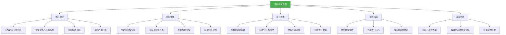

# 面试专题：注解

## 概述
注解是Java面试中的高频考点，涉及底层实现、框架应用和性能优化等多个方面。掌握注解技术不仅能应对面试中的理论问题，更能在实际项目中写出更优雅、更灵活的代码。本章将系统梳理注解相关的面试重点，帮助你全面掌握这一重要知识点。



## 核心理论

### 1. 注解的本质与分类
注解本质是继承`java.lang.annotation.Annotation`接口的特殊接口，编译后会生成对应的class文件。根据用途可分为：
- **标准注解**：JDK内置的注解，如`@Override`、`@Deprecated`
- **元注解**：用于修饰注解的注解，如`@Target`、`@Retention`
- **自定义注解**：开发者根据需求定义的注解

### 2. 元注解详解
JDK提供的4个元注解及其作用：

| 元注解 | 作用 | 关键参数 |
|--------|------|----------|
| `@Target` | 指定注解可修饰的元素类型 | `ElementType.TYPE`（类）、`FIELD`（字段）、`METHOD`（方法）等 |
| `@Retention` | 指定注解保留策略 | `SOURCE`（源码）、`CLASS`（字节码）、`RUNTIME`（运行时） |
| `@Documented` | 指定注解是否包含在Javadoc中 | - |
| `@Inherited` | 指定注解是否可被继承 | - |

**关键考点**：`@Retention(RetentionPolicy.RUNTIME)`是运行时反射解析注解的必要条件，而`@Inherited`仅对类注解有效，方法和字段注解不会被子类继承。

### 3. 注解的生命周期
- **SOURCE**：仅存在于源码中，编译时被丢弃（如`@Override`）
- **CLASS**：存在于字节码中，但JVM加载类时会被丢弃（默认策略）
- **RUNTIME**：存在于运行时，可通过反射获取（如Spring的`@Autowired`）

### 4. JDK8注解新特性
- **重复注解**：允许在同一元素上多次使用同一注解，需用`@Repeatable`标记
- **类型注解**：可用于泛型、类型转换等场景，如`List<@NonNull String>`

```java
// 重复注解示例
@Repeatable(Schedules.class)
public @interface Schedule {
    String dayOfWeek();
    int hour();
}

public @interface Schedules {
    Schedule[] value();
}

// 使用重复注解
@Schedule(dayOfWeek = "MONDAY", hour = 9)
@Schedule(dayOfWeek = "FRIDAY", hour = 17)
public void doPeriodicTask() {
    // 任务逻辑
}
```

## 代码实践

### 面试题1：实现一个简单的日志注解
**需求**：设计一个`@Log`注解，用于标记方法需要记录日志，包括方法名、参数和返回值。

```java
// 1. 定义日志注解
@Target(ElementType.METHOD)
@Retention(RetentionPolicy.RUNTIME)
public @interface Log {
    // 日志描述
    String description() default "";
    // 是否记录参数
    boolean logParameters() default true;
    // 是否记录返回值
    boolean logReturnValue() default true;
}

// 2. 实现AOP切面处理日志
@Aspect
@Component
public class LogAspect {
    private static final Logger logger = LoggerFactory.getLogger(LogAspect.class);

    @Around("@annotation(log)")
    public Object logAround(ProceedingJoinPoint joinPoint, Log log) throws Throwable {
        String methodName = joinPoint.getSignature().getName();
        Object[] args = joinPoint.getArgs();

        // 记录方法调用前日志
        if (log.logParameters()) {
            logger.info("{} - 调用开始，参数: {}", methodName, Arrays.toString(args));
        } else {
            logger.info("{} - 调用开始", methodName);
        }

        long startTime = System.currentTimeMillis();
        Object result = null;
        try {
            // 执行目标方法
            result = joinPoint.proceed();
            return result;
        } catch (Exception e) {
            // 记录异常日志
            logger.error("{} - 调用异常: {}", methodName, e.getMessage(), e);
            throw e;
        } finally {
            // 记录方法调用后日志
            long duration = System.currentTimeMillis() - startTime;
            if (log.logReturnValue()) {
                logger.info("{} - 调用结束，返回值: {}, 耗时: {}ms", methodName, result, duration);
            } else {
                logger.info("{} - 调用结束，耗时: {}ms", methodName, duration);
            }
        }
    }
}

// 3. 使用日志注解
@Service
public class UserService {
    @Log(description = "获取用户信息", logParameters = true, logReturnValue = true)
    public User getUserById(Long id) {
        // 业务逻辑
        return userRepository.findById(id);
    }
}
```

### 面试题2：实现一个基于注解的参数校验器
**需求**：设计`@NotNull`、`@Max`、`@Min`等注解，实现简单的参数校验功能。

```java
// 1. 定义校验注解
@Target({ElementType.FIELD, ElementType.PARAMETER})
@Retention(RetentionPolicy.RUNTIME)
public @interface NotNull {
    String message() default "参数不能为空";
}

@Target({ElementType.FIELD, ElementType.PARAMETER})
@Retention(RetentionPolicy.RUNTIME)
public @interface Max {
    long value();
    String message() default "参数超过最大值";
}

// 2. 实现校验器
public class Validator {
    public static void validate(Object obj) throws ValidationException {
        if (obj == null) {
            throw new ValidationException("校验对象不能为空");
        }

        Class<?> clazz = obj.getClass();
        // 校验字段
        for (Field field : clazz.getDeclaredFields()) {
            field.setAccessible(true);
            validateField(field, obj);
        }
    }

    private static void validateField(Field field, Object obj) throws ValidationException {
        try {
            Object value = field.get(obj);

            // 校验@NotNull
            if (field.isAnnotationPresent(NotNull.class) && value == null) {
                NotNull annotation = field.getAnnotation(NotNull.class);
                throw new ValidationException(annotation.message() + "(字段: " + field.getName() + ")");
            }

            // 校验@Max
            if (field.isAnnotationPresent(Max.class) && value instanceof Number) {
                Max annotation = field.getAnnotation(Max.class);
                long maxValue = annotation.value();
                long fieldValue = ((Number) value).longValue();
                if (fieldValue > maxValue) {
                    throw new ValidationException(annotation.message() + "(字段: " + field.getName() + ", 最大值: " + maxValue + ", 实际值: " + fieldValue + ")");
                }
            }

            // 可添加更多注解的校验逻辑...
        } catch (IllegalAccessException e) {
            throw new ValidationException("校验失败: " + e.getMessage());
        }
    }
}

// 3. 使用校验注解
public class User {
    @NotNull(message = "用户ID不能为空")
    private Long id;

    @NotNull(message = "用户名不能为空")
    private String username;

    @Max(value = 120, message = "年龄不能超过120")
    private Integer age;

    // 省略getter和setter
}

// 4. 执行校验
public class ValidationDemo {
    public static void main(String[] args) {
        User user = new User();
        user.setId(null);
        user.setUsername("test");
        user.setAge(150);

        try {
            Validator.validate(user);
        } catch (ValidationException e) {
            System.out.println("校验失败: " + e.getMessage());
        }
    }
}
```

## 设计思想

### 1. 元数据驱动开发
注解体现了元数据驱动开发（MDD）思想，通过注解为代码添加元数据，实现：
- **配置与代码分离**：如Spring的`@Component`替代XML配置
- **声明式编程**：通过注解声明意图而非实现细节
- **代码自我描述**：注解使代码具有自解释性

### 2. AOP与注解结合
注解常与AOP结合实现横切关注点：
- **日志记录**：如`@Log`注解标记需要记录日志的方法
- **事务管理**：如Spring的`@Transactional`
- **权限控制**：如`@RequiresPermission`
- **缓存控制**：如`@Cacheable`

### 3. 编译期代码生成
通过注解处理器在编译期生成代码，避免运行时反射开销：
- **Lombok**：通过`@Data`、`@Getter`等注解生成getter/setter等方法
- **ButterKnife**：通过`@BindView`生成视图绑定代码
- **Dagger**：通过`@Inject`生成依赖注入代码

### 4. 约定优于配置
注解是"约定优于配置"（Convention over Configuration）思想的重要实现：
- 默认值减少显式配置
- 命名约定简化配置
- 注解标记替代XML配置

## 避坑指南

### 1. 常见错误案例

#### 错误1：错误的保留策略
```java
// 错误示例：需要运行时解析却使用CLASS保留策略
@Retention(RetentionPolicy.CLASS)
public @interface MyAnnotation {
    String value();
}

// 正确做法：运行时解析需使用RUNTIME保留策略
@Retention(RetentionPolicy.RUNTIME)
public @interface MyAnnotation {
    String value();
}
```

#### 错误2：误解@Inherited注解
```java
// @Inherited仅对类注解有效，方法注解不会被子类继承
@Inherited
@Target({ElementType.TYPE, ElementType.METHOD})
@Retention(RetentionPolicy.RUNTIME)
public @interface MyAnnotation {
}

@MyAnnotation
public class Parent {
    @MyAnnotation
    public void doSomething() {}
}

public class Child extends Parent {
    // 重写父类方法后，@MyAnnotation注解不会被继承
    @Override
    public void doSomething() {}
}
```

#### 错误3：注解属性默认值问题
```java
// 错误示例：注解属性没有默认值且使用时未指定
public @interface MyAnnotation {
    String value(); // 没有默认值
    int count();    // 没有默认值
}

// 使用时必须指定所有无默认值的属性
@MyAnnotation(value = "test", count = 1) // 正确
public class MyClass {}

@MyAnnotation(value = "test") // 错误：缺少count属性
public class MyClass {}
```

### 2. 性能优化技巧

#### 技巧1：缓存注解解析结果
```java
// 使用缓存避免重复反射解析注解
public class AnnotationCache {
    private static final ConcurrentHashMap<Class<?>, MyAnnotation> cache = new ConcurrentHashMap<>();

    public static MyAnnotation getAnnotation(Class<?> clazz) {
        return cache.computeIfAbsent(clazz, c -> c.getAnnotation(MyAnnotation.class));
    }
}
```

#### 技巧2：优先使用编译期注解处理器
避免运行时反射开销，如使用APT在编译期处理注解生成代码。

#### 技巧3：减少高频代码中的注解解析
在循环、高频调用方法中避免使用反射解析注解，可提前解析并缓存结果。

### 3. 版本兼容性处理
- JDK8之前不支持重复注解和类型注解
- Android平台对某些注解特性支持有限
- 不同框架版本对注解的处理可能存在差异

## 深度思考题

### 思考题1：注解与XML配置相比有哪些优缺点？在什么场景下应该选择注解，什么场景下应该选择XML？

**参考答案**：

**注解的优点**：
- 代码与配置紧密结合，可读性好
- 编译期检查，减少运行时错误
- 开发效率高，无需维护额外的XML文件

**注解的缺点**：
- 配置分散，不便于集中管理
- 修改配置需要重新编译代码
- 对于复杂配置，注解表达能力有限

**XML的优点**：
- 配置集中管理，便于维护
- 无需重新编译即可修改配置
- 适合复杂配置和跨语言场景

**XML的缺点**：
- 与代码分离，可读性较差
- 没有编译期检查，容易出现拼写错误
- 配置文件庞大时维护困难

**选择策略**：
- 简单配置、固定配置、与代码强相关的配置优先使用注解
- 复杂配置、需要动态修改的配置、跨语言配置优先使用XML
- 现代框架通常提供混合配置方式，可根据具体场景选择

### 思考题2：如何实现一个注解处理器，在编译期检查代码规范？

**参考答案**：
可以实现一个注解处理器，在编译期检查类名、方法名是否符合驼峰命名规范，变量是否使用final修饰等。

```java
// 1. 定义一个标记注解
@Target(ElementType.TYPE)
@Retention(RetentionPolicy.SOURCE)
public @interface Code规范检查 {
}

// 2. 实现注解处理器
@SupportedAnnotationTypes("com.example.Code规范检查")
@SupportedSourceVersion(SourceVersion.RELEASE_8)
public class Code规范Processor extends AbstractProcessor {
    private Messager messager;

    @Override
    public synchronized void init(ProcessingEnvironment processingEnv) {
        super.init(processingEnv);
        messager = processingEnv.getMessager();
    }

    @Override
    public boolean process(Set<? extends TypeElement> annotations, RoundEnvironment roundEnv) {
        for (TypeElement annotation : annotations) {
            for (Element element : roundEnv.getElementsAnnotatedWith(annotation)) {
                if (element.getKind() == ElementKind.CLASS) {
                    checkClassName((TypeElement) element);
                    checkFields((TypeElement) element);
                    checkMethods((TypeElement) element);
                }
            }
        }
        return true;
    }

    // 检查类名是否符合驼峰命名法（首字母大写）
    private void checkClassName(TypeElement classElement) {
        String className = classElement.getSimpleName().toString();
        if (!Character.isUpperCase(className.charAt(0))) {
            messager.printMessage(Diagnostic.Kind.ERROR,
                "类名" + className + "不符合驼峰命名规范，首字母必须大写");
        }
    }

    // 检查字段是否使用final修饰（常量除外）
    private void checkFields(TypeElement classElement) {
        for (Element enclosedElement : classElement.getEnclosedElements()) {
            if (enclosedElement.getKind() == ElementKind.FIELD) {
                VariableElement field = (VariableElement) enclosedElement;
                // 静态常量不需要检查
                if (field.getModifiers().contains(Modifier.STATIC) &&
                    field.getModifiers().contains(Modifier.FINAL)) {
                    continue;
                }
                // 成员变量应使用final修饰
                if (!field.getModifiers().contains(Modifier.FINAL)) {
                    messager.printMessage(Diagnostic.Kind.WARNING,
                        "字段" + field.getSimpleName() + "建议使用final修饰");
                }
            }
        }
    }

    // 检查方法名是否符合驼峰命名法（首字母小写）
    private void checkMethods(TypeElement classElement) {
        for (Element enclosedElement : classElement.getEnclosedElements()) {
            if (enclosedElement.getKind() == ElementKind.METHOD) {
                ExecutableElement method = (ExecutableElement) enclosedElement;
                // 构造方法不需要检查
                if (method.getSimpleName().contentEquals(classElement.getSimpleName())) {
                    continue;
                }
                String methodName = method.getSimpleName().toString();
                if (!Character.isLowerCase(methodName.charAt(0))) {
                    messager.printMessage(Diagnostic.Kind.ERROR,
                        "方法名" + methodName + "不符合驼峰命名规范，首字母必须小写");
                }
            }
        }
    }
}
```

这种编译期检查可以在开发阶段就发现代码规范问题，提高代码质量和团队协作效率。