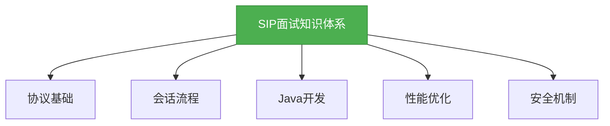
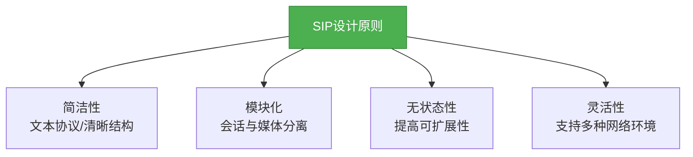
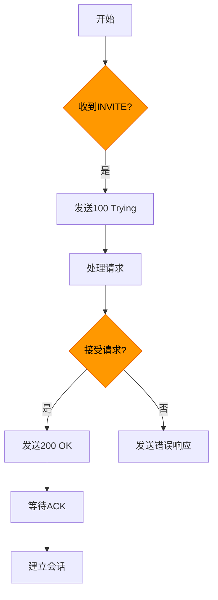
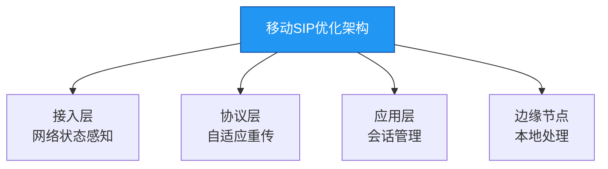

# 面试专题：SIP机制

## 概述
SIP（Session Initiation Protocol）作为IP通信的核心协议，在面试中常涉及协议原理、会话流程、Java开发实践等方面。以下是SIP面试知识体系：



## 核心理论
### 1. SIP协议基本概念
SIP是一个基于文本的应用层协议，用于建立、修改和终止多媒体会话。它采用客户端-服务器模型，支持点对点和多方通信。

### 2. SIP消息结构
SIP消息分为请求消息和响应消息，请求消息包含方法（如INVITE、ACK、BYE等），响应消息包含状态码。

```java
// SIP请求消息示例
String inviteRequest = "INVITE sip:alice@example.com SIP/2.0\r\n" +
                       "Via: SIP/2.0/UDP client.example.com:5060;branch=z9hG4bK776asdhds\r\n" +
                       "To: Alice <sip:alice@example.com>\r\n" +
                       "From: Bob <sip:bob@example.com>;tag=1928301774\r\n" +
                       "Call-ID: a84b4c76e66710@client.example.com\r\n" +
                       "CSeq: 314159 INVITE\r\n" +
                       "Contact: <sip:bob@client.example.com:5060>\r\n" +
                       "Content-Type: application/sdp\r\n" +
                       "Content-Length: 142\r\n\r\n" +
                       "v=0\r\n" +
                       "o=bob 2890844526 2890844526 IN IP4 client.example.com\r\n" +
                       "s=Session SDP\r\n" +
                       "c=IN IP4 client.example.com\r\n" +
                       "t=0 0\r\n" +
                       "m=audio 49170 RTP/AVP 0\r\n" +
                       "a=rtpmap:0 PCMU/8000\r\n";
```

## 代码实践
### 1. SIP客户端基本实现
使用JAIN-SIP库实现简单SIP客户端，发送INVITE请求并处理响应：

```java
import javax.sip.*;
import javax.sip.address.*;
import javax.sip.header.*;
import javax.sip.message.*;
import java.util.*;

/**
 * SIP客户端示例，演示如何发送INVITE请求
 */
public class SipClient implements SipListener {
    private SipFactory sipFactory;
    private SipStack sipStack;
    private SipProvider sipProvider;
    private AddressFactory addressFactory;
    private MessageFactory messageFactory;
    private HeaderFactory headerFactory;
    private ListeningPoint listeningPoint;
    private String username = "bob";
    private String server = "example.com";
    private int port = 5060;

    public void init() throws Exception {
        // 初始化SIP工厂
        sipFactory = SipFactory.getInstance();
        sipFactory.setPathName("gov.nist");

        // 配置SIP栈
        Properties properties = new Properties();
        properties.setProperty("javax.sip.STACK_NAME", "SipClientStack");
        properties.setProperty("javax.sip.IP_ADDRESS", "127.0.0.1");
        sipStack = sipFactory.createSipStack(properties);

        // 创建地址、消息和头工厂
        addressFactory = sipFactory.createAddressFactory();
        messageFactory = sipFactory.createMessageFactory();
        headerFactory = sipFactory.createHeaderFactory();

        // 创建监听点
        listeningPoint = sipStack.createListeningPoint("127.0.0.1", port, "udp");

        // 创建SIP提供者
        sipProvider = sipStack.createSipProvider(listeningPoint);
        sipProvider.addSipListener(this);
    }

    /**
     * 发送INVITE请求
     */
    public void sendInvite(String toUser) throws Exception {
        // 创建请求URI
        SipURI requestURI = addressFactory.createSipURI(toUser, server);

        // 创建To头
        Address toAddress = addressFactory.createAddress("sip:" + toUser + "@" + server);
        ToHeader toHeader = headerFactory.createToHeader(toAddress, null);

        // 创建From头
        Address fromAddress = addressFactory.createAddress("sip:" + username + "@" + server);
        FromHeader fromHeader = headerFactory.createFromHeader(fromAddress, "client-tag-12345");

        // 创建Call-ID头
        CallIdHeader callIdHeader = sipProvider.getNewCallId();

        // 创建CSeq头
        CSeqHeader cSeqHeader = headerFactory.createCSeqHeader(1L, Request.INVITE);

        // 创建Via头
        ViaHeader viaHeader = headerFactory.createViaHeader("127.0.0.1", port, "udp", "z9hG4bK776asdhds");
        List<ViaHeader> viaHeaders = new ArrayList<>();
        viaHeaders.add(viaHeader);

        // 创建Max-Forwards头
        MaxForwardsHeader maxForwardsHeader = headerFactory.createMaxForwardsHeader(70);

        // 创建INVITE请求
        Request inviteRequest = messageFactory.createRequest(
            requestURI,
            Request.INVITE,
            callIdHeader,
            cSeqHeader,
            fromHeader,
            toHeader,
            viaHeaders,
            maxForwardsHeader
        );

        // 添加Contact头
        Address contactAddress = addressFactory.createAddress("sip:" + username + "@127.0.0.1:" + port);
        ContactHeader contactHeader = headerFactory.createContactHeader(contactAddress);
        inviteRequest.addHeader(contactHeader);

        // 添加Content-Type头
        ContentTypeHeader contentTypeHeader = headerFactory.createContentTypeHeader("application", "sdp");
        inviteRequest.setContentLength(headerFactory.createContentLengthHeader(0));

        // 发送请求
        ClientTransaction clientTransaction = sipProvider.getNewClientTransaction(inviteRequest);
        clientTransaction.sendRequest();
    }

    // 实现SipListener接口的方法（省略）
    @Override
    public void processRequest(RequestEvent requestEvent) {}

    @Override
    public void processResponse(ResponseEvent responseEvent) {
        System.out.println("Received response: " + responseEvent.getResponse().getStatusLine());
    }

    @Override
    public void processTimeout(TimeoutEvent timeoutEvent) {}

    @Override
    public void processIOException(IOExceptionEvent exceptionEvent) {}

    @Override
    public void processTransactionTerminated(TransactionTerminatedEvent transactionTerminatedEvent) {}

    @Override
    public void processDialogTerminated(DialogTerminatedEvent dialogTerminatedEvent) {}

    public static void main(String[] args) throws Exception {
        SipClient client = new SipClient();
        client.init();
        client.sendInvite("alice");
        // 保持程序运行
        Thread.sleep(60000);
    }
}
```

### 2. SIP消息解析工具类

```java
import javax.sip.message.Request;
import javax.sip.message.Response;
import java.text.ParseException;

/**
 * SIP消息解析工具类
 */
public class SipMessageParser {
    /**
     * 解析SIP请求消息
     */
    public static void parseRequest(String requestString) throws ParseException {
        // 实际项目中使用SIP库解析，此处简化处理
        String[] lines = requestString.split("\r\n");
        if (lines.length == 0) {
            throw new ParseException("Empty SIP request", 0);
        }

        // 解析请求行
        String[] requestLine = lines[0].split(" ");
        if (requestLine.length != 3) {
            throw new ParseException("Invalid request line: " + lines[0], 0);
        }

        String method = requestLine[0];
        String requestUri = requestLine[1];
        String sipVersion = requestLine[2];

        System.out.println("SIP Request:\n" +
                           "Method: " + method + "\n" +
                           "Request URI: " + requestUri + "\n" +
                           "SIP Version: " + sipVersion);

        // 解析头部（简化版）
        for (int i = 1; i < lines.length; i++) {
            if (lines[i].trim().isEmpty()) break;
            String[] header = lines[i].split(": ", 2);
            if (header.length == 2) {
                System.out.println(header[0] + ": " + header[1]);
            }
        }
    }
}
```

## 设计思想
### 1. SIP协议设计原则
SIP协议的设计遵循以下核心原则，这些原则使其成为IP通信领域的理想选择：

#### （1）简洁性
SIP采用文本格式而非二进制格式，简化了协议的实现和调试。消息结构清晰，由起始行、头部和消息体组成，类似于HTTP协议，降低了学习和使用门槛。

#### （2）模块化
SIP专注于会话的建立、修改和终止，而将媒体传输交给RTP/RTCP协议处理。这种模块化设计使SIP能够灵活适应不同的媒体类型和应用场景。

#### （3）无状态性
SIP服务器（除了状态代理服务器）通常是无状态的，这意味着服务器不需要保存会话状态信息，提高了系统的可扩展性和容错能力。



### 2. SIP与其他协议的对比
与传统的H.323协议相比，SIP具有明显优势：

| 特性 | SIP | H.323 |
|------|-----|-------|
| 协议类型 | 文本型 | 二进制型 |
| 复杂度 | 低 | 高 |
| 扩展性 | 强 | 弱 |
| 互联网适应性 | 好 | 一般 |
| 实现难度 | 低 | 高 |

## 避坑指南
### 1. 网络环境问题
#### （1）NAT穿透问题
SIP客户端位于NAT后面时，可能导致外部无法访问内部IP和端口。解决方案包括：
- 使用STUN/TURN服务器获取公网地址
- 在SIP消息中正确设置Contact头和Via头
- 采用ICE（Interactive Connectivity Establishment）协议

```java
// 使用STUN服务器获取公网地址示例
public String getPublicAddress(String stunServer, int stunPort) throws Exception {
    StunAddress stunAddress = new StunAddress(InetAddress.getByName(stunServer), stunPort);
    StunClient stunClient = new StunClient(stunAddress);
    StunMessage response = stunClient.testBinding();
    return response.getAddress().getHostAddress();
}
```

#### （2）防火墙限制
防火墙可能阻止SIP信令（通常是UDP 5060端口）和媒体流。解决方案：
- 配置防火墙开放相关端口
- 使用TCP协议代替UDP（更易穿透防火墙）
- 采用端口范围规划，减少端口阻塞风险

### 2. 协议实现问题
#### （1）消息解析异常
SIP消息格式错误或不完整会导致解析失败。建议：
- 使用成熟的SIP库（如JAIN-SIP、Mobicents）而非手动解析
- 严格验证消息格式，处理异常情况
- 记录详细日志便于调试

#### （2）事务状态管理
SIP事务状态复杂，错误的状态管理会导致会话异常。关键点：
- 正确实现INVITE事务的三次握手
- 处理超时重传机制
- 区分事务状态和对话状态



## 深度思考题
### 1. 设计一个支持百万级并发的SIP服务器需要考虑哪些关键技术点？

**思考题回答：**
设计高并发SIP服务器需从协议处理、架构设计和性能优化三个维度综合考虑：

#### （1）协议处理层优化
- **异步IO模型**：采用Netty等NIO框架，通过Reactor模式处理大量并发连接
- **连接池管理**：复用SIP连接，减少TCP握手开销
- **消息解析优化**：使用零拷贝技术和内存池减少GC压力

```java
// Netty SIP服务器初始化示例
public class HighPerformanceSipServer {
    private final int port;
    private EventLoopGroup bossGroup;
    private EventLoopGroup workerGroup;

    public HighPerformanceSipServer(int port) {
        this.port = port;
        // 根据CPU核心数配置线程池
        this.bossGroup = new NioEventLoopGroup(1);
        this.workerGroup = new NioEventLoopGroup(Runtime.getRuntime().availableProcessors() * 2);
    }

    public void start() throws Exception {
        try {
            ServerBootstrap b = new ServerBootstrap();
            b.group(bossGroup, workerGroup)
             .channel(NioServerSocketChannel.class)
             .childHandler(new ChannelInitializer<SocketChannel>() {
                 @Override
                 public void initChannel(SocketChannel ch) throws Exception {
                     ChannelPipeline pipeline = ch.pipeline();
                     // 添加SIP消息编解码器
                     pipeline.addLast(new SipMessageDecoder());
                     pipeline.addLast(new SipMessageEncoder());
                     // 添加业务处理器
                     pipeline.addLast(new SipServerHandler());
                 }
             })
             .option(ChannelOption.SO_BACKLOG, 1024)
             .childOption(ChannelOption.SO_KEEPALIVE, true)
             // 启用TCP_NODELAY减少延迟
             .childOption(ChannelOption.TCP_NODELAY, true);

            // 绑定端口并启动服务
            ChannelFuture f = b.bind(port).sync();
            System.out.println("SIP server started on port " + port);
            f.channel().closeFuture().sync();
        } finally {
            workerGroup.shutdownGracefully();
            bossGroup.shutdownGracefully();
        }
    }
}
```

#### （2）架构设计要点
- **水平扩展**：采用无状态设计，通过负载均衡器分发请求
- **分层架构**：分离信令处理、媒体控制和业务逻辑
- **分布式存储**：使用Redis等存储会话状态，支持集群扩展

#### （3）性能优化策略
- **批处理机制**：对相似请求进行批处理，减少系统调用
- **内存管理**：使用对象池和直接内存，减少GC频率
- **监控与调优**：实时监控连接数、消息吞吐量和响应时间

### 2. 如何解决SIP协议在移动网络环境下的可靠性问题？

**思考题回答：**
移动网络的高延迟、高丢包和频繁切换特性对SIP协议提出挑战，解决方案包括：

#### （1）信令优化
- **消息压缩**：对SIP消息进行压缩，减少传输带宽
- **重传策略**：自适应调整重传间隔，避免网络拥塞
- **心跳机制**：定期发送OPTIONS消息检测连接状态

#### （2）会话保持
- **会话迁移**：支持终端在不同接入点间切换时保持会话
- **短会话设计**：将长会话拆分为多个短会话，降低中断影响
- **媒体流冗余**：采用FEC（前向纠错）技术提高媒体传输可靠性

#### （3）网络适配
- **接入感知**：根据网络类型（4G/5G/WiFi）动态调整协议参数
- **边缘计算**：将SIP服务器部署在网络边缘，减少传输延迟
- **多路径传输**：同时使用多个网络接口传输信令和媒体

