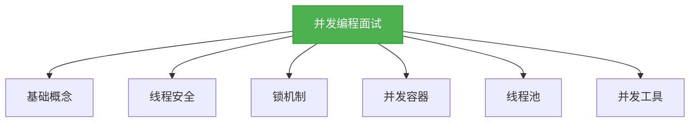
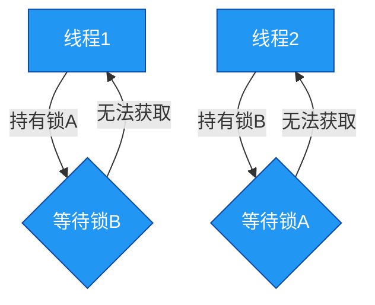

# 面试专题：并发编程

## 概述
本章节汇总了Java并发编程艺术中常见的面试问题及解答，涵盖了并发基础、线程安全、锁机制、并发容器、线程池等核心知识点。这些问题不仅有助于面试准备，也能帮助开发者梳理并发编程的知识体系，加深对并发原理的理解。



## 知识要点
### 1. 并发基础概念
#### 1.1 什么是线程和进程？它们的区别是什么？
线程是进程的一个执行单元，是操作系统调度的基本单位。进程是程序的一次执行过程，是系统进行资源分配和调度的一个独立单位。

区别：
- 进程是资源分配的基本单位，线程是调度的基本单位
- 进程有自己的内存空间，线程共享进程的内存空间
- 进程间通信需要借助操作系统，线程间通信可以直接共享内存
- 进程的创建和销毁成本高，线程的创建和销毁成本低

#### 1.2 什么是并发和并行？
并发是指多个任务在同一时间段内交替执行，看起来像是同时进行；并行是指多个任务在同一时间点同时执行。

```java
// 并发示例：两个线程交替执行
Thread t1 = new Thread(() -> {
    for (int i = 0; i < 100; i++) {
        System.out.println("Thread 1: " + i);
    }
});

Thread t2 = new Thread(() -> {
    for (int i = 0; i < 100; i++) {
        System.out.println("Thread 2: " + i);
    }
});

t1.start();
t2.start();
```

### 2. 线程安全
#### 2.1 什么是线程安全？如何实现线程安全？
线程安全是指多个线程同时访问一个共享资源时，不会导致数据不一致或其他异常情况。实现线程安全的方式包括：

- 使用 synchronized 关键字
- 使用 ReentrantLock 等显式锁
- 使用 volatile 关键字
- 使用并发容器
- 使用原子类

```java
// 使用 synchronized 实现线程安全
public class Counter {
    private int count = 0;

    public synchronized void increment() {
        count++;
    }

    public synchronized int getCount() {
        return count;
    }
}
```

#### 2.2 什么是原子操作？Java 中的原子类有哪些？
原子操作是指不可被中断的操作，要么全部执行完成，要么全部不执行。Java 中的原子类包括 AtomicInteger、AtomicLong、AtomicBoolean 等。

```java
// 使用 AtomicInteger 实现线程安全的计数
AtomicInteger atomicCount = new AtomicInteger(0);

// 原子递增
atomicCount.incrementAndGet();

// 原子获取
int currentCount = atomicCount.get();
```

### 3. 锁机制
#### 3.1 什么是死锁？如何避免死锁？
死锁是指两个或多个线程互相持有对方需要的锁，导致它们都无法继续执行的情况。避免死锁的方法包括：

- 按顺序获取锁
- 超时释放锁
- 使用 Lock 而不是 synchronized
- 减少锁的持有时间



#### 3.2 synchronized 和 ReentrantLock 的区别是什么？
- synchronized 是关键字，ReentrantLock 是类
- ReentrantLock 可以实现公平锁，synchronized 只能是非公平锁
- ReentrantLock 可以设置超时，synchronized 不能
- ReentrantLock 可以中断，synchronized 不能
- ReentrantLock 可以使用 Condition 实现更精细的线程协作

```java
// 使用 ReentrantLock
ReentrantLock lock = new ReentrantLock();

lock.lock();
try {
    // 临界区代码
} finally {
    lock.unlock();
}
```

### 4. 并发容器
#### 4.1 并发容器和普通容器的区别是什么？
并发容器是线程安全的，可以被多个线程同时访问；普通容器不是线程安全的，需要额外的同步措施。

#### 4.2 Java 中的并发容器有哪些？
- ConcurrentHashMap：线程安全的 HashMap
- CopyOnWriteArrayList：线程安全的 ArrayList，适合读多写少的场景
- ConcurrentLinkedQueue：线程安全的队列
- BlockingQueue：阻塞队列，支持线程间的协作

```java
// 使用 ConcurrentHashMap
ConcurrentHashMap<String, Integer> map = new ConcurrentHashMap<>();

// 线程安全的操作
map.put("key", 1);
map.get("key");
```

### 5. 线程池
#### 5.1 为什么要使用线程池？
- 减少线程的创建和销毁成本
- 控制线程的数量，避免资源耗尽
- 提高线程的复用率
- 提供任务排队和管理的机制

#### 5.2 Java 中的线程池有哪些类型？
- FixedThreadPool：固定大小的线程池
- CachedThreadPool：可缓存的线程池
- ScheduledThreadPool：支持定时和周期性任务的线程池
- SingleThreadExecutor：单线程的线程池

```java
// 创建固定大小的线程池
ExecutorService executor = Executors.newFixedThreadPool(5);

// 提交任务
executor.submit(() -> {
    // 任务代码
});

// 关闭线程池
executor.shutdown();
```

## 知识扩展
### 设计思想
并发编程的核心设计思想是在保证线程安全的前提下，提高程序的执行效率和吞吐量。这需要开发者平衡线程安全和性能之间的关系，避免过度同步导致的性能问题，同时也要确保程序的正确性。

### 避坑指南
1. **避免过度同步**：只在必要的代码段上加锁，减少锁的持有时间
2. **避免使用全局锁**：尽量使用细粒度的锁，提高并发性能
3. **注意可见性问题**：使用 volatile 或其他机制确保变量的可见性
4. **避免线程局部变量泄漏**：及时清理 ThreadLocal 变量
5. **注意线程池的配置**：根据实际需求选择合适的线程池类型和大小

### 深度思考题
**思考题**：什么是ABA问题？如何解决ABA问题？

** 思考题回答**：
ABA问题是指在并发环境中，线程A读取了一个值为A的变量，线程B将该变量的值从A修改为B，然后又从B修改回A，线程A无法察觉这个变化。ABA问题会导致线程A做出错误的判断。

解决ABA问题的方法包括：
- 使用 AtomicStampedReference 类，它可以记录变量的版本号
- 使用 AtomicMarkableReference 类，它可以标记变量是否被修改过

例如，使用 AtomicStampedReference：
```java
AtomicStampedReference<Integer> ref = new AtomicStampedReference<>(1, 0);

// 获取当前值和版本号
int currentValue = ref.getReference();
int currentStamp = ref.getStamp();

// 尝试更新，只有当值和版本号都匹配时才会成功
ref.compareAndSet(currentValue, 2, currentStamp, currentStamp + 1);
```

** 思考题**：什么是虚假唤醒？如何避免虚假唤醒？

** 思考题回答**：
虚假唤醒是指线程在没有被其他线程显式通知的情况下，从等待状态中苏醒过来。虚假唤醒可能是由于操作系统的调度原因或者其他线程的中断导致的。

避免虚假唤醒的方法是在条件判断中使用循环而不是if语句，这样即使线程被虚假唤醒，也会重新检查条件，如果条件不满足，就会继续等待。

例如：
```java
synchronized (obj) {
    while (!condition) {
        obj.wait();
    }
    // 执行代码
}
```

通过这种方式，即使线程被虚假唤醒，也会重新检查条件，确保只有在条件满足的情况下才会继续执行。