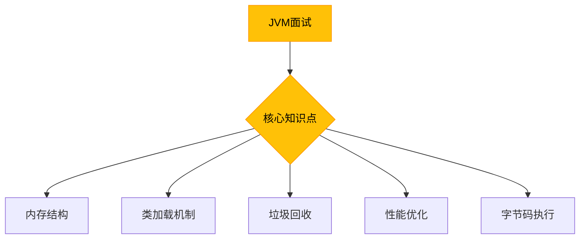
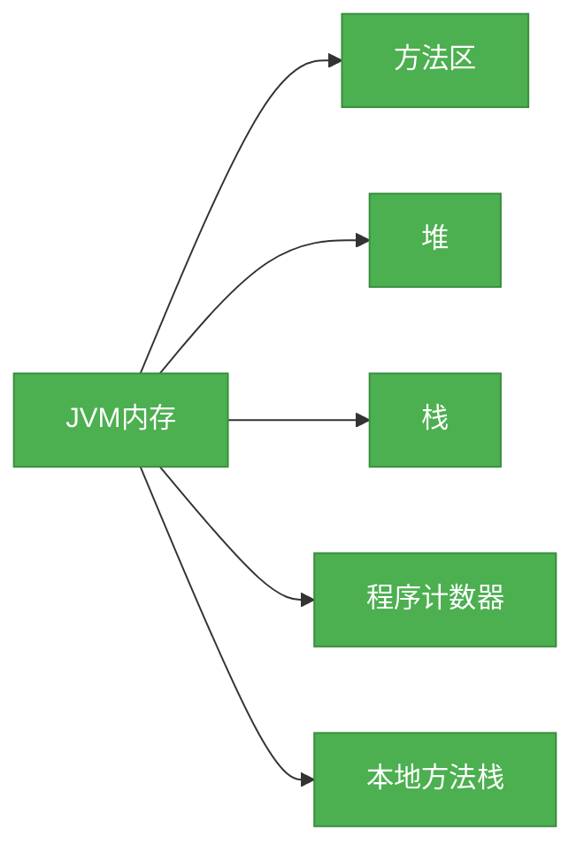

# 面试专题：JVM原理

## 概述

JVM（Java虚拟机）是Java语言的核心组件之一，它负责将Java字节码转换为机器码并执行。本专题将系统梳理面试中常见的JVM原理问题，涵盖内存结构、类加载机制、垃圾回收、性能优化等核心知识点。



## 知识要点

### 1. 内存结构

JVM内存结构主要包括以下几个部分：



#### 堆

堆是JVM中最大的内存区域，用于存储对象实例和数组。堆可以分为新生代和老年代：

```java
public class HeapDemo {
    public static void main(String[] args) {
        // 创建对象，存储在堆中
        Object obj = new Object();
        // 创建数组，存储在堆中
        int[] arr = new int[10];
    }
}
```

#### 栈

栈用于存储方法执行时的局部变量、操作数栈、动态链接和方法返回地址。每个线程都有自己的栈：

```java
public class StackDemo {
    public static void main(String[] args) {
        // 局部变量，存储在栈中
        int a = 10;
        // 调用方法，会创建新的栈帧
        method();
    }

    public static void method() {
        int b = 20;
    }
}
```

### 2. 类加载机制

类加载过程包括加载、链接（验证、准备、解析）和初始化三个阶段：


#### 类加载器

Java提供了三层类加载器：

```java
public class ClassLoaderDemo {
    public static void main(String[] args) {
        // 获取系统类加载器
        ClassLoader systemClassLoader = ClassLoader.getSystemClassLoader();
        System.out.println("系统类加载器: " + systemClassLoader);

        // 获取扩展类加载器
        ClassLoader extensionClassLoader = systemClassLoader.getParent();
        System.out.println("扩展类加载器: " + extensionClassLoader);

        // 获取引导类加载器
        ClassLoader bootstrapClassLoader = extensionClassLoader.getParent();
        System.out.println("引导类加载器: " + bootstrapClassLoader);
    }
}
```

### 3. 垃圾回收

垃圾回收是JVM的重要功能，用于回收不再使用的对象内存。

#### 垃圾判断算法

- 引用计数法：通过计算对象的引用数量来判断对象是否可达
- 可达性分析：通过从GC Roots出发，判断对象是否可达

#### 垃圾回收算法

- 标记-清除算法：标记需要回收的对象，然后清除
- 复制算法：将内存分为两半，只使用其中一半，当这一半满时，将存活对象复制到另一半
- 标记-整理算法：标记存活对象，然后将存活对象向一端移动

```java
public class GCDemo {
    public static void main(String[] args) {
        // 创建大量对象，触发垃圾回收
        for (int i = 0; i < 10000; i++) {
            Object obj = new Object();
        }
    }
}
```

### 4. 性能优化

JVM性能优化主要包括以下几个方面：

- 内存分配优化：调整堆大小、新生代和老年代的比例
- 垃圾回收器选择：根据应用特点选择合适的垃圾回收器
- 代码优化：避免创建过多的对象、减少对象的存活时间

```java
public class PerformanceDemo {
    // 避免频繁创建对象
    private static final String CONSTANT = "constant";

    public static void main(String[] args) {
        // 使用StringBuilder而不是String拼接
        StringBuilder sb = new StringBuilder();
        for (int i = 0; i < 1000; i++) {
            sb.append(i);
        }
        String result = sb.toString();
    }
}
```

## 知识扩展

### 设计思想

JVM的设计遵循以下原则：
1. **平台无关性**：通过字节码实现一次编写，到处运行
2. **内存管理**：自动管理内存，减少内存泄漏的风险
3. **安全性**：通过类加载机制和字节码验证确保代码安全
4. **性能优化**：通过即时编译等技术提高代码执行效率

### 避坑指南

1. **避免内存泄漏**：注意关闭资源，避免长生命周期的对象持有短生命周期对象的引用
2. **避免栈溢出**：避免递归调用过深，或者方法内部创建过大的局部变量
3. **避免内存溢出**：合理设置堆大小，避免创建过多的大对象
4. **选择合适的垃圾回收器**：根据应用特点选择合适的垃圾回收器，如吞吐量优先或响应时间优先

### 深度思考题

**思考题：**
什么是类加载的双亲委派机制？它有什么优缺点？

** 思考题回答：**
双亲委派机制是指当一个类加载器收到类加载请求时，它首先将请求委托给父类加载器，只有当父类加载器无法加载该类时，才由自己加载。

优点：
1. 避免类的重复加载
2. 确保Java核心库的安全

缺点：
1. 父类加载器无法访问子类加载器加载的类
2. 灵活性不足，无法实现一些特殊的类加载需求

**思考题:**
什么是内存溢出和栈溢出？它们有什么区别？

** 思考题回答：**
内存溢出是指堆内存不足，无法创建新的对象；栈溢出是指栈空间不足，通常是由于递归调用过深或方法内部创建过大的局部变量导致的。

区别：
1. 发生的内存区域不同：内存溢出发生在堆中，栈溢出发生在栈中
2. 原因不同：内存溢出通常是由于创建过多的对象或堆大小设置过小导致的；栈溢出通常是由于递归调用过深或方法内部创建过大的局部变量导致的
3. 表现不同：内存溢出会抛出OutOfMemoryError异常；栈溢出会抛出StackOverflowError异常