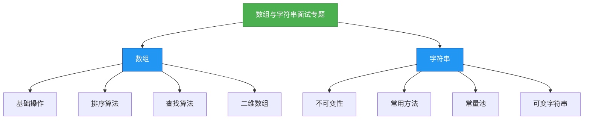

# 面试专题：数组与字符串

## 概述
数组与字符串是Java面试中的基础重点内容，涉及内存管理、算法实现和性能优化等多个方面。以下是数组与字符串相关的知识体系：



## 知识要点

### 一、数组经典面试题

#### 1. 数组的初始化与遍历
**问题**：如何初始化一个int数组并进行遍历？比较不同遍历方式的优缺点。

**解答**：
Java中数组初始化有三种方式，遍历方式包括for循环、增强for循环和Arrays.stream()。

```java
import java.util.Arrays;

public class ArrayInitializationExample {
    public static void main(String[] args) {
        // 1. 静态初始化
        int[] arr1 = {1, 2, 3, 4, 5};
        
        // 2. 动态初始化
        int[] arr2 = new int[5];
        for (int i = 0; i < arr2.length; i++) {
            arr2[i] = i + 1;
        }
        
        // 3. 数组工具类初始化
        int[] arr3 = new int[5];
        Arrays.fill(arr3, 0);
        
        // 遍历方式1：普通for循环
        System.out.println("普通for循环遍历：");
        for (int i = 0; i < arr1.length; i++) {
            System.out.print(arr1[i] + " ");
        }
        
        // 遍历方式2：增强for循环
        System.out.println("\n增强for循环遍历：");
        for (int num : arr2) {
            System.out.print(num + " ");
        }
        
        // 遍历方式3：Stream API
        System.out.println("\nStream API遍历：");
        Arrays.stream(arr3).forEach(num -> System.out.print(num + " "));
    }
}
```

**关键要点**：
- 普通for循环可以获取索引，适用于需要修改数组元素的场景
- 增强for循环代码简洁，但无法获取索引
- Stream API适合进行复杂的数据处理和转换

#### 2. 数组排序与查找
**问题**：实现数组的冒泡排序，并使用二分查找法查找指定元素。

**解答**：

```java
public class ArraySortAndSearch {
    /**
     * 冒泡排序算法
     * @param arr 待排序数组
     */
    public static void bubbleSort(int[] arr) {
        if (arr == null || arr.length <= 1) {
            return;
        }
        
        for (int i = 0; i < arr.length - 1; i++) {
            boolean swapped = false;
            for (int j = 0; j < arr.length - 1 - i; j++) {
                if (arr[j] > arr[j + 1]) {
                    // 交换元素
                    int temp = arr[j];
                    arr[j] = arr[j + 1];
                    arr[j + 1] = temp;
                    swapped = true;
                }
            }
            // 如果没有交换，说明数组已经有序
            if (!swapped) {
                break;
            }
        }
    }
    
    /**
     * 二分查找算法
     * @param arr 已排序数组
     * @param target 目标元素
     * @return 目标元素索引，未找到返回-1
     */
    public static int binarySearch(int[] arr, int target) {
        if (arr == null || arr.length == 0) {
            return -1;
        }
        
        int left = 0;
        int right = arr.length - 1;
        
        while (left <= right) {
            int mid = left + (right - left) / 2; // 避免溢出
            if (arr[mid] == target) {
                return mid;
            } else if (arr[mid] < target) {
                left = mid + 1;
            } else {
                right = mid - 1;
            }
        }
        return -1;
    }
    
    public static void main(String[] args) {
        int[] arr = {5, 2, 9, 3, 7};
        bubbleSort(arr);
        System.out.println("排序后数组：");
        for (int num : arr) {
            System.out.print(num + " ");
        }
        
        int target = 7;
        int index = binarySearch(arr, target);
        System.out.println("\n元素" + target + "的索引：" + index);
    }
}
```

**关键要点**：
- 冒泡排序时间复杂度O(n²)，空间复杂度O(1)
- 二分查找仅适用于有序数组，时间复杂度O(log n)
- 计算中间索引时使用`left + (right - left) / 2`避免整数溢出

#### 3. 二维数组的螺旋遍历
**问题**：如何顺时针螺旋遍历一个二维数组？

**解答**：

```java
import java.util.ArrayList;
import java.util.List;

public class SpiralMatrix {
    /**
     * 顺时针螺旋遍历二维数组
     * @param matrix 二维数组
     * @return 遍历结果列表
     */
    public static List<Integer> spiralOrder(int[][] matrix) {
        List<Integer> result = new ArrayList<>();
        if (matrix == null || matrix.length == 0 || matrix[0].length == 0) {
            return result;
        }
        
        int top = 0;
        int bottom = matrix.length - 1;
        int left = 0;
        int right = matrix[0].length - 1;
        
        while (top <= bottom && left <= right) {
            // 从左到右遍历上边界
            for (int i = left; i <= right; i++) {
                result.add(matrix[top][i]);
            }
            top++;
            
            // 从上到下遍历右边界
            for (int i = top; i <= bottom; i++) {
                result.add(matrix[i][right]);
            }
            right--;
            
            // 从右到左遍历下边界（需要检查是否还有行）
            if (top <= bottom) {
                for (int i = right; i >= left; i--) {
                    result.add(matrix[bottom][i]);
                }
                bottom--;
            }
            
            // 从下到上遍历左边界（需要检查是否还有列）
            if (left <= right) {
                for (int i = bottom; i >= top; i--) {
                    result.add(matrix[i][left]);
                }
                left++;
            }
        }
        return result;
    }
    
    public static void main(String[] args) {
        int[][] matrix = {
            {1, 2, 3},
            {4, 5, 6},
            {7, 8, 9}
        };
        
        List<Integer> result = spiralOrder(matrix);
        System.out.println("螺旋遍历结果：" + result);
    }
}
```

**关键要点**：
- 使用四个边界变量控制遍历范围
- 每完成一行或一列遍历后，调整相应的边界
- 注意处理单行或单列的特殊情况

### 二、字符串经典面试题

#### 1. 字符串反转
**问题**：实现字符串反转的几种方式，并比较它们的性能。

**解答**：

```java
public class StringReverse {
    /**
     * 使用字符数组反转
     * @param str 输入字符串
     * @return 反转后的字符串
     */
    public static String reverseWithCharArray(String str) {
        if (str == null || str.isEmpty()) {
            return str;
        }
        
        char[] chars = str.toCharArray();
        int left = 0;
        int right = chars.length - 1;
        
        while (left < right) {
            // 交换字符
            char temp = chars[left];
            chars[left] = chars[right];
            chars[right] = temp;
            
            left++;
            right--;
        }
        return new String(chars);
    }
    
    /**
     * 使用StringBuilder反转
     * @param str 输入字符串
     * @return 反转后的字符串
     */
    public static String reverseWithStringBuilder(String str) {
        if (str == null || str.isEmpty()) {
            return str;
        }
        return new StringBuilder(str).reverse().toString();
    }
    
    /**
     * 使用递归反转
     * @param str 输入字符串
     * @return 反转后的字符串
     */
    public static String reverseWithRecursion(String str) {
        if (str == null || str.length() <= 1) {
            return str;
        }
        return reverseWithRecursion(str.substring(1)) + str.charAt(0);
    }
    
    public static void main(String[] args) {
        String str = "Hello World";
        System.out.println("字符数组反转：" + reverseWithCharArray(str));
        System.out.println("StringBuilder反转：" + reverseWithStringBuilder(str));
        System.out.println("递归反转：" + reverseWithRecursion(str));
    }
}
```

**性能比较**：
- 字符数组方式：效率最高，时间复杂度O(n)，空间复杂度O(n)
- StringBuilder方式：简洁高效，内部也是使用字符数组实现
- 递归方式：代码简洁但效率最低，存在栈溢出风险，不适合长字符串

#### 2. 判断字符串是否为回文
**问题**：判断一个字符串是否为回文（正读和反读都一样），忽略大小写和非字母字符。

**解答**：

```java
public class PalindromeChecker {
    /**
     * 判断字符串是否为回文
     * @param s 输入字符串
     * @return 是否为回文
     */
    public static boolean isPalindrome(String s) {
        if (s == null || s.isEmpty()) {
            return true;
        }
        
        int left = 0;
        int right = s.length() - 1;
        
        while (left < right) {
            // 找到左侧第一个字母或数字
            while (left < right && !Character.isLetterOrDigit(s.charAt(left))) {
                left++;
            }
            
            // 找到右侧第一个字母或数字
            while (left < right && !Character.isLetterOrDigit(s.charAt(right))) {
                right--;
            }
            
            // 比较字符（忽略大小写）
            if (Character.toLowerCase(s.charAt(left)) != Character.toLowerCase(s.charAt(right))) {
                return false;
            }
            
            left++;
            right--;
        }
        return true;
    }
    
    public static void main(String[] args) {
        String s1 = "A man, a plan, a canal: Panama";
        String s2 = "race a car";
        
        System.out.println("s1是否为回文：" + isPalindrome(s1)); // true
        System.out.println("s2是否为回文：" + isPalindrome(s2)); // false
    }
}
```

**关键要点**：
- 使用双指针从两端向中间遍历
- 跳过非字母数字字符
- 统一转换为小写（或大写）进行比较

#### 3. 字符串中的第一个唯一字符
**问题**：找到字符串中第一个不重复的字符，并返回其索引。如果不存在，则返回-1。

**解答**：

```java
public class FirstUniqueChar {
    /**
     * 找到字符串中第一个不重复的字符
     * @param s 输入字符串
     * @return 第一个不重复字符的索引，不存在返回-1
     */
    public static int firstUniqChar(String s) {
        if (s == null || s.isEmpty()) {
            return -1;
        }
        
        // 存储字符出现的次数
        int[] count = new int[26];
        
        // 第一次遍历：统计每个字符出现的次数
        for (int i = 0; i < s.length(); i++) {
            char c = s.charAt(i);
            count[c - 'a']++;
        }
        
        // 第二次遍历：找到第一个出现次数为1的字符
        for (int i = 0; i < s.length(); i++) {
            char c = s.charAt(i);
            if (count[c - 'a'] == 1) {
                return i;
            }
        }
        return -1;
    }
    
    public static void main(String[] args) {
        String s1 = "leetcode";
        String s2 = "loveleetcode";
        
        System.out.println("s1第一个唯一字符索引：" + firstUniqChar(s1)); // 0
        System.out.println("s2第一个唯一字符索引：" + firstUniqChar(s2)); // 2
    }
}
```

**关键要点**：
- 使用数组作为哈希表，存储每个字符的出现次数
- 时间复杂度O(n)，空间复杂度O(1)（因为字符集大小固定）
- 两次遍历：第一次统计，第二次查找

## 知识扩展

### 设计思想
1. **数组设计思想**：
   - 数组是一种线性数据结构，使用连续的内存空间存储相同类型的数据
   - 随机访问时间复杂度为O(1)，插入和删除时间复杂度为O(n)
   - Java中的数组是定长的，一旦创建无法改变大小

2. **字符串设计思想**：
   - String类被设计为不可变的，保证了线程安全和哈希值的缓存效率
   - 字符串常量池减少了内存开销，实现了字符串的复用
   - StringBuilder和StringBuffer用于处理可变字符串，分别适用于单线程和多线程环境

### 避坑指南
1. **数组常见问题**：
   - 数组下标越界异常（ArrayIndexOutOfBoundsException）
   - 空指针异常（NullPointerException）
   - 数组复制时的浅拷贝问题
   - 二维数组中各行长度可以不同的特性

2. **字符串常见问题**：
   - 使用"=="比较字符串内容（应使用equals()方法）
   - 频繁字符串拼接导致的性能问题（应使用StringBuilder）
   - 忽略String.intern()方法的使用场景
   - 字符串常量池的工作原理理解不清

### 深度思考题
**思考题1**：如何在不使用额外空间的情况下，判断一个数组中是否存在重复元素？

**思考题回答**：
可以先对数组进行排序（时间复杂度O(n log n)），然后遍历数组，比较相邻元素是否相等。如果存在相等的相邻元素，则说明有重复元素。

```java
public static boolean containsDuplicate(int[] nums) {
    Arrays.sort(nums);
    for (int i = 0; i < nums.length - 1; i++) {
        if (nums[i] == nums[i + 1]) {
            return true;
        }
    }
    return false;
}
```

**思考题2**：如何判断两个字符串是否互为变位词（Anagram）？

**思考题回答**：
变位词是指两个字符串包含相同的字符，但顺序不同。可以通过以下步骤判断：
1. 检查两个字符串长度是否相同
2. 使用数组统计每个字符出现的次数
3. 比较两个数组是否相同

```java
public static boolean isAnagram(String s, String t) {
    if (s.length() != t.length()) {
        return false;
    }
    
    int[] count = new int[26];
    for (int i = 0; i < s.length(); i++) {
        count[s.charAt(i) - 'a']++;
        count[t.charAt(i) - 'a']--;
    }
    
    for (int num : count) {
        if (num != 0) {
            return false;
        }
    }
    return true;
}
```

**思考题3**：如何找到两个字符串的最长公共前缀？

**思考题回答**：
可以以第一个字符串为基准，依次与其他字符串比较对应位置的字符，直到找到不匹配的字符或到达某个字符串的末尾。

```java
public static String longestCommonPrefix(String[] strs) {
    if (strs == null || strs.length == 0) {
        return "";
    }
    
    String prefix = strs[0];
    for (int i = 1; i < strs.length; i++) {
        while (strs[i].indexOf(prefix) != 0) {
            prefix = prefix.substring(0, prefix.length() - 1);
            if (prefix.isEmpty()) {
                return "";
            }
        }
    }
    return prefix;
}
```