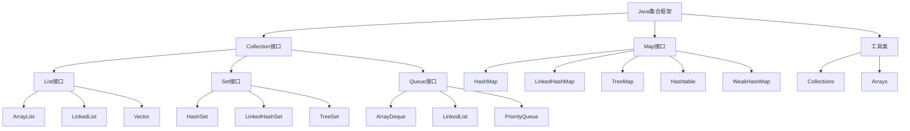
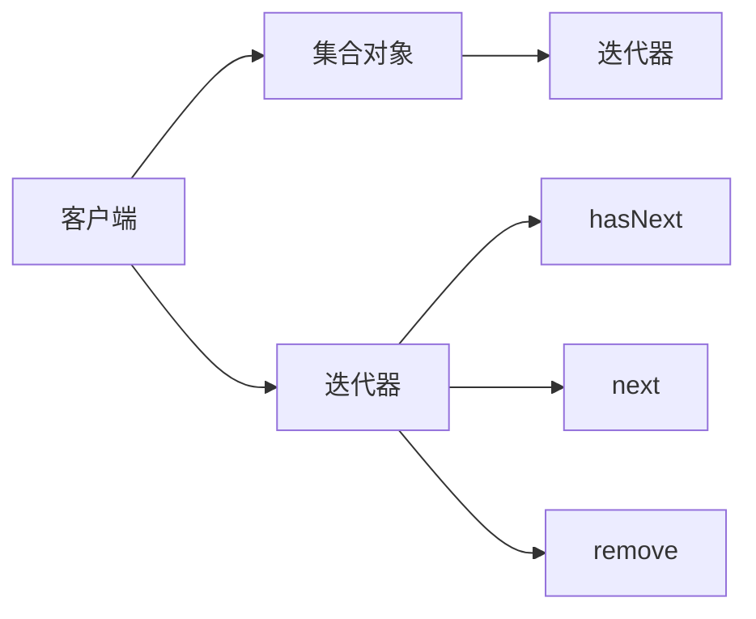
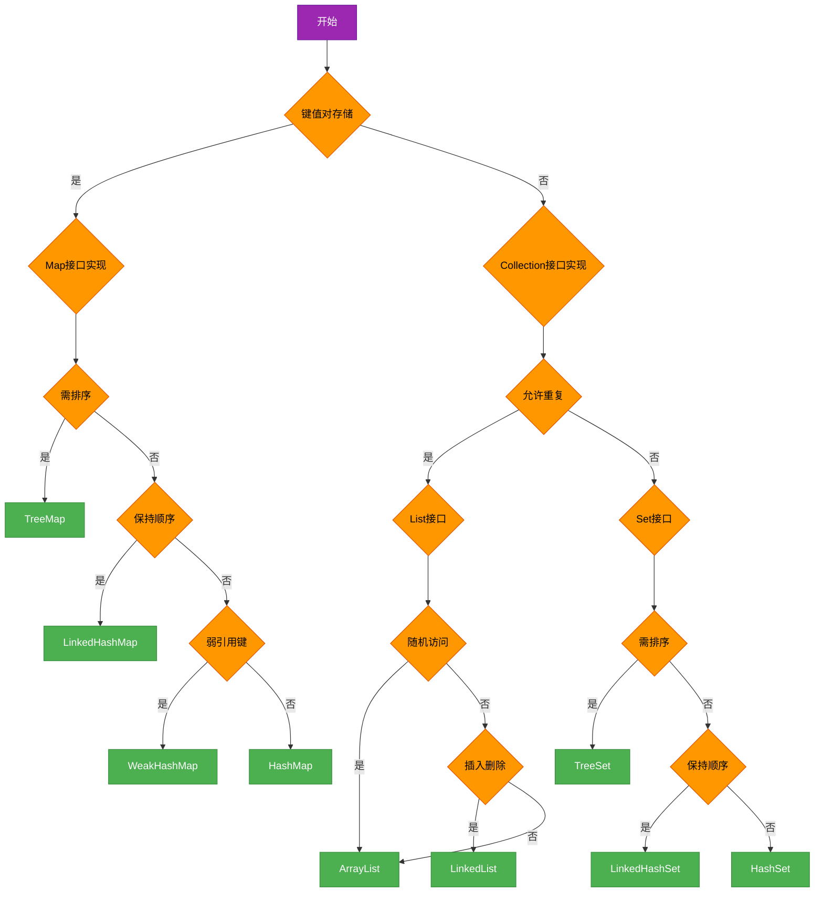

# 面试专题：集合框架

## 核心理论
### 1.1 集合框架体系结构
Java集合框架主要分为三大体系：Collection、Map和工具类。Collection接口下有List、Set和Queue三大分支，Map接口则提供键值对存储能力。



### 1.2 集合框架核心接口对比
| 接口 | 特点 | 实现类 | 线程安全 |
|------|------|--------|----------|
| List | 有序可重复 | ArrayList, LinkedList, Vector | Vector是，其余否 |
| Set | 无序不可重复 | HashSet, TreeSet, LinkedHashSet | 均否 |
| Queue | 先进先出 | ArrayDeque, LinkedList, PriorityQueue | 均否 |
| Map | 键值对映射 | HashMap, TreeMap, LinkedHashMap | Hashtable是，其余否 |

### 1.3 面试高频考点分类
1. **基础概念题**：集合体系结构、实现原理、特性对比
2. **源码分析题**：HashMap、ConcurrentHashMap、ArrayList等实现细节
3. **算法设计题**：基于集合的算法实现与优化
4. **性能分析题**：时间/空间复杂度分析、性能优化策略
5. **并发编程题**：线程安全集合、并发修改异常处理

## 代码实践
### 2.1 集合初始化与遍历方式
#### 2.1.1 常见集合初始化
```java
/**
 * 集合初始化方式对比
 * JDK 8及以上版本特性
 */
public class CollectionInitialization {
    public static void main(String[] args) {
        // 1. 传统初始化方式
        List<String> list1 = new ArrayList<>();
        list1.add("Java");
        list1.add("Python");
        list1.add("C++");

        // 2. 双括号初始化（匿名内部类，存在内存泄漏风险）
        List<String> list2 = new ArrayList<String>() {{
            add("Java");
            add("Python");
            add("C++");
        }};

        // 3. JDK 8 Stream API初始化
        List<String> list3 = Stream.of("Java", "Python", "C++").collect(Collectors.toList());

        // 4. JDK 9+ of()方法（不可变集合）
        List<String> list4 = List.of("Java", "Python", "C++");
        Set<String> set1 = Set.of("Java", "Python", "C++");
        Map<String, Integer> map1 = Map.of("Java", 1, "Python", 2, "C++", 3);

        // 5. Guava库初始化（需引入第三方依赖）
        List<String> list5 = Lists.newArrayList("Java", "Python", "C++");
        Set<String> set2 = Sets.newHashSet("Java", "Python", "C++");
        Map<String, Integer> map2 = Maps.newHashMap();
    }
}
```

#### 2.1.2 集合遍历方式性能对比
```java
/**
 * 集合遍历方式及性能分析
 * 结论：ArrayList下标遍历最快，LinkedList迭代器遍历最快
 */
public class CollectionTraversal {
    public static void main(String[] args) {
        List<String> arrayList = new ArrayList<>();
        List<String> linkedList = new LinkedList<>();

        // 添加测试数据
        for (int i = 0; i < 100000; i++) {
            arrayList.add("element" + i);
            linkedList.add("element" + i);
        }

        // ArrayList遍历方式
        long start = System.currentTimeMillis();
        // 1. 下标遍历
        for (int i = 0; i < arrayList.size(); i++) {
            String element = arrayList.get(i);
        }
        System.out.println("ArrayList下标遍历: " + (System.currentTimeMillis() - start) + "ms");

        // 2. 增强for循环
        start = System.currentTimeMillis();
        for (String element : arrayList) {
            // do nothing
        }
        System.out.println("ArrayList增强for循环: " + (System.currentTimeMillis() - start) + "ms");

        // 3. 迭代器遍历
        start = System.currentTimeMillis();
        Iterator<String> iterator = arrayList.iterator();
        while (iterator.hasNext()) {
            String element = iterator.next();
        }
        System.out.println("ArrayList迭代器遍历: " + (System.currentTimeMillis() - start) + "ms");

        // LinkedList遍历方式（测试略，结论：迭代器遍历性能最优）
    }
}
```

### 2.2 高频面试题实现
#### 2.2.1 HashMap手写实现（简化版）
```java
/**
 * 简化版HashMap实现
 * 包含put、get核心方法，拉链法解决哈希冲突
 */
public class SimpleHashMap<K, V> {
    // 默认初始容量
    private static final int DEFAULT_CAPACITY = 16;
    // 负载因子
    private static final float LOAD_FACTOR = 0.75f;
    // 数组（桶）
    private Entry<K, V>[] table;
    // 元素数量
    private int size;

    @SuppressWarnings("unchecked")
    public SimpleHashMap() {
        table = new Entry[DEFAULT_CAPACITY];
        size = 0;
    }

    /**
     * 哈希函数：计算键的哈希值并映射到数组索引
     */
    private int hash(K key) {
        return key == null ? 0 : Math.abs(key.hashCode()) % table.length;
    }

    /**
     * 添加键值对
     */
    public void put(K key, V value) {
        // 计算哈希值和索引
        int index = hash(key);
        // 遍历链表查找是否存在相同key
        Entry<K, V> entry = table[index];
        while (entry != null) {
            if ((key == null && entry.key == null) || (key != null && key.equals(entry.key))) {
                // 键存在，更新值
                entry.value = value;
                return;
            }
            entry = entry.next;
        }
        // 键不存在，添加新节点（头插法）
        Entry<K, V> newEntry = new Entry<>(key, value, table[index]);
        table[index] = newEntry;
        size++;
        // 检查是否需要扩容
        if (size >= table.length * LOAD_FACTOR) {
            resize();
        }
    }

    /**
     * 获取键对应的值
     */
    public V get(K key) {
        int index = hash(key);
        Entry<K, V> entry = table[index];
        while (entry != null) {
            if ((key == null && entry.key == null) || (key != null && key.equals(entry.key))) {
                return entry.value;
            }
            entry = entry.next;
        }
        return null;
    }

    /**
     * 扩容方法
     */
    @SuppressWarnings("unchecked")
    private void resize() {
        Entry<K, V>[] oldTable = table;
        int newCapacity = oldTable.length * 2;
        Entry<K, V>[] newTable = new Entry[newCapacity];
        // 重新哈希并转移所有元素
        for (int i = 0; i < oldTable.length; i++) {
            Entry<K, V> entry = oldTable[i];
            while (entry != null) {
                Entry<K, V> next = entry.next;
                int newIndex = hash(entry.key);
                entry.next = newTable[newIndex];
                newTable[newIndex] = entry;
                entry = next;
            }
        }
        table = newTable;
    }

    /**
     * 键值对节点类
     */
    static class Entry<K, V> {
        K key;
        V value;
        Entry<K, V> next;

        Entry(K key, V value, Entry<K, V> next) {
            this.key = key;
            this.value = value;
            this.next = next;
        }
    }

    // Getter方法
    public int size() {
        return size;
    }
}
```

#### 2.2.2 集合去重与排序
```java
/**
 * 集合去重与排序综合案例
 */
public class CollectionDeduplicationAndSorting {
    public static void main(String[] args) {
        // 1. 数组去重并排序
        Integer[] numbers = {3, 1, 2, 5, 3, 7, 2, 8, 5};
        // 去重
        Set<Integer> numberSet = new HashSet<>(Arrays.asList(numbers));
        // 排序
        List<Integer> sortedList = new ArrayList<>(numberSet);
        Collections.sort(sortedList);
        System.out.println("去重并排序结果: " + sortedList); // [1, 2, 3, 5, 7, 8]

        // 2. 自定义对象去重与排序
        List<Person> persons = Arrays.asList(
            new Person("Alice", 25),
            new Person("Bob", 30),
            new Person("Alice", 25), // 重复对象
            new Person("Charlie", 20)
        );

        // 去重（需重写Person类的equals和hashCode方法）
        Set<Person> uniquePersons = new HashSet<>(persons);

        // 排序（按年龄升序，年龄相同按姓名升序）
        List<Person> sortedPersons = new ArrayList<>(uniquePersons);
        sortedPersons.sort(Comparator.comparingInt(Person::getAge)
            .thenComparing(Person::getName));

        System.out.println("自定义对象排序结果: " + sortedPersons);
    }

    static class Person {
        private String name;
        private int age;

        public Person(String name, int age) {
            this.name = name;
            this.age = age;
        }

        // Getters
        public String getName() { return name; }
        public int getAge() { return age; }

        // 重写equals和hashCode方法以支持去重
        @Override
        public boolean equals(Object o) {
            if (this == o) return true;
            if (o == null || getClass() != o.getClass()) return false;
            Person person = (Person) o;
            return age == person.age && Objects.equals(name, person.name);
        }

        @Override
        public int hashCode() {
            return Objects.hash(name, age);
        }

        @Override
        public String toString() {
            return name + "(" + age + ")";
        }
    }
}
```

## 设计思想
### 3.1 集合框架设计模式应用
#### 3.1.1 迭代器模式（Iterator）
迭代器模式提供了一种顺序访问集合元素的方法，而无需暴露集合的内部实现。



```java
/**
 * 迭代器模式在集合框架中的应用
 */
public class IteratorPatternDemo {
    public static void main(String[] args) {
        List<String> list = new ArrayList<>(Arrays.asList("A", "B", "C"));
        Set<String> set = new HashSet<>(Arrays.asList("X", "Y", "Z"));

        // 使用迭代器遍历集合
        iterateCollection(list.iterator());
        iterateCollection(set.iterator());
    }

    /**
     * 通用迭代器遍历方法
     * 体现了迭代器模式的多态性
     */
    private static void iterateCollection(Iterator<?> iterator) {
        while (iterator.hasNext()) {
            System.out.println(iterator.next());
        }
    }
}
```

#### 3.1.2 装饰器模式（Decorator）
装饰器模式允许向一个现有对象添加新的功能，同时又不改变其结构。Collections工具类中的synchronizedXXX方法就是典型应用。

```java
/**
 * 装饰器模式在集合框架中的应用
 * 通过Collections.synchronizedList实现线程安全集合
 */
public class DecoratorPatternDemo {
    public static void main(String[] args) {
        // 创建普通ArrayList
        List<String> unsafeList = new ArrayList<>();
        // 使用装饰器模式包装为线程安全集合
        List<String> safeList = Collections.synchronizedList(unsafeList);

        // 多线程操作安全集合
        ExecutorService executor = Executors.newFixedThreadPool(5);
        for (int i = 0; i < 1000; i++) {
            int index = i;
            executor.submit(() -> safeList.add("element" + index));
        }
        executor.shutdown();
        try {
            executor.awaitTermination(1, TimeUnit.SECONDS);
        } catch (InterruptedException e) {
            e.printStackTrace();
        }
        System.out.println("安全集合大小: " + safeList.size()); // 应该为1000
    }
}
```

### 3.2 集合选择策略
在实际开发和面试中，选择合适的集合类型至关重要，需考虑以下因素：



## 避坑指南
### 4.1 集合使用常见错误
#### 4.1.1 ConcurrentModificationException异常
当使用增强for循环遍历集合的同时修改集合结构（添加/删除元素）时，会抛出此异常。

```java
/**
 * ConcurrentModificationException异常演示与解决方案
 */
public class ConcurrentModificationDemo {
    public static void main(String[] args) {
        List<String> list = new ArrayList<>(Arrays.asList("A", "B", "C", "D"));

        // 错误示例：增强for循环中删除元素
        try {
            for (String element : list) {
                if (element.equals("B")) {
                    list.remove(element); // 会抛出ConcurrentModificationException
                }
            }
        } catch (ConcurrentModificationException e) {
            System.out.println("捕获异常: " + e.getMessage());
        }

        // 正确解决方案1：使用迭代器
        Iterator<String> iterator = list.iterator();
        while (iterator.hasNext()) {
            String element = iterator.next();
            if (element.equals("B")) {
                iterator.remove(); // 使用迭代器的remove方法
            }
        }
        System.out.println("迭代器删除后: " + list);

        // 正确解决方案2：使用Stream API（JDK 8+）
        List<String> newList = list.stream()
            .filter(element -> !element.equals("C"))
            .collect(Collectors.toList());
        System.out.println("Stream过滤后: " + newList);
    }
}
```

#### 4.1.2 集合转换与不可变性问题
```java
/**
 * 集合转换与不可变性问题
 */
public class CollectionImmutabilityDemo {
    public static void main(String[] args) {
        // 问题1：Arrays.asList返回的List不可修改
        List<String> fixedSizeList = Arrays.asList("A", "B", "C");
        try {
            fixedSizeList.add("D"); // 会抛出UnsupportedOperationException
        } catch (UnsupportedOperationException e) {
            System.out.println("Arrays.asList返回的列表不可添加元素");
        }

        // 解决方案：包装为可修改的ArrayList
        List<String> modifiableList = new ArrayList<>(Arrays.asList("A", "B", "C"));
        modifiableList.add("D"); // 正常执行

        // 问题2：JDK 9+ List.of()返回的是不可变集合
        List<String> immutableList = List.of("X", "Y", "Z");
        try {
            immutableList.set(0, "W"); // 会抛出UnsupportedOperationException
        } catch (UnsupportedOperationException e) {
            System.out.println("List.of()返回的列表不可修改");
        }

        // 创建真正不可变的集合
        List<String> trulyImmutableList = Collections.unmodifiableList(new ArrayList<>(Arrays.asList("1", "2", "3")));
        try {
            trulyImmutableList.add("4"); // 会抛出UnsupportedOperationException
        } catch (UnsupportedOperationException e) {
            System.out.println("unmodifiableList返回的列表不可修改");
        }
    }
}
```

### 4.2 性能优化建议
#### 4.2.1 初始容量设置
为集合设置合适的初始容量可以减少扩容次数，提高性能。

```java
/**
 * 集合初始容量优化
 */
public class CollectionCapacityOptimization {
    public static void main(String[] args) {
        // 已知大概元素数量时，指定初始容量
        int expectedSize = 10000;
        
        // ArrayList：初始容量设置为expectedSize，避免多次扩容
        List<String> optimizedList = new ArrayList<>(expectedSize);
        
        // HashMap：初始容量设置为(expectedSize / 0.75f) + 1，避免扩容
        int initialCapacity = (int) (expectedSize / 0.75f) + 1;
        Map<String, Integer> optimizedMap = new HashMap<>(initialCapacity);
    }
}
```

#### 4.2.2 集合工具类使用陷阱
```java
/**
 * 集合工具类使用注意事项
 */
public class CollectionUtilsPitfalls {
    public static void main(String[] args) {
        // 1. Collections.emptyList()返回的是不可变列表
        List<String> emptyList = Collections.emptyList();
        try {
            emptyList.add("A"); // 抛出UnsupportedOperationException
        } catch (UnsupportedOperationException e) {
            System.out.println("emptyList不可修改");
        }

        // 2. Collections.synchronizedList并非绝对线程安全
        List<String> syncList = Collections.synchronizedList(new ArrayList<>());
        // 迭代操作仍需手动加锁
        synchronized (syncList) {
            Iterator<String> iterator = syncList.iterator();
            while (iterator.hasNext()) {
                System.out.println(iterator.next());
            }
        }

        // 3. 使用subList时的注意事项
        List<String> originalList = new ArrayList<>(Arrays.asList("A", "B", "C", "D", "E"));
        List<String> subList = originalList.subList(1, 4); // [B, C, D]
        subList.set(0, "X"); // 修改子列表会影响原列表
        System.out.println(originalList); // [A, X, C, D, E]
        
        originalList.add("F"); // 原列表结构修改后，子列表操作会抛出ConcurrentModificationException
        try {
            System.out.println(subList.size());
        } catch (ConcurrentModificationException e) {
            System.out.println("原列表结构修改后子列表失效");
        }
    }
}
```

## 深度思考题
### 思考题1：HashMap在JDK 7和JDK 8中的实现差异及性能影响

思考题回答：HashMap在JDK 7和JDK 8中的主要实现差异：

1. **数据结构**：
   - JDK 7：数组 + 链表
   - JDK 8：数组 + 链表 + 红黑树（当链表长度超过阈值8时，链表转为红黑树）

2. **哈希计算**：
   - JDK 7：扰动函数进行4次位运算
   - JDK 8：简化为一次位运算（key.hashCode() ^ (key.hashCode() >>> 16)）

3. **扩容机制**：
   - JDK 7：头插法，可能导致多线程环境下的循环链表问题
   - JDK 8：尾插法，解决了循环链表问题

4. **性能影响**：
   - JDK 8在哈希冲突严重时（链表较长）查询性能更优，从O(n)提升到O(log n)
   - JDK 8的哈希计算更高效，减少了位运算次数
   - JDK 8的扩容过程更稳定，避免了头插法可能导致的并发问题

实际应用建议：优先使用JDK 8及以上版本，对于大数据量且哈希冲突可能性高的场景，HashMap性能优势更明显。

### 思考题2：如何实现一个线程安全的HashMap？对比ConcurrentHashMap的实现原理

思考题回答：实现线程安全HashMap的方案及对比：

1. **使用Collections.synchronizedMap**：
   - 原理：对HashMap的所有方法添加synchronized同步锁
   - 优点：实现简单，完全线程安全
   - 缺点：性能差，多线程竞争同一把锁，并发度低

2. **使用ReentrantLock手动加锁**：
   - 原理：在操作HashMap前后手动加锁和解锁
   - 优点：可灵活控制锁粒度
   - 缺点：实现复杂，需手动处理异常和锁释放

3. **ConcurrentHashMap实现**：
   - JDK 7：分段锁（Segment）机制，将HashMap分为多个段，每个段独立加锁
   - JDK 8：CAS + synchronized，锁粒度细化到链表头节点或红黑树的根节点
   - 优点：并发度高，读写性能好，支持部分并发操作
   - 缺点：实现复杂

性能对比：ConcurrentHashMap > ReentrantLock手动加锁 > Collections.synchronizedMap

实际应用建议：优先使用ConcurrentHashMap，在JDK 8及以上版本中，其性能已接近HashMap，同时提供了良好的线程安全性。

### 思考题3：集合框架在JDK 1.8到JDK 21的演进及新特性

思考题回答：JDK 1.8到JDK 21集合框架的主要演进：

1. **JDK 8**：
   - 引入Stream API，支持集合的函数式操作
   - 添加forEach()、removeIf()等默认方法
   - HashMap使用红黑树优化哈希冲突

2. **JDK 9**：
   - 新增不可变集合工厂方法：List.of()、Set.of()、Map.of()
   - 增强Stream API，添加takeWhile()、dropWhile()等方法

3. **JDK 10**：
   - 新增List.copyOf()、Set.copyOf()、Map.copyOf()方法
   - 优化集合的序列化和反序列化

4. **JDK 16**：
   - 引入Stream.toList()方法，返回不可变列表
   - 增强Map接口，添加computeIfAbsent()等方法

5. **JDK 21**：
   - 新增SequencedCollection接口，提供统一的首尾元素操作
   - 增强LinkedList，实现SequencedCollection接口
   - 新增Record集合工厂方法，如List.of(record...)等

演进趋势：
- 不可变集合支持增强
- 函数式编程支持增强
- 接口方法不断丰富
- 性能持续优化
- 并发集合功能增强

实际应用建议：在新项目中优先使用JDK 11及以上LTS版本，充分利用不可变集合和Stream API提升代码质量和性能。