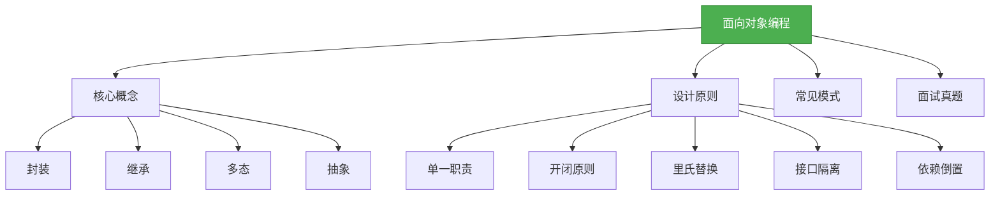

# 面试专题：面向对象

## 概述

面向对象编程（OOP）是Java的核心特性，也是面试中必问的知识点。本章节将系统讲解面向对象的核心概念、设计原则以及常见面试题，帮助你全面掌握面向对象编程的精髓。



## 知识要点

### 1. 核心概念

#### 1.1 封装

封装是将数据和方法组合在一个单元中的机制，它隐藏了对象的内部实现细节，只暴露必要的接口。

```java
public class User {
    // 私有属性，外部无法直接访问
    private String name;
    private int age;

    // 提供公共方法来访问和修改私有属性
    public String getName() {
        return name;
    }

    public void setName(String name) {
        this.name = name;
    }

    public int getAge() {
        return age;
    }

    public void setAge(int age) {
        // 加入验证逻辑
        if (age >= 0 && age <= 150) {
            this.age = age;
        } else {
            throw new IllegalArgumentException("年龄必须在0-150之间");
        }
    }
}
```

#### 1.2 继承

继承允许一个类获取另一个类的属性和方法。被继承的类称为父类，继承的类称为子类。

```java
// 父类
public class Animal {
    public void eat() {
        System.out.println("动物会进食");
    }
}

// 子类
public class Dog extends Animal {
    // 重写父类方法
    @Override
    public void eat() {
        System.out.println("狗吃骨头");
    }

    // 子类特有方法
    public void bark() {
        System.out.println("狗会汪汪叫");
    }
}
```

#### 1.3 多态

多态是指同一个方法可以有不同的实现方式。在Java中，多态通过方法重载和方法重写实现。

```java
// 方法重载 - 同一个类中，方法名相同，参数不同
public class Calculator {
    public int add(int a, int b) {
        return a + b;
    }

    public double add(double a, double b) {
        return a + b;
    }
}

// 方法重写 - 子类重写父类的方法
public class Animal {
    public void move() {
        System.out.println("动物会移动");
    }
}

public class Bird extends Animal {
    @Override
    public void move() {
        System.out.println("鸟会飞");
    }
}
```

#### 1.4 抽象

抽象是指忽略细节，关注本质。在Java中，抽象通过抽象类和接口实现。

```java
// 抽象类
public abstract class Shape {
    // 抽象方法，没有实现
    public abstract double getArea();

    // 具体方法
    public void display() {
        System.out.println("这是一个形状");
    }
}

// 接口
public interface Flyable {
    void fly();
}
```

### 2. 设计原则

#### 2.1 单一职责原则

一个类应该只有一个引起它变化的原因。

```java
// 违反单一职责原则
public class User {
    private String name;
    private int age;

    public void save() {
        // 保存用户到数据库
    }

    public void validate() {
        // 验证用户信息
    }
}

// 遵循单一职责原则
public class User {
    private String name;
    private int age;
    // 只包含用户相关的属性和方法
}

public class UserRepository {
    public void save(User user) {
        // 保存用户到数据库
    }
}

public class UserValidator {
    public boolean validate(User user) {
        // 验证用户信息
        return true;
    }
}
```

#### 2.2 开闭原则

对扩展开放，对修改关闭。

```java
// 违反开闭原则
public class ShapeCalculator {
    public double calculateArea(Shape shape) {
        if (shape instanceof Circle) {
            return Math.PI * ((Circle) shape).getRadius() * ((Circle) shape).getRadius();
        } else if (shape instanceof Rectangle) {
            return ((Rectangle) shape).getWidth() * ((Rectangle) shape).getHeight();
        }
        // 每添加一个新形状，都需要修改这个方法
        return 0;
    }
}

// 遵循开闭原则
public abstract class Shape {
    public abstract double getArea();
}

public class Circle extends Shape {
    private double radius;

    @Override
    public double getArea() {
        return Math.PI * radius * radius;
    }
}

public class Rectangle extends Shape {
    private double width;
    private double height;

    @Override
    public double getArea() {
        return width * height;
    }
}

public class ShapeCalculator {
    public double calculateArea(Shape shape) {
        return shape.getArea();
        // 不需要修改这个方法，只需要扩展新的形状类
    }
}
```

#### 2.3 里氏替换原则

子类可以替换父类，而不会改变程序的正确性。

```java
// 违反里氏替换原则
public class Bird {
    public void fly() {
        System.out.println("鸟会飞");
    }
}

public class Ostrich extends Bird {
    @Override
    public void fly() {
        // 鸵鸟不会飞，违反了里氏替换原则
        throw new UnsupportedOperationException("鸵鸟不会飞");
    }
}

// 遵循里氏替换原则
public class Bird {
    public void move() {
        System.out.println("鸟会移动");
    }
}

public class Ostrich extends Bird {
    @Override
    public void move() {
        System.out.println("鸵鸟会跑");
    }
}
```

#### 2.4 接口隔离原则

客户端不应该被迫实现它不需要的接口。

```java
// 违反接口隔离原则
public interface Animal {
    void eat();
    void fly();
    void swim();
}

public class Dog implements Animal {
    @Override
    public void eat() {
        System.out.println("狗吃骨头");
    }

    @Override
    public void fly() {
        // 狗不会飞，但是被迫实现这个方法
        throw new UnsupportedOperationException();
    }

    @Override
    public void swim() {
        System.out.println("狗会游泳");
    }
}

// 遵循接口隔离原则
public interface Eat {
    void eat();
}

public interface Fly {
    void fly();
}

public interface Swim {
    void swim();
}

public class Dog implements Eat, Swim {
    @Override
    public void eat() {
        System.out.println("狗吃骨头");
    }

    @Override
    public void swim() {
        System.out.println("狗会游泳");
    }
}
```

#### 2.5 依赖倒置原则

高层模块不应该依赖低层模块，它们都应该依赖抽象。

```java
// 违反依赖倒置原则
public class Light {
    public void turnOn() {
        System.out.println("灯打开了");
    }

    public void turnOff() {
        System.out.println("灯关闭了");
    }
}

public class Switch {
    private Light light;

    public Switch(Light light) {
        this.light = light;
    }

    public void operate() {
        light.turnOn();
    }
}

// 遵循依赖倒置原则
public interface Switchable {
    void turnOn();
    void turnOff();
}

public class Light implements Switchable {
    @Override
    public void turnOn() {
        System.out.println("灯打开了");
    }

    @Override
    public void turnOff() {
        System.out.println("灯关闭了");
    }
}

public class Switch {
    private Switchable device;

    public Switch(Switchable device) {
        this.device = device;
    }

    public void operate() {
        device.turnOn();
    }
}
```

## 知识扩展

### 设计思想

面向对象编程的核心设计思想是将现实世界中的事物抽象成对象，通过对象之间的交互来解决问题。它强调封装、继承、多态和抽象，这些概念帮助我们编写更加模块化、可维护和可扩展的代码。

### 避坑指南

1. **过度继承**：不要为了复用少量代码而创建深层次的继承关系，这会导致代码难以理解和维护。

2. **违反里氏替换原则**：子类不应该修改父类的行为，否则会导致代码出现意外的错误。

3. **接口臃肿**：不要创建包含太多方法的接口，这会导致实现接口的类变得非常复杂。

4. **忽视封装**：不要直接暴露对象的内部状态，应该通过方法来访问和修改对象的状态。

5. **混合责任**：一个类不应该承担太多的责任，否则会导致代码难以维护和测试。

### 深度思考题

**思考题:**
什么是面向对象编程？它有什么优点？

**回答:**
面向对象编程是一种编程范式，它将现实世界中的事物抽象成对象，通过对象之间的交互来解决问题。

优点：
1. 模块化：每个对象都是一个独立的模块，便于代码的维护和复用。
2. 可扩展性：通过继承和多态，可以方便地扩展现有代码。
3. 可维护性：对象封装了数据和方法，隐藏了内部实现细节，使得代码更加易于维护。
4. 可读性：面向对象编程的代码更加接近自然语言，易于理解。
5. 可测试性：每个对象都是一个独立的单元，便于进行单元测试。

**思考题:**
什么是多态？它在Java中有哪些实现方式？

**回答:**
多态是指同一个方法可以有不同的实现方式。

在Java中，多态通过以下方式实现：
1. 方法重载：同一个类中，方法名相同，参数不同。
2. 方法重写：子类重写父类的方法。
3. 接口实现：不同的类实现同一个接口的方法。
4. 抽象类：子类实现抽象类的抽象方法。

**思考题:**
什么是设计模式？它与面向对象编程有什么关系？

**回答:**
设计模式是解决特定问题的最佳实践，它是面向对象编程的经验总结。

关系：
1. 设计模式是面向对象编程的具体应用。
2. 设计模式体现了面向对象编程的核心思想，如封装、继承、多态和抽象。
3. 设计模式帮助我们编写更加模块化、可维护和可扩展的代码。
4. 设计模式是面向对象编程的高级应用，它需要我们掌握面向对象编程的核心概念和设计原则。