# 面试专题：IO流

## 概述
IO流是Java编程中的核心知识点，也是面试中的高频考点。本专题将系统梳理IO流相关的经典面试题，包括基础概念辨析、核心API使用、性能优化策略以及实际应用场景分析。通过理论讲解与代码实践相结合的方式，帮助读者深入理解IO流的底层原理，掌握常见问题的解决思路和最佳实践。无论是初级开发者还是有经验的工程师，都能从本专题中获得对IO流知识体系的全面认识和面试应对技巧。

```mermaid
graph TD
    A[IO流面试专题] --> B[基础概念]
    A --> C[核心API]
    A --> D[性能优化]
    A --> E[实际应用]
    A --> F[NIO专题]
    
    B --> B1[字节流vs字符流]
    B --> B2[节点流vs处理流]
    B --> B3[阻塞IOvs非阻塞IO]
    B --> B4[同步IOvs异步IO]
    
    C --> C1[InputStream/OutputStream]
    C --> C2[Reader/Writer]
    C --> C3[缓冲流实现]
    C --> C4[转换流编码处理]
    C --> C5[对象序列化]
    
    D --> D1[缓冲机制]
    D --> D2[零拷贝技术]
    D --> D3[NIO性能优势]
    D --> D4[资源管理]
    
    E --> E1[文件复制]
    E --> E2[大文件处理]
    E --> E3[网络IO编程]
    E --> E4[日志系统设计]
    
    F --> F1[Channel/Buffer]
    F --> F2[Selector模式]
    F --> F3[Reactor模型]
    F --> F4[NIO.2特性]
    
    classDef section fill:#2196F3,stroke:#1565C0,color:white;
    classDef topic fill:#4CAF50,stroke:#2E7D32,color:white;
    class A section;
    class B,C,D,E,F section;
    class B1,B2,B3,B4,C1,C2,C3,C4,C5,D1,D2,D3,D4,E1,E2,E3,E4,F1,F2,F3,F4 topic;
```



## 知识要点

### 1. IO流基础概念辨析

#### 1.1 字节流与字符流的区别
这是IO流最基础也最常考的问题，需要从数据处理单位、适用场景和底层实现三个维度进行回答：

| 特性 | 字节流 | 字符流 |
|------|-------|-------|
| 处理单位 | 字节(8位) | 字符(16位Unicode) |
| 基类 | InputStream/OutputStream | Reader/Writer |
| 处理对象 | 二进制数据(如图片、音频、视频) | 文本数据(如.txt、.java文件) |
| 编码转换 | 不支持直接编码转换 | 支持编码转换(通过转换流) |
| 缓冲区 | 需手动创建缓冲区 | 内置缓冲区 |

**代码示例：字节流与字符流读取文件对比**
```java
import java.io.*;

/**
 * 字节流与字符流读取文件对比示例
 */
public class StreamComparisonExample {
    public static void main(String[] args) {
        String filePath = "example.txt";
        
        // 使用字节流读取
        readWithByteStream(filePath);
        
        // 使用字符流读取
        readWithCharacterStream(filePath);
    }
    
    /**
     * 使用字节流读取文件
     */
    private static void readWithByteStream(String filePath) {
        System.out.println("=== 使用字节流读取 ===");
        try (FileInputStream fis = new FileInputStream(filePath);
             BufferedInputStream bis = new BufferedInputStream(fis)) {
            
            byte[] buffer = new byte[1024];
            int bytesRead;
            
            while ((bytesRead = bis.read(buffer)) != -1) {
                // 字节流直接读取字节数组
                System.out.print(new String(buffer, 0, bytesRead));
            }
        } catch (IOException e) {
            e.printStackTrace();
        }
    }
    
    /**
     * 使用字符流读取文件
     */
    private static void readWithCharacterStream(String filePath) {
        System.out.println("\n=== 使用字符流读取 ===");
        try (FileReader fr = new FileReader(filePath);
             BufferedReader br = new BufferedReader(fr)) {
            
            String line;
            // 字符流可以按行读取
            while ((line = br.readLine()) != null) {
                System.out.println(line);
            }
        } catch (IOException e) {
            e.printStackTrace();
        }
    }
}
```

#### 1.2 节点流与处理流的区别
- **节点流**：直接与数据源连接，如FileInputStream、FileOutputStream等
- **处理流**：包装节点流或其他处理流，增强功能，如BufferedInputStream、ObjectOutputStream等
- **设计模式**：处理流使用装饰器模式，动态添加功能
- **优势**：处理流可以叠加使用，灵活组合各种功能

**代码示例：处理流的组合使用**
```java
import java.io.*;

/**
 * 处理流组合使用示例
 * 演示缓冲流+转换流+数据流的组合使用
 */
public class ProcessingStreamExample {
    public static void main(String[] args) {
        String filePath = "data.txt";
        
        try (
            // 节点流
            FileOutputStream fos = new FileOutputStream(filePath);
            // 缓冲处理流
            BufferedOutputStream bos = new BufferedOutputStream(fos);
            // 数据处理流
            DataOutputStream dos = new DataOutputStream(bos)
        ) {
            // 写入各种类型数据
            dos.writeUTF("Hello IO Stream");
            dos.writeInt(2023);
            dos.writeDouble(3.1415926);
            dos.writeBoolean(true);
            
            System.out.println("数据写入完成");
        } catch (IOException e) {
            e.printStackTrace();
        }
        
        // 读取数据
        try (
            FileInputStream fis = new FileInputStream(filePath);
            BufferedInputStream bis = new BufferedInputStream(fis);
            DataInputStream dis = new DataInputStream(bis)
        ) {
            // 按写入顺序读取数据
            String str = dis.readUTF();
            int num = dis.readInt();
            double d = dis.readDouble();
            boolean flag = dis.readBoolean();
            
            System.out.println("读取的数据：");
            System.out.println("字符串: " + str);
            System.out.println("整数: " + num);
            System.out.println("小数: " + d);
            System.out.println("布尔值: " + flag);
        } catch (IOException e) {
            e.printStackTrace();
        }
    }
}
```

### 2. 核心API使用与实现原理

#### 2.1 缓冲流的实现原理与性能优势
缓冲流(BufferedInputStream/BufferedOutputStream/BufferedReader/BufferedWriter)是面试高频考点，需要掌握其内部实现机制：

**实现原理**：
- 内部维护一个缓冲区数组(默认8KB)
- 读取时一次性从底层流读取多个字节/字符到缓冲区
- 写入时先写入缓冲区，缓冲区满后再一次性写入底层流
- 减少IO操作次数，提高性能

**性能对比代码示例**：
```java
import java.io.*;
import java.util.Date;

/**
 * 缓冲流性能对比示例
 * 演示使用缓冲流与不使用缓冲流的性能差异
 */
public class BufferPerformanceExample {
    private static final String LARGE_FILE = "large_file.txt";
    private static final int FILE_SIZE = 1024 * 1024 * 10; // 10MB
    
    public static void main(String[] args) throws IOException {
        // 创建大文件
        createLargeFile();
        
        // 不使用缓冲流复制文件
        long startTime = new Date().getTime();
        copyWithoutBuffer();
        long endTime = new Date().getTime();
        System.out.println("不使用缓冲流耗时: " + (endTime - startTime) + "ms");
        
        // 使用缓冲流复制文件
        startTime = new Date().getTime();
        copyWithBuffer();
        endTime = new Date().getTime();
        System.out.println("使用缓冲流耗时: " + (endTime - startTime) + "ms");
    }
    
    private static void createLargeFile() throws IOException {
        try (FileOutputStream fos = new FileOutputStream(LARGE_FILE);
             BufferedOutputStream bos = new BufferedOutputStream(fos)) {
            
            byte[] data = new byte[1024];
            for (int i = 0; i < FILE_SIZE / 1024; i++) {
                bos.write(data);
            }
        }
    }
    
    private static void copyWithoutBuffer() throws IOException {
        try (FileInputStream fis = new FileInputStream(LARGE_FILE);
             FileOutputStream fos = new FileOutputStream("copy_without_buffer.txt")) {
            
            int data;
            while ((data = fis.read()) != -1) { // 每次读取一个字节
                fos.write(data);
            }
        }
    }
    
    private static void copyWithBuffer() throws IOException {
        try (BufferedInputStream bis = new BufferedInputStream(new FileInputStream(LARGE_FILE));
             BufferedOutputStream bos = new BufferedOutputStream(new FileOutputStream("copy_with_buffer.txt"))) {
            
            byte[] buffer = new byte[1024 * 8]; // 8KB缓冲区
            int bytesRead;
            while ((bytesRead = bis.read(buffer)) != -1) { // 每次读取缓冲区大小的数据
                bos.write(buffer, 0, bytesRead);
            }
        }
    }
}
```

#### 2.2 对象序列化与反序列化
对象序列化是将对象转换为字节序列的过程，反序列化则是将字节序列恢复为对象的过程。

**核心知识点**：
- 实现`Serializable`接口(标记接口，无方法)
- 使用`ObjectOutputStream`和`ObjectInputStream`进行序列化/反序列化
- `transient`关键字：修饰的字段不会被序列化
- 序列化版本号`serialVersionUID`：确保反序列化时版本一致

**代码示例：对象序列化与反序列化**
```java
import java.io.*;
import java.util.Date;

/**
 * 对象序列化与反序列化示例
 */
public class SerializationExample {
    public static void main(String[] args) {
        // 创建对象
        User user = new User(1, "Alice", 25, new Date());
        System.out.println("序列化前: " + user);
        
        String filePath = "user.ser";
        
        // 序列化对象
        try (ObjectOutputStream oos = new ObjectOutputStream(
                new FileOutputStream(filePath))) {
            oos.writeObject(user);
            System.out.println("对象序列化完成");
        } catch (IOException e) {
            e.printStackTrace();
        }
        
        // 反序列化对象
        try (ObjectInputStream ois = new ObjectInputStream(
                new FileInputStream(filePath))) {
            User deserializedUser = (User) ois.readObject();
            System.out.println("反序列化后: " + deserializedUser);
        } catch (IOException | ClassNotFoundException e) {
            e.printStackTrace();
        }
    }
    
    /**
     * 可序列化的User类
     */
    static class User implements Serializable {
        // 序列化版本号
        private static final long serialVersionUID = 1L;
        
        private int id;
        private String name;
        private int age;
        // transient字段不会被序列化
        private transient Date birthday;
        
        public User(int id, String name, int age, Date birthday) {
            this.id = id;
            this.name = name;
            this.age = age;
            this.birthday = birthday;
        }
        
        @Override
        public String toString() {
            return "User{" +
                    "id=" + id +
                    ", name='" + name + '\'' +
                    ", age=" + age +
                    ", birthday=" + birthday + // 反序列化后为null
                    '}';
        }
    }
}
```

### 3. NIO核心组件与应用

#### 3.1 NIO与BIO的本质区别
NIO(New IO)是JDK 1.4引入的新IO模型，与传统BIO相比有本质区别：

| 特性 | BIO | NIO |
|------|-----|-----|
| 模型 | 面向流(Stream) | 面向缓冲区(Buffer) |
| 阻塞 | 阻塞IO | 非阻塞IO |
| 线程 | 一个连接一个线程 | 一个线程处理多个连接 |
| 选择器 | 无 | Selector支持多路复用 |
| 效率 | 低(频繁线程切换) | 高(减少线程开销) |
| 编程复杂度 | 简单 | 复杂 |

#### 3.2 Selector的工作原理
Selector是NIO实现非阻塞IO的核心组件，允许单个线程监控多个通道的IO事件：

**工作流程**：
1. 创建Selector
2. 将Channel注册到Selector，并指定关注的事件
3. 调用Selector的select()方法，阻塞等待就绪事件
4. 获取就绪事件集合，处理事件

**代码示例：NIO Selector实现多客户端通信**
```java
import java.io.IOException;
import java.net.InetSocketAddress;
import java.nio.ByteBuffer;
import java.nio.channels.SelectionKey;
import java.nio.channels.Selector;
import java.nio.channels.ServerSocketChannel;
import java.nio.channels.SocketChannel;
import java.util.Iterator;
import java.util.Set;

/**
 * NIO Selector多客户端通信示例
 */
public class NioSelectorServer {
    public static void main(String[] args) {
        try {
            // 创建Selector
            Selector selector = Selector.open();
            
            // 创建ServerSocketChannel
            ServerSocketChannel serverSocketChannel = ServerSocketChannel.open();
            serverSocketChannel.socket().bind(new InetSocketAddress(8888));
            serverSocketChannel.configureBlocking(false);
            
            // 注册接受连接事件
            serverSocketChannel.register(selector, SelectionKey.OP_ACCEPT);
            
            System.out.println("NIO服务器启动，监听端口8888...");
            
            while (true) {
                // 阻塞等待就绪事件
                int readyChannels = selector.select();
                if (readyChannels == 0) continue;
                
                // 获取就绪事件集合
                Set<SelectionKey> selectionKeys = selector.selectedKeys();
                Iterator<SelectionKey> iterator = selectionKeys.iterator();
                
                while (iterator.hasNext()) {
                    SelectionKey key = iterator.next();
                    
                    // 处理接受连接事件
                    if (key.isAcceptable()) {
                        handleAccept(key, selector);
                    }
                    
                    // 处理读事件
                    if (key.isReadable()) {
                        handleRead(key);
                    }
                    
                    // 移除已处理的事件
                    iterator.remove();
                }
            }
        } catch (IOException e) {
            e.printStackTrace();
        }
    }
    
    private static void handleAccept(SelectionKey key, Selector selector) throws IOException {
        ServerSocketChannel serverSocketChannel = (ServerSocketChannel) key.channel();
        SocketChannel socketChannel = serverSocketChannel.accept();
        socketChannel.configureBlocking(false);
        
        System.out.println("新客户端连接: " + socketChannel.getRemoteAddress());
        
        // 注册读事件，并附加缓冲区
        socketChannel.register(selector, SelectionKey.OP_READ, ByteBuffer.allocate(1024));
    }
    
    private static void handleRead(SelectionKey key) throws IOException {
        SocketChannel socketChannel = (SocketChannel) key.channel();
        ByteBuffer buffer = (ByteBuffer) key.attachment();
        
        int bytesRead = socketChannel.read(buffer);
        if (bytesRead == -1) {
            // 客户端关闭连接
            socketChannel.close();
            System.out.println("客户端断开连接: " + socketChannel.getRemoteAddress());
            return;
        }
        
        // 处理读取的数据
        buffer.flip();
        byte[] data = new byte[buffer.remaining()];
        buffer.get(data);
        String message = new String(data);
        System.out.println("收到消息: " + message + " 来自: " + socketChannel.getRemoteAddress());
        
        // 响应客户端
        buffer.clear();
        buffer.put("服务器已收到: " + message.getBytes());
        buffer.flip();
        socketChannel.write(buffer);
    }
}
```

## 知识扩展

### 设计思想

#### IO流设计模式分析
Java IO框架广泛应用了多种设计模式，理解这些模式有助于深入掌握IO流的设计思想：

1. **装饰器模式(Decorator Pattern)**
   - 应用：处理流包装节点流或其他处理流
   - 优势：动态添加功能，灵活组合不同处理方式
   - 示例：`BufferedInputStream`包装`FileInputStream`添加缓冲功能

2. **适配器模式(Adapter Pattern)**
   - 应用：字节流与字符流之间的转换
   - 示例：`InputStreamReader`将字节流适配为字符流

3. **工厂模式(Factory Pattern)**
   - 应用：`Files`类的静态方法创建各种流
   - 示例：`Files.newInputStream()`、`Files.newBufferedReader()`

4. **策略模式(Strategy Pattern)**
   - 应用：不同的IO操作实现不同的策略
   - 示例：各种`Reader`和`Writer`实现不同的字符编码策略

#### 零拷贝技术原理
零拷贝(Zero-Copy)是提高IO性能的关键技术，减少数据在用户空间和内核空间之间的拷贝次数：

**传统IO数据传输过程**：
1. 数据从磁盘读取到内核缓冲区
2. 数据从内核缓冲区拷贝到用户缓冲区
3. 数据从用户缓冲区拷贝到内核Socket缓冲区
4. 数据从内核Socket缓冲区发送到网卡

**零拷贝技术**：
- **mmap+write**：减少一次用户空间到内核空间的拷贝
- **sendfile**：完全在内核空间操作，无需用户空间参与
- **Java NIO中的零拷贝**：`FileChannel.transferTo()`和`transferFrom()`方法

**代码示例：使用零拷贝技术复制文件**
```java
import java.io.IOException;
import java.nio.channels.FileChannel;
import java.nio.file.Paths;
import java.nio.file.StandardOpenOption;

/**
 * 零拷贝技术文件复制示例
 */
public class ZeroCopyExample {
    public static void main(String[] args) {
        String sourcePath = "large_file.txt";
        String destPath = "zero_copy_dest.txt";
        
        try (
            FileChannel sourceChannel = FileChannel.open(
                Paths.get(sourcePath), StandardOpenOption.READ);
            FileChannel destChannel = FileChannel.open(
                Paths.get(destPath), StandardOpenOption.WRITE, 
                StandardOpenOption.CREATE, StandardOpenOption.TRUNCATE_EXISTING)
        ) {
            // 使用零拷贝技术传输数据
            long position = 0;
            long transferCount = 0;
            long fileSize = sourceChannel.size();
            
            while (transferCount < fileSize) {
                transferCount += sourceChannel.transferTo(
                    position + transferCount, fileSize - transferCount, destChannel);
            }
            
            System.out.println("文件复制完成，总传输字节数: " + transferCount);
        } catch (IOException e) {
            e.printStackTrace();
        }
    }
}
```

### 避坑指南

#### 1. 资源未正确关闭
**问题**：IO流未正确关闭导致资源泄漏
**解决方案**：使用try-with-resources自动关闭资源

```java
// 错误方式
FileInputStream fis = null;
try {
    fis = new FileInputStream("file.txt");
    // 读取操作
} catch (IOException e) {
    e.printStackTrace();
} finally {
    if (fis != null) {
        try {
            fis.close(); // 可能被遗忘
        } catch (IOException e) {
            e.printStackTrace();
        }
    }
}

// 正确方式(try-with-resources)
try (FileInputStream fis = new FileInputStream("file.txt")) {
    // 读取操作
} catch (IOException e) {
    e.printStackTrace();
}
```

#### 2. 缓冲区使用不当
**问题**：忘记调用`flip()`切换读写模式，导致数据读取错误
**解决方案**：严格遵循缓冲区操作顺序

```java
// 错误方式
ByteBuffer buffer = ByteBuffer.allocate(1024);
buffer.put("data".getBytes());
// 忘记调用flip()，position指向缓冲区末尾
channel.write(buffer); // 写入0字节

// 正确方式
ByteBuffer buffer = ByteBuffer.allocate(1024);
buffer.put("data".getBytes());
buffer.flip(); // 切换为读模式
channel.write(buffer);
```

#### 3. 字符编码问题
**问题**：未指定字符编码，导致中文乱码
**解决方案**：明确指定字符编码

```java
// 错误方式
// 使用系统默认编码，跨平台可能出现乱码
BufferedReader br = new BufferedReader(new FileReader("file.txt"));

// 正确方式
// 明确指定编码
BufferedReader br = new BufferedReader(
    new InputStreamReader(new FileInputStream("file.txt"), StandardCharsets.UTF_8));
```

#### 4. Selector空轮询问题
**问题**：JDK NIO存在Selector空轮询bug，导致CPU使用率100%
**解决方案**：
1. 设置select超时时间：`selector.select(1000)`
2. 捕获`IOException`后重建Selector
3. 升级JDK版本

```java
// 解决空轮询问题的代码片段
try {
    while (true) {
        int readyChannels = selector.select(1000); // 设置超时时间
        if (readyChannels == 0) {
            // 检查是否需要退出
            continue;
        }
        // 处理事件...
    }
} catch (IOException e) {
    // 发生异常时重建Selector
    rebuildSelector();
}
```

### 深度思考题

**思考题1**：如何设计一个高效的文件上传系统？需要考虑哪些IO相关的优化策略？

**参考答案**：
设计高效文件上传系统需考虑以下IO优化策略：

1. **分块上传**：
   - 将大文件分成小块(如5MB/块)，使用多线程并发上传
   - 支持断点续传，失败后只需重传失败的块
   - 实现：`RandomAccessFile`或NIO的`FileChannel`定位写入

2. **零拷贝技术**：
   - 使用`FileChannel.transferTo()`减少数据拷贝
   - 服务端接收文件时直接写入磁盘，避免用户空间拷贝

3. **异步IO**：
   - 使用NIO.2的AsynchronousFileChannel实现异步文件IO
   - 避免阻塞线程，提高并发处理能力

4. **缓冲区优化**：
   - 设置合理的缓冲区大小(一般8KB~64KB)
   - 重用缓冲区，减少对象创建开销

5. **内存映射**：
   - 对于超大文件，使用`MappedByteBuffer`进行内存映射
   - 避免一次性加载整个文件到内存

6. **网络传输优化**：
   - 使用NIO的非阻塞模式，一个线程处理多个连接
   - 设置合理的TCP缓冲区大小

**核心代码示例**：
```java
import java.io.IOException;
import java.nio.ByteBuffer;
import java.nio.channels.AsynchronousFileChannel;
import java.nio.channels.CompletionHandler;
import java.nio.file.Path;
import java.nio.file.Paths;
import java.nio.file.StandardOpenOption;
import java.util.concurrent.CountDownLatch;

/**
 * 异步文件IO示例
 */
public class AsyncFileUploadExample {
    public static void main(String[] args) throws InterruptedException {
        String filePath = "large_upload.dat";
        long fileSize = 1024 * 1024 * 100; // 100MB
        int blockSize = 1024 * 1024 * 5; // 5MB/块
        int blockCount = (int) (fileSize / blockSize) + (fileSize % blockSize > 0 ? 1 : 0);
        
        CountDownLatch latch = new CountDownLatch(blockCount);
        
        try {
            AsynchronousFileChannel fileChannel = AsynchronousFileChannel.open(
                Paths.get(filePath), StandardOpenOption.WRITE, StandardOpenOption.CREATE);
            
            for (int i = 0; i < blockCount; i++) {
                long position = i * (long) blockSize;
                int size = (i == blockCount - 1) ? 
                    (int) (fileSize - position) : blockSize;
                
                ByteBuffer buffer = ByteBuffer.allocate(size);
                // 填充缓冲区数据(实际应用中从网络读取)
                fillBuffer(buffer, size);
                buffer.flip();
                
                // 异步写入文件
                fileChannel.write(buffer, position, buffer, 
                    new CompletionHandler<Integer, ByteBuffer>() {
                        @Override
                        public void completed(Integer result, ByteBuffer attachment) {
                            System.out.println("写入完成: " + result + "字节");
                            latch.countDown();
                        }
                        
                        @Override
                        public void failed(Throwable exc, ByteBuffer attachment) {
                            System.err.println("写入失败: " + exc.getMessage());
                            exc.printStackTrace();
                            latch.countDown();
                        }
                    });
            }
            
            // 等待所有块写入完成
            latch.await();
            System.out.println("文件上传完成");
            fileChannel.close();
        } catch (IOException e) {
            e.printStackTrace();
        }
    }
    
    private static void fillBuffer(ByteBuffer buffer, int size) {
        // 填充测试数据
        for (int i = 0; i < size; i++) {
            buffer.put((byte) (i % 256));
        }
    }
}
```

**思考题2**：Java NIO.2(AIO)与传统NIO有什么区别？在什么场景下应该选择使用AIO？

**参考答案**：
Java NIO.2(AIO)即异步IO，是JDK 7引入的新IO模型，与传统NIO(BIO)的区别主要体现在：

1. **编程模型**：
   - NIO：同步非阻塞，基于Selector的多路复用
   - AIO：异步非阻塞，基于回调的事件驱动

2. **操作方式**：
   - NIO：需要主动轮询Selector获取就绪事件
   - AIO：操作完成后由操作系统通知应用程序

3. **适用场景**：
   - NIO：连接数较多但数据量不大的场景(如聊天服务器)
   - AIO：连接数较少但数据量大的场景(如文件传输)

4. **性能特点**：
   - NIO：在高并发小数据量场景下性能优异
   - AIO：在大数据量传输场景下性能更好

**AIO适用场景**：
1. **文件服务器**：处理大文件传输
2. **数据库访问**：异步数据库操作
3. **消息队列**：异步消息处理
4. **Web服务器**：处理长连接和大文件上传

**AIO代码示例**：
```java
import java.io.IOException;
import java.net.InetSocketAddress;
import java.nio.ByteBuffer;
import java.nio.channels.AsynchronousServerSocketChannel;
import java.nio.channels.AsynchronousSocketChannel;
import java.nio.channels.CompletionHandler;

/**
 * AIO服务器示例
 */
public class AIOServerExample {
    public static void main(String[] args) throws IOException {
        // 创建异步服务器通道
        AsynchronousServerSocketChannel serverSocketChannel = 
            AsynchronousServerSocketChannel.open().bind(new InetSocketAddress(8888));
        
        System.out.println("AIO服务器启动，监听端口8888...");
        
        // 接受连接
        serverSocketChannel.accept(null, new CompletionHandler<AsynchronousSocketChannel, Object>() {
            @Override
            public void completed(AsynchronousSocketChannel clientChannel, Object attachment) {
                // 继续接受其他连接
                serverSocketChannel.accept(null, this);
                
                try {
                    System.out.println("新客户端连接: " + clientChannel.getRemoteAddress());
                    
                    // 读取数据
                    ByteBuffer buffer = ByteBuffer.allocate(1024);
                    clientChannel.read(buffer, buffer, new CompletionHandler<Integer, ByteBuffer>() {
                        @Override
                        public void completed(Integer bytesRead, ByteBuffer buffer) {
                            if (bytesRead == -1) {
                                try {
                                    clientChannel.close();
                                } catch (IOException e) {
                                    e.printStackTrace();
                                }
                                return;
                            }
                            
                            buffer.flip();
                            byte[] data = new byte[buffer.remaining()];
                            buffer.get(data);
                            System.out.println("收到消息: " + new String(data));
                            
                            // 响应客户端
                            String response = "服务器已收到: " + new String(data);
                            ByteBuffer responseBuffer = ByteBuffer.wrap(response.getBytes());
                            clientChannel.write(responseBuffer, null, 
                                new CompletionHandler<Integer, Object>() {
                                    @Override
                                    public void completed(Integer result, Object attachment) {
                                        // 写入完成
                                        buffer.clear();
                                        clientChannel.read(buffer, buffer, this);
                                    }
                                    
                                    @Override
                                    public void failed(Throwable exc, Object attachment) {
                                        exc.printStackTrace();
                                    }
                                });
                        }
                        
                        @Override
                        public void failed(Throwable exc, ByteBuffer buffer) {
                            exc.printStackTrace();
                        }
                    });
                } catch (IOException e) {
                    e.printStackTrace();
                }
            }
            
            @Override
            public void failed(Throwable exc, Object attachment) {
                exc.printStackTrace();
            }
        });
        
        // 防止主线程退出
        try { Thread.sleep(Integer.MAX_VALUE); } catch (InterruptedException e) {}
    }
}
```

AIO虽然理论上更先进，但在实际应用中，由于JDK实现和操作系统支持的差异，其性能优势并不总是明显。在选择IO模型时，需要根据具体场景和性能测试结果综合考虑。对于大多数Java网络应用，NIO已经能够满足需求，而AIO更适合特定的大数据量异步处理场景。