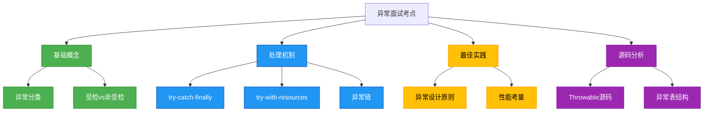

# 面试专题：异常处理

## 概述
异常处理是Java面试中的高频考点，涉及异常体系、处理机制、最佳实践等多个方面。本章将从面试角度梳理异常处理的核心知识点，包括常见面试题解析、实战案例分析和深度思考问题，帮助读者全面掌握异常处理相关面试要点。



## 知识要点

### 1. 异常基础概念辨析

#### 1.1 异常与错误的区别
异常（Exception）表示程序可以处理的意外情况，而错误（Error）表示系统级别的严重问题，程序通常无法恢复。

```java
// Error示例 - 通常无法处理
public class ErrorDemo {
    public static void main(String[] args) {
        // StackOverflowError是虚拟机错误
        recursiveCall();
    }
    
    private static void recursiveCall() {
        recursiveCall(); // 无限递归导致栈溢出
    }
}

// Exception示例 - 可以处理
public class ExceptionDemo {
    public static void main(String[] args) {
        try {
            int result = 10 / 0;
        } catch (ArithmeticException e) {
            // 处理异常
            System.out.println("捕获到算术异常: " + e.getMessage());
        }
    }
}
```

#### 1.2 受检异常与非受检异常的选择
面试常考为何选择受检或非受检异常，关键在于判断异常是否可恢复以及是否需要强制处理。

**受检异常适用场景**：
- 外部资源访问（文件、网络、数据库）
- 可预见且应处理的业务异常
- 需要调用者显式处理的情况

**非受检异常适用场景**：
- 编程错误（空指针、数组越界）
- 不可恢复的配置或环境错误
- 性能敏感场景

### 2. 异常处理机制深度解析

#### 2.1 try-catch-finally执行顺序
面试高频考点：finally块的执行时机和返回值覆盖问题。

```java
public class FinallyExecutionDemo {
    public static int testFinally() {
        try {
            return 1;
        } catch (Exception e) {
            return 2;
        } finally {
            System.out.println("finally执行");
            // finally中的return会覆盖try/catch的return
            // return 3; // 不推荐
        }
    }
    
    public static void main(String[] args) {
        int result = testFinally();
        System.out.println("结果: " + result);
        // 输出顺序:
        // finally执行
        // 结果: 1
    }
}
```

#### 2.2 try-with-resources实现原理
JDK7引入的try-with-resources语法糖背后的实现机制。

```java
// 编译前
public class TryWithResourcesDemo {
    public static void main(String[] args) {
        try (BufferedReader br = new BufferedReader(
                 new FileReader("test.txt"))) {
            System.out.println(br.readLine());
        } catch (IOException e) {
            e.printStackTrace();
        }
    }
}

// 编译后（近似）
public class TryWithResourcesDemo {
    public static void main(String[] args) {
        BufferedReader br = new BufferedReader(new FileReader("test.txt"));
        try {
            System.out.println(br.readLine());
        } catch (IOException e) {
            e.printStackTrace();
        } finally {
            if (br != null) {
                try {
                    br.close();
                } catch (IOException e) {
                    e.printStackTrace();
                }
            }
        }
    }
}
```

### 3. 异常处理最佳实践面试题

#### 3.1 如何设计自定义异常
优秀的自定义异常设计应包含错误码、描述信息和上下文数据。

```java
/**
 * 符合面试标准的自定义异常实现
 */
public class BusinessException extends Exception {
    // 错误码
    private final int errorCode;
    // 错误发生时间
    private final LocalDateTime timestamp;
    // 请求ID，用于分布式追踪
    private final String requestId;
    
    public BusinessException(String message, int errorCode, String requestId) {
        super(message);
        this.errorCode = errorCode;
        this.requestId = requestId;
        this.timestamp = LocalDateTime.now();
    }
    
    public BusinessException(String message, Throwable cause, int errorCode, String requestId) {
        super(message, cause);
        this.errorCode = errorCode;
        this.requestId = requestId;
        this.timestamp = LocalDateTime.now();
    }
    
    // Getters
    public int getErrorCode() { return errorCode; }
    public LocalDateTime getTimestamp() { return timestamp; }
    public String getRequestId() { return requestId; }
}
```

#### 3.2 异常处理对性能的影响
异常创建的性能开销主要来自堆栈跟踪的生成。

```java
public class ExceptionPerformanceDemo {
    private static final int ITERATIONS = 1_000_000;
    
    public static void main(String[] args) {
        // 测试正常流程性能
        long normalTime = testNormalPath();
        // 测试异常流程性能
        long exceptionTime = testExceptionPath();
        
        System.out.println("正常流程耗时: " + normalTime + "ms");
        System.out.println("异常流程耗时: " + exceptionTime + "ms");
        System.out.println("异常流程是正常流程的" + (exceptionTime / normalTime) + "倍");
    }
    
    private static long testNormalPath() {
        long start = System.currentTimeMillis();
        for (int i = 0; i < ITERATIONS; i++) {
            int result = i * 2;
        }
        return System.currentTimeMillis() - start;
    }
    
    private static long testExceptionPath() {
        long start = System.currentTimeMillis();
        for (int i = 0; i < ITERATIONS; i++) {
            try {
                if (i % 2 == 0) {
                    throw new RuntimeException("测试异常");
                }
            } catch (RuntimeException e) {
                // 空处理
            }
        }
        return System.currentTimeMillis() - start;
    }
}
```

## 知识扩展

### 设计思想

异常处理的设计体现了以下重要思想：

1. **责任链模式**：异常沿调用链向上传递，直到被合适的处理器捕获
2. **开闭原则**：通过继承Throwable类，可以扩展新的异常类型而不修改现有代码
3. **信息隐藏**：通过异常转换，隐藏底层实现细节，暴露高层业务语义
4. **防御式编程**：提前预判可能的错误，通过异常机制进行保护

### 避坑指南

面试中常被问及的异常处理陷阱：

1. **异常吞噬**
最常见的错误是捕获异常后不处理也不记录。

```java
// 错误示例
public void loadData() {
    try {
        // 加载数据
    } catch (IOException e) {
        // 空catch块，吞噬异常
    }
}

// 正确示例
public void loadData() {
    try {
        // 加载数据
    } catch (IOException e) {
        log.error("数据加载失败", e);
        throw new ServiceException("数据加载失败，请重试", e);
    }
}
```

2. **过度使用异常**
用异常控制正常业务流程会严重影响性能和可读性。

```java
// 不推荐
public boolean isPositive(int number) {
    try {
        if (number <= 0) {
            throw new NotPositiveException();
        }
        return true;
    } catch (NotPositiveException e) {
        return false;
    }
}

// 推荐
public boolean isPositive(int number) {
    return number > 0;
}
```

### 深度思考题

**思考题1**：为什么Java中的异常必须显式捕获或声明，而其他语言如Python不需要？这种设计有什么优缺点？

**思考题1回答**：Java的受检异常设计基于"失败必须处理"的理念，强制程序员处理可预见的错误，提高代码健壮性。优点是迫使开发者考虑异常情况，减少未处理异常导致的运行时错误；缺点是过度使用会导致代码臃肿（如IO操作需要大量try-catch），有时开发者会用空catch块简单规避，反而降低代码质量。

相比之下，Python采用"请求宽恕比请求许可更容易"（EAFP）的风格，鼓励使用异常处理正常流程，这在某些场景下使代码更简洁。Java 8后引入的Optional和Stream API也体现了向这种风格的部分转变。

**思考题2**：在并发编程中，如何正确处理线程中的异常？Thread.UncaughtExceptionHandler的作用是什么？

**思考题2回答**：并发环境中异常处理有特殊挑战，因为线程中的异常无法跨线程传播。正确的处理方式包括：

1. 使用Thread.UncaughtExceptionHandler捕获未处理异常：
```java
Thread thread = new Thread(() -> {
    throw new RuntimeException("线程异常");
});

thread.setUncaughtExceptionHandler((t, e) -> {
    log.error("线程{}发生未捕获异常", t.getName(), e);
});

thread.start();
```

2. 使用Future获取线程执行结果和异常：
```java
ExecutorService executor = Executors.newSingleThreadExecutor();
Future<?> future = executor.submit(() -> {
    throw new RuntimeException("任务异常");
});

try {
    future.get();
} catch (ExecutionException e) {
    Throwable cause = e.getCause();
    log.error("任务执行异常", cause);
} finally {
    executor.shutdown();
}
```

Thread.UncaughtExceptionHandler提供了一种集中处理线程中未捕获异常的机制，避免异常导致线程静默终止而不被察觉，这在服务器应用中尤为重要。