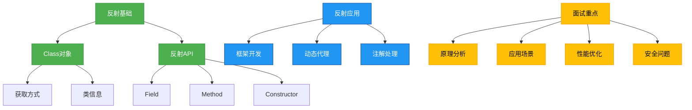

# 面试专题：反射

## 概述
反射是Java语言的重要特性之一，它允许程序在运行时动态获取类的信息并操作类的属性、方法和构造函数。本专题将深入解析反射的核心概念、实现原理、应用场景以及面试中常见的问题与解答，帮助你全面掌握反射机制并从容应对面试挑战。



## 知识要点

### 1. 反射基础概念辨析

#### 1.1 什么是反射？
反射是Java语言提供的一种能力，它允许程序在运行时而非编译时获取类的完整信息，并能动态操作类的属性、方法和构造函数。通过反射，我们可以打破封装性，访问类的私有成员，实现动态创建对象和调用方法。

#### 1.2 Class对象是什么？有哪些获取方式？
Class对象是反射的核心，它代表一个类的字节码文件，包含了类的所有信息。获取Class对象的方式有以下四种：

```java
public class ClassObjectDemo {
    public static void main(String[] args) throws ClassNotFoundException {
        // 方式一：通过类名.class获取
        Class<?> clazz1 = String.class;
        
        // 方式二：通过对象.getClass()方法获取
        String str = "hello";
        Class<?> clazz2 = str.getClass();
        
        // 方式三：通过Class.forName()方法获取
        Class<?> clazz3 = Class.forName("java.lang.String");
        
        // 方式四：通过类加载器获取
        ClassLoader classLoader = ClassObjectDemo.class.getClassLoader();
        Class<?> clazz4 = classLoader.loadClass("java.lang.String");
        
        // 验证所有方式获取的是同一个Class对象
        System.out.println(clazz1 == clazz2); // true
        System.out.println(clazz1 == clazz3); // true
        System.out.println(clazz1 == clazz4); // true
    }
}
```

#### 1.3 反射API主要包含哪些类？
反射API主要包含以下几个核心类，位于java.lang.reflect包下：
- Class：代表类的字节码对象，是反射的入口
- Field：代表类的成员变量
- Method：代表类的方法
- Constructor：代表类的构造函数
- Modifier：代表类、字段、方法等的修饰符
- Parameter：代表方法的参数

### 2. 反射机制实现原理

#### 2.1 反射的底层实现机制是什么？
Java反射机制的底层实现依赖于JVM提供的相关指令和数据结构。当我们通过反射访问类的成员时，JVM会执行以下步骤：
1. 检查访问权限，如果是私有成员，需要调用setAccessible(true)绕过访问检查
2. 查找对应的成员信息（字段、方法或构造函数）
3. 执行相应的操作（获取/设置字段值、调用方法、创建对象等）

需要注意的是，反射操作会绕过编译器的类型检查，因此可能会带来安全风险和性能开销。

#### 2.2 反射调用的性能为什么比直接调用差？如何优化？
反射调用的性能比直接调用差，主要原因有以下几点：
1. 反射需要在运行时解析类型信息，而直接调用在编译时就已确定
2. 反射调用需要进行安全检查和权限验证
3. 反射调用无法被JVM内联优化

优化反射性能的方法：
- 缓存Class对象、Field对象、Method对象等反射相关对象
- 使用setAccessible(true)关闭访问检查（仅在必要时使用）
- 对于频繁调用的方法，可以通过MethodHandle进行优化
- 在Java 9及以上版本，可以使用VarHandle替代部分反射操作

```java
import java.lang.invoke.MethodHandle;
import java.lang.invoke.MethodHandles;
import java.lang.invoke.MethodType;
import java.lang.reflect.Method;

public class ReflectionPerformanceDemo {
    private static final int ITERATIONS = 10000000;
    private static final String STR = "test";
    
    public static void main(String[] args) throws Exception {
        // 直接调用
        long startTime = System.currentTimeMillis();
        for (int i = 0; i < ITERATIONS; i++) {
            STR.length();
        }
        long directTime = System.currentTimeMillis() - startTime;
        
        // 反射调用
        Method lengthMethod = String.class.getMethod("length");
        startTime = System.currentTimeMillis();
        for (int i = 0; i < ITERATIONS; i++) {
            lengthMethod.invoke(STR);
        }
        long reflectionTime = System.currentTimeMillis() - startTime;
        
        // MethodHandle调用
        MethodHandles.Lookup lookup = MethodHandles.lookup();
        MethodType methodType = MethodType.methodType(int.class);
        MethodHandle lengthHandle = lookup.findVirtual(String.class, "length", methodType);
        startTime = System.currentTimeMillis();
        for (int i = 0; i < ITERATIONS; i++) {
            lengthHandle.invokeExact(STR);
        }
        long methodHandleTime = System.currentTimeMillis() - startTime;
        
        System.out.println("直接调用: " + directTime + "ms");
        System.out.println("反射调用: " + reflectionTime + "ms");
        System.out.println("MethodHandle调用: " + methodHandleTime + "ms");
    }
}
```

### 3. 反射的应用场景

#### 3.1 反射在框架开发中有哪些应用？
反射是许多Java框架的基础，如Spring、MyBatis、Hibernate等。以下是一些典型应用：

1. **Spring IoC容器**：通过反射创建Bean对象，注入依赖
2. **MyBatis**：通过反射将查询结果映射到Java对象
3. **JUnit**：通过反射执行测试方法
4. **JSON序列化/反序列化**：通过反射将Java对象转换为JSON字符串，或反之

以Spring为例，当我们在配置文件中定义一个Bean时：
```xml
<bean id="userService" class="com.example.UserService"/>
```
Spring容器会通过Class.forName()方法获取UserService类的Class对象，然后通过反射调用其构造函数创建实例。

#### 3.2 反射与动态代理的关系是什么？
动态代理是反射的重要应用之一。Java中的动态代理主要通过java.lang.reflect.Proxy类实现，它允许在运行时创建目标类的代理对象，并在代理对象中增强目标方法的功能。

```java
import java.lang.reflect.InvocationHandler;
import java.lang.reflect.Method;
import java.lang.reflect.Proxy;

// 接口
interface UserService {
    void addUser(String username);
}

// 实现类
class UserServiceImpl implements UserService {
    @Override
    public void addUser(String username) {
        System.out.println("添加用户: " + username);
    }
}

// 动态代理处理器
class LogInvocationHandler implements InvocationHandler {
    private Object target;
    
    public LogInvocationHandler(Object target) {
        this.target = target;
    }
    
    @Override
    public Object invoke(Object proxy, Method method, Object[] args) throws Throwable {
        // 前置增强
        System.out.println("方法" + method.getName() + "开始执行");
        // 调用目标方法
        Object result = method.invoke(target, args);
        // 后置增强
        System.out.println("方法" + method.getName() + "执行结束");
        return result;
    }
}

public class DynamicProxyDemo {
    public static void main(String[] args) {
        UserService userService = new UserServiceImpl();
        InvocationHandler handler = new LogInvocationHandler(userService);
        
        // 通过反射创建代理对象
        UserService proxy = (UserService) Proxy.newProxyInstance(
            userService.getClass().getClassLoader(),
            userService.getClass().getInterfaces(),
            handler
        );
        
        proxy.addUser("张三");
    }
}
```

### 4. 反射常见面试题

#### 4.1 如何通过反射获取和设置私有字段的值？
要通过反射获取和设置私有字段的值，需要使用Field类的setAccessible(true)方法绕过访问检查。

```java
import java.lang.reflect.Field;

class Person {
    private String name;
    private int age;
    
    public Person(String name, int age) {
        this.name = name;
        this.age = age;
    }
}

public class PrivateFieldAccessDemo {
    public static void main(String[] args) throws Exception {
        Person person = new Person("张三", 20);
        Class<?> clazz = person.getClass();
        
        // 获取私有字段name
        Field nameField = clazz.getDeclaredField("name");
        nameField.setAccessible(true); // 绕过访问检查
        String name = (String) nameField.get(person);
        System.out.println("原始name值: " + name);
        
        // 设置私有字段name
        nameField.set(person, "李四");
        System.out.println("修改后的name值: " + nameField.get(person));
        
        // 获取私有字段age
        Field ageField = clazz.getDeclaredField("age");
        ageField.setAccessible(true);
        int age = (int) ageField.get(person);
        System.out.println("原始age值: " + age);
        
        // 设置私有字段age
        ageField.set(person, 25);
        System.out.println("修改后的age值: " + ageField.get(person));
    }
}
```

#### 4.2 如何通过反射调用私有方法？
类似地，要调用私有方法，需要使用Method类的setAccessible(true)方法。

```java
import java.lang.reflect.Method;

class Calculator {
    private int add(int a, int b) {
        return a + b;
    }
    
    private String concat(String s1, String s2) {
        return s1 + s2;
    }
}

public class PrivateMethodInvokeDemo {
    public static void main(String[] args) throws Exception {
        Calculator calculator = new Calculator();
        Class<?> clazz = calculator.getClass();
        
        // 调用私有方法add
        Method addMethod = clazz.getDeclaredMethod("add", int.class, int.class);
        addMethod.setAccessible(true);
        int sum = (int) addMethod.invoke(calculator, 10, 20);
        System.out.println("10 + 20 = " + sum);
        
        // 调用私有方法concat
        Method concatMethod = clazz.getDeclaredMethod("concat", String.class, String.class);
        concatMethod.setAccessible(true);
        String result = (String) concatMethod.invoke(calculator, "Hello", "World");
        System.out.println("拼接结果: " + result);
    }
}
```

#### 4.3 反射是否破坏了Java的封装性？为什么？
反射确实在一定程度上破坏了Java的封装性。封装性是面向对象的三大特性之一，它要求将对象的状态信息隐藏在对象内部，不允许外部程序直接访问。然而，通过反射，我们可以绕过访问控制符的限制，直接访问和修改私有成员。

但是，反射并没有完全破坏封装性，因为：
1. 反射需要显式调用setAccessible(true)方法才能访问私有成员，这是一种有意识的行为
2. 在安全管理器（SecurityManager）存在的情况下，可以限制反射对私有成员的访问
3. 反射主要用于框架开发、调试工具等特殊场景，普通应用开发中应避免过度使用

## 知识扩展

### 1. 设计思想
反射体现了Java语言的动态性和灵活性，它允许程序在运行时适应变化，而不需要在编译时确定所有细节。这种设计思想在框架开发中尤为重要，它使得框架可以与任意用户自定义类协同工作，而不需要提前知道这些类的具体信息。

反射的设计也体现了"开-闭原则"，即对扩展开放，对修改关闭。通过反射，我们可以在不修改框架源码的情况下，扩展框架的功能。

### 2. 避坑指南

#### 2.1 安全风险
反射可以访问和修改私有成员，这可能会破坏对象的完整性和一致性。在使用反射时，应注意：
- 避免在生产环境中过度使用反射
- 不要随意修改不可变对象（如String、Integer等）的内部状态
- 在有安全管理器的环境中，反射可能会受到限制

#### 2.2 性能问题
如前所述，反射调用的性能比直接调用差。在性能敏感的场景中，应：
- 缓存反射对象（Class、Field、Method等）
- 尽量使用直接调用而非反射调用
- 考虑使用MethodHandle等替代方案

#### 2.3 兼容性问题
反射依赖于类的结构，如果类的结构发生变化（如字段名、方法名改变），反射代码可能会抛出异常。因此：
- 反射代码应做好异常处理
- 避免对不稳定的类使用反射
- 在使用第三方库时，注意其版本兼容性

### 3. 深度思考题

#### 思考题1：为什么Java中的Class对象是单例的？

思考题回答：Java中的Class对象是单例的，这是因为每个类的字节码文件在JVM中只会被加载一次，生成一个Class对象。类加载过程中，JVM会保证Class对象的唯一性，即使通过不同的类加载器加载同一个类，也会生成不同的Class对象。这种设计可以节省内存空间，同时保证类信息的一致性。

#### 思考题2：如何通过反射创建数组？

思考题回答：可以通过Array类的newInstance()方法创建数组。例如：
```java
import java.lang.reflect.Array;

public class ArrayCreationDemo {
    public static void main(String[] args) {
        // 创建一个长度为5的int数组
        int[] intArray = (int[]) Array.newInstance(int.class, 5);
        
        // 设置数组元素
        for (int i = 0; i < intArray.length; i++) {
            Array.set(intArray, i, i * 10);
        }
        
        // 获取数组元素
        for (int i = 0; i < intArray.length; i++) {
            System.out.println(Array.get(intArray, i));
        }
    }
}
```

#### 思考题3：反射在Java模块化系统（Jigsaw）中有哪些限制？

思考题回答：Java 9引入的模块化系统对反射进行了限制，主要包括：
1. 模块需要显式导出包才能被其他模块反射访问
2. 即使导出了包，私有成员仍然不能被反射访问，除非使用opens语句开放
3. 可以使用--add-opens JVM参数临时开放包访问，但这不是推荐做法

例如，要允许反射访问java.base模块中的java.lang包，需要在模块声明中添加：
```java
module com.example {
    opens java.lang to com.reflection.module;
}
```

这些限制增强了Java的安全性和封装性，但也给依赖反射的框架带来了挑战。