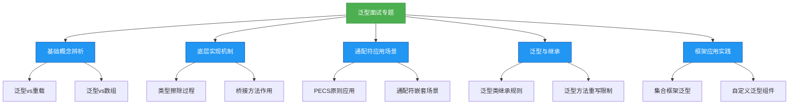

# 面试专题：泛型

## 概述
泛型是Java面试中的高频考点，涉及底层实现机制、实际应用场景及最佳实践等多个维度。本章将系统梳理泛型面试中的核心问题，包括类型擦除原理、通配符使用场景、泛型与继承的关系等，通过理论解析与代码实践相结合的方式，帮助开发者全面掌握泛型面试要点，从容应对各类泛型相关问题。



## 核心理论

### 1. 泛型基础概念辨析

#### 1.1 泛型的本质与作用
泛型的本质是参数化类型，即将具体类型参数化，使得代码可以操作多种数据类型而无需重复编写。其核心作用包括：
- **类型安全**：编译期检查类型，避免运行时ClassCastException
- **代码复用**：一套代码支持多种数据类型
- **可读性提升**：代码意图更清晰，无需通过注释说明类型

#### 1.2 泛型与重载的区别
泛型与重载都能实现多类型支持，但机制不同：
- **泛型**：通过类型参数化实现，编译后类型擦除为同一方法
- **重载**：通过不同参数列表实现，编译后生成不同方法签名

```java
// 泛型实现多类型支持
public <T> void print(T data) {
    System.out.println(data);
}

// 重载实现多类型支持
public void print(String data) { System.out.println(data); }
public void print(Integer data) { System.out.println(data); }
```

#### 1.3 泛型与数组的对比
| 特性 | 泛型 | 数组 |
|------|------|------|
| 类型检查 | 编译期 | 运行期 |
| 可变性 | 不可变（类型参数固定） | 可变（可存储子类型元素） |
| 创建限制 | 不能创建泛型数组 | 可以创建具体类型数组 |
| 协变性 | 不支持（List< String>不是List< Object>子类） | 支持（String[]是Object[]子类） |

### 2. 类型擦除深度解析

#### 2.1 类型擦除的三个阶段
1. **擦除类型参数**：将泛型类型参数替换为边界类型（无边界则为Object）
2. **擦除方法参数**：调整方法签名，替换泛型参数为原始类型
3. **生成桥接方法**：维持泛型多态性，确保类型安全

**示例**：
```java
public class ErasureDemo<T extends Number> {
    private T value;
    public T getValue() { return value; }
    public void setValue(T value) { this.value = value; }
}

// 擦除后等价于
public class ErasureDemo {
    private Number value;
    public Number getValue() { return value; }
    public void setValue(Number value) { this.value = value; }
}
```

#### 2.2 类型擦除引发的常见问题
- **运行时类型判断失效**：无法使用`instanceof List< String>`
- **泛型静态变量共享**：静态变量属于类而非泛型实例，不同类型参数共享同一静态变量
- **异常不能是泛型**：异常类不能使用泛型参数，因为异常捕获基于运行时类型

## 代码实践

### 1. 泛型面试高频编程题

#### 1.1 实现泛型单例模式
```java
public class GenericSingleton<T> {
    private T instance;
    
    private GenericSingleton(T instance) {
        this.instance = instance;
    }
    
    public static <T> GenericSingleton<T> getInstance(T instance) {
        return new GenericSingleton<>(instance);
    }
    
    public T getInstance() {
        return instance;
    }
}

// 使用
GenericSingleton<String> strSingleton = GenericSingleton.getInstance("test");
GenericSingleton<Integer> intSingleton = GenericSingleton.getInstance(123);
```

#### 1.2 泛型方法实现两数交换
```java
public class GenericSwap {
    public static <T> void swap(T[] array, int i, int j) {
        if (array == null || i < 0 || j < 0 || i >= array.length || j >= array.length) {
            throw new IllegalArgumentException("Invalid parameters");
        }
        T temp = array[i];
        array[i] = array[j];
        array[j] = temp;
    }
    
    public static void main(String[] args) {
        Integer[] intArray = {1, 2, 3, 4};
        swap(intArray, 0, 3);
        System.out.println(Arrays.toString(intArray)); // [4, 2, 3, 1]
        
        String[] strArray = {"A", "B", "C"};
        swap(strArray, 1, 2);
        System.out.println(Arrays.toString(strArray)); // [A, C, B]
    }
}
```

#### 1.3 通配符应用：实现通用集合拷贝
```java
public class CollectionCopy {
    // 生产者使用extends，消费者使用super
    public static <T> void copy(List<? extends T> src, List<? super T> dest) {
        for (T item : src) {
            dest.add(item);
        }
    }
    
    public static void main(String[] args) {
        List<Integer> src = Arrays.asList(1, 2, 3);
        List<Number> dest = new ArrayList<>();
        copy(src, dest);
        System.out.println(dest); // [1, 2, 3]
    }
}
```

## 设计思想

### 1. 泛型设计的开闭原则体现
泛型通过参数化类型实现了"对扩展开放，对修改关闭"的设计原则。以集合框架为例，ArrayList< T>通过泛型支持任意元素类型，无需为每种元素类型创建新的ArrayList子类。

### 2. 泛型与依赖注入的协同
Spring等框架将泛型与依赖注入结合，实现了类型安全的依赖管理。通过泛型类型信息，容器能够精确匹配Bean，减少了显式类型转换，提升了开发效率。

## 避坑指南

### 1. 避免泛型类型的无意识绕开
```java
List<String> strList = new ArrayList<>();
// 错误：通过原始类型绕开泛型检查
List rawList = strList;
rawList.add(123); // 编译通过，运行时不会报错
String str = strList.get(0); // 运行时抛出ClassCastException
```

### 2. 正确使用泛型通配符
- 避免过度使用无界通配符（?），丧失类型安全
- 遵循PECS原则选择通配符方向
- 复杂泛型场景使用辅助方法捕获类型参数

### 3. 泛型方法返回值的类型推断陷阱
```java
public <T> T getValue() {
    return (T) "test"; // 不安全的类型转换
}

// 调用时可能静默失败
Integer value = getValue(); // 编译通过，运行时抛出ClassCastException
```

## 深度思考题
1. 如何在运行时获取泛型的具体类型信息？（提示：通过匿名内部类或反射获取TypeToken）
2. 泛型擦除机制对Java虚拟机的影响是什么？为什么说泛型是Java的语法糖？
3. 如何设计一个支持泛型的缓存框架？需要考虑哪些泛型相关的设计要点？

### 思考题

### 思考题回答