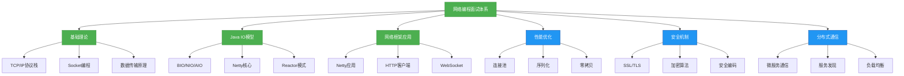
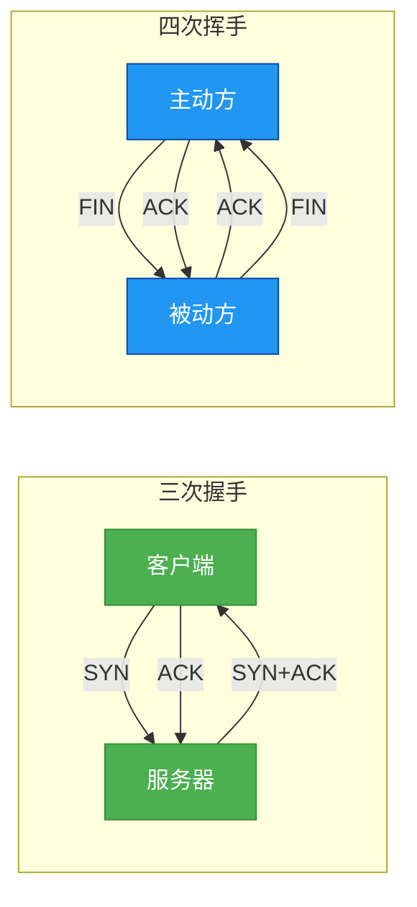
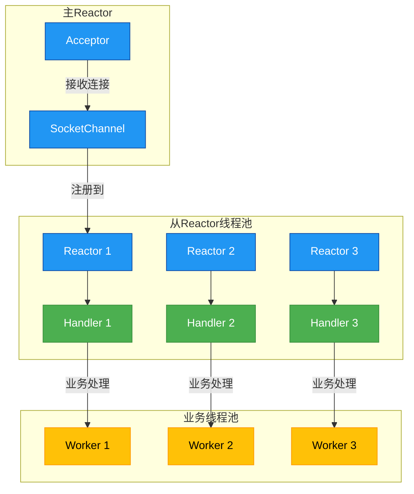

# 面试专题：网络编程

## 概述
网络编程是Java面试中的核心考察领域，涉及底层通信原理、并发处理、性能优化等关键技能。本章节将系统梳理网络编程面试高频考点，从基础理论到实战应用，帮助你构建完整的知识体系并掌握面试应答策略。



## 核心理论

### 1. TCP/IP协议深度解析

#### 1.1 TCP三次握手与四次挥手
TCP连接建立和断开的过程是面试高频考点，需要理解每个阶段的状态变化和设计原因。

**三次握手过程**：
1. 客户端发送SYN包（同步序列编号），进入SYN_SENT状态
2. 服务器收到SYN包，回复SYN+ACK包，进入SYN_RCVD状态
3. 客户端收到SYN+ACK包，回复ACK包，双方进入ESTABLISHED状态

**为什么需要三次握手？**
- 防止已失效的连接请求报文段突然又传送到服务器，导致错误
- 确保双方都具备发送和接收能力
- 协商初始序列号

**四次挥手过程**：
1. 主动方发送FIN包，进入FIN_WAIT_1状态
2. 被动方收到FIN包，回复ACK包，进入CLOSE_WAIT状态
3. 被动方准备关闭，发送FIN包，进入LAST_ACK状态
4. 主动方收到FIN包，回复ACK包，进入TIME_WAIT状态，等待2MSL后关闭

**为什么TIME_WAIT状态需要等待2MSL？**
- 确保最后一个ACK报文能到达对方
- 防止"已失效的连接请求报文段"出现在本连接中



#### 1.2 TCP可靠传输机制
TCP通过多种机制保证可靠传输，是面试重点考察内容：

1. **校验和**：检测数据在传输过程中的差错
2. **确认应答**：收到数据后发送ACK确认
3. **超时重传**：发送数据后设置定时器，超时未收到ACK则重传
4. **流量控制**：通过滑动窗口机制控制发送速率，避免接收方缓冲区溢出
5. **拥塞控制**：慢开始、拥塞避免、快重传、快恢复机制，避免网络拥塞
6. **数据分片**：将大数据分成适合MTU的报文段
7. **有序到达**：通过序列号确保数据按序到达
8. **重复丢弃**：通过序列号识别重复数据并丢弃

**滑动窗口原理**：
发送方和接收方各维护一个窗口，窗口内的数据可以连续发送无需等待确认。接收方通过ACK报文告知发送方可接收的窗口大小，实现动态流量控制。

```java
/**
 * TCP滑动窗口机制简化模型
 * 展示发送窗口如何根据接收窗口动态调整
 */
public class SlidingWindowDemo {
    // 发送窗口参数
    private int sendBase;       // 已发送但未确认的第一个字节序号
    private int nextSeq;        // 下一个要发送的字节序号
    private int windowSize;     // 当前窗口大小
    private int maxWindowSize;  // 最大窗口大小
    private boolean[] acked;    // 记录已确认的报文
    
    // 接收窗口参数
    private int rcvWindow;      // 接收窗口大小
    private int expectedSeq;    // 期望接收的下一个字节序号
    
    /**
     * 收到接收方的ACK，更新发送窗口
     */
    public void onAckReceived(int ackSeq, int windowSize) {
        // 更新已确认的序号
        for (int i = sendBase; i < ackSeq; i++) {
            acked[i] = true;
        }
        
        // 移动发送窗口基址到第一个未确认的序号
        while (sendBase < acked.length && acked[sendBase]) {
            sendBase++;
        }
        
        // 更新窗口大小
        this.windowSize = Math.min(windowSize, maxWindowSize);
        System.out.println("发送窗口更新: [" + sendBase + ", " + (sendBase + windowSize) + ")");
    }
    
    /**
     * 发送数据
     */
    public void sendData() {
        // 可以发送窗口内的所有数据
        while (nextSeq < sendBase + windowSize && nextSeq < acked.length) {
            System.out.println("发送数据: " + nextSeq);
            nextSeq++;
        }
    }
}
```

### 2. Java IO模型演进

Java IO模型经历了从BIO到NIO再到AIO的演进，理解各种模型的优缺点和适用场景是面试必备知识。

#### 2.1 BIO (Blocking IO)
**特点**：同步阻塞IO，每个连接需要一个独立线程处理
**优点**：模型简单，编程容易
**缺点**：资源消耗大，并发能力低
**适用场景**：连接数少且固定的架构

```java
/**
 * BIO服务器示例
 * 每个客户端连接需要一个独立线程处理
 */
public class BioServer {
    public static void main(String[] args) throws IOException {
        ServerSocket serverSocket = new ServerSocket(8080);
        System.out.println("BIO服务器启动，端口: 8080");
        
        while (true) {
            // 阻塞等待客户端连接
            Socket socket = serverSocket.accept();
            System.out.println("新客户端连接: " + socket.getInetAddress());
            
            // 为每个客户端创建新线程处理
            new Thread(() -> {
                try (InputStream in = socket.getInputStream();
                     OutputStream out = socket.getOutputStream();
                     BufferedReader reader = new BufferedReader(new InputStreamReader(in));
                     PrintWriter writer = new PrintWriter(out, true)) {
                     
                    String line;
                    // 阻塞读取客户端数据
                    while ((line = reader.readLine()) != null) {
                        System.out.println("收到客户端消息: " + line);
                        writer.println("服务器已收到: " + line);
                        
                        // 客户端发送exit时断开连接
                        if ("exit".equals(line)) {
                            break;
                        }
                    }
                    System.out.println("客户端断开连接");
                } catch (IOException e) {
                    e.printStackTrace();
                } finally {
                    try {
                        socket.close();
                    } catch (IOException e) {
                        e.printStackTrace();
                    }
                }
            }).start();
        }
    }
}
```

#### 2.2 NIO (Non-blocking IO)
**特点**：同步非阻塞IO，基于Selector、Channel和Buffer
**优点**：单线程处理多个连接，资源消耗低，并发能力强
**缺点**：编程复杂度高
**适用场景**：高并发、高吞吐量的网络应用

**NIO三大核心组件**：
- **Channel**：双向通道，支持读写操作
- **Buffer**：缓冲区，数据读写的容器
- **Selector**：多路复用器，监控多个Channel的事件

```java
/**
 * NIO服务器示例
 * 单线程处理多个客户端连接
 */
public class NioServer {
    public static void main(String[] args) throws IOException {
        // 创建ServerSocketChannel
        ServerSocketChannel serverSocketChannel = ServerSocketChannel.open();
        serverSocketChannel.socket().bind(new InetSocketAddress(8080));
        serverSocketChannel.configureBlocking(false);
        
        // 创建Selector
        Selector selector = Selector.open();
        
        // 注册Accept事件
        serverSocketChannel.register(selector, SelectionKey.OP_ACCEPT);
        System.out.println("NIO服务器启动，端口: 8080");
        
        while (true) {
            // 阻塞等待事件就绪
            selector.select();
            
            // 获取就绪事件集合
            Set<SelectionKey> selectionKeys = selector.selectedKeys();
            Iterator<SelectionKey> iterator = selectionKeys.iterator();
            
            while (iterator.hasNext()) {
                SelectionKey key = iterator.next();
                iterator.remove();
                
                try {
                    // 处理Accept事件
                    if (key.isAcceptable()) {
                        handleAccept(key);
                    }
                    // 处理Read事件
                    if (key.isReadable()) {
                        handleRead(key);
                    }
                } catch (IOException e) {
                    key.cancel();
                    key.channel().close();
                }
            }
        }
    }
    
    /**
     * 处理客户端连接
     */
    private static void handleAccept(SelectionKey key) throws IOException {
        ServerSocketChannel serverSocketChannel = (ServerSocketChannel) key.channel();
        SocketChannel socketChannel = serverSocketChannel.accept();
        socketChannel.configureBlocking(false);
        System.out.println("新客户端连接: " + socketChannel.getRemoteAddress());
        
        // 注册Read事件，并关联缓冲区
        ByteBuffer buffer = ByteBuffer.allocate(1024);
        socketChannel.register(key.selector(), SelectionKey.OP_READ, buffer);
    }
    
    /**
     * 处理客户端读事件
     */
    private static void handleRead(SelectionKey key) throws IOException {
        SocketChannel socketChannel = (SocketChannel) key.channel();
        ByteBuffer buffer = (ByteBuffer) key.attachment();
        
        int bytesRead = socketChannel.read(buffer);
        if (bytesRead > 0) {
            buffer.flip();
            byte[] bytes = new byte[buffer.remaining()];
            buffer.get(bytes);
            String message = new String(bytes, StandardCharsets.UTF_8);
            System.out.println("收到客户端消息: " + message);
            
            // 回复客户端
            String response = "服务器已收到: " + message;
            buffer.clear();
            buffer.put(response.getBytes(StandardCharsets.UTF_8));
            buffer.flip();
            socketChannel.write(buffer);
            
            // 客户端发送exit时断开连接
            if ("exit".equals(message.trim())) {
                socketChannel.close();
                System.out.println("客户端断开连接");
            }
        } else if (bytesRead == -1) {
            // 客户端断开连接
            socketChannel.close();
            System.out.println("客户端断开连接");
        }
    }
}
```

#### 2.3 AIO (Asynchronous IO)
**特点**：异步非阻塞IO，基于回调机制
**优点**：完全异步，无需Selector轮询
**缺点**：实现复杂，JDK原生支持有限
**适用场景**：连接数多且连接时间短的应用

### 3. 网络编程核心概念

#### 3.1 阻塞与非阻塞
- **阻塞**：调用结果返回前，当前线程会被挂起，直到得到结果
- **非阻塞**：调用不会阻塞当前线程，立即返回结果或错误

#### 3.2 同步与异步
- **同步**：调用者主动等待结果返回
- **异步**：调用者不会立即得到结果，而是通过回调等方式被动通知

#### 3.3 多路复用
单个线程同时监控多个IO通道，当某个通道就绪时才进行处理，提高系统吞吐量。

#### 3.4 零拷贝
避免数据在用户空间和内核空间之间来回拷贝，提高IO效率：
- mmap+write：减少一次CPU拷贝
- sendfile：完全零拷贝（需要操作系统支持）

```java
/**
 * 使用NIO的零拷贝示例
 */
public class ZeroCopyDemo {
    public static void main(String[] args) throws IOException {
        String sourcePath = "large_file.dat";
        String destPath = "copied_file.dat";
        
        // 传统IO拷贝
        long startTime = System.currentTimeMillis();
        traditionalCopy(sourcePath, destPath + "_traditional");
        System.out.println("传统IO拷贝耗时: " + (System.currentTimeMillis() - startTime) + "ms");
        
        // NIO零拷贝
        startTime = System.currentTimeMillis();
        nioZeroCopy(sourcePath, destPath + "_nio");
        System.out.println("NIO零拷贝耗时: " + (System.currentTimeMillis() - startTime) + "ms");
    }
    
    /**
     * 传统IO拷贝
     */
    private static void traditionalCopy(String source, String dest) throws IOException {
        try (InputStream in = new FileInputStream(source);
             OutputStream out = new FileOutputStream(dest);
             byte[] buffer = new byte[4096]) {
             
            int bytesRead;
            while ((bytesRead = in.read(buffer)) != -1) {
                out.write(buffer, 0, bytesRead);
            }
        }
    }
    
    /**
     * NIO零拷贝
     */
    private static void nioZeroCopy(String source, String dest) throws IOException {
        try (FileChannel inChannel = new FileInputStream(source).getChannel();
             FileChannel outChannel = new FileOutputStream(dest).getChannel()) {
             
            inChannel.transferTo(0, inChannel.size(), outChannel);
        }
    }
}
```

## 代码实践

### 1. 网络编程常见面试题

#### 1.1 实现简单的HTTP服务器
使用Java NIO实现一个简单的HTTP服务器，能够处理GET请求并返回响应。

```java
/**
 * 简单HTTP服务器实现
 * 处理GET请求并返回响应
 */
public class SimpleHttpServer {
    public static void main(String[] args) throws IOException {
        ServerSocketChannel serverSocketChannel = ServerSocketChannel.open();
        serverSocketChannel.socket().bind(new InetSocketAddress(8080));
        serverSocketChannel.configureBlocking(false);
        
        Selector selector = Selector.open();
        serverSocketChannel.register(selector, SelectionKey.OP_ACCEPT);
        System.out.println("简单HTTP服务器启动，端口: 8080");
        
        while (true) {
            selector.select();
            Iterator<SelectionKey> iterator = selector.selectedKeys().iterator();
            
            while (iterator.hasNext()) {
                SelectionKey key = iterator.next();
                iterator.remove();
                
                if (key.isAcceptable()) {
                    handleAccept(key);
                } else if (key.isReadable()) {
                    handleRead(key);
                }
            }
        }
    }
    
    private static void handleAccept(SelectionKey key) throws IOException {
        ServerSocketChannel serverSocketChannel = (ServerSocketChannel) key.channel();
        SocketChannel socketChannel = serverSocketChannel.accept();
        socketChannel.configureBlocking(false);
        socketChannel.register(key.selector(), SelectionKey.OP_READ);
    }
    
    private static void handleRead(SelectionKey key) throws IOException {
        SocketChannel socketChannel = (SocketChannel) key.channel();
        ByteBuffer buffer = ByteBuffer.allocate(1024);
        
        try {
            int bytesRead = socketChannel.read(buffer);
            if (bytesRead > 0) {
                buffer.flip();
                byte[] bytes = new byte[buffer.remaining()];
                buffer.get(bytes);
                String request = new String(bytes, StandardCharsets.UTF_8);
                
                // 解析HTTP请求
                String[] requestLines = request.split("\r\n");
                String[] firstLine = requestLines[0].split(" ");
                String method = firstLine[0];
                String path = firstLine[1];
                
                System.out.println("收到请求: " + method + " " + path);
                
                // 构建HTTP响应
                String response = "HTTP/1.1 200 OK\r\n"
                                + "Content-Type: text/html\r\n"
                                + "Connection: close\r\n"
                                + "\r\n"
                                + "<h1>Hello, HTTP Server</h1>"
                                + "<p>Request Path: " + path + "</p>";
                
                ByteBuffer responseBuffer = ByteBuffer.wrap(response.getBytes(StandardCharsets.UTF_8));
                socketChannel.write(responseBuffer);
            }
        } finally {
            socketChannel.close();
        }
    }
}
```

#### 1.2 解决TCP粘包问题
TCP粘包是由于TCP是流式协议，多个数据包可能被合并发送，需要在应用层进行拆包处理。

**常见解决方案**：
1. 固定长度消息
2. 消息长度+消息内容格式
3. 特殊分隔符

```java
/**
 * 基于长度前缀的TCP粘包解决方案
 * 消息格式: [4字节长度][消息内容]
 */
public class TcpUnpacker {
    private final ByteBuffer lengthBuffer = ByteBuffer.allocate(4);
    private ByteBuffer contentBuffer;
    private int contentLength = -1;
    
    /**
     * 处理接收到的数据，返回完整的消息列表
     */
    public List<byte[]> process(byte[] data) {
        List<byte[]> messages = new ArrayList<>();
        ByteBuffer buffer = ByteBuffer.wrap(data);
        
        while (true) {
            // 读取消息长度
            if (contentLength == -1) {
                while (buffer.hasRemaining() && lengthBuffer.hasRemaining()) {
                    lengthBuffer.put(buffer.get());
                }
                
                // 如果长度字段已读取完成
                if (!lengthBuffer.hasRemaining()) {
                    lengthBuffer.flip();
                    contentLength = lengthBuffer.getInt();
                    contentBuffer = ByteBuffer.allocate(contentLength);
                    lengthBuffer.clear();
                } else {
                    break;
                }
            }
            
            // 读取消息内容
            if (contentLength != -1) {
                while (buffer.hasRemaining() && contentBuffer.hasRemaining()) {
                    contentBuffer.put(buffer.get());
                }
                
                // 如果消息内容已读取完成
                if (!contentBuffer.hasRemaining()) {
                    contentBuffer.flip();
                    byte[] message = new byte[contentLength];
                    contentBuffer.get(message);
                    messages.add(message);
                    
                    // 重置状态，准备读取下一个消息
                    contentLength = -1;
                    contentBuffer = null;
                } else {
                    break;
                }
            }
        }
        
        return messages;
    }
    
    /**
     * 打包消息，添加长度前缀
     */
    public byte[] pack(byte[] message) {
        ByteBuffer buffer = ByteBuffer.allocate(4 + message.length);
        buffer.putInt(message.length);
        buffer.put(message);
        return buffer.array();
    }
}
```

#### 1.3 实现线程安全的连接池
连接池用于管理网络连接，避免频繁创建和关闭连接的开销。

```java
/**
 * 简单的TCP连接池实现
 */
public class ConnectionPool {
    private final String host;
    private final int port;
    private final int maxSize;
    private final BlockingQueue<Socket> pool;
    private final AtomicInteger currentSize = new AtomicInteger(0);
    private volatile boolean isClosed = false;
    
    /**
     * 构造连接池
     * @param host 服务器主机
     * @param port 服务器端口
     * @param maxSize 最大连接数
     */
    public ConnectionPool(String host, int port, int maxSize) {
        this.host = host;
        this.port = port;
        this.maxSize = maxSize;
        this.pool = new LinkedBlockingQueue<>(maxSize);
    }
    
    /**
     * 获取连接
     * @return Socket连接
     * @throws IOException IO异常
     * @throws InterruptedException 线程中断异常
     */
    public Socket getConnection() throws IOException, InterruptedException {
        if (isClosed) {
            throw new IllegalStateException("连接池已关闭");
        }
        
        // 尝试从池中获取连接
        Socket socket = pool.poll();
        if (socket != null && !socket.isClosed() && socket.isConnected()) {
            return socket;
        }
        
        // 池中无可用连接，创建新连接
        if (currentSize.get() < maxSize) {
            currentSize.incrementAndGet();
            try {
                return createNewConnection();
            } catch (IOException e) {
                currentSize.decrementAndGet();
                throw e;
            }
        }
        
        // 达到最大连接数，等待可用连接
        socket = pool.take();
        if (socket != null && !socket.isClosed() && socket.isConnected()) {
            return socket;
        }
        
        // 等待到的连接不可用，递归获取
        return getConnection();
    }
    
    /**
     * 归还连接到池
     * @param socket 要归还的连接
     */
    public void releaseConnection(Socket socket) {
        if (isClosed || socket == null || socket.isClosed()) {
            return;
        }
        
        try {
            // 重置连接状态
            socket.setSoTimeout(0);
            socket.setTcpNoDelay(true);
            
            // 将连接放入池中
            if (!pool.offer(socket)) {
                // 池已满，关闭连接
                socket.close();
                currentSize.decrementAndGet();
            }
        } catch (IOException e) {
            socket.close();
            currentSize.decrementAndGet();
        }
    }
    
    /**
     * 创建新连接
     */
    private Socket createNewConnection() throws IOException {
        Socket socket = new Socket(host, port);
        socket.setKeepAlive(true);
        socket.setTcpNoDelay(true);
        return socket;
    }
    
    /**
     * 关闭连接池
     */
    public void close() {
        isClosed = true;
        pool.forEach(socket -> {
            try {
                socket.close();
            } catch (IOException e) {
                // 忽略关闭异常
            }
        });
        pool.clear();
        currentSize.set(0);
    }
    
    /**
     * 获取当前活跃连接数
     */
    public int getActiveCount() {
        return currentSize.get() - pool.size();
    }
    
    /**
     * 获取池中可用连接数
     */
    public int getIdleCount() {
        return pool.size();
    }
}
```

## 设计思想

### 1. Reactor模式
Reactor模式是高性能网络编程的核心模式，基于事件驱动，通过Selector多路复用实现一个线程处理多个连接。

**Reactor模式组件**：
- **Reactor**：负责监听和分发事件
- **Handler**：负责处理事件
- **Acceptor**：负责处理连接建立事件
- **Event**：IO事件（读、写、连接等）

**单Reactor单线程模型**：
一个Reactor线程负责所有事件的监听和处理，简单但无法充分利用多核CPU。

**单Reactor多线程模型**：
Reactor线程负责事件监听和分发，业务处理交给线程池，提高并发处理能力。

**主从Reactor多线程模型**：
主Reactor负责连接建立，从Reactor负责IO事件处理，充分利用多核CPU，Netty采用此模型。



### 2. 网络编程中的设计模式

#### 2.1 观察者模式
用于事件监听机制，当事件发生时通知所有注册的观察者。
在NIO中，Selector注册SelectionKey就是观察者模式的应用。

#### 2.2 工厂模式
用于创建网络连接、处理器等对象，隐藏创建细节。
Netty中的ChannelFactory就是工厂模式的应用。

#### 2.3 责任链模式
用于请求处理流程，多个处理器依次处理请求。
Netty的ChannelPipeline就是责任链模式的典型应用。

```java
/**
 * Netty责任链模式示例
 * ChannelPipeline中的处理器依次处理请求
 */
public class NettyPipelineDemo {
    public static void main(String[] args) {
        EventLoopGroup bossGroup = new NioEventLoopGroup(1);
        EventLoopGroup workerGroup = new NioEventLoopGroup();
        
        try {
            ServerBootstrap bootstrap = new ServerBootstrap();
            bootstrap.group(bossGroup, workerGroup)
                     .channel(NioServerSocketChannel.class)
                     .childHandler(new ChannelInitializer<SocketChannel>() {
                         @Override
                         protected void initChannel(SocketChannel ch) throws Exception {
                             ChannelPipeline pipeline = ch.pipeline();
                             
                             // 添加处理器到责任链
                             pipeline.addLast(new LoggingHandler(LogLevel.INFO));
                             pipeline.addLast(new LengthFieldBasedFrameDecoder(1024, 0, 4, 0, 4));
                             pipeline.addLast(new StringDecoder());
                             pipeline.addLast(new StringEncoder());
                             pipeline.addLast(new BusinessHandler());
                         }
                     });
            
            ChannelFuture future = bootstrap.bind(8080).sync();
            System.out.println("Netty服务器启动，端口: 8080");
            future.channel().closeFuture().sync();
        } catch (InterruptedException e) {
            e.printStackTrace();
        } finally {
            bossGroup.shutdownGracefully();
            workerGroup.shutdownGracefully();
        }
    }
    
    /**
     * 业务处理器
     */
    static class BusinessHandler extends SimpleChannelInboundHandler<String> {
        @Override
        protected void channelRead0(ChannelHandlerContext ctx, String msg) throws Exception {
            System.out.println("收到消息: " + msg);
            ctx.writeAndFlush("处理完成: " + msg);
        }
    }
}
```

#### 2.4 装饰器模式
用于动态添加对象功能，如为IO流添加缓冲、加密等功能。
Java IO中的BufferedInputStream、DataInputStream等都是装饰器模式的应用。

## 避坑指南

### 1. 常见网络编程错误

#### 1.1 连接泄漏
**问题**：未正确关闭Socket连接，导致资源耗尽
**解决方案**：
- 使用try-with-resources自动关闭资源
- 实现连接池管理连接生命周期
- 添加连接泄漏检测机制

```java
// 错误示例：未关闭连接
public void sendData(String host, int port, String data) throws IOException {
    Socket socket = new Socket(host, port);
    OutputStream out = socket.getOutputStream();
    out.write(data.getBytes());
    // 未关闭socket和out
}

// 正确示例：使用try-with-resources
public void sendData(String host, int port, String data) throws IOException {
    try (Socket socket = new Socket(host, port);
         OutputStream out = socket.getOutputStream()) {
        out.write(data.getBytes());
        out.flush();
    }
}
```

#### 1.2 忽略异常处理
**问题**：未妥善处理网络异常，导致程序不稳定
**解决方案**：
- 捕获并处理特定异常而非通用Exception
- 添加重试机制处理临时网络故障
- 记录详细异常日志便于排查

```java
// 错误示例：捕获通用异常
public void connect() {
    try {
        // 网络操作
    } catch (Exception e) {
        // 简单打印异常
        e.printStackTrace();
    }
}

// 正确示例：针对性异常处理
public void connect() {
    int retryCount = 0;
    while (retryCount < 3) {
        try {
            // 网络操作
            Socket socket = new Socket(host, port);
            break;
        } catch (ConnectException e) {
            log.error("连接失败，正在重试... ({}次)", retryCount + 1, e);
            retryCount++;
            try {
                Thread.sleep(1000 * (retryCount + 1)); // 指数退避
            } catch (InterruptedException ie) {
                Thread.currentThread().interrupt();
                break;
            }
        } catch (IOException e) {
            log.error("IO异常，无法继续", e);
            throw new NetworkException("网络操作失败", e);
        }
    }
}
```

#### 1.3 缓冲区使用不当
**问题**：NIO缓冲区flip()、clear()等方法使用不当导致数据错误
**解决方案**：
- 清晰理解缓冲区的三个状态：写模式、读模式、清空模式
- 操作缓冲区后及时调用flip()切换到读模式
- 读取完成后调用clear()或compact()准备下次写入

```java
// 错误示例：缓冲区使用不当
public void readData(SocketChannel channel) throws IOException {
    ByteBuffer buffer = ByteBuffer.allocate(1024);
    channel.read(buffer);
    // 未调用flip()切换到读模式
    byte[] data = new byte[buffer.remaining()];
    buffer.get(data); // 读取到错误数据
}

// 正确示例：正确使用缓冲区
public void readData(SocketChannel channel) throws IOException {
    ByteBuffer buffer = ByteBuffer.allocate(1024);
    int bytesRead = channel.read(buffer);
    if (bytesRead > 0) {
        buffer.flip(); // 切换到读模式
        byte[] data = new byte[buffer.remaining()];
        buffer.get(data);
        // 处理数据
        
        if (buffer.hasRemaining()) {
            buffer.compact(); // 保留未读取数据
        } else {
            buffer.clear(); // 清空缓冲区
        }
    }
}
```

#### 1.4 未设置SO_TIMEOUT
**问题**：Socket操作未设置超时，导致线程永久阻塞
**解决方案**：
- 设置合理的SO_TIMEOUT（read超时）
- 设置连接超时
- 使用NIO的非阻塞模式

```java
// 设置Socket超时
Socket socket = new Socket();
// 设置连接超时
socket.connect(new InetSocketAddress(host, port), 5000);
// 设置读取超时
socket.setSoTimeout(3000);
```

### 2. 性能优化建议

#### 2.1 使用NIO而非BIO
高并发场景下，NIO的多路复用机制比BIO的多线程模型更高效。

#### 2.2 合理设置缓冲区大小
缓冲区太小会导致频繁IO，太大则浪费内存，一般建议4KB~64KB。

#### 2.3 使用连接池
复用连接减少TCP握手开销，特别是短连接场景。

#### 2.4 启用TCP_NODELAY
禁用Nagle算法，减少网络延迟（适用于实时性要求高的场景）。

#### 2.5 使用零拷贝技术
减少数据拷贝次数，提高大文件传输性能。

#### 2.6 异步处理业务逻辑
网络IO线程只处理IO操作，耗时业务逻辑交给专门的线程池处理。

## 深度思考题

**思考题1**：在高并发网络编程中，如何设计一个能够支撑百万级并发连接的服务器架构？

**思考题回答**：
支撑百万级并发连接的服务器架构设计要点：

1. **IO模型选择**：
   - 采用主从Reactor多线程模型
   - 主Reactor处理连接建立，从Reactor处理IO事件
   - 每个CPU核心绑定一个Reactor线程，避免线程切换开销

2. **线程模型优化**：
   - 分离IO线程和业务线程
   - IO线程仅处理网络读写，不做复杂业务逻辑
   - 业务线程池按CPU核心数的2~4倍配置
   - 使用无锁队列传递任务

3. **网络参数调优**：
   - 增大文件描述符限制（ulimit -n）
   - 调大TCP缓冲区（SO_RCVBUF, SO_SNDBUF）
   - 启用TCP快速回收（tcp_tw_recycle）
   - 调整TCP连接超时参数

4. **内存管理**：
   - 使用对象池复用缓冲区和临时对象
   - 避免频繁分配和释放内存
   - 实现内存使用监控和告警

5. **架构层面**：
   - 采用分布式架构，水平扩展
   - 使用负载均衡分散流量
   - 引入消息队列削峰填谷
   - CDN加速静态资源

6. **监控与运维**：
   - 实时监控连接数、吞吐量、延迟等指标
   - 实现自动扩缩容
   - 建立完善的告警机制

**思考题2**：Netty相比JDK原生NIO有哪些优势？在哪些场景下适合使用Netty？

**思考题回答**：
Netty相比JDK原生NIO的优势：

1. **易用性**：
   - 封装了复杂的NIO操作，提供简洁API
   - 解决了NIO的诸多痛点（如Selector空轮询bug）
   - 提供丰富的开箱即用的编解码器

2. **性能优化**：
   - 零拷贝机制（CompositeByteBuf、FileRegion）
   - 内存池管理，减少GC开销
   - 高效的Reactor线程模型
   - 可配置的IO线程数

3. **可靠性**：
   - 完善的异常处理机制
   - 断线重连支持
   - 流量控制和背压支持

4. **功能丰富**：
   - 支持多种协议（HTTP、WebSocket、Protobuf等）
   - 内置多种编解码器
   - 支持SSL/TLS加密
   - 提供ChannelPipeline责任链模式

适合使用Netty的场景：
1. **高性能服务器**：如游戏服务器、聊天服务器
2. **RPC框架**：如Dubbo、gRPC等底层通信
3. **消息中间件**：如 RocketMQ、Kafka 等内部通信
4. **网关**：API网关、反向代理
5. **实时通信系统**：WebSocket服务
6. **大数据处理**：数据传输通道

Netty不适合的场景：
1. 简单的HTTP服务器（可考虑Spring Boot内置服务器）
2. 对性能要求不高的小型应用
3. 快速原型开发（开发效率不如Spring生态）