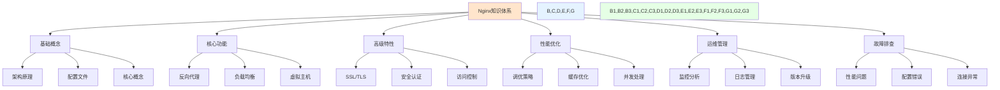
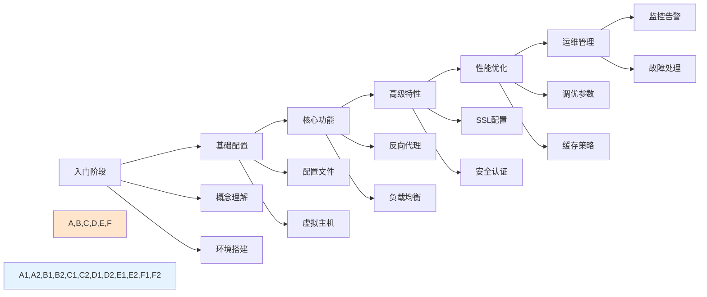

# Nginx知识体系介绍

## 概述

Nginx（发音为"engine-x"）是一个高性能的HTTP和反向代理服务器，也是一个IMAP/POP3/SMTP代理服务器。由俄罗斯程序员Igor Sysoev开发，于2004年首次发布。Nginx以其高并发处理能力、低内存消耗和高可靠性而闻名。

本文档将系统性地介绍Nginx的知识体系，从基础概念到高级应用，帮助读者全面掌握Nginx的核心技术和最佳实践。

## 知识体系结构

Nginx知识体系可以分为以下几个主要模块：

## 基础概念模块

### 核心概念
- **正向代理与反向代理**：理解代理的基本概念及其在Nginx中的应用
- **负载均衡**：掌握Nginx的负载均衡机制和算法
- **虚拟主机**：学习如何在单个Nginx实例上托管多个网站

### 架构原理
- **Master-Worker进程模型**：理解Nginx的高性能架构设计
- **事件驱动机制**：掌握Nginx的异步非阻塞I/O处理模型
- **模块化设计**：了解Nginx的模块化架构和扩展机制

### 配置文件结构
- **nginx.conf配置**：掌握Nginx主配置文件的组织结构
- **指令作用域**：理解不同配置指令的作用范围和优先级
- **配置语法**：学习Nginx配置文件的基本语法规则

## 核心功能模块

### 反向代理
- **基础代理配置**：学习如何配置基本的反向代理
- **代理头设置**：掌握代理请求头的传递和修改
- **代理缓存**：了解代理缓存的配置和优化

### 负载均衡
- **负载均衡算法**：掌握轮询、加权轮询、最少连接等算法
- **健康检查**：学习后端服务器的健康检查机制
- **会话保持**：了解如何实现基于IP的会话保持

### 虚拟主机
- **基于域名的虚拟主机**：配置多个域名指向不同站点
- **基于端口的虚拟主机**：通过不同端口区分站点
- **基于IP的虚拟主机**：使用不同IP地址托管站点

## 高级特性模块

### SSL/TLS安全认证
- **HTTPS配置**：学习如何配置SSL证书实现HTTPS
- **证书管理**：掌握SSL证书的申请、配置和更新
- **安全加固**：了解HTTPS安全配置的最佳实践

### 访问控制与认证
- **基础访问控制**：基于IP地址的访问控制
- **用户认证**：实现HTTP基本认证和摘要认证
- **访问限制**：学习如何限制请求频率和并发连接

## 性能优化模块

### 调优策略
- **系统级优化**：操作系统层面的性能调优
- **配置优化**：Nginx配置参数的优化调整
- **资源管理**：合理分配系统资源提升性能

### 缓存优化
- **静态资源缓存**：配置静态文件的浏览器缓存
- **代理缓存**：实现反向代理的缓存机制
- **缓存策略**：制定合理的缓存更新策略

### 并发处理
- **连接处理**：优化并发连接数和处理能力
- **内存管理**：合理配置缓冲区和内存使用
- **I/O优化**：提升数据传输效率

## 运维管理模块

### 监控分析
- **性能监控**：实时监控Nginx的运行状态
- **日志分析**：分析访问日志和错误日志
- **指标收集**：收集关键性能指标用于分析

### 日志管理
- **日志格式定制**：根据需求定制日志格式
- **日志轮转**：实现日志的自动轮转和归档
- **日志分析工具**：使用工具进行日志分析

### 版本升级
- **平滑升级**：实现不停机的版本升级
- **配置迁移**：新版本配置文件的迁移和适配
- **兼容性检查**：确保升级后的兼容性

## 故障排查模块

### 性能问题
- **响应慢**：诊断和解决响应慢的问题
- **连接超时**：处理连接超时相关问题
- **资源耗尽**：解决内存、CPU等资源耗尽问题

### 配置错误
- **语法错误**：识别和修复配置文件语法错误
- **逻辑错误**：发现和纠正配置逻辑问题
- **权限问题**：解决文件和目录权限相关问题

### 连接异常
- **5xx错误**：诊断和解决5xx系列服务器错误
- **4xx错误**：处理4xx系列客户端错误
- **连接拒绝**：解决连接被拒绝的问题

## 学习路径建议

## 总结

Nginx作为现代Web架构中的关键组件，其知识体系涵盖了从基础概念到高级应用的多个层面。通过系统性地学习和实践，可以充分发挥Nginx在高性能Web服务、反向代理、负载均衡等方面的优势。

后续章节将深入探讨各个模块的具体实现和最佳实践，帮助读者逐步掌握Nginx的核心技术。