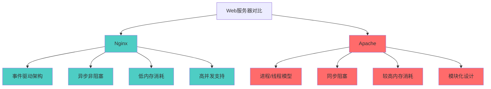
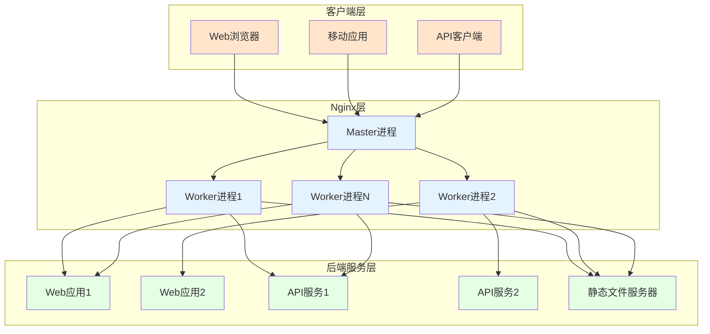
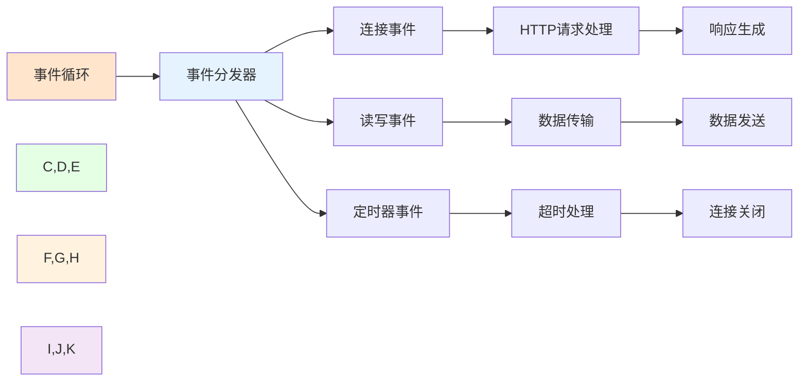
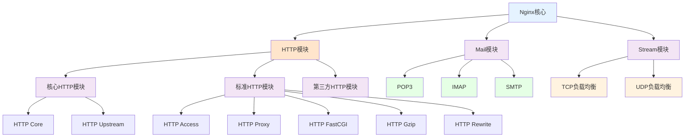
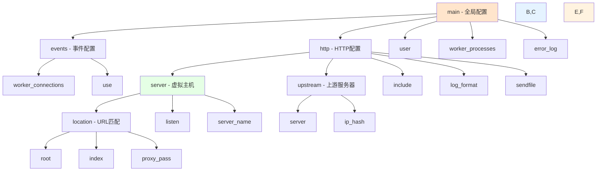

# Nginx基础与核心概念

## 概述

Nginx（发音为"engine-x"）是一个高性能的HTTP和反向代理服务器，也是一个IMAP/POP3/SMTP代理服务器。由俄罗斯程序员Igor Sysoev开发，于2004年首次发布。Nginx以其高并发处理能力、低内存消耗和高可靠性而闻名。

### 什么是Nginx？

Nginx是一个轻量级/高性能的反向代理Web服务器，它实现非常高效的反向代理、负载平衡，可以处理2-3万并发连接数，官方监测能支持5万并发。现在中国使用Nginx的网站用户有很多，例如：新浪、网易、腾讯等。

### 为什么要用Nginx？

使用Nginx有以下优势：
- 跨平台、配置简单、反向代理、高并发连接：处理2-3万并发连接数，官方监测能支持5万并发
- 内存消耗小：开启10个Nginx才占150M内存，Nginx处理静态文件好，耗费内存少
- 内置健康检查功能：如果有一个服务器宕机，会做一个健康检查，再发送的请求就不会发送到宕机的服务器了，重新将请求提交到其他的节点上

使用Nginx还能：
1. 节省宽带：支持GZIP压缩，可以添加浏览器本地缓存
2. 稳定性高：宕机的概率非常小
3. 接收用户请求是异步的

### Nginx的优缺点

**优点：**
1. 占内存小，可实现高并发连接，处理响应快
2. 可实现HTTP服务器、虚拟主机、反向代理、负载均衡
3. Nginx配置简单
4. 可以不暴露正式的服务器IP地址

**缺点：**
动态处理差：Nginx处理静态文件好，耗费内存少，但是处理动态页面则很鸡肋，现在一般前端用Nginx作为反向代理抗住压力。

## Nginx基础概念

### 什么是正向代理和反向代理？

**正向代理（Forward Proxy）**：
正向代理就是一个人发送一个请求直接就到达了目标的服务器。客户端明确知道代理服务器的存在，客户端向代理服务器发送请求，代理服务器代替客户端向目标服务器请求数据。常用于内部网络访问外部网络。

**反向代理（Reverse Proxy）**：
反向代理就是请求统一被Nginx接收，Nginx反向代理服务器接收到之后，按照一定的规则分发给了后端的业务处理服务器进行处理了。客户端不知道代理服务器的存在，客户端向代理服务器发送请求，代理服务器将请求转发给内部服务器。常用于负载均衡、SSL终止、缓存等。

**使用反向代理服务器的优点：**
反向代理服务器可以隐藏源服务器的存在和特征。它充当互联网云和Web服务器之间的中间层。这对于安全方面来说是很好的，特别是当您使用Web托管服务时。

### Nginx与Apache的对比

在理解Nginx之前，有必要了解它与传统Web服务器Apache的区别：



### 为什么Nginx性能这么高？

因为它的事件处理机制：异步非阻塞事件处理机制，运用了epoll模型，提供了一个队列，排队解决。

### 核心概念解析

#### 1. 负载均衡

负载均衡是将工作负载分布到多个服务器上的过程，以提高系统的整体性能和可靠性。

常见的负载均衡算法：
- **轮询（Round Robin）**：依次将请求分发给每个服务器
- **加权轮询（Weighted Round Robin）**：根据服务器权重分配请求
- **最少连接（Least Connections）**：将请求发送给当前连接数最少的服务器
- **IP哈希（IP Hash）**：根据客户端IP地址进行哈希计算，确保同一客户端始终访问同一服务器

#### 2. 虚拟主机

虚拟主机允许在单个Nginx实例上托管多个网站，通过不同的域名或端口来区分不同的站点。

## Nginx系统架构深度解析

### 整体架构图



### Master-Worker进程模型

Nginx采用Master-Worker进程模型，这是其高性能的关键所在：

#### Master进程
- 通常以root用户运行
- 负责管理工作进程（启动、停止、重启、平滑升级）
- 读取和评估配置文件
- 绑定端口（需要特权）
- 不处理客户端请求

#### Worker进程
- 通常以非特权用户运行
- 处理实际的客户端请求
- 数量通常设置为CPU核心数
- 各进程间相互独立，互不影响
- 采用异步非阻塞I/O模型

### 事件驱动架构

Nginx采用事件驱动、异步非阻塞的架构设计：



### 模块化架构

Nginx具有高度模块化的架构，核心功能通过模块来实现：



## Nginx配置文件结构

### Nginx目录结构

```shell
[root@localhost ~]# tree /usr/local/nginx
/usr/local/nginx
├── client_body_temp
├── conf                             # Nginx所有配置文件的目录
│   ├── fastcgi.conf                 # fastcgi相关参数的配置文件
│   ├── fastcgi.conf.default         # fastcgi.conf的原始备份文件
│   ├── fastcgi_params               # fastcgi的参数文件
│   ├── fastcgi_params.default       
│   ├── koi-utf
│   ├── koi-win
│   ├── mime.types                   # 媒体类型
│   ├── mime.types.default
│   ├── nginx.conf                   # Nginx主配置文件
│   ├── nginx.conf.default
│   ├── scgi_params                  # scgi相关参数文件
│   ├── scgi_params.default  
│   ├── uwsgi_params                 # uwsgi相关参数文件
│   ├── uwsgi_params.default
│   └── win-utf
├── fastcgi_temp                     # fastcgi临时数据目录
├── html                             # Nginx默认站点目录
│   ├── 50x.html                     # 错误页面优雅替代显示文件，例如当出现502错误时会调用此页面
│   └── index.html                   # 默认的首页文件
├── logs                             # Nginx日志目录
│   ├── access.log                   # 访问日志文件
│   ├── error.log                    # 错误日志文件
│   └── nginx.pid                    # pid文件，Nginx进程启动后，会把所有进程的ID号写到此文件
├── proxy_temp                       # 临时目录
├── sbin                             # Nginx命令目录
│   └── nginx                        # Nginx的启动命令
├── scgi_temp                        # 临时目录
└── uwsgi_temp                       # 临时目录
```

### 配置文件组织

Nginx配置文件通常位于`/etc/nginx/nginx.conf`，其结构如下：

```nginx
# 全局块 - 影响整个Nginx服务器
user nginx;
worker_processes auto;
error_log /var/log/nginx/error.log;
pid /run/nginx.pid;

# events块 - 影响事件处理模型
events {
    worker_connections 1024;
    use epoll;
    multi_accept on;
}

# http块 - 配置HTTP服务器相关
http {
    # HTTP全局块
    include /etc/nginx/mime.types;
    default_type application/octet-stream;
    
    log_format main '$remote_addr - $remote_user [$time_local] "$request" '
                    '$status $body_bytes_sent "$http_referer" '
                    '"$http_user_agent" "$http_x_forwarded_for"';
    
    access_log /var/log/nginx/access.log main;
    
    sendfile on;
    tcp_nopush on;
    tcp_nodelay on;
    keepalive_timeout 65;
    
    # server块 - 虚拟主机配置
    server {
        listen 80;
        server_name example.com;
        
        # location块 - URL匹配规则
        location / {
            root /usr/share/nginx/html;
            index index.html index.htm;
        }
        
        location /api/ {
            proxy_pass http://backend;
        }
    }
    
    # upstream块 - 定义后端服务器组
    upstream backend {
        server 192.168.1.10:8080;
        server 192.168.1.11:8080;
    }
}
```

### Nginx配置文件nginx.conf属性模块

```shell
worker_processes  1;                			# worker进程的数量
events {                              			# 事件区块开始
    worker_connections  1024;          		# 每个worker进程支持的最大连接数
}                               			# 事件区块结束
http {                           			# HTTP区块开始
    include       mime.types;         			# Nginx支持的媒体类型库文件
    default_type  application/octet-stream;            # 默认的媒体类型
    sendfile        on;       				# 开启高效传输模式
    keepalive_timeout  65;       			# 连接超时
    server {            		                # 第一个Server区块开始，表示一个独立的虚拟主机站点
        listen       80;      			        # 提供服务的端口，默认80
        server_name  localhost;    			# 提供服务的域名主机名
        location / {            	        	# 第一个location区块开始
            root   html;       			# 站点的根目录，相当于Nginx的安装目录
            index  index.html index.htm;       	# 默认的首页文件，多个用空格分开
        }          				        # 第一个location区块结果
        error_page   500502503504  /50x.html;          # 出现对应的http状态码时，使用50x.html回应客户
        location = /50x.html {          	        # location区块开始，访问50x.html
            root   html;      		      	        # 指定对应的站点目录为html
        }
    }  
    ......
```

### 配置指令作用域

Nginx配置指令根据其作用域分为不同层级：



## 核心模块详解

### HTTP核心模块

HTTP核心模块是Nginx处理HTTP请求的基础模块：

```nginx
http {
    # 基本文件处理
    include /etc/nginx/mime.types;
    default_type application/octet-stream;
    
    # 日志配置
    log_format main '$remote_addr - $remote_user [$time_local] "$request" '
                    '$status $body_bytes_sent "$http_referer" '
                    '"$http_user_agent" "$http_x_forwarded_for"';
    
    access_log /var/log/nginx/access.log main;
    error_log /var/log/nginx/error.log;
    
    # 性能优化
    sendfile on;
    tcp_nopush on;
    tcp_nodelay on;
    keepalive_timeout 65;
    keepalive_requests 100;
    
    # 数据传输优化
    client_max_body_size 10m;
    client_body_buffer_size 128k;
    client_header_buffer_size 1k;
    large_client_header_buffers 4 4k;
    
    # 输出缓冲区
    output_buffers 1 32k;
    postpone_output 1460;
}
```

### 虚拟主机配置

虚拟主机允许在单个Nginx实例上托管多个网站：

```nginx
# 基于域名的虚拟主机
server {
    listen 80;
    server_name www.example.com;
    root /var/www/example;
    index index.html;
}

server {
    listen 80;
    server_name www.another.com;
    root /var/www/another;
    index index.html;
}

# 基于端口的虚拟主机
server {
    listen 8080;
    server_name localhost;
    root /var/www/app1;
}

server {
    listen 8081;
    server_name localhost;
    root /var/www/app2;
}

# 基于IP的虚拟主机
server {
    listen 192.168.1.100:80;
    server_name example.com;
    root /var/www/site1;
}

server {
    listen 192.168.1.101:80;
    server_name example.com;
    root /var/www/site2;
}
```

#### Nginx虚拟主机配置方法

1. 基于域名的虚拟主机，通过域名来区分虚拟主机——应用：外部网站
2. 基于端口的虚拟主机，通过端口来区分虚拟主机——应用：公司内部网站，外部网站的管理后台
3. 基于IP的虚拟主机。

##### 基于虚拟主机配置域名

需要建立/data/www /data/bbs目录，Windows本地hosts添加虚拟机IP地址对应的域名解析；对应域名网站目录下新增index.html文件：

```shell
#当客户端访问www.lijie.com,监听端口号为80,直接跳转到data/www目录下文件
server {
    listen       80;
    server_name  www.lijie.com;
    location / {
        root   data/www;
        index  index.html index.htm;
    }
}

#当客户端访问www.lijie.com,监听端口号为80,直接跳转到data/bbs目录下文件
server {
    listen       80;
    server_name  bbs.lijie.com;
    location / {
        root   data/bbs;
        index  index.html index.htm;
    }
}
```

##### 基于端口的虚拟主机

使用端口来区分，浏览器使用域名或IP地址:端口号访问：

```shell
#当客户端访问www.lijie.com,监听端口号为8080,直接跳转到data/www目录下文件
server {
    listen       8080;
    server_name  8080.lijie.com;
    location / {
        root   data/www;
        index  index.html index.htm;
    }
}

#当客户端访问www.lijie.com,监听端口号为80直接跳转到真实IP服务器地址 127.0.0.1:8080
server {
    listen       80;
    server_name  www.lijie.com;
    location / {
        proxy_pass http://127.0.0.1:8080;
        index  index.html index.htm;
    }
}
```

### 反向代理配置

反向代理是Nginx的核心功能之一：

```nginx
# 基础反向代理
server {
    listen 80;
    server_name api.example.com;
    
    location / {
        proxy_pass http://backend_servers;
        proxy_set_header Host $host;
        proxy_set_header X-Real-IP $remote_addr;
        proxy_set_header X-Forwarded-For $proxy_add_x_forwarded_for;
        proxy_set_header X-Forwarded-Proto $scheme;
    }
}

# 负载均衡配置
upstream backend_servers {
    # 轮询算法（默认）
    server 192.168.1.10:8080;
    server 192.168.1.11:8080;
    server 192.168.1.12:8080;
    
    # 加权轮询
    # server 192.168.1.10:8080 weight=3;
    # server 192.168.1.11:8080 weight=2;
    # server 192.168.1.12:8080 weight=1;
    
    # 最少连接
    # least_conn;
    # server 192.168.1.10:8080;
    # server 192.168.1.11:8080;
    
    # IP哈希
    # ip_hash;
    # server 192.168.1.10:8080;
    # server 192.168.1.11:8080;
}

# 健康检查配置
upstream backend_with_health {
    server 192.168.1.10:8080 max_fails=3 fail_timeout=30s;
    server 192.168.1.11:8080 max_fails=3 fail_timeout=30s;
    server 192.168.1.12:8080 backup;  # 备用服务器
}
```

### Nginx怎么处理请求的？

Nginx接收一个请求后，首先由listen和server_name指令匹配server模块，再匹配server模块里的location，location就是实际地址。

```bash
server {            		    	# 第一个Server区块开始，表示一个独立的虚拟主机站点
    listen       80;      		        # 提供服务的端口，默认80
    server_name  localhost;    		# 提供服务的域名主机名
    location / {            	        # 第一个location区块开始
        root   html;       		# 站点的根目录，相当于Nginx的安装目录
        index  index.html index.htm;    	# 默认的首页文件，多个用空格分开
    }          				# 第一个location区块结果
}           
```

## Location详解

### location的作用

location指令的作用是根据用户请求的URI来执行不同的应用，也就是根据用户请求的网站URL进行匹配，匹配成功即进行相关的操作。

### location的语法

注意：~ 代表自己输入的英文字母

| 匹配符 |           匹配规则           | 优先级 |
| :----: | :--------------------------: | :----: |
|   =    |           精确匹配           |   1    |
|   ^~   |       以某个字符串开头       |   2    |
|   ~    |     区分大小写的正则匹配     |   3    |
|   ~*   |    不区分大小写的正则匹配    |   4    |
|   !~   |    区分大小写不匹配的正则    |   5    |
|  !~*   |   不区分大小写不匹配的正则   |   6    |
|   /    | 通用匹配，任何请求都会匹配到 |   7    |

### Location正则案例

示例：

```shell
#优先级1,精确匹配，根路径
location =/ {
    return 400;
}

#优先级2,以某个字符串开头,以av开头的，优先匹配这里，区分大小写
location ^~ /av {
   root /data/av/;
}

#优先级3，区分大小写的正则匹配，匹配/media*****路径
location ~ /media {
      alias /data/static/;
}

#优先级4 ，不区分大小写的正则匹配，所有的****.jpg|gif|png 都走这里
location ~* .*\.(jpg|gif|png|js|css)$ {
   root  /data/av/;
}

#优先7，通用匹配
location / {
    return 403;
}
```

## 限流机制

### 限流原理

Nginx限流就是限制用户请求速度，防止服务器受不了。限流有3种：
1. 正常限制访问频率（正常流量）
2. 突发限制访问频率（突发流量）
3. 限制并发连接数

Nginx的限流都是基于漏桶流算法。

### 实现三种限流算法

#### 1. 正常限制访问频率（正常流量）

限制一个用户发送的请求，Nginx多久接收一个请求。Nginx中使用ngx_http_limit_req_module模块来限制的访问频率，限制的原理实质是基于漏桶算法原理来实现的。在nginx.conf配置文件中可以使用limit_req_zone命令及limit_req命令限制单个IP的请求处理频率。

```shell
#定义限流维度，一个用户一分钟一个请求进来，多余的全部漏掉
limit_req_zone $binary_remote_addr zone=one:10m rate=1r/m;

#绑定限流维度
server{
    
    location/seckill.html{
        limit_req zone=zone;	
        proxy_pass http://lj_seckill;
    }

}
```

1r/s代表1秒一个请求，1r/m一分钟接收一个请求，如果Nginx这时还有别人的请求没有处理完，Nginx就会拒绝处理该用户请求。

#### 2. 突发限制访问频率（突发流量）

上面的配置一定程度可以限制访问频率，但是也存在着一个问题：如果突发流量超出请求被拒绝处理，无法处理活动时候的突发流量，这时候应该如何进一步处理呢？Nginx提供burst参数结合nodelay参数可以解决流量突发的问题，可以设置能处理的超过设置的请求数外能额外处理的请求数。我们可以将之前的例子添加burst参数以及nodelay参数：

```shell
#定义限流维度，一个用户一分钟一个请求进来，多余的全部漏掉
limit_req_zone $binary_remote_addr zone=one:10m rate=1r/m;

#绑定限流维度
server{
    
    location/seckill.html{
        limit_req zone=zone burst=5 nodelay;
        proxy_pass http://lj_seckill;
    }

}
```

为什么就多了一个 burst=5 nodelay; 呢，多了这个可以代表Nginx对于一个用户的请求会立即处理前五个，多余的就慢慢来落，没有其他用户的请求我就处理你的，有其他的请求的话我Nginx就漏掉不接受你的请求。

#### 3. 限制并发连接数

Nginx中的ngx_http_limit_conn_module模块提供了限制并发连接数的功能，可以使用limit_conn_zone指令以及limit_conn执行进行配置。接下来我们可以通过一个简单的例子来看下：

```shell
http {
    limit_conn_zone $binary_remote_addr zone=myip:10m;
    limit_conn_zone $server_name zone=myServerName:10m;
}

server {
    location / {
        limit_conn myip 10;
        limit_conn myServerName 100;
        rewrite / http://www.xxx.net permanent;
    }
}
```

上面配置了单个IP同时并发连接数最多只能10个连接，并且设置了整个虚拟服务器同时最大并发数最多只能100个链接。当然，只有当请求的header被服务器处理后，虚拟服务器的连接数才会计数。

### 漏桶流算法和令牌桶算法

#### 漏桶算法

漏桶算法是网络世界中流量整形或速率限制时经常使用的一种算法，它的主要目的是控制数据注入到网络的速率，平滑网络上的突发流量。漏桶算法提供了一种机制，通过它，突发流量可以被整形以便为网络提供一个稳定的流量。也就是我们刚才所讲的情况。漏桶算法提供的机制实际上就是刚才的案例：**突发流量会进入到一个漏桶，漏桶会按照我们定义的速率依次处理请求，如果水流过大也就是突发流量过大就会直接溢出，则多余的请求会被拒绝。所以漏桶算法能控制数据的传输速率。**

#### 令牌桶算法

令牌桶算法是网络流量整形和速率限制中最常使用的一种算法。典型情况下，令牌桶算法用来控制发送到网络上的数据的数目，并允许突发数据的发送。Google开源项目Guava中的RateLimiter使用的就是令牌桶控制算法。**令牌桶算法的机制如下：存在一个大小固定的令牌桶，会以恒定的速率源源不断产生令牌。如果令牌消耗速率小于生产令牌的速度，令牌就会一直产生直至装满整个令牌桶。**

## 静态资源处理

### Nginx静态资源

静态资源访问，就是存放在Nginx的html页面，我们可以自己编写。

### 为什么要做动静分离？

Nginx是当下最热的Web容器，网站优化的重要点在于静态化网站，网站静态化的关键点则是是动静分离，动静分离是让动态网站里的动态网页根据一定规则把不变的资源和经常变的资源区分开来，动静资源做好了拆分以后，我们则根据静态资源的特点将其做缓存操作。

让静态的资源只走静态资源服务器，动态的走动态的服务器。Nginx的静态处理能力很强，但是动态处理能力不足，因此，在企业中常用动静分离技术。

对于静态资源比如图片，js，css等文件，我们则在反向代理服务器Nginx中进行缓存。这样浏览器在请求一个静态资源时，代理服务器Nginx就可以直接处理，无需将请求转发给后端服务器Tomcat。若用户请求的动态文件，比如servlet,jsp则转发给Tomcat服务器处理，从而实现动静分离。这也是反向代理服务器的一个重要的作用。

### Nginx怎么做的动静分离？

只需要指定路径对应的目录。location可以使用正则表达式匹配，并指定对应的硬盘中的目录。如下：（操作都是在Linux上）

```shell
location /image/ {
    root   /usr/local/static/;
    autoindex on;
}
```

操作步骤：
1. 创建目录
   ```shell
   mkdir /usr/local/static/image
   ```
2. 进入目录
   ```shell
   cd  /usr/local/static/image
   ```
3. 放一张照片上去
   ```shell
   1.jpg
   ```
4. 重启Nginx
   ```shell
   sudo nginx -s reload
   ```
5. 打开浏览器输入 server_name/image/1.jpg 就可以访问该静态图片了

## 负载均衡策略

为了避免服务器崩溃，大家会通过负载均衡的方式来分担服务器压力。将对台服务器组成一个集群，当用户访问时，先访问到一个转发服务器，再由转发服务器将访问分发到压力更小的服务器。

Nginx负载均衡实现的策略有以下五种：

### 1. 轮询(默认)

每个请求按时间顺序逐一分配到不同的后端服务器，如果后端某个服务器宕机，能自动剔除故障系统。

```shell
upstream backserver { 
   server 192.168.x.x; 
   server 192.168.x.x; 
} 
```

### 2. 权重 weight

```shell
- weight的值越大分配到的访问概率越高，主要用于后端每台服务器性能不均衡的情况下。其次是为在主从的情况下设置不同的权值，达到合理有效的地利用主机资源。
upstream backserver { 
   server 192.168.0.x weight=2; 
   server 192.168.0.x weight=8; 
} 
- 权重越高，在被访问的概率越大，如上例，分别是20%，80%。
```

### 3. IP哈希(ip_hash)

每个请求按访问IP的哈希结果分配，使来自同一个IP的访客固定访问一台后端服务器，`并且可以有效解决动态网页存在的session共享问题`

```shell
upstream backserver { 
     ip_hash; 
     server 192.168.0.x:x; 
     server 192.168.0.x:x; 
} 
```

### 4. Fair(第三方插件)

必须安装upstream_fair模块。对比weight、ip_hash更加智能的负载均衡算法，fair算法可以根据页面大小和加载时间长短智能地进行负载均衡，响应时间短的优先分配。

```shell
upstream backserver { 
   server server1; 
   server server2; 
   fair; 
} 
- 哪个服务器的响应速度快，就将请求分配到那个服务器上。
```

### 5. URL哈希(url_hash)(第三方插件)

必须安装Nginx的hash软件包。按访问url的hash结果来分配请求，使每个url定向到同一个后端服务器，可以进一步提高后端缓存服务器的效率。

```shell
upstream backserver { 
   server squid1:3128; 
   server squid2:3128; 
   hash $request_uri; 
   hash_method crc32; 
} 
```

## 高级功能

### Nginx配置高可用性

当上游服务器(真实访问服务器)，一旦出现故障或者是没有及时相应的话，应该直接轮训到下一台服务器，保证服务器的高可用。

```shell
server {
    listen       80;
    server_name  www.lijie.com;
    location / {
        ### 指定上游服务器负载均衡服务器
        proxy_pass http://backServer;
        ###nginx与上游服务器(真实访问的服务器)超时时间 后端服务器连接的超时时间_发起握手等候响应超时时间
        proxy_connect_timeout 1s;
        ###nginx发送给上游服务器(真实访问的服务器)超时时间
        proxy_send_timeout 1s;
        ### nginx接受上游服务器(真实访问的服务器)超时时间
        proxy_read_timeout 1s;
        index  index.html index.htm;
    }
}
```

### 如何用Nginx解决前端跨域问题？

使用Nginx转发请求。把跨域的接口写成调本域的接口，然后将这些接口转发到真正的请求地址。

### 访问控制

#### Nginx怎么判断别IP不可访问？

```shell
如果访问的ip地址为192.168.9.115,则返回403
if  ($remote_addr = 192.168.9.115) {  
     return 403;  
}  
```

#### 怎么限制浏览器访问？

```shell
不允许谷歌浏览器访问 如果是谷歌浏览器返回500
if ($http_user_agent ~ Chrome) {   
    return 500;  
}
```

### Rewrite全局变量

|       变量        |                             含义                             |
| :---------------: | :----------------------------------------------------------: |
|       $args       |         这个变量等于请求行中的参数，同$query_string          |
|  $contentlength   |                请求头中的Content-length字段。                |
|   $content_type   |                 请求头中的Content-Type字段。                 |
|  $document_root   |                当前请求在root指令中指定的值。                |
|       $host       |              请求主机头字段，否则为服务器名称。              |
| $http_user_agent  |                       客户端agent信息                        |
|   $http_cookie    |                       客户端cookie信息                       |
|    $limit_rate    |                  这个变量可以限制连接速率。                  |
|  $request_method  |             客户端请求的动作，通常为GET或POST。              |
|   $remote_addr    |                       客户端的IP地址。                       |
|   $remote_port    |                        客户端的端口。                        |
|   $remote_user    |            已经经过AuthBasicModule验证的用户名。             |
| $request_filename |     当前请求的文件路径，由root或alias指令与URI请求生成。     |
|      $scheme      |                 HTTP方法（如http，https）。                  |
| $server_protocol  |          请求使用的协议，通常是HTTP/1.0或HTTP/1.1。          |
|   $server_addr    |       服务器地址，在完成一次系统调用后可以确定这个值。       |
|   $server_name    |                         服务器名称。                         |
|   $server_port    |                   请求到达服务器的端口号。                   |
|   $request_uri    | 包含请求参数的原始URI，不包含主机名，如"/foo/bar.php?arg=baz"。 |
|       $uri        | 不带请求参数的当前URI，$uri不包含主机名，如"/foo/bar.html"。 |
|   $document_uri   |                         与$uri相同。                         |

## Nginx应用场景

1. HTTP服务器。Nginx是一个HTTP服务可以独立提供HTTP服务。可以做网页静态服务器。
2. 虚拟主机。可以实现在一台服务器虚拟出多个网站，例如个人网站使用的虚拟机。
3. 反向代理，负载均衡。当网站的访问量达到一定程度后，单台服务器不能满足用户的请求时，需要用多台服务器集群可以使用Nginx做反向代理。并且多台服务器可以平均分担负载，不会因为某台服务器负载高宕机而某台服务器闲置的情况。
4. Nginx中也可以配置安全管理、比如可以使用Nginx搭建API接口网关，对每个接口服务进行拦截。

## 生产环境配置实践

### 安全配置

```nginx
server {
    listen 80;
    server_name example.com;
    
    # 隐藏版本信息
    server_tokens off;
    
    # 防止恶意访问
    if ($request_method !~ ^(GET|HEAD|POST)$ ) {
        return 405;
    }
    
    # 防止访问敏感文件
    location ~ /\. {
        deny all;
        access_log off;
        log_not_found off;
    }
    
    # 限制请求频率
    limit_req_zone $binary_remote_addr zone=one:10m rate=1r/s;
    location /login {
        limit_req zone=one burst=5;
    }
    
    # 安全头设置
    add_header X-Frame-Options "SAMEORIGIN" always;
    add_header X-XSS-Protection "1; mode=block" always;
    add_header X-Content-Type-Options "nosniff" always;
    add_header Referrer-Policy "no-referrer-when-downgrade" always;
    add_header Content-Security-Policy "default-src 'self' http: https: data: blob: 'unsafe-inline'" always;
}
```

### 性能优化配置

```nginx
# 全局性能优化
worker_processes auto;
worker_rlimit_nofile 65535;

events {
    worker_connections 65535;
    use epoll;
    multi_accept on;
}

http {
    # 基本优化
    sendfile on;
    tcp_nopush on;
    tcp_nodelay on;
    keepalive_timeout 65;
    
    # Gzip压缩
    gzip on;
    gzip_vary on;
    gzip_min_length 1024;
    gzip_comp_level 6;
    gzip_types
        text/plain
        text/css
        text/xml
        text/javascript
        application/json
        application/javascript
        application/xml+rss
        application/atom+xml
        image/svg+xml;
    
    # 缓冲区优化
    client_body_buffer_size 128k;
    client_max_body_size 10m;
    client_header_buffer_size 1k;
    large_client_header_buffers 4 4k;
    output_buffers 1 32k;
    
    # 超时设置
    client_header_timeout 60;
    client_body_timeout 60;
    send_timeout 60;
    keepalive_timeout 65;
}
```

### 日志管理配置

```nginx
# 自定义日志格式
log_format main '$remote_addr - $remote_user [$time_local] "$request" '
                '$status $body_bytes_sent "$http_referer" '
                '"$http_user_agent" "$http_x_forwarded_for" '
                '$request_time $upstream_response_time';

log_format detailed '$remote_addr - $remote_user [$time_local] '
                    '"$request" $status $body_bytes_sent '
                    '"$http_referer" "$http_user_agent" '
                    'rt=$request_time uct="$upstream_connect_time" '
                    'uht="$upstream_header_time" urt="$upstream_response_time"';

# 访问日志
access_log /var/log/nginx/access.log main;

# 错误日志
error_log /var/log/nginx/error.log warn;

# 条件日志记录
map $status $loggable {
    ~^[23] 0;
    default 1;
}
access_log /var/log/nginx/access.log main if=$loggable;
```

## 常见架构模式

### 静态文件服务器

```nginx
server {
    listen 80;
    server_name static.example.com;
    root /var/www/static;
    
    # 启用目录列表
    location / {
        autoindex on;
        autoindex_exact_size off;
        autoindex_format html;
        autoindex_localtime on;
    }
    
    # 静态文件缓存
    location ~* \.(jpg|jpeg|png|gif|ico|css|js)$ {
        expires 1y;
        add_header Cache-Control "public, immutable";
    }
    
    # 字体文件缓存
    location ~* \.(woff|woff2|ttf|eot)$ {
        expires 1y;
        add_header Access-Control-Allow-Origin "*";
    }
}
```

### API网关模式

```nginx
upstream api_backend {
    server 192.168.1.10:8080;
    server 192.168.1.11:8080;
}

server {
    listen 80;
    server_name api.example.com;
    
    # 限流配置
    limit_req_zone $binary_remote_addr zone=api:10m rate=100r/s;
    
    # 健康检查端点
    location /health {
        access_log off;
        return 200 "healthy\n";
        add_header Content-Type text/plain;
    }
    
    # API路由
    location /v1/users/ {
        limit_req zone=api burst=200 nodelay;
        proxy_pass http://api_backend/users/;
        proxy_set_header Host $host;
        proxy_set_header X-Real-IP $remote_addr;
        proxy_set_header X-Forwarded-For $proxy_add_x_forwarded_for;
    }
    
    location /v1/products/ {
        limit_req zone=api burst=150 nodelay;
        proxy_pass http://api_backend/products/;
        proxy_set_header Host $host;
        proxy_set_header X-Real-IP $remote_addr;
        proxy_set_header X-Forwarded-For $proxy_add_x_forwarded_for;
    }
}
```

### 微服务架构中的负载均衡

```nginx
# 用户服务
upstream user_service {
    least_conn;
    server 192.168.1.10:8080 weight=3;
    server 192.168.1.11:8080 weight=3;
    server 192.168.1.12:8080 backup;
}

# 订单服务
upstream order_service {
    least_conn;
    server 192.168.2.10:8080;
    server 192.168.2.11:8080;
}

# 支付服务
upstream payment_service {
    least_conn;
    server 192.168.3.10:8080;
    server 192.168.3.11:8080;
}

server {
    listen 80;
    server_name microservices.example.com;
    
    location /api/users/ {
        proxy_pass http://user_service;
        proxy_set_header Host $host;
        proxy_set_header X-Real-IP $remote_addr;
        proxy_set_header X-Forwarded-For $proxy_add_x_forwarded_for;
    }
    
    location /api/orders/ {
        proxy_pass http://order_service;
        proxy_set_header Host $host;
        proxy_set_header X-Real-IP $remote_addr;
        proxy_set_header X-Forwarded-For $proxy_add_x_forwarded_for;
    }
    
    location /api/payments/ {
        proxy_pass http://payment_service;
        proxy_set_header Host $host;
        proxy_set_header X-Real-IP $remote_addr;
        proxy_set_header X-Forwarded-For $proxy_add_x_forwarded_for;
    }
}
```

## 总结与最佳实践

### 设计原则总结

1. **进程模型选择**
   - Worker进程数设置为CPU核心数
   - 合理设置worker_connections参数
   - 使用epoll事件模型（Linux环境）

2. **配置文件组织**
   - 按功能模块分割配置文件
   - 使用include指令组织配置
   - 保持配置文件简洁清晰

3. **性能优化原则**
   - 启用sendfile和tcp_nopush
   - 合理设置缓冲区大小
   - 使用Gzip压缩减少传输数据

4. **安全配置原则**
   - 隐藏版本信息
   - 设置安全头
   - 限制请求频率
   - 防止访问敏感文件

### 常见误区避免

- ❌ 所有配置都写在主配置文件中
- ❌ 忽略日志管理和监控
- ❌ 不合理设置worker_processes和worker_connections
- ❌ 忽略安全配置和访问控制

理解Nginx的基础概念和架构是构建高性能Web应用的基石。