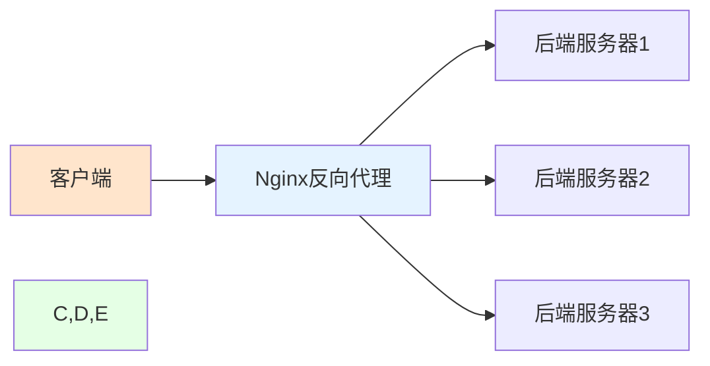

# Nginx核心-反向代理与负载均衡

## 业务场景引入

在构建一个大型电商平台时，系统架构师面临以下挑战：

1. **高并发访问处理**：平台在促销活动期间需要同时处理数十万用户请求
2. **服务解耦需求**：用户服务、商品服务、订单服务需要独立部署和扩展
3. **故障容错机制**：当某个服务实例出现故障时，系统应自动切换到健康实例
4. **性能优化要求**：需要合理分配请求负载，避免单点过载
5. **安全访问控制**：对外暴露统一入口，隐藏内部服务细节

这些需求正是Nginx反向代理和负载均衡功能的核心应用场景。通过合理配置，Nginx可以作为系统的统一入口，实现请求分发、故障转移、性能优化等关键功能。

## 反向代理深度解析

### 反向代理基本概念

反向代理是一种服务器架构模式，代理服务器接收客户端的请求，然后将请求转发给一个或多个后端服务器，最后将从后端服务器得到的结果返回给客户端。客户端通常不知道实际处理请求的是哪台服务器。



### 反向代理的优势

1. **安全性增强**：隐藏后端服务器信息，防止直接暴露
2. **负载分担**：将请求分发到多个服务器，提高整体处理能力
3. **缓存加速**：缓存静态内容，减少后端服务器压力
4. **SSL终止**：在代理层处理SSL加密解密，减轻后端负担
5. **压缩优化**：在代理层进行内容压缩，减少网络传输

### 基础反向代理配置

```nginx
# 基础反向代理配置
server {
    listen 80;
    server_name api.example.com;
    
    location / {
        # 基本反向代理
        proxy_pass http://backend_servers;
        
        # 传递客户端真实信息
        proxy_set_header Host $host;
        proxy_set_header X-Real-IP $remote_addr;
        proxy_set_header X-Forwarded-For $proxy_add_x_forwarded_for;
        proxy_set_header X-Forwarded-Proto $scheme;
        
        # 超时设置
        proxy_connect_timeout 30s;
        proxy_send_timeout 30s;
        proxy_read_timeout 30s;
        
        # 缓冲区设置
        proxy_buffering on;
        proxy_buffer_size 4k;
        proxy_buffers 8 4k;
    }
}

# 后端服务器定义
upstream backend_servers {
    server 192.168.1.10:8080;
    server 192.168.1.11:8080;
    server 192.168.1.12:8080;
}
```

### 高级反向代理配置

```nginx
# 高级反向代理配置
server {
    listen 443 ssl http2;
    server_name api.example.com;
    
    # SSL配置
    ssl_certificate /etc/nginx/ssl/api.example.com.crt;
    ssl_certificate_key /etc/nginx/ssl/api.example.com.key;
    
    # 安全头设置
    add_header Strict-Transport-Security "max-age=31536000; includeSubDomains" always;
    add_header X-Frame-Options "SAMEORIGIN" always;
    add_header X-Content-Type-Options "nosniff" always;
    
    location / {
        # 基本反向代理
        proxy_pass http://backend_servers;
        
        # 传递客户端信息
        proxy_set_header Host $host;
        proxy_set_header X-Real-IP $remote_addr;
        proxy_set_header X-Forwarded-For $proxy_add_x_forwarded_for;
        proxy_set_header X-Forwarded-Proto $scheme;
        proxy_set_header X-Forwarded-Port $server_port;
        
        # 连接和超时设置
        proxy_connect_timeout 10s;
        proxy_send_timeout 30s;
        proxy_read_timeout 30s;
        proxy_next_upstream error timeout invalid_header http_500 http_502 http_503 http_504;
        
        # 缓冲区优化
        proxy_buffering on;
        proxy_buffer_size 128k;
        proxy_buffers 4 256k;
        proxy_busy_buffers_size 256k;
        
        # WebSocket支持
        proxy_http_version 1.1;
        proxy_set_header Upgrade $http_upgrade;
        proxy_set_header Connection "upgrade";
    }
    
    # 健康检查端点
    location /health {
        access_log off;
        return 200 "healthy\n";
        add_header Content-Type text/plain;
    }
}

# 后端服务器组
upstream backend_servers {
    # 最少连接算法
    least_conn;
    
    # 服务器配置
    server 192.168.1.10:8080 weight=3 max_fails=3 fail_timeout=30s;
    server 192.168.1.11:8080 weight=3 max_fails=3 fail_timeout=30s;
    server 192.168.1.12:8080 weight=2 max_fails=3 fail_timeout=30s;
    server 192.168.1.13:8080 backup;  # 备用服务器
}
```

### 不同协议的反向代理

#### HTTP/HTTPS反向代理

```nginx
# HTTP反向代理
location /api/ {
    proxy_pass http://backend_api;
    proxy_set_header Host $host;
    proxy_set_header X-Real-IP $remote_addr;
    proxy_set_header X-Forwarded-For $proxy_add_x_forwarded_for;
}

# HTTPS反向代理
location /secure-api/ {
    proxy_pass https://secure_backend;
    proxy_set_header Host $host;
    proxy_set_header X-Real-IP $remote_addr;
    proxy_set_header X-Forwarded-For $proxy_add_x_forwarded_for;
    proxy_set_header X-Forwarded-Proto https;
    
    # SSL相关设置
    proxy_ssl_verify off;
    proxy_ssl_session_reuse on;
}
```

#### TCP/UDP反向代理（Stream模块）

```nginx
# TCP反向代理配置
stream {
    upstream mysql_backend {
        server 192.168.1.10:3306;
        server 192.168.1.11:3306;
    }
    
    server {
        listen 3306;
        proxy_pass mysql_backend;
        proxy_timeout 1s;
        proxy_responses 1;
    }
    
    # UDP反向代理
    upstream dns_backend {
        server 192.168.1.10:53;
        server 192.168.1.11:53;
    }
    
    server {
        listen 53 udp;
        proxy_pass dns_backend;
    }
}
```

## 负载均衡算法详解

### 轮询算法（Round Robin）

轮询是最简单的负载均衡算法，按顺序将请求分发给每个服务器。

```nginx
upstream backend {
    # 默认使用轮询算法
    server 192.168.1.10:8080;
    server 192.168.1.11:8080;
    server 192.168.1.12:8080;
}
```

### 加权轮询算法（Weighted Round Robin）

根据服务器权重分配请求，权重高的服务器处理更多请求。

```nginx
upstream backend {
    # 加权轮询算法
    server 192.168.1.10:8080 weight=5;  # 50%的请求
    server 192.168.1.11:8080 weight=3;  # 30%的请求
    server 192.168.1.12:8080 weight=2;  # 20%的请求
}
```

### 最少连接算法（Least Connections）

将请求发送给当前连接数最少的服务器。

```nginx
upstream backend {
    # 最少连接算法
    least_conn;
    server 192.168.1.10:8080;
    server 192.168.1.11:8080;
    server 192.168.1.12:8080;
}
```

### IP哈希算法（IP Hash）

根据客户端IP地址进行哈希计算，确保同一客户端始终访问同一服务器。

```nginx
upstream backend {
    # IP哈希算法
    ip_hash;
    server 192.168.1.10:8080;
    server 192.168.1.11:8080;
    server 192.168.1.12:8080;
}
```

### 通用哈希算法（Hash）

根据指定的键进行哈希计算。

```nginx
upstream backend {
    # 通用哈希算法
    hash $request_uri consistent;
    server 192.168.1.10:8080;
    server 192.168.1.11:8080;
    server 192.168.1.12:8080;
}

# 或者根据其他变量进行哈希
upstream backend {
    hash $cookie_user consistent;
    server 192.168.1.10:8080;
    server 192.168.1.11:8080;
    server 192.168.1.12:8080;
}
```

### 随机算法（Random）

随机选择服务器，可配合权重使用。

```nginx
upstream backend {
    # 随机算法
    random;
    server 192.168.1.10:8080 weight=3;
    server 192.168.1.11:8080 weight=2;
    server 192.168.1.12:8080 weight=1;
}
```

## 负载均衡高级配置

### 服务器状态控制

```nginx
upstream backend {
    server 192.168.1.10:8080 weight=3;           # 正常服务器
    server 192.168.1.11:8080 weight=2 down;     # 永久下线
    server 192.168.1.12:8080 weight=1 backup;   # 备用服务器
    server 192.168.1.13:8080 max_fails=3 fail_timeout=30s;  # 故障检测
}
```

### 健康检查配置

```nginx
upstream backend {
    server 192.168.1.10:8080 max_fails=2 fail_timeout=10s;
    server 192.168.1.11:8080 max_fails=2 fail_timeout=10s;
    server 192.168.1.12:8080 max_fails=2 fail_timeout=10s;
    
    # 健康检查相关指令
    keepalive 32;           # 保持连接数
    keepalive_requests 100; # 每个连接的最大请求数
    keepalive_timeout 60s;  # 保持连接超时时间
}
```

### 会话保持配置

```nginx
# 方法1：使用IP哈希
upstream backend {
    ip_hash;
    server 192.168.1.10:8080;
    server 192.168.1.11:8080;
    server 192.168.1.12:8080;
}

# 方法2：使用Cookie
location / {
    proxy_pass http://backend;
    proxy_set_header Host $host;
    
    # 设置sticky cookie
    proxy_cookie_path / "/; secure; HttpOnly; SameSite=strict";
}

# 方法3：使用upstream的sticky模块（需要第三方模块）
upstream backend {
    sticky cookie srv_id expires=1h domain=.example.com path=/;
    server 192.168.1.10:8080;
    server 192.168.1.11:8080;
    server 192.168.1.12:8080;
}
```

## 实际应用场景配置

### 电商网站负载均衡

```nginx
# 电商网站反向代理配置
upstream user_service {
    least_conn;
    server 192.168.1.10:8080 weight=3 max_fails=3 fail_timeout=30s;
    server 192.168.1.11:8080 weight=3 max_fails=3 fail_timeout=30s;
    server 192.168.1.12:8080 backup;
}

upstream product_service {
    least_conn;
    server 192.168.2.10:8080 weight=2 max_fails=3 fail_timeout=30s;
    server 192.168.2.11:8080 weight=2 max_fails=3 fail_timeout=30s;
    server 192.168.2.12:8080 weight=1 max_fails=3 fail_timeout=30s;
}

upstream order_service {
    least_conn;
    server 192.168.3.10:8080 max_fails=3 fail_timeout=30s;
    server 192.168.3.11:8080 max_fails=3 fail_timeout=30s;
}

server {
    listen 80;
    server_name shop.example.com;
    
    # 用户服务路由
    location /api/users/ {
        proxy_pass http://user_service;
        proxy_set_header Host $host;
        proxy_set_header X-Real-IP $remote_addr;
        proxy_set_header X-Forwarded-For $proxy_add_x_forwarded_for;
        proxy_set_header X-Forwarded-Proto $scheme;
        
        # 用户服务特定配置
        proxy_connect_timeout 5s;
        proxy_send_timeout 10s;
        proxy_read_timeout 10s;
    }
    
    # 商品服务路由
    location /api/products/ {
        proxy_pass http://product_service;
        proxy_set_header Host $host;
        proxy_set_header X-Real-IP $remote_addr;
        proxy_set_header X-Forwarded-For $proxy_add_x_forwarded_for;
        proxy_set_header X-Forwarded-Proto $scheme;
        
        # 商品服务特定配置
        proxy_connect_timeout 3s;
        proxy_send_timeout 5s;
        proxy_read_timeout 5s;
    }
    
    # 订单服务路由
    location /api/orders/ {
        proxy_pass http://order_service;
        proxy_set_header Host $host;
        proxy_set_header X-Real-IP $remote_addr;
        proxy_set_header X-Forwarded-For $proxy_add_x_forwarded_for;
        proxy_set_header X-Forwarded-Proto $scheme;
        
        # 订单服务特定配置
        proxy_connect_timeout 10s;
        proxy_send_timeout 30s;
        proxy_read_timeout 30s;
    }
    
    # 静态资源代理
    location /static/ {
        proxy_pass http://static_servers;
        expires 1y;
        add_header Cache-Control "public, immutable";
    }
}
```

### 微服务架构负载均衡

```nginx
# 微服务架构配置
upstream auth_service {
    least_conn;
    server auth1.internal:8080 weight=2;
    server auth2.internal:8080 weight=2;
    server auth3.internal:8080 backup;
}

upstream payment_service {
    least_conn;
    server payment1.internal:8080;
    server payment2.internal:8080;
}

upstream notification_service {
    least_conn;
    server notification1.internal:8080;
    server notification2.internal:8080;
    server notification3.internal:8080;
}

server {
    listen 80;
    server_name api.microservices.example.com;
    
    # 认证服务
    location /auth/ {
        proxy_pass http://auth_service;
        proxy_set_header Host $host;
        proxy_set_header X-Real-IP $remote_addr;
        proxy_set_header X-Forwarded-For $proxy_add_x_forwarded_for;
        proxy_set_header X-Forwarded-Proto $scheme;
        
        # 认证服务超时设置
        proxy_connect_timeout 2s;
        proxy_send_timeout 5s;
        proxy_read_timeout 5s;
    }
    
    # 支付服务
    location /payment/ {
        proxy_pass http://payment_service;
        proxy_set_header Host $host;
        proxy_set_header X-Real-IP $remote_addr;
        proxy_set_header X-Forwarded-For $proxy_add_x_forwarded_for;
        proxy_set_header X-Forwarded-Proto $scheme;
        
        # 支付服务超时设置
        proxy_connect_timeout 5s;
        proxy_send_timeout 15s;
        proxy_read_timeout 15s;
    }
    
    # 通知服务
    location /notification/ {
        proxy_pass http://notification_service;
        proxy_set_header Host $host;
        proxy_set_header X-Real-IP $remote_addr;
        proxy_set_header X-Forwarded-For $proxy_add_x_forwarded_for;
        proxy_set_header X-Forwarded-Proto $scheme;
        
        # 通知服务超时设置
        proxy_connect_timeout 3s;
        proxy_send_timeout 10s;
        proxy_read_timeout 10s;
    }
    
    # 健康检查端点
    location /health {
        access_log off;
        return 200 "healthy\n";
        add_header Content-Type text/plain;
    }
}
```

### 容器化环境负载均衡

```nginx
# Docker/Kubernetes环境配置
upstream app_backend {
    # 使用DNS解析动态发现服务
    server app-service:8080 resolve;
    server app-service:8081 resolve;
    keepalive 32;
}

server {
    listen 80;
    server_name app.example.com;
    
    location / {
        proxy_pass http://app_backend;
        proxy_set_header Host $host;
        proxy_set_header X-Real-IP $remote_addr;
        proxy_set_header X-Forwarded-For $proxy_add_x_forwarded_for;
        proxy_set_header X-Forwarded-Proto $scheme;
        
        # 容器环境特定配置
        proxy_connect_timeout 2s;
        proxy_send_timeout 5s;
        proxy_read_timeout 5s;
        
        # 启用keepalive
        proxy_http_version 1.1;
        proxy_set_header Connection "";
    }
    
    # 健康检查
    location /health {
        proxy_pass http://app_backend/health;
        proxy_connect_timeout 1s;
        proxy_send_timeout 2s;
        proxy_read_timeout 2s;
    }
}
```

## 性能优化配置

### 连接池优化

```nginx
upstream backend {
    server 192.168.1.10:8080;
    server 192.168.1.11:8080;
    
    # 连接池配置
    keepalive 32;           # 保持连接数
    keepalive_requests 100; # 每个连接的最大请求数
    keepalive_timeout 60s;  # 保持连接超时时间
}

server {
    location / {
        proxy_pass http://backend;
        proxy_http_version 1.1;
        proxy_set_header Connection "";
    }
}
```

### 缓冲区优化

```nginx
upstream backend {
    server 192.168.1.10:8080;
    server 192.168.1.11:8080;
}

server {
    location / {
        proxy_pass http://backend;
        
        # 缓冲区优化
        proxy_buffering on;
        proxy_buffer_size 128k;
        proxy_buffers 4 256k;
        proxy_busy_buffers_size 256k;
        proxy_temp_file_write_size 256k;
        
        # 大文件传输优化
        proxy_max_temp_file_size 1024m;
    }
}
```

### 超时优化

```nginx
upstream backend {
    server 192.168.1.10:8080 max_fails=3 fail_timeout=10s;
    server 192.168.1.11:8080 max_fails=3 fail_timeout=10s;
}

server {
    location / {
        proxy_pass http://backend;
        
        # 超时优化
        proxy_connect_timeout 5s;    # 连接超时
        proxy_send_timeout 10s;      # 发送超时
        proxy_read_timeout 10s;      # 读取超时
        
        # 下游服务器故障转移
        proxy_next_upstream error timeout invalid_header http_500 http_502 http_503 http_504;
        proxy_next_upstream_timeout 10s;
        proxy_next_upstream_tries 3;
    }
}
```

## 监控与日志配置

### 负载均衡状态监控

```nginx
# 启用状态页面
server {
    listen 8080;
    server_name localhost;
    
    location /nginx_status {
        stub_status on;
        access_log off;
        allow 127.0.0.1;
        deny all;
    }
    
    location /upstream_status {
        upstream_show;
        access_log off;
        allow 127.0.0.1;
        deny all;
    }
}
```

### 详细日志配置

```nginx
# 自定义日志格式
log_format upstream_log '$remote_addr - $remote_user [$time_local] "$request" '
                        '$status $body_bytes_sent "$http_referer" '
                        '"$http_user_agent" "$http_x_forwarded_for" '
                        'upstream_addr=$upstream_addr '
                        'upstream_status=$upstream_status '
                        'request_time=$request_time '
                        'upstream_response_time=$upstream_response_time '
                        'upstream_connect_time=$upstream_connect_time';

upstream backend {
    server 192.168.1.10:8080;
    server 192.168.1.11:8080;
}

server {
    access_log /var/log/nginx/upstream_access.log upstream_log;
    
    location / {
        proxy_pass http://backend;
        proxy_set_header Host $host;
        proxy_set_header X-Real-IP $remote_addr;
        proxy_set_header X-Forwarded-For $proxy_add_x_forwarded_for;
    }
}
```

## 故障处理与恢复

### 自动故障检测

```nginx
upstream backend {
    server 192.168.1.10:8080 max_fails=2 fail_timeout=10s;
    server 192.168.1.11:8080 max_fails=2 fail_timeout=10s;
    server 192.168.1.12:8080 max_fails=2 fail_timeout=10s;
    
    # 故障恢复配置
    keepalive 32;
}

server {
    location / {
        proxy_pass http://backend;
        
        # 故障转移配置
        proxy_next_upstream error timeout invalid_header http_500 http_502 http_503 http_504;
        proxy_next_upstream_timeout 10s;
        proxy_next_upstream_tries 3;
    }
}
```

### 手动服务器管理

```nginx
# 通过upstream_conf模块动态管理服务器
upstream backend {
    zone backend 64k;
    server 192.168.1.10:8080;
    server 192.168.1.11:8080;
}

server {
    location /upstream_conf {
        upstream_conf;
        allow 127.0.0.1;
        deny all;
    }
}

# 管理命令示例：
# 添加服务器: curl 'http://localhost/upstream_conf?upstream=backend&server=192.168.1.12:8080&weight=2'
# 移除服务器: curl 'http://localhost/upstream_conf?upstream=backend&remove=&server=192.168.1.10:8080'
# 修改权重: curl 'http://localhost/upstream_conf?upstream=backend&server=192.168.1.11:8080&weight=3'
```

## 最佳实践总结

### 配置优化建议

1. **合理选择负载均衡算法**
   - 一般场景使用最少连接算法
   - 需要会话保持使用IP哈希
   - 特殊需求使用通用哈希

2. **服务器健康检测**
   - 设置合适的max_fails和fail_timeout
   - 配置proxy_next_upstream实现故障转移
   - 定期监控服务器状态

3. **性能调优**
   - 启用连接池减少连接开销
   - 合理配置缓冲区大小
   - 优化超时设置

4. **安全配置**
   - 限制管理接口访问
   - 隐藏版本信息
   - 设置适当的访问控制

### 常见问题处理

1. **负载不均衡**
   - 检查服务器权重配置
   - 确认负载均衡算法选择
   - 监控各服务器连接数

2. **连接超时**
   - 调整proxy_connect_timeout
   - 检查后端服务器性能
   - 优化网络配置

3. **会话丢失**
   - 使用IP哈希或sticky cookie
   - 检查应用程序会话存储
   - 配置适当的故障转移策略

通过深入理解Nginx的反向代理和负载均衡功能，可以构建高可用、高性能的Web应用架构。在实际应用中，需要根据具体业务需求和系统特点，合理配置相关参数，持续监控和优化系统性能。