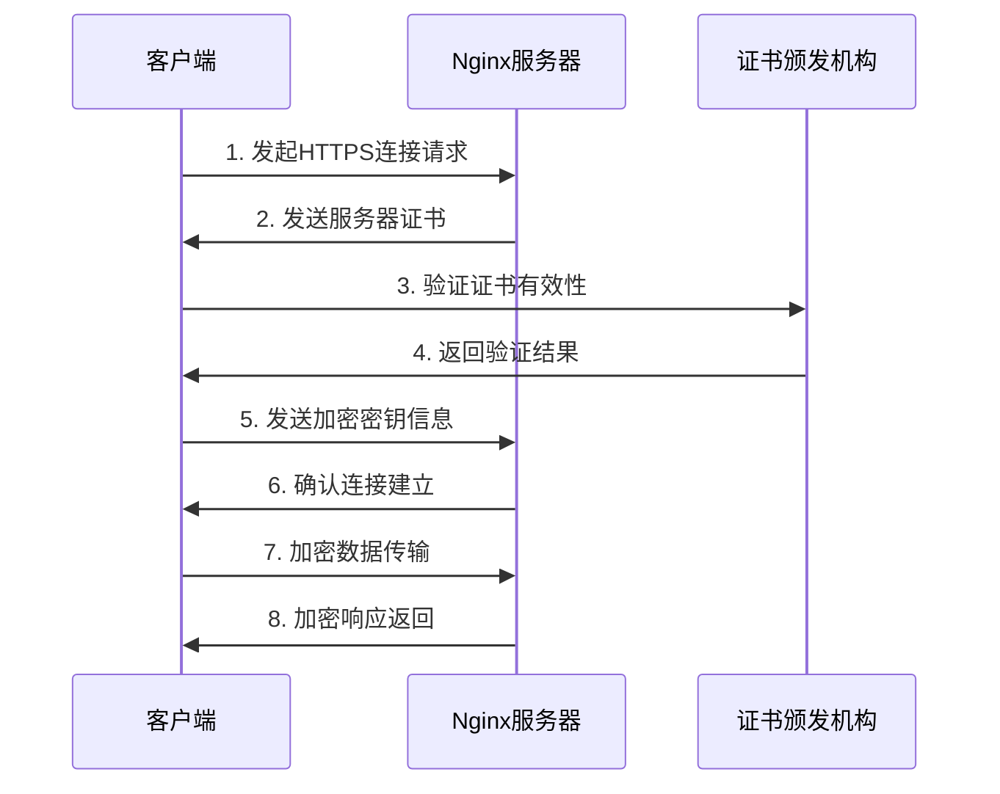

# Nginx高级-SSL安全认证

## 业务场景引入

在构建金融支付平台时，安全是最重要的考虑因素。平台需要满足以下安全要求：

1. **数据传输加密**：所有用户敏感信息（如银行卡号、身份证号、交易密码）必须在传输过程中加密
2. **身份认证**：确保用户访问的是真实的银行网站，防止钓鱼攻击
3. **合规要求**：满足PCI DSS、GDPR等安全标准和法规要求
4. **性能保障**：在保证安全的前提下，不能显著影响系统性能
5. **证书管理**：需要支持多域名证书、通配符证书，并能平滑更新证书

这些需求正是Nginx SSL/TLS安全认证功能的核心应用场景。通过合理配置SSL/TLS，Nginx可以为Web应用提供强大的安全保护。

## SSL/TLS基础概念

### 什么是SSL/TLS？

SSL（Secure Sockets Layer）和TLS（Transport Layer Security）是用于在互联网上提供通信安全的加密协议。TLS是SSL的继任者，目前广泛使用的是TLS 1.2和TLS 1.3版本。

### SSL/TLS工作原理



### 证书类型

1. **域名验证证书（DV）**：仅验证域名所有权
2. **组织验证证书（OV）**：验证域名所有权和组织信息
3. **扩展验证证书（EV）**：最高级别的验证，显示绿色地址栏

## SSL证书配置

### 基础SSL配置

```nginx
server {
    listen 443 ssl http2;
    server_name example.com;
    
    # SSL证书配置
    ssl_certificate /etc/nginx/ssl/example.com.crt;
    ssl_certificate_key /etc/nginx/ssl/example.com.key;
    
    # SSL协议和加密套件
    ssl_protocols TLSv1.2 TLSv1.3;
    ssl_ciphers ECDHE-RSA-AES256-GCM-SHA512:DHE-RSA-AES256-GCM-SHA512:ECDHE-RSA-AES256-GCM-SHA384:DHE-RSA-AES256-GCM-SHA384;
    ssl_prefer_server_ciphers off;
    
    # SSL会话优化
    ssl_session_cache shared:SSL:10m;
    ssl_session_timeout 10m;
    ssl_session_tickets off;
    
    # OCSP stapling
    ssl_stapling on;
    ssl_stapling_verify on;
    resolver 8.8.8.8 8.8.4.4 valid=300s;
    resolver_timeout 5s;
    
    # 安全头设置
    add_header Strict-Transport-Security "max-age=31536000; includeSubDomains" always;
    add_header X-Frame-Options "SAMEORIGIN" always;
    add_header X-Content-Type-Options "nosniff" always;
    
    root /var/www/html;
    index index.html;
}
```

### HTTP到HTTPS重定向

```nginx
# 强制HTTPS重定向
server {
    listen 80;
    server_name example.com www.example.com;
    
    # 301永久重定向到HTTPS
    return 301 https://$server_name$request_uri;
}

# HTTPS服务器配置
server {
    listen 443 ssl http2;
    server_name example.com www.example.com;
    
    # SSL配置
    ssl_certificate /etc/nginx/ssl/example.com.crt;
    ssl_certificate_key /etc/nginx/ssl/example.com.key;
    
    # ... 其他SSL配置
}
```

### 多域名证书配置

```nginx
server {
    listen 443 ssl http2;
    server_name example.com www.example.com api.example.com;
    
    # 多域名证书
    ssl_certificate /etc/nginx/ssl/wildcard.example.com.crt;
    ssl_certificate_key /etc/nginx/ssl/wildcard.example.com.key;
    
    # SNI支持（默认启用）
    ssl_protocols TLSv1.2 TLSv1.3;
    ssl_ciphers HIGH:!aNULL:!MD5;
    
    location / {
        root /var/www/html;
        index index.html;
    }
}
```

### 通配符证书配置

```nginx
server {
    listen 443 ssl http2;
    server_name *.example.com;
    
    # 通配符证书
    ssl_certificate /etc/nginx/ssl/wildcard.example.com.crt;
    ssl_certificate_key /etc/nginx/ssl/wildcard.example.com.key;
    
    location / {
        root /var/www/html;
        index index.html;
    }
}
```

## 高级SSL配置

### TLS 1.3优化配置

```nginx
server {
    listen 443 ssl http2;
    server_name example.com;
    
    # TLS 1.3优化配置
    ssl_protocols TLSv1.2 TLSv1.3;
    ssl_ciphers ECDHE+AES256:ECDHE+CHACHA20:!DSS;
    
    # TLS 1.3特定配置
    ssl_conf_command Options PrioritizeChaCha;
    ssl_conf_command Ciphersuites TLS_CHACHA20_POLY1305_SHA256:TLS_AES_256_GCM_SHA384:TLS_AES_128_GCM_SHA256;
    
    # 会话恢复优化
    ssl_session_cache shared:SSL:10m;
    ssl_session_timeout 10m;
    ssl_session_tickets on;  # TLS 1.3推荐启用
    
    # 证书配置
    ssl_certificate /etc/nginx/ssl/example.com.crt;
    ssl_certificate_key /etc/nginx/ssl/example.com.key;
}
```

### 客户端证书认证

```nginx
server {
    listen 443 ssl http2;
    server_name secure.example.com;
    
    # 服务器证书
    ssl_certificate /etc/nginx/ssl/server.crt;
    ssl_certificate_key /etc/nginx/ssl/server.key;
    
    # 客户端证书认证
    ssl_client_certificate /etc/nginx/ssl/ca.crt;
    ssl_verify_client on;
    ssl_verify_depth 2;
    
    # 客户端证书CRL检查
    ssl_crl /etc/nginx/ssl/ca.crl;
    
    location / {
        # 传递客户端证书信息
        proxy_set_header X-SSL-Client-Cert $ssl_client_cert;
        proxy_set_header X-SSL-Client-Verify $ssl_client_verify;
        proxy_set_header X-SSL-Client-S-DN $ssl_client_s_dn;
        proxy_set_header X-SSL-Client-I-DN $ssl_client_i_dn;
        
        proxy_pass http://backend;
    }
}
```

### OCSP Stapling配置

```nginx
server {
    listen 443 ssl http2;
    server_name example.com;
    
    ssl_certificate /etc/nginx/ssl/example.com.crt;
    ssl_certificate_key /etc/nginx/ssl/example.com.key;
    
    # OCSP Stapling配置
    ssl_stapling on;
    ssl_stapling_verify on;
    
    # OCSP响应缓存
    ssl_trusted_certificate /etc/nginx/ssl/chain.crt;
    
    # DNS解析器
    resolver 8.8.8.8 8.8.4.4 valid=300s;
    resolver_timeout 5s;
    
    # OCSP stapling缓存
    ssl_stapling_file /etc/nginx/ssl/example.com.ocsp;
}
```

## 证书管理与更新

### Let's Encrypt自动化配置

```nginx
# 使用Certbot自动化证书管理
server {
    listen 80;
    server_name example.com www.example.com;
    
    # Let's Encrypt验证路径
    location /.well-known/acme-challenge/ {
        root /var/www/certbot;
    }
    
    # 其他请求重定向到HTTPS
    location / {
        return 301 https://$server_name$request_uri;
    }
}

server {
    listen 443 ssl http2;
    server_name example.com www.example.com;
    
    # Let's Encrypt证书路径
    ssl_certificate /etc/letsencrypt/live/example.com/fullchain.pem;
    ssl_certificate_key /etc/letsencrypt/live/example.com/privkey.pem;
    
    # 证书更新后自动重载
    ssl_trusted_certificate /etc/letsencrypt/live/example.com/chain.pem;
    
    # ... 其他SSL配置
}
```

### 证书更新脚本

```bash
#!/bin/bash
# SSL证书自动更新脚本

# 设置变量
DOMAINS="example.com www.example.com api.example.com"
EMAIL="admin@example.com"
WEBROOT="/var/www/certbot"

# 更新证书
certbot certonly --webroot -w $WEBROOT -d $DOMAINS --email $EMAIL --agree-tos --non-interactive

# 检查更新结果
if [ $? -eq 0 ]; then
    echo "Certificate updated successfully"
    
    # 测试Nginx配置
    nginx -t
    if [ $? -eq 0 ]; then
        # 重新加载Nginx配置
        systemctl reload nginx
        echo "Nginx reloaded successfully"
    else
        echo "Nginx configuration test failed"
        exit 1
    fi
else
    echo "Certificate update failed"
    exit 1
fi
```

### 证书监控脚本

```bash
#!/bin/bash
# SSL证书过期监控脚本

# 设置变量
CERT_PATH="/etc/letsencrypt/live"
WARNING_DAYS=30

# 检查证书过期时间
for domain_dir in $CERT_PATH/*/; do
    if [ -d "$domain_dir" ]; then
        domain=$(basename $domain_dir)
        cert_file="$domain_dir/fullchain.pem"
        
        if [ -f "$cert_file" ]; then
            # 获取证书过期时间
            expire_date=$(openssl x509 -in $cert_file -noout -enddate | cut -d= -f2)
            expire_timestamp=$(date -d "$expire_date" +%s)
            current_timestamp=$(date +%s)
            
            # 计算剩余天数
            days_left=$(( (expire_timestamp - current_timestamp) / 86400 ))
            
            # 检查是否需要警告
            if [ $days_left -lt $WARNING_DAYS ]; then
                echo "WARNING: Certificate for $domain expires in $days_left days"
                # 发送告警邮件或通知
            else
                echo "Certificate for $domain is valid for $days_left days"
            fi
        fi
    fi
done
```

## 安全加固配置

### 完整安全配置示例

```nginx
server {
    listen 443 ssl http2;
    server_name example.com www.example.com;
    
    # 基础SSL配置
    ssl_certificate /etc/nginx/ssl/example.com.crt;
    ssl_certificate_key /etc/nginx/ssl/example.com.key;
    ssl_trusted_certificate /etc/nginx/ssl/chain.crt;
    
    # 协议和加密套件
    ssl_protocols TLSv1.2 TLSv1.3;
    ssl_ciphers ECDHE-ECDSA-AES128-GCM-SHA256:ECDHE-RSA-AES128-GCM-SHA256:ECDHE-ECDSA-AES256-GCM-SHA384:ECDHE-RSA-AES256-GCM-SHA384:ECDHE-ECDSA-CHACHA20-POLY1305:ECDHE-RSA-CHACHA20-POLY1305:DHE-RSA-AES128-GCM-SHA256:DHE-RSA-AES256-GCM-SHA384;
    ssl_prefer_server_ciphers off;
    
    # 会话优化
    ssl_session_cache shared:SSL:10m;
    ssl_session_timeout 10m;
    ssl_session_tickets off;
    
    # OCSP Stapling
    ssl_stapling on;
    ssl_stapling_verify on;
    resolver 8.8.8.8 8.8.4.4 valid=300s;
    resolver_timeout 5s;
    
    # Diffie-Hellman参数
    ssl_dhparam /etc/nginx/ssl/dhparam.pem;
    
    # 安全头设置
    add_header Strict-Transport-Security "max-age=31536000; includeSubDomains; preload" always;
    add_header X-Frame-Options "SAMEORIGIN" always;
    add_header X-Content-Type-Options "nosniff" always;
    add_header X-XSS-Protection "1; mode=block" always;
    add_header Referrer-Policy "no-referrer-when-downgrade" always;
    add_header Content-Security-Policy "default-src 'self'; script-src 'self' 'unsafe-inline' 'unsafe-eval'; style-src 'self' 'unsafe-inline';" always;
    
    # 特定安全配置
    ssl_ecdh_curve secp384r1;
    ssl_buffer_size 1400;
    
    location / {
        root /var/www/html;
        index index.html;
    }
}
```

### 防止降级攻击

```nginx
server {
    listen 443 ssl http2;
    server_name example.com;
    
    # 强制使用安全协议
    ssl_protocols TLSv1.2 TLSv1.3;
    
    # 禁用不安全的加密套件
    ssl_ciphers HIGH:!aNULL:!eNULL:!EXPORT:!CAMELLIA:!DES:!MD5:!PSK:!RC4:!kRSA;
    
    # 防止协议降级
    ssl_prefer_server_ciphers on;
    
    # 启用HSTS
    add_header Strict-Transport-Security "max-age=31536000; includeSubDomains; preload" always;
    
    # 证书配置
    ssl_certificate /etc/nginx/ssl/example.com.crt;
    ssl_certificate_key /etc/nginx/ssl/example.com.key;
}
```

### 完整的HTTP重定向配置

```nginx
# HTTP重定向到HTTPS
server {
    listen 80;
    listen [::]:80;
    server_name example.com www.example.com;
    
    # 添加安全头
    add_header X-Frame-Options "SAMEORIGIN" always;
    add_header X-Content-Type-Options "nosniff" always;
    add_header X-XSS-Protection "1; mode=block" always;
    
    # 重定向到HTTPS
    return 301 https://$server_name$request_uri;
}

# HTTPS服务器
server {
    listen 443 ssl http2;
    listen [::]:443 ssl http2;
    server_name example.com www.example.com;
    
    # SSL配置
    ssl_certificate /etc/nginx/ssl/example.com.crt;
    ssl_certificate_key /etc/nginx/ssl/example.com.key;
    
    # 安全配置
    ssl_protocols TLSv1.2 TLSv1.3;
    ssl_ciphers ECDHE+AES256:ECDHE+CHACHA20:!DSS;
    ssl_prefer_server_ciphers off;
    
    # HSTS
    add_header Strict-Transport-Security "max-age=31536000; includeSubDomains; preload" always;
    
    location / {
        root /var/www/html;
        index index.html;
    }
}
```

## 性能优化配置

### SSL会话优化

```nginx
# 全局SSL会话配置
http {
    # SSL会话缓存
    ssl_session_cache shared:SSL:50m;
    ssl_session_timeout 10m;
    ssl_session_tickets on;
    
    # SSL缓冲区优化
    ssl_buffer_size 1400;
    
    # Diffie-Hellman参数
    ssl_dhparam /etc/nginx/ssl/dhparam.pem;
    
    server {
        listen 443 ssl http2;
        server_name example.com;
        
        # 服务器特定配置
        ssl_certificate /etc/nginx/ssl/example.com.crt;
        ssl_certificate_key /etc/nginx/ssl/example.com.key;
        
        # 启用Early Data (TLS 1.3)
        ssl_early_data on;
        
        location / {
            proxy_pass http://backend;
            proxy_set_header Host $host;
            proxy_set_header X-Real-IP $remote_addr;
            proxy_set_header X-Forwarded-For $proxy_add_x_forwarded_for;
            proxy_set_header X-Forwarded-Proto $scheme;
        }
    }
}
```

### HTTP/2优化

```nginx
server {
    listen 443 ssl http2;
    server_name example.com;
    
    # SSL配置
    ssl_certificate /etc/nginx/ssl/example.com.crt;
    ssl_certificate_key /etc/nginx/ssl/example.com.key;
    
    # HTTP/2优化
    http2_max_field_size 16k;
    http2_max_header_size 32k;
    http2_body_preread_size 32k;
    
    # 连接优化
    keepalive_timeout 75s;
    keepalive_requests 1000;
    
    location / {
        root /var/www/html;
        index index.html;
    }
}
```

## 监控与日志配置

### SSL访问日志

```nginx
# 自定义SSL日志格式
log_format ssl_log '$remote_addr - $remote_user [$time_local] "$request" '
                  '$status $body_bytes_sent "$http_referer" '
                  '"$http_user_agent" "$http_x_forwarded_for" '
                  'ssl_protocol=$ssl_protocol ssl_cipher=$ssl_cipher '
                  'request_time=$request_time';

server {
    listen 443 ssl http2;
    server_name example.com;
    
    # SSL配置
    ssl_certificate /etc/nginx/ssl/example.com.crt;
    ssl_certificate_key /etc/nginx/ssl/example.com.key;
    
    # 使用自定义日志格式
    access_log /var/log/nginx/ssl_access.log ssl_log;
    error_log /var/log/nginx/ssl_error.log;
    
    location / {
        root /var/www/html;
        index index.html;
    }
}
```

### SSL状态监控

```nginx
# 启用SSL状态页面
server {
    listen 8443 ssl;
    server_name localhost;
    
    # SSL配置
    ssl_certificate /etc/nginx/ssl/localhost.crt;
    ssl_certificate_key /etc/nginx/ssl/localhost.key;
    
    # 访问控制
    allow 127.0.0.1;
    deny all;
    
    location /nginx_status {
        stub_status on;
        access_log off;
    }
    
    location /ssl_status {
        # 自定义SSL状态信息
        return 200 "SSL Protocol: $ssl_protocol\nSSL Cipher: $ssl_cipher\n";
        add_header Content-Type text/plain;
    }
}
```

## 故障排除与调试

### 常见SSL错误处理

```nginx
# SSL错误日志配置
error_log /var/log/nginx/ssl_error.log debug;

# 常见问题解决配置
server {
    listen 443 ssl http2;
    server_name example.com;
    
    # 证书配置
    ssl_certificate /etc/nginx/ssl/example.com.crt;
    ssl_certificate_key /etc/nginx/ssl/example.com.key;
    
    # 调试配置
    ssl_verify_client off;  # 临时关闭客户端验证用于调试
    
    # 错误页面
    error_page 495 496 497 /ssl_error.html;
    
    location = /ssl_error.html {
        root /var/www/error;
        internal;
    }
    
    location / {
        root /var/www/html;
        index index.html;
    }
}
```

### SSL调试命令

```bash
# 检查证书信息
openssl x509 -in /etc/nginx/ssl/example.com.crt -text -noout

# 测试SSL连接
openssl s_client -connect example.com:443 -servername example.com

# 检查支持的协议和加密套件
nmap --script ssl-enum-ciphers -p 443 example.com

# 测试HTTP/2支持
curl -I --http2 https://example.com

# 检查HSTS头
curl -I https://example.com | grep -i strict
```

## 最佳实践总结

### 安全配置建议

1. **使用强加密算法**
   - 启用TLS 1.2和TLS 1.3
   - 使用ECDHE密钥交换算法
   - 禁用弱加密套件

2. **证书管理**
   - 定期更新证书
   - 使用自动化工具管理证书
   - 监控证书过期时间

3. **安全头设置**
   - 启用HSTS
   - 设置适当的Content-Security-Policy
   - 防止点击劫持攻击

4. **性能优化**
   - 启用SSL会话缓存
   - 使用HTTP/2
   - 优化SSL缓冲区大小

### 常见问题避免

- ❌ 使用过期或自签名证书
- ❌ 启用不安全的SSL协议版本
- ❌ 忽略证书链配置
- ❌ 不监控证书过期时间
- ❌ 缺少安全头配置

通过合理配置Nginx的SSL/TLS功能，可以为Web应用提供强大的安全保护，同时保持良好的性能表现。在实际应用中，需要根据具体的安全要求和性能需求，选择合适的配置方案，并定期进行安全审计和性能优化。