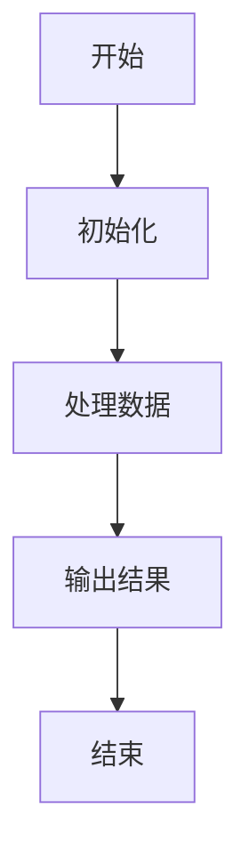
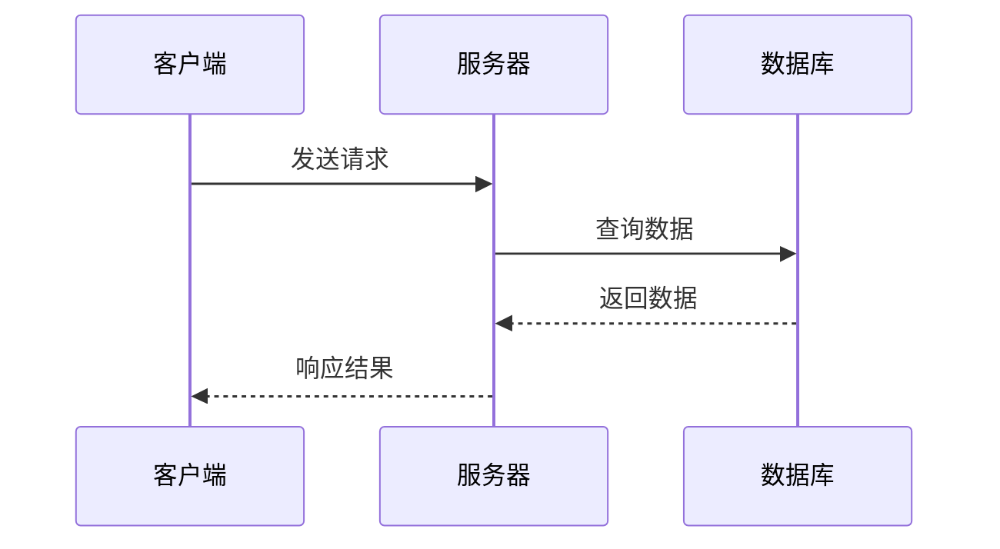
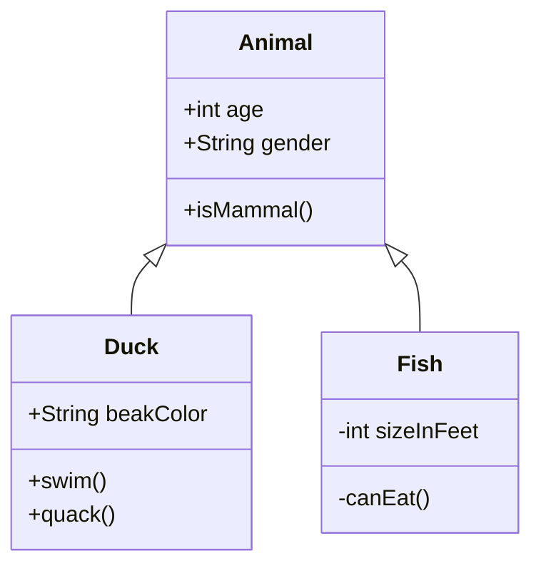

# Mermaid测试页面

这是一个用于测试Mermaid图表是否正常工作的页面。

## 流程图测试

```mermaid
graph TD
    A[开始] --> B[初始化]
    B --> C[处理数据]
    C --> D[输出结果]
    D --> E[结束]
```

## 序列图测试

```mermaid
sequenceDiagram
    participant 客户端
    participant 服务器
    participant 数据库
    
    客户端->>服务器: 发送请求
    服务器->>数据库: 查询数据
    数据库-->>服务器: 返回数据
    服务器-->>客户端: 响应结果
```

## 类图测试

```mermaid
classDiagram
    Animal <|-- Duck
    Animal <|-- Fish
    Animal: +int age
    Animal: +String gender
    Animal: +isMammal()
    
    class Duck{
        +String beakColor
        +swim()
        +quack()
    }
    
    class Fish{
        -int sizeInFeet
        -canEat()
    }
```